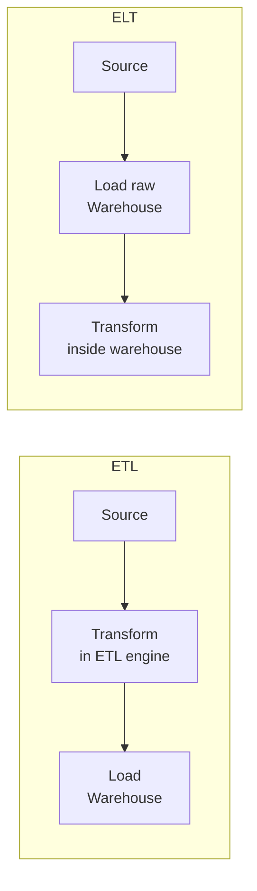
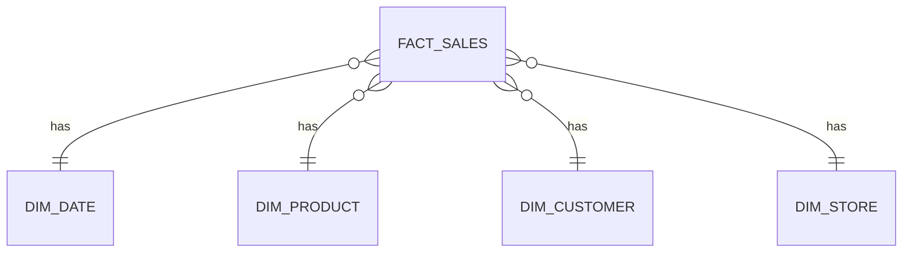
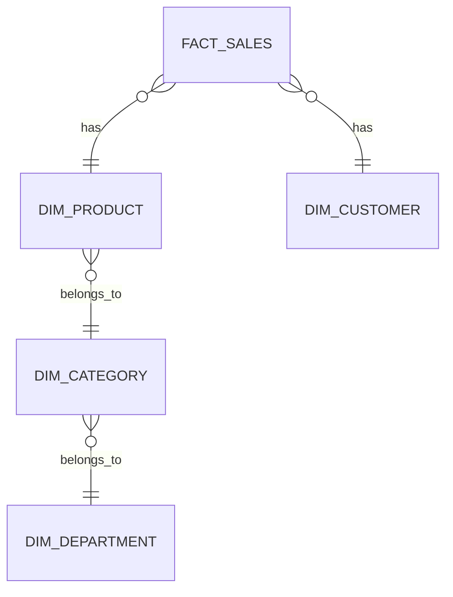
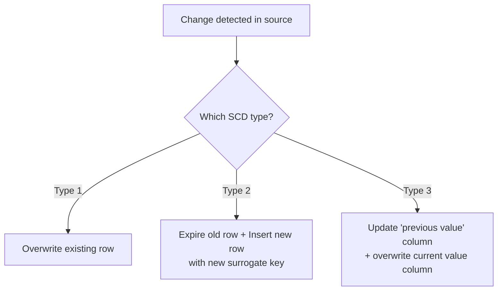
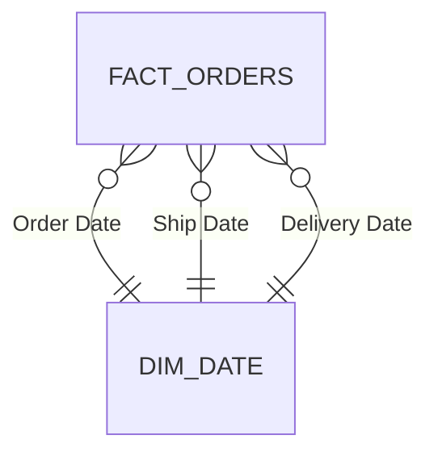
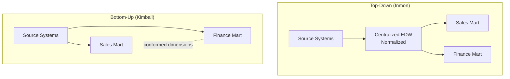

# Data Warehousing — Complete Study Guide

> Structured from your rough notes, reordered into a logical learning path: **Systems → Loading → Modeling → Schema Design → Facts & Measures → Dimensions (deep dive) → Architecture Philosophy → Storage**.

---

## Table of Contents
1. [OLTP vs OLAP](#1-oltp-vs-olap)
2. [ETL vs ELT](#2-etl-vs-elt)
3. [Data Modeling: OLTP (Normalization)](#3-data-modeling-oltp---normalization)
4. [Data Modeling: OLAP (Dimensional Modeling)](#4-data-modeling-olap---dimensional-modeling)
5. [Star vs Snowflake Schema](#5-star-vs-snowflake-schema)
6. [Fact Tables & Measures](#6-fact-tables--measures)
7. [Dimension Tables & Keys](#7-dimension-tables--keys)
8. [Slowly Changing Dimensions (SCD)](#8-slowly-changing-dimensions-scd)
9. [Special Dimension Patterns](#9-special-dimension-patterns)
10. [Data Warehouse Architecture: Top-Down vs Bottom-Up](#10-data-warehouse-architecture-top-down-vs-bottom-up)
11. [Data Marts](#11-data-marts)
12. [Row vs Columnar Storage](#12-row-vs-columnar-storage)
13. [Quick-Fire Revision Sheet](#13-quick-fire-revision-sheet)

---

## 1. OLTP vs OLAP

|                           | **OLTP** (Online Transaction Processing) | **OLAP** (Online Analytical Processing)          |
|---------------------------|------------------------------------------|--------------------------------------------------|
| **Purpose**               | Run the business day-to-day              | Analyze the business over time                   |
| **Example system**        | Banking app, e-commerce checkout         | Sales dashboard, quarterly reporting             |
| **Query pattern**         | Simple, short, many concurrent writes    | Complex, aggregations, fewer users, mostly reads |
| **Data shape**            | Highly normalized (no duplication)       | Denormalized (optimized for read speed)          |
| **Data volume per query** | A handful of rows                        | Millions of rows scanned/aggregated              |
| **Optimized for**         | Fast `INSERT`/`UPDATE` of single records | Fast `SUM`/`GROUP BY` across huge datasets       |

**Plain-language definition:** OLTP systems are the ones *creating* data as the business operates (a customer places an order). OLAP systems are the ones *consuming* that data afterward to answer questions (how many orders did we get last quarter, by region?).

**Real-world example:** The app that processes your Amazon order is OLTP. The internal Amazon dashboard showing "revenue by category, last 90 days" is powered by an OLAP-style warehouse.

> 🎓 **Tutor's Tip:** Don't just memorize the table — understand *why* the two need different data shapes. OLTP normalizes to make single-row writes fast and safe (no duplicate data to keep in sync). OLAP denormalizes because joining 10 normalized tables at query time to run an aggregation over millions of rows would be far too slow.

> 💼 **Why This Matters in Interviews:** A classic opening question is "why don't we just run analytics directly on the production database?" Answer: it would compete for locks/resources with live transactions, and the normalized schema makes analytical queries slow and complex — hence a separate OLAP warehouse, fed by ETL/ELT.

---

## 2. ETL vs ELT

Both describe how data moves from source systems into a warehouse. The difference is **where transformation happens**.

- **ETL (Extract → Transform → Load):** Data is extracted from the source, transformed (cleaned, joined, aggregated) in a separate processing engine, **then** loaded into the warehouse already in its final, query-ready shape.
- **ELT (Extract → Load → Transform):** Data is extracted and loaded into the warehouse **raw/near-raw first**, and transformation happens *inside* the warehouse itself using its own compute (SQL, dbt, etc.).

**Why ELT became popular:** Modern cloud warehouses (Snowflake, BigQuery, Databricks SQL) have cheap, elastic, massively parallel compute — so it's often faster and simpler to push raw data in first and let the warehouse's own engine do the heavy transformation, rather than maintaining a separate transformation cluster. Tools like **dbt** are built entirely around this ELT "transform-in-warehouse" pattern.

**Real-world example:** A traditional on-prem Informatica/SSIS pipeline that cleans and joins data before writing to a data warehouse = ETL. A pipeline that lands raw JSON into Snowflake/BigQuery and then runs dbt models to build clean tables = ELT.

> 🎓 **Tutor's Tip:** Think of ETL as "clean it in the truck before it enters the warehouse"; ELT as "dump it in the warehouse loading dock and clean it with the warehouse's own machinery."

> 💼 **Why This Matters in Interviews:** Interviewers want to hear you connect this to **compute cost and architecture**, not just the acronym order. ELT trades "cheap, elastic warehouse compute" for "raw data stored longer, more storage cost, need strong governance on raw zone" — mention this as a trade-off, not "ELT is just newer/better."

---

## 3. Data Modeling: OLTP - Normalization

**Definition:** Normalization is the process of structuring OLTP tables to eliminate data redundancy and prevent update anomalies, by progressively splitting data into smaller, related tables.

| Normal Form | Rule (plain English)                                                                                                    | Fixes                                                                                                                           |
|-------------|-------------------------------------------------------------------------------------------------------------------------|---------------------------------------------------------------------------------------------------------------------------------|
| **1NF**     | Every column holds a single, atomic value (no lists/repeating groups in one cell); each row is unique.                  | "Multiple phone numbers crammed into one cell" problem                                                                          |
| **2NF**     | Must be in 1NF, **and** every non-key column depends on the **whole** primary key (relevant when the key is composite). | "Partial dependency" — a column that only depends on part of a composite key                                                    |
| **3NF**     | Must be in 2NF, **and** no non-key column depends on another non-key column (no transitive dependency).                 | "Column A determines Column B, but neither is the key" — e.g., storing `city` and `zip_code` where `zip_code` determines `city` |

**Step-by-step example:**
Imagine one flat table: `Order(OrderID, ProductID, ProductName, ProductPrice, CustomerName, CustomerCity)`.
- **1NF issue:** none here structurally, assuming each cell is already atomic.
- **2NF issue:** if the key is `(OrderID, ProductID)`, then `ProductName` and `ProductPrice` depend only on `ProductID`, not the full key → split into a `Product` table.
- **3NF issue:** `CustomerCity` depends on `CustomerName`, not directly on `OrderID` → split into a `Customer` table.

Result after normalization: `Order`, `Product`, `Customer` — three small tables, joined by keys, each fact stored exactly once.

> 🎓 **Tutor's Tip:** The one-line test for 3NF: **"the key, the whole key, and nothing but the key"** — every non-key column must depend on the primary key directly, fully, and only.

> 💼 **Why This Matters in Interviews:** Interviewers love asking you to normalize a messy flat table live. Practice spotting partial and transitive dependencies out loud — that's what's actually being tested, not the definitions.

---

## 4. Data Modeling: OLAP - Dimensional Modeling

OLAP systems intentionally **denormalize**. The dominant approach is **dimensional modeling** (Ralph Kimball), which organizes data into:
- **Fact tables** — the numeric, measurable events (a sale, a click, a transaction).
- **Dimension tables** — the descriptive context around those events (who, what, where, when).

The two schema styles for arranging facts and dimensions are the **Star Schema** and the **Snowflake Schema** (covered in depth in Section 5).

**Why denormalize for OLAP?** Because analytical queries aggregate over millions of rows — every extra `JOIN` needed to reassemble normalized data adds cost. Dimensional models flatten dimension attributes into fewer, wider tables so a typical query only joins a fact table to a handful of dimension tables, not a deep chain of normalized lookup tables.

> 🎓 **Tutor's Tip:** OLTP normalizes to protect write integrity. OLAP denormalizes to protect read speed. Same underlying business data, different physical shape, because the two systems optimize for opposite things.

> 💼 **Why This Matters in Interviews:** Be ready to explain dimensional modeling as a **deliberate trade-off** — some redundancy is accepted (e.g., a product's category name repeated across rows) in exchange for simpler, faster queries and a model business users can intuitively understand.

---

## 5. Star vs Snowflake Schema

### Star Schema
A single, central **fact table** connected directly to fully **denormalized dimension tables** (each dimension is one flat table, not split further).

### Snowflake Schema
Same idea, but dimension tables are **further normalized** into sub-dimension tables (e.g., `DIM_PRODUCT` splits out into `DIM_PRODUCT` → `DIM_CATEGORY` → `DIM_DEPARTMENT`), so the diagram looks like a "snowflake" branching outward.

### Comparison

|                                          | **Star Schema**                                              | **Snowflake Schema**                                                                      |
|------------------------------------------|--------------------------------------------------------------|-------------------------------------------------------------------------------------------|
| Dimension structure                      | Flat, denormalized                                           | Normalized into sub-tables                                                                |
| Joins per query                          | Fewer (simpler, faster)                                      | More (extra hops through sub-dimensions)                                                  |
| Storage                                  | Slightly more (redundant attribute values)                   | Slightly less (no repeated values)                                                        |
| Ease of understanding for business users | Easier — one hop from fact to dimension                      | Harder — multiple hops                                                                    |
| Typical use case                         | Most BI/reporting warehouses (query speed > storage savings) | Cases with very large, high-cardinality dimensions where storage/consistency matters more |

**Real-world example:** `DIM_PRODUCT` in a star schema holds `ProductName, Category, Department` all as flat columns (Category repeated for every product in that category). In a snowflake version, `Category` and `Department` live in their own small lookup tables, and `DIM_PRODUCT` only stores a `CategoryID` foreign key.

> 🎓 **Tutor's Tip:** Star = optimized for **query simplicity/speed**. Snowflake = optimized for **storage efficiency/data consistency**. In practice, most modern cloud warehouses (cheap storage, expensive compute-per-join) favor star schemas.

> 💼 **Why This Matters in Interviews:** A common follow-up: "why not always snowflake, since it removes redundancy?" Answer: extra joins hurt query performance and columnar compression in modern warehouses already squashes the "redundancy" storage cost of a star schema to almost nothing — so the storage argument for snowflaking has weakened over time.

---

## 6. Fact Tables & Measures

**Definition:** A **fact table** stores the quantitative, measurable data about a business process — usually one row per event — plus foreign keys linking out to dimension tables that describe that event.

### Types of Fact Tables

| Type                      | What it stores                                                                                       | Example                                                                                                                 |
|---------------------------|------------------------------------------------------------------------------------------------------|-------------------------------------------------------------------------------------------------------------------------|
| **Transactional**         | One row per individual business event, at the moment it happens                                      | One row per sale/order line item                                                                                        |
| **Periodic Snapshot**     | One row per entity per fixed time interval, capturing state *at that point*                          | One row per bank account, per day, showing end-of-day balance                                                           |
| **Accumulating Snapshot** | One row per process instance, **updated in place** as the process moves through its lifecycle stages | One row per order, with columns like `order_date`, `shipped_date`, `delivered_date` — updated as each milestone happens |
| **Factless Fact Table**   | No numeric measures at all — just foreign keys, recording that an *event or relationship occurred*   | A row every time a student attends a class (attendance itself is the fact, there's no "amount" to sum)                  |

**Step-by-step distinction:**
- Transactional = "record every event as it happens, never update the row."
- Snapshot = "take a photo of the state on a schedule, even if nothing changed."
- Accumulating = "one long-lived row, keep updating it as the process progresses" (used for well-defined pipelines/workflows with a clear start and end, like order fulfillment).
- Factless = "we care that something happened/two things were related, not how much."

### Types of Measures

| Measure type      | Can you `SUM` it across **all** dimensions?                             | Example                                                                                                                    |
|-------------------|-------------------------------------------------------------------------|----------------------------------------------------------------------------------------------------------------------------|
| **Additive**      | Yes, across every dimension                                             | `sales_amount` — sums correctly across time, product, store                                                                |
| **Semi-Additive** | Yes across *some* dimensions, but not others (commonly not across time) | `account_balance` — you can sum balances across customers on a given day, but summing a balance across days is meaningless |
| **Non-Additive**  | No, can't be meaningfully summed across any dimension                   | `profit_margin_percent`, `unit_price` — must be recalculated/averaged, not summed                                          |

> 🎓 **Tutor's Tip:** *(Note: your original notes mentioned only additive and semi-additive — non-additive is the missing third category and interviewers often test whether you know all three.)* Quick test for measure type: ask "does summing this number across [dimension X] still mean something?" If yes for all dimensions → additive. If yes for some (not time) → semi-additive. If it never makes sense to sum it → non-additive.

> 💼 **Why This Matters in Interviews:** A favorite scenario question: "You have a fact table with `account_balance`. A user sums it across a whole month and gets a nonsensical number. What happened, and how do you fix reporting?" Answer: balance is semi-additive over time — you should report the **last/average balance**, not `SUM()`, when aggregating over the time dimension.

---

## 7. Dimension Tables & Keys

**Definition:** A **dimension table** holds the descriptive, textual context that gives meaning to the numbers in a fact table — the "who, what, where, when, how" of a business event.

**Real-world example:** `DIM_CUSTOMER` holds `CustomerName, Email, Segment, SignupDate` — none of these are measures, all describe *who* is involved in a sale recorded in `FACT_SALES`.

### Keys in a Data Warehouse

| Key type             | What it is                                                                                                                                  | Why it's used                         |
|----------------------|---------------------------------------------------------------------------------------------------------------------------------------------|---------------------------------------|
| **Primary Key (PK)** | Uniquely identifies a row within its own table                                                                                              | Standard relational integrity         |
| **Foreign Key (FK)** | A column in one table referencing the PK of another                                                                                         | Links fact tables to dimension tables |
| **Surrogate Key**    | A warehouse-generated, meaningless key (usually an auto-incrementing integer), used **instead of** the source system's natural/business key | See below                             |

**Why use a surrogate key instead of the natural/business key from the source system?**
1. **Handles Slowly Changing Dimensions** — you can have multiple warehouse rows for the same real-world entity (e.g., a customer who changed address), each with a different surrogate key, while the natural key (e.g., `CustomerID`) stays the same across those versions.
2. **Insulates the warehouse from source system changes** — if the source system changes its ID format, merges with another system, or reuses IDs, the warehouse's surrogate keys remain stable and unaffected.
3. **Performance** — a small, simple integer joins faster than a long natural key (e.g., a text-based customer code or composite key).
4. **Supports integrating multiple source systems** — two source systems might both use `CustomerID = 1001` for *different* customers; surrogate keys prevent collisions when merging into one warehouse.

> 🎓 **Tutor's Tip:** The natural key answers "who is this in the real world?" The surrogate key answers "which *version* of this row am I looking at, in warehouse history?" You need both — natural key for business meaning, surrogate key for warehouse mechanics (especially SCD Type 2, see next section).

> 💼 **Why This Matters in Interviews:** "Why not just use the source system's primary key?" is almost guaranteed. Lead with the SCD Type 2 reason first — it's the one that can't be solved any other way — then mention system-integration and stability as secondary benefits.

---

## 8. Slowly Changing Dimensions (SCD)

**Definition:** SCDs are strategies for handling changes to dimension attribute values over time — e.g., a customer moves city, a product gets reclassified into a new category.

| Type                         | Strategy                                                                                                                                  | Effect                                                                  | Example                                                                                                       |
|------------------------------|-------------------------------------------------------------------------------------------------------------------------------------------|-------------------------------------------------------------------------|---------------------------------------------------------------------------------------------------------------|
| **Type 0**                   | Never change — original value retained forever                                                                                            | No history tracked, value is fixed at load                              | Original signup date                                                                                          |
| **Type 1**                   | **Overwrite** the old value with the new one                                                                                              | No history — old value is lost                                          | Correcting a typo in a customer's name                                                                        |
| **Type 2**                   | **Add a new row** for the changed record, keep the old row, flag current vs. historical (`effective_date`, `end_date`, `is_current` flag) | Full history preserved                                                  | Customer moves from London to Manchester — old row shows London (expired), new row shows Manchester (current) |
| **Type 3**                   | Add a **new column** to store the previous value (e.g., `current_city`, `previous_city`)                                                  | Limited history (only last value)                                       | Track "current region" and "previous region" side by side                                                     |
| **Type 4**                   | Move history to a **separate history table**, keep only current value in the main dimension                                               | Keeps main table small/fast, history queryable separately               | Main `DIM_CUSTOMER` = current only; `DIM_CUSTOMER_HISTORY` = all past versions                                |
| **Type 6** *(hybrid: 1+2+3)* | Combines overwrite + new row + previous-value column                                                                                      | Both full history AND easy "current vs. previous" comparison in one row | Common in mature enterprise warehouses needing both                                                           |

**Step-by-step: how SCD Type 2 actually works (the one most interviews focus on):**
1. New data arrives from the source for `CustomerID = 1001`, with `City = Manchester` (previously `London`).
2. ETL/ELT compares incoming row to the **current** row for that natural key in the dimension.
3. A difference is detected on a tracked attribute (`City`).
4. The **existing** row is "expired": set `end_date = today`, `is_current = false`.
5. A **new** row is inserted: new **surrogate key**, `City = Manchester`, `start_date = today`, `end_date = NULL` (or 9999-12-31), `is_current = true`.
6. Historical fact records still point to the *old* surrogate key (so historical sales still correctly show "London" as of that sale date) — new facts point to the *new* surrogate key.

> 🎓 **Tutor's Tip:** This is exactly why surrogate keys matter — a natural key can't have two "current" rows in a table at once without ambiguity, but two different surrogate keys can both legitimately map to the same natural key across time.

> 💼 **Why This Matters in Interviews:** SCD Type 2 is arguably **the single most-asked data warehousing concept**. Be ready to whiteboard the before/after table state for a Type 2 change, not just recite the definition.

---

## 9. Special Dimension Patterns

These are dimension design patterns that come up in specific edge cases — commonly tested because they show whether you've handled *real* dimensional modeling, not just textbook star schemas.

| Pattern                     | Definition                                                                                                                                                          | Example                                                                                                                                                                                                 |
|-----------------------------|---------------------------------------------------------------------------------------------------------------------------------------------------------------------|---------------------------------------------------------------------------------------------------------------------------------------------------------------------------------------------------------|
| **Conformed Dimension**     | A dimension shared identically (same structure, same keys, same meaning) across **multiple fact tables / data marts**                                               | `DIM_DATE` and `DIM_CUSTOMER` used identically by both the `FACT_SALES` mart and the `FACT_SUPPORT_TICKETS` mart — enabling consistent cross-mart reporting                                             |
| **Late-Arriving Dimension** | A fact record arrives **before** its corresponding dimension record exists yet                                                                                      | A sale transaction arrives, but the new customer's profile hasn't been loaded into `DIM_CUSTOMER` yet — handled by inserting a placeholder/inferred dimension row, updated later when real data arrives |
| **Degenerate Dimension**    | A dimension-like value that lives **directly in the fact table** with no separate dimension table, because it has no descriptive attributes of its own              | `OrderNumber` / `InvoiceNumber` stored directly on the fact row — it's an identifier, not really "descriptive," so a separate table would be pointless                                                  |
| **Junk Dimension**          | A single dimension table that **combines several small, low-cardinality, unrelated flags/indicators** that would otherwise each need their own tiny dimension table | Combining `PaymentMethod`, `IsGift`, `IsRush` flags into one `DIM_ORDER_JUNK` table instead of three separate tiny dimension tables                                                                     |
| **Role-Playing Dimension**  | **One physical dimension table used multiple times in the same fact table**, each time representing a different "role"                                              | `DIM_DATE` joined three times to `FACT_ORDERS` as `OrderDateKey`, `ShipDateKey`, and `DeliveryDateKey`                                                                                                  |

*(Role-playing dimension: same `DIM_DATE` table, three different logical roles via view aliases.)*

**Step-by-step: handling a late-arriving dimension:**
1. Fact record for `CustomerID = 2050` arrives.
2. ETL checks `DIM_CUSTOMER` for that natural key — not found.
3. Insert a **placeholder row** in `DIM_CUSTOMER` with the known key and `"Unknown"`/inferred attributes, mark it as inferred (e.g., `is_inferred_member = true`).
4. Fact record loads normally, pointing to this placeholder's surrogate key.
5. When the real customer record arrives later, **update** the placeholder row in place (this is one of the few cases where updating a dimension row, rather than SCD-versioning it, is standard practice) — since the fact already points to the correct surrogate key, no fact re-linking is needed.

> 🎓 **Tutor's Tip:** Notice the pattern across all five: each one exists to solve a *practical* problem (shared reporting, timing mismatches, pointless tiny tables, meaningless natural IDs, reused date logic) — don't memorize them as isolated vocabulary, tie each to the problem it solves.

> 💼 **Why This Matters in Interviews:** These five terms are the fastest way to signal "I've actually built dimensional models," not just read about star schemas. Role-playing and junk dimensions especially come up in "design a schema for X" whiteboard exercises.

---

## 10. Data Warehouse Architecture: Top-Down vs Bottom-Up

Two competing philosophies for **how to build the warehouse overall**, not just a single schema.

|                         | **Top-Down (Inmon)**                                                        | **Bottom-Up (Kimball)**                                                                  |
|-------------------------|-----------------------------------------------------------------------------|------------------------------------------------------------------------------------------|
| **Starting point**      | Build one centralized, normalized **Enterprise Data Warehouse (EDW)** first | Build individual **dimensional data marts** first, per business process                  |
| **Data marts**          | Derived *from* the EDW afterward                                            | Built directly, and later integrated via **conformed dimensions**                        |
| **Time to first value** | Slower — large upfront design effort                                        | Faster — a single mart can go live quickly                                               |
| **Consistency risk**    | Low — single source of truth from day one                                   | Higher — marts must be disciplined about using conformed dimensions, or they drift apart |
| **Best for**            | Large enterprises needing strict, centralized governance from the start     | Teams needing fast, iterative delivery, business-process by business-process             |

**Real-world example:** A bank building one master EDW covering all products before any reporting mart goes live = top-down. A retailer building a "Sales" data mart in month 1, then a "Inventory" mart in month 2, tying them together later via a shared `DIM_DATE`/`DIM_PRODUCT` = bottom-up.

> 🎓 **Tutor's Tip:** Top-down = "design the whole house, then furnish each room." Bottom-up = "furnish each room well, using the same style of furniture (conformed dimensions) so it all matches later."

> 💼 **Why This Matters in Interviews:** Most modern cloud-native warehouses (dbt-driven, Kimball-style dimensional marts on Snowflake/BigQuery/Databricks) lean **bottom-up** in practice — mention this as the current industry default, while still being able to explain why some regulated/enterprise contexts still favor top-down governance-first approaches.

---

## 11. Data Marts

**Definition:** A **data mart** is a smaller, subject-specific subset of the data warehouse, built for a single department or business function (Sales, Finance, HR) rather than the whole enterprise.

- Can be sourced **from** a central EDW (top-down approach) or built **directly** from source systems and later unified via conformed dimensions (bottom-up/Kimball approach).
- Typically uses a star schema, scoped to just the facts/dimensions that business area needs.

**Real-world example:** A "Marketing Data Mart" containing only `FACT_CAMPAIGN_RESPONSES`, `DIM_CUSTOMER`, `DIM_CAMPAIGN`, `DIM_DATE` — a small, focused slice rather than the entire enterprise warehouse.

> 🎓 **Tutor's Tip:** Data mart = data warehouse's smaller, departmental sibling. The relationship between marts and the warehouse is exactly what differs between top-down (marts *come from* the warehouse) and bottom-up (marts *are* the building blocks *of* the warehouse).

> 💼 **Why This Matters in Interviews:** Be ready to place this term correctly relative to Section 10 — a common trick question is "is a data mart part of building top-down or bottom-up?" (Answer: both — the difference is direction and sequencing, not whether marts exist.)

---

## 12. Row vs Columnar Storage

|                      | **Row-Oriented Storage**                      | **Columnar Storage**                                                 |
|----------------------|-----------------------------------------------|----------------------------------------------------------------------|
| **Data laid out as** | All columns of one row stored together        | All values of one column stored together                             |
| **Best for**         | OLTP — reading/writing a whole record at once | OLAP — aggregating/scanning one or a few columns across many rows    |
| **Compression**      | Weaker (mixed data types together)            | Much stronger (same data type/similar values together compress well) |
| **Example engines**  | PostgreSQL, MySQL (default row store)         | Parquet, ORC, Redshift, BigQuery, Snowflake                          |

**Step-by-step — why columnar wins for analytics:**
1. A query like `SELECT AVG(sales_amount) FROM fact_sales` only needs the `sales_amount` column.
2. In a **row store**, the engine must still read every full row from disk (all columns), then discard the ones it doesn't need — wasted I/O.
3. In a **columnar store**, the engine reads *only* the `sales_amount` column's data block — far less I/O, and because that block is all the same data type, it compresses and scans extremely efficiently (and enables **vectorized execution** — processing whole column batches at once).

**Real-world example:** Parquet files (columnar) are the standard storage format underlying Delta Lake/Iceberg tables in modern lakehouses specifically because analytical queries scan a handful of columns across huge tables — the exact case columnar storage is built for.

> 🎓 **Tutor's Tip:** Row store = optimized to fetch "everything about one thing" fast (one customer's full record). Columnar store = optimized to fetch "one thing about everything" fast (one column across millions of rows).

> 💼 **Why This Matters in Interviews:** This connects directly back to Section 1 (OLTP vs OLAP) — interviewers like candidates who can explain *why* the physical storage format follows from the workload pattern, not just name-drop "Parquet is columnar."

---

## 13. Quick-Fire Revision Sheet

Use this as a 2-minute pre-interview refresher — if you can explain every line below out loud, you know the material.

- **OLTP** = run the business (normalized, many small writes). **OLAP** = analyze the business (denormalized, big aggregations).
- **ETL** transforms before loading; **ELT** loads raw and transforms inside the warehouse (favored by modern cloud warehouses/dbt).
- **Normalization (1NF→3NF)** = "the key, the whole key, and nothing but the key" — removes redundancy for OLTP.
- **Dimensional modeling** intentionally denormalizes: **fact tables** (measures + FKs) + **dimension tables** (descriptive context).
- **Star schema** = flat dimensions, fewer joins. **Snowflake schema** = normalized dimensions, more joins, less redundancy.
- **Fact table types:** Transactional (event-level), Snapshot (periodic state), Accumulating (updated across a lifecycle), Factless (no measures, just occurrence).
- **Measure types:** Additive (sums everywhere), Semi-additive (sums except across time, e.g. balances), Non-additive (never sums, e.g. ratios/percentages).
- **Surrogate keys** exist mainly to enable SCD history and to insulate the warehouse from source-system key changes.
- **SCD Type 1** = overwrite (no history). **Type 2** = new row + expire old (full history) — the most important one to know cold. **Type 3** = extra column for previous value.
- **Conformed dimension** = shared across marts. **Late-arriving dimension** = placeholder row until real data arrives. **Degenerate dimension** = identifier stored directly on the fact (e.g., order number). **Junk dimension** = bundles small unrelated flags. **Role-playing dimension** = one physical table, multiple logical roles (e.g., `DIM_DATE` for order/ship/delivery).
- **Top-down (Inmon)** = centralized EDW first, marts derived after. **Bottom-up (Kimball)** = marts first, unified later via conformed dimensions.
- **Data mart** = subject-specific subset of the warehouse.
- **Columnar storage** wins for OLAP because it reads only the needed columns and compresses better; **row storage** wins for OLTP because it reads/writes a whole record at once.
