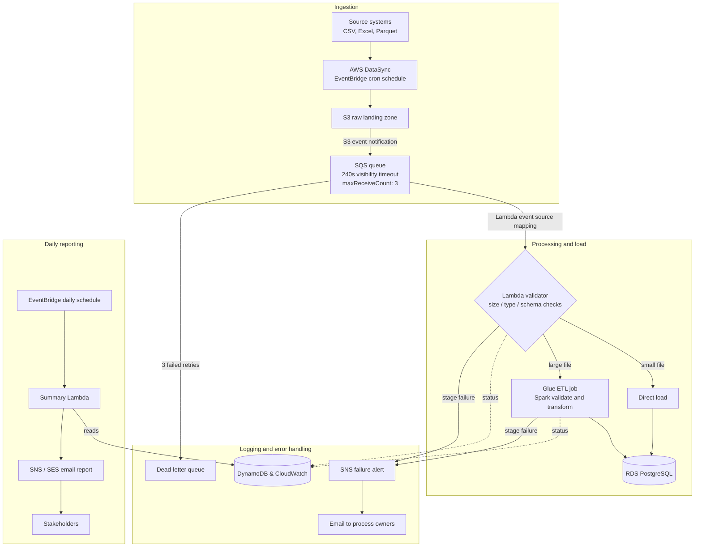

# APT (Aviation Performance Tool) — Automated Data Pipeline

**Role:** Lead Data Engineer
**Type:** Serverless data lake / ETL automation (SDLF-inspired pattern on AWS)

---

## 1. Problem statement

Regulated files from multiple upstream systems were being manually analyzed, validated, and uploaded to a Postgres database by different teams, at different times, from different locations. This manual process was slow, error-prone, and didn't scale.

**Goal:** automate the Extract → Validate → Transform → Report → Load process so files are processed in near real time, with no manual touchpoints.

**Inputs:** CSV, Excel, and Parquet files from various source systems.

**Challenges:** 
    - Excel sheet handling different sheet different logic different table and transformations
    - Traffic spike during initial first week of month. 

---

## 2. Architecture at a glance

---

## 3. Step-by-step flow

1. **Source systems** drop regulated files (CSV, Excel, Parquet) into shared folders at different times from different teams/locations.
2. **AWS DataSync**, triggered on a cron schedule via an **EventBridge rule**, copies new files from those source folders into an **S3 raw landing bucket**. DataSync is used (rather than a custom copy script) because it's purpose-built for bulk file-share-to-S3 transfer, with built-in checksum verification and encryption in transit.
3. **S3 event notifications** (`s3:ObjectCreated:*`) fire on every new object and send a message to an **SQS queue**. This requires a **queue policy** — a resource-based policy on the SQS queue granting `s3.amazonaws.com` permission to call `SendMessage`.
4. A **Lambda event source mapping (ESM)** polls the SQS queue and invokes Lambda with batches of messages.
5. **Lambda (using a shared Lambda layer)** runs validation on each file: size check, file type check, schema check.
   - **Small file** → Lambda validates and loads directly into Postgres.
   - **Large file** → Lambda triggers a **Glue job** (`boto3 start_job_run`), which reads the file from S3, runs heavier validation/transformation, and loads into Postgres.
6. Every stage (Lambda and Glue) writes its status to **DynamoDB**, giving a full execution history per file.
7. If a message fails processing 3 times (`maxReceiveCount: 3`), SQS automatically routes it to the **dead-letter queue** instead of retrying indefinitely.
8. Any stage failure triggers an **SNS** notification, emailed to the relevant process owners.
9. At end of day, a scheduled Lambda (triggered by an EventBridge rule) queries DynamoDB and emails a summary report via SNS/SES.

---

## 4. Component deep dive

**SQS visibility timeout (240s) + `maxReceiveCount: 3`**
AWS best practice for Lambda + SQS: set visibility timeout to **at least 6x the Lambda function timeout**, since Lambda has its own internal retry behavior, and you don't want SQS releasing a message mid-processing. Know your actual Lambda timeout value so you can justify the 240s.

**`ReceiveMessageWaitTimeSeconds: 10`**
Long polling — reduces empty receives and SQS API cost vs. short polling.

**Dead-letter queue**
After 3 failed attempts, a message lands here instead of retrying forever. Worth having a story for what happens *next*: a redrive policy, a CloudWatch alarm on DLQ depth, and a process (manual or scheduled) for reprocessing once root cause is fixed.

**Lambda layers**
Shared dependencies (DB driver, `pandas`/`openpyxl` for Excel, custom validation utilities) reused across multiple Lambda functions without bundling them into every deployment package.

**Excel handling (a real gap to know)**
Spark/Glue `DynamicFrame` doesn't natively read `.xlsx`. If Glue handled Excel files, it was likely either a **Glue "Python Shell" job** using `pandas`/`openpyxl`, or files were converted to CSV before reaching Glue. Be ready to say which.

**Idempotency**
SQS guarantees at-least-once delivery, not exactly-once — a message can be processed more than once. If inserts (not upserts) are used in Postgres, duplicate processing means duplicate rows. Worth knowing whether file-level dedup (e.g. filename + timestamp, or content hash checked against DynamoDB) was in place.

**RDS connection management**
Lambda can scale to many concurrent executions, each opening a DB connection; Postgres has a hard connection cap. If **RDS Proxy** wasn't used for pooling, this is a known limitation worth naming proactively.

**Security**
- S3: SSE-KMS encryption at rest
- DataSync: TLS in transit
- DB credentials: Secrets Manager (not hardcoded)
- IAM: least-privilege, separate roles per Lambda function / Glue job / DataSync task
- If Lambda/Glue run in a VPC: VPC endpoints for S3/DynamoDB to keep traffic off the public internet

---

## 5. Numbers to confirm

- Approximate file volume/day and the size threshold that separated "small" (Lambda) from "large" (Glue)
- Before/after processing latency (manual hours → automated minutes)
- Error rate before vs. validation-rejection rate after
- Lambda memory/timeout configuration
- Glue job type (Spark) and worker/DPU count

---

## 6. Practice questions (answer unaided, then check your reasoning)

- Why use Lambda *and* Glue rather than just one for every file?
- If the same file landed in S3 twice, what's the actual failure mode, and how would you prevent a duplicate load?
- SQS guarantees at-least-once delivery, not exactly-once or strict ordering — where does that matter in this pipeline, and where doesn't it?
- Walk through what happens operationally when a message lands in the DLQ, end to end.
- Why DataSync instead of having source systems write directly to S3?
- If file volume grew 10x overnight, which part of this architecture breaks first?
