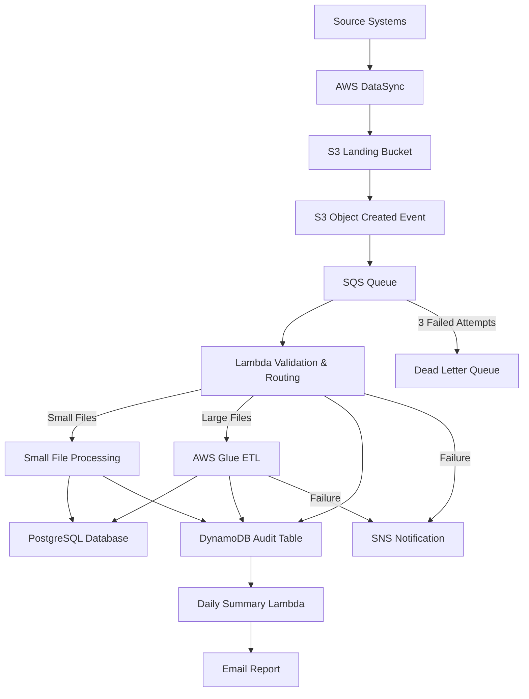
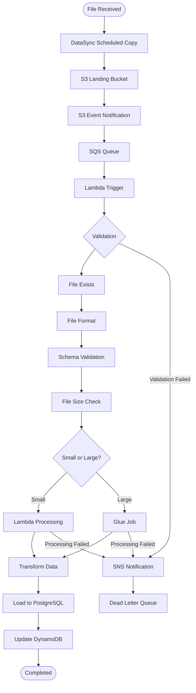
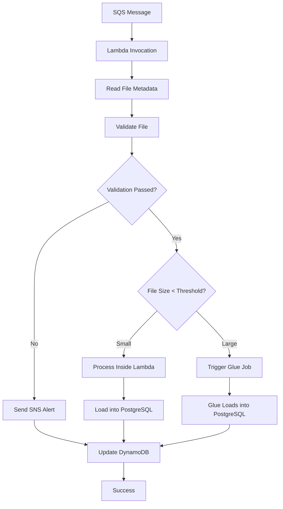
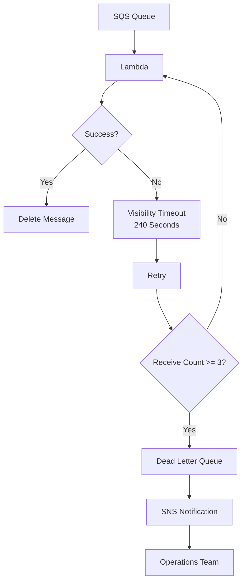
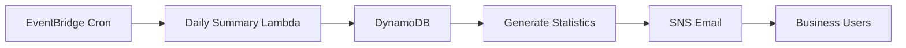
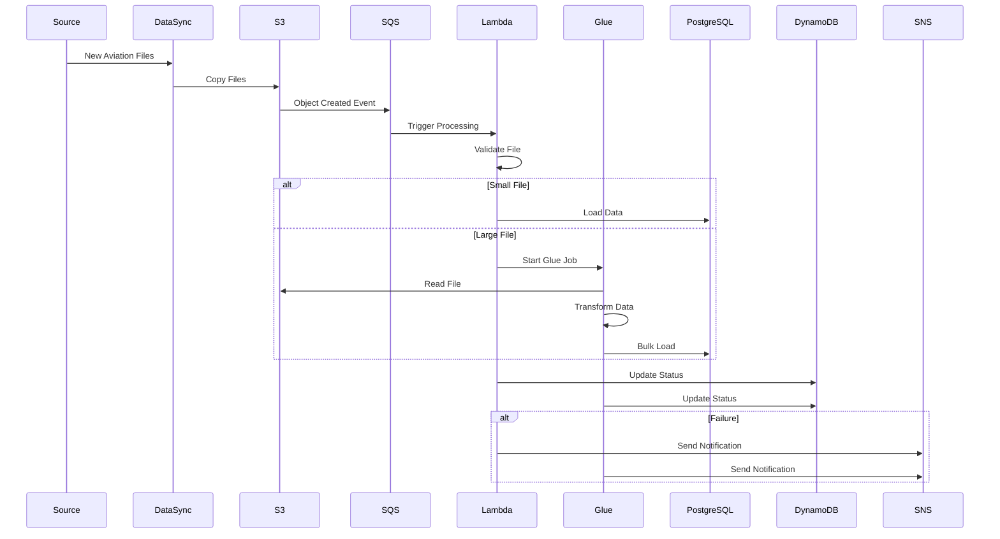

# 1. High-Level Architecture

# 2. Detailed ETL Flow

# 3. Lambda Decision Flow

# 4. Error Handling & Retry Mechanism

# 5. Daily Reporting Process

# 6. Sequence Diagram (Interview Favorite ⭐)
