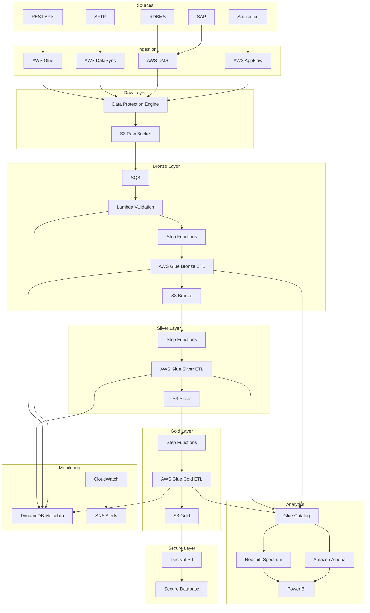
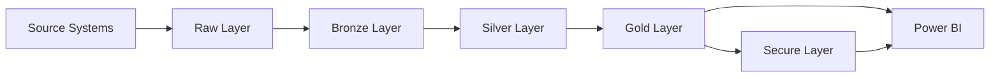
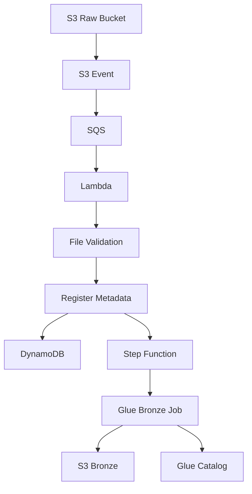
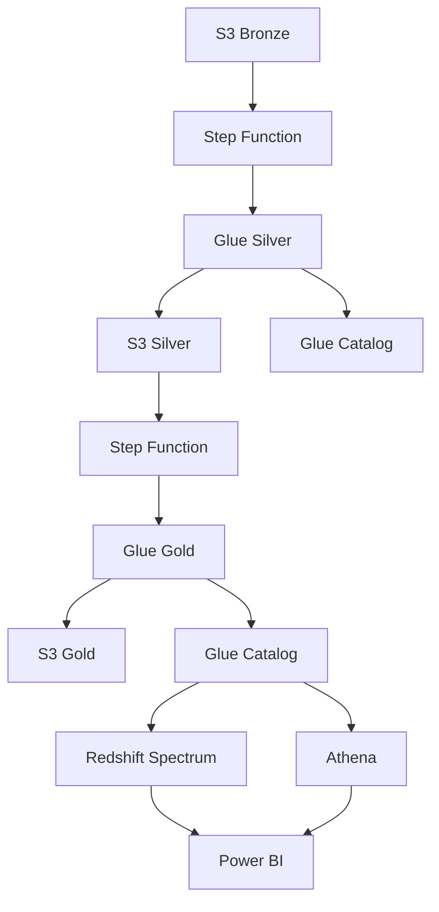
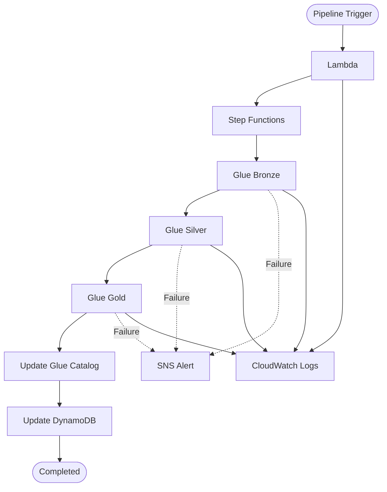
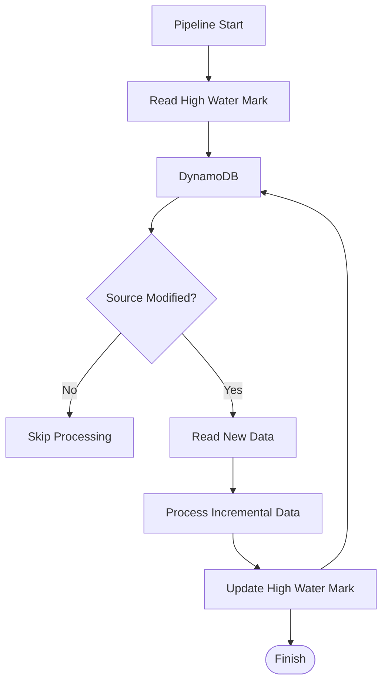
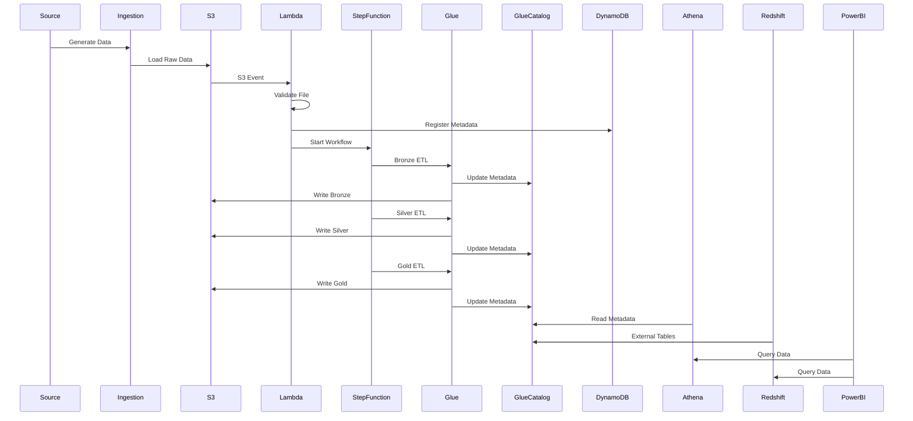

## 1. End-to-End Cloud Migration Architecture (Main Diagram ⭐)

---

## 2. Medallion Architecture

## 3. Bronze Layer Processing

## 4. Silver & Gold Processing

## 5. Pipeline Orchestration

## 6. High Water Mark Processing

## Sequence Diagram

