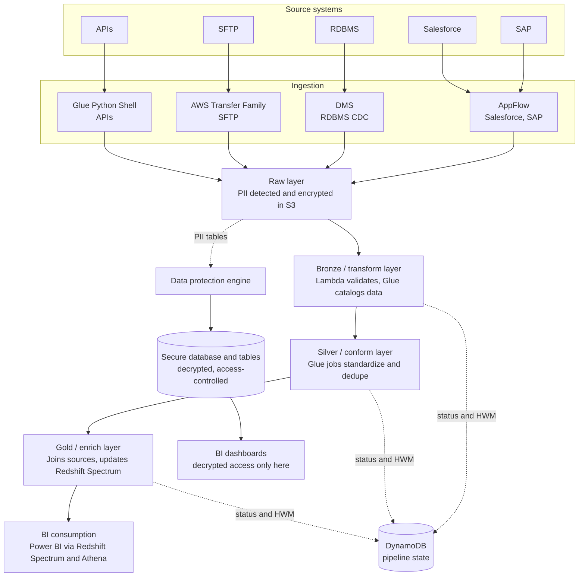

# Aviation Serverless Cloud Migration — Medallion Data Lake

**Role:** Lead Data Engineer
**Type:** Cloud-first serverless data lake migration off legacy Cloudera Hadoop/HDFS, medallion-architecture-aligned

---

## 1. Business Context:

The Aviation Analytics Platform was responsible for collecting and analyzing aviation fuel sales and operational data from multiple enterprise systems. Business users relied on this platform for financial planning, forecasting, customer profitability analysis, and operational reporting.

The platform provided insights such as:

- Fuel sales trends across airports and regions
- Revenue, expenses, and profitability analysis
- Sales forecasting using historical data
- Forecast vs actual sales comparison
- Customer profitability analysis
- Product performance analysis
- Financial risk assessment
- Executive dashboards through Power BI

The legacy Cloudera Hadoop (HDFS) platform struggled with growing data volume, slow performance, and complex maintenance. The team proposed a cloud-first, serverless data lake for scalability, cost-efficiency, and simpler operations.

---

## 2. Business Problem:
The legacy platform was built on Cloudera Hadoop (HDFS).

As data volume increased, the platform faced several challenges:

- Storage was becoming expensive.
- Hadoop cluster maintenance required significant operational effort.
- ETL jobs were slow and resource intensive.
- Infrastructure scaling required manual intervention.
- Deployment cycles were lengthy.
- Data governance and security were difficult to maintain.
- Multiple data sources increased integration complexity.

The organization decided to modernize the platform by migrating to a fully serverless AWS data lake architecture based on Medallion Architecture principles.

The objectives were:

- Eliminate Hadoop cluster management
- Reduce infrastructure cost
- Improve scalability
- Enable serverless processing
- Improve data governance
- Reduce processing time
- Support near real-time analytics

---

## 3. Architecture at a glance

---

## 4. Step-by-step flow

1. **Source systems**: SAP, RDBMS, SFTP, Salesforce, and various APIs.
2. **Ingestion**, matched to source type:
   - **AppFlow** — Salesforce and SAP (native SaaS connectors)
   - **DMS** — RDBMS, typically CDC-based
   - **AWS Transfer Family** — SFTP
   - **Glue** (Python Shell jobs) — general API sources
3. **Raw layer**: files land in S3. A data-protection step (AWS Glue Studio's "Detect PII" transform, or a custom Lambda/Glue step using KMS) scans for and encrypts PII before/as it lands.
4. **Bronze / transform layer**: an S3 event triggers SQS → Lambda, which validates basic file properties and registers the file's receipt, then triggers a **Step Function** that runs a **Glue job**. From here on, Glue reads through the **Glue Data Catalog** rather than raw S3 paths. Progression to the next stage is either event-driven (Lambda triggers the next Step Function) or schedule-driven (EventBridge triggers it directly) — near-real-time tables go the event route, lower-priority batch tables go the scheduled route.
5. **Silver / conform layer**: Step Functions orchestrate a sequence of Glue jobs that read from the catalog, apply standardization/conformance rules (dedup, canonical schema, business rules), write back to S3, and update the catalog.
6. **Gold / enrich layer**: Glue jobs join and combine data across sources, write to S3, update the catalog, and refresh **Redshift Spectrum**, which queries the S3/catalog data directly without loading it into Redshift's native storage.
7. **BI consumption**: Power BI connects through Redshift Spectrum for production dashboards; **Athena** is used separately for ad-hoc/exploratory querying over the same catalog.
8. **Secure layer (parallel path)**: for PII tables that need decrypted access, a data-protection engine decrypts on demand and writes into a separate, tightly access-controlled secure database/table set. BI dashboards only get decrypted PII access through this layer — never directly against the encrypted raw/bronze tables.

---

## 5. Component deep dive

**HWM (high-water-mark) in DynamoDB — your strongest talking point**
DynamoDB tracks, per source table, the last successfully processed point. This enables (1) **incremental processing** — a job only runs against new/changed source data, and (2) **safe resume after failure** — retries pick up from the last good watermark instead of redoing completed work. Same idea as a Kafka consumer offset, applied to batch table processing.

**Step Functions + EventBridge + Lambda orchestration**
Know the decision rule behind "sometimes Lambda triggers the next step, sometimes EventBridge does it directly" — typically near-real-time tables chain via Lambda-triggered Step Functions, lower-priority batch tables run on an EventBridge schedule.

**Glue/Spark optimization — specifics to have ready**
Job bookmarks for incremental reads, partition pruning and predicate pushdown via the catalog, right-sized worker type/DPU count, avoiding the small-files problem on write (repartition/coalesce before writing), broadcast joins for small dimension tables, salting for skewed join keys.

**Schema enforcement and versioning**
Either the Glue Data Catalog's native table version history, or — if any part of this was streaming — the **AWS Glue Schema Registry**. Know which one you mean.

**Secure/PII layer**
A strong governance pattern: encrypt by default, decrypt into a separate tightly-controlled store only when needed. The "textbook" AWS alternative worth knowing: **AWS Lake Formation**, which gives column-level/row-level access control directly on the Glue Catalog/S3 instead of maintaining a fully separate decrypted copy.

**Parquet + Snappy, S3 lifecycle, Intelligent-Tiering**
Standard, correct choices for Glue/Athena/Redshift Spectrum performance and storage cost management.

**Athena vs. Redshift Spectrum**
Complementary, not redundant — Athena for ad-hoc/exploratory querying, Redshift Spectrum for high-concurrency BI workloads that may also join against native Redshift tables.

**CloudFormation + Azure DevOps**
A deliberate cross-tooling reality: AWS-native IaC (CloudFormation) deployed through an org-standard CI/CD platform (Azure DevOps) rather than AWS-specific tooling.

---

## 6. Numbers and details to confirm before interviews

- Was Redshift **Serverless** or a provisioned cluster (Spectrum works with both, cost/scaling story differs)
- Roughly how much data was migrated off Hadoop/HDFS, and over what timeframe
- Which specific fields were treated as PII (gives you a concrete example instead of speaking abstractly)
- Typical Glue worker type/DPU count for Bronze vs. Gold jobs
- Whether Lake Formation was used anywhere, or access control was purely custom IAM plus the separate secure layer

---

## 7. Practice questions (answer unaided, then check your reasoning)

- Why maintain a fully separate decrypted "secure" layer instead of using column-level security directly on the existing tables?
- What's actually stored in the Glue Catalog versus DynamoDB, and why do you need both?
- How does the high-water-mark approach handle a source record that gets updated in place, rather than a new record being appended?
- Why use Redshift Spectrum for the Gold layer instead of loading the enriched data natively into Redshift?
- What would break first if the source data volume from SAP tripled overnight?
- Why CloudFormation over Terraform here, given the CI/CD layer was Azure DevOps rather than AWS-native tooling?

#  Details
## Raw Layer (Landing Zone)

The Raw layer stored an immutable copy of source data exactly as received.

Responsibilities:

- Preserve original files
- Support auditing
- Support reprocessing
- Maintain source lineage

Before data was stored, a Data Protection Engine scanned incoming data for Personally Identifiable Information (PII).

Sensitive columns were encrypted before being written into the Raw S3 bucket.

Only encrypted data was stored.

## Bronze Layer

Whenever new data landed in S3:

S3 Object Created Event

↓

Amazon SQS

↓

AWS Lambda

Lambda performed:

- File existence validation
- File format validation
- Schema validation
- Metadata extraction
- Duplicate detection
- File registration

Processing metadata was stored in DynamoDB.

Lambda then triggered an AWS Step Functions workflow.

Step Functions orchestrated one or more AWS Glue jobs.

Glue jobs read source data using the Glue Data Catalog rather than directly accessing file paths.

The Bronze layer performed:

- Data cleansing
- Standardization
- Data type conversion
- Basic business validations

Processed data was written back into partitioned Parquet files on Amazon S3.

Glue Catalog metadata was updated automatically.

## Silver Layer

The Silver layer contained validated and standardized enterprise data.

Step Functions orchestrated multiple Glue jobs depending on business dependencies.

Processing included:

- Deduplication
- Business rule validation
- Data quality checks
- Null handling
- Standardized dimensions
- Slowly Changing Dimension (where applicable)
- Incremental processing

Glue jobs again read datasets through the Glue Data Catalog.

The processed data was written back into S3 using optimized Parquet format.

Catalog metadata was updated after every successful execution.

## Gold Layer

The Gold layer created business-ready analytical datasets.

Here, data from multiple business domains was combined.

Typical processing included:

- Multi-source joins
- KPI calculations
- Aggregations
- Business metrics
- Financial calculations
- Customer profitability
- Sales forecasting datasets

The Gold datasets were exposed using:

- Amazon Redshift Spectrum
- Amazon Athena

Power BI connected directly to these analytical datasets.

## Secure Layer

Certain datasets contained sensitive customer information.

The Secure Layer handled controlled decryption of authorized datasets.

The Data Protection Engine decrypted only approved columns.

These datasets were written into dedicated secure databases and secure Glue Catalog tables.

Role-based IAM permissions ensured that only authorized users and BI applications could access decrypted information.

## Orchestration

AWS Step Functions orchestrated the complete ETL workflow.

Responsibilities included:

- Sequential Glue execution
- Parallel execution where possible
- Retry logic
- Error handling
- Conditional branching
- Dependency management

This significantly simplified pipeline management compared to legacy scheduling systems.

## Metadata Management

AWS Glue Data Catalog served as the enterprise metadata repository.

Benefits:

- Central schema management
- Schema evolution
- Partition discovery
- Integration with Athena
- Integration with Redshift Spectrum

Most ETL jobs read tables through the Glue Catalog rather than hardcoded S3 locations.

## Pipeline Tracking

Amazon DynamoDB stored operational metadata including:

- Pipeline execution status
- File processing status
- Start time
- Completion time
- Error messages
- Retry count
- High watermark (HWM)

The High watermark ensured incremental processing.

Only newly arrived or modified data was processed.

If a job failed, processing resumed from the last successful checkpoint instead of restarting the entire pipeline.

## Data Storage Optimization

Several optimizations were implemented.

### Parquet Format

Reduced storage requirements.

Improved analytical query performance.

### Snappy Compression

Reduced storage cost while maintaining fast decompression.

### Partitioning

Data was partitioned using business keys such as:

- Business Date
- Region
- Airport
- Source System

Partition pruning significantly reduced Athena and Spark scan time.

### S3 Intelligent Tiering

Automatically moved infrequently accessed data into lower-cost storage classes.

### Lifecycle Policies

Automatically archived historical datasets.

## Security

Security was implemented at multiple levels.

- IAM Role-based access
- Encryption at rest
- Encryption in transit
- PII encryption
- Secure decryption layer
- Schema governance
- Version-controlled schema evolution

## Monitoring

Operational monitoring included:

- CloudWatch Logs
- CloudWatch Metrics
- CloudWatch Alarms
- SNS notifications

Alerts were generated for:

- Glue failures
- Lambda failures
- Step Function failures
- Data quality failures
- SLA violations

## Infrastructure as Code

The complete AWS infrastructure was provisioned using AWS CloudFormation.

Resources included:

- S3
- Glue
- Lambda
- IAM
- Step Functions
- DynamoDB
- SNS
- CloudWatch
- Redshift Spectrum

This enabled repeatable deployments across Development, QA, and Production environments.

## CI/CD

Azure DevOps pipelines automated:

- Code build
- Unit testing
- Deployment
- Infrastructure deployment
- Environment promotion

This eliminated manual deployment activities.

## Performance Optimizations

The platform was optimized using:

- Serverless architecture
- Glue Spark optimization
- Predicate pushdown
- Partition pruning
- Incremental processing
- High watermark processing
- Snappy compression
- Parquet storage
- Glue job bookmarks (where applicable)
- Dynamic Frame optimization
- Parallel Step Function execution

## My Responsibilities (Lead Data Engineer)

As the Lead Data Engineer, I was responsible for:

- Designing the end-to-end serverless data lake architecture
- Leading the migration from Hadoop to AWS
- Defining Medallion Architecture standards
- Designing ingestion frameworks
- Building Glue ETL pipelines
- Designing Step Function orchestration
- Implementing security and PII protection
- Establishing CI/CD using Azure DevOps
- Optimizing Spark and Glue performance
- Code reviews and mentoring engineers
- Collaborating with business stakeholders and solution architects
- Production support and performance tuning