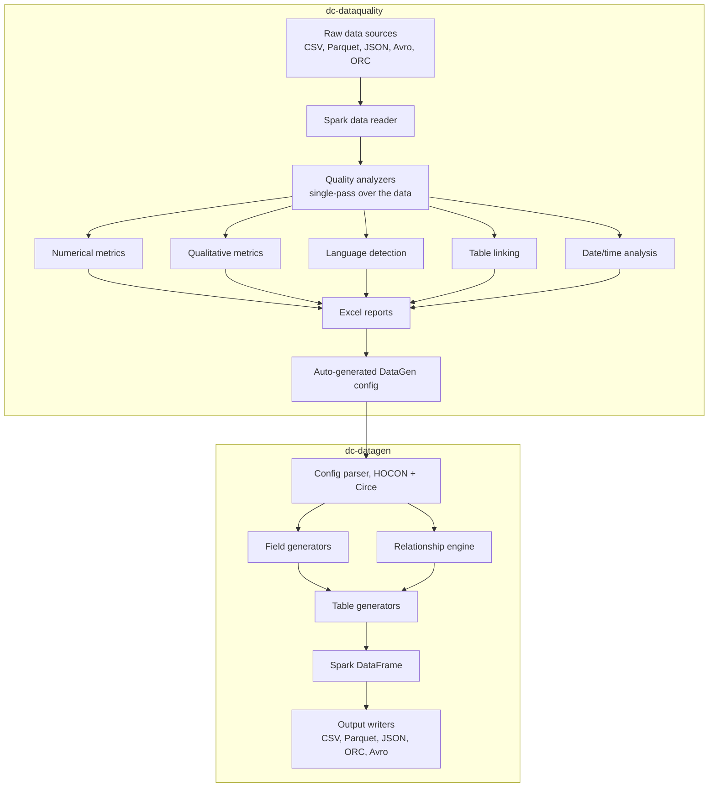
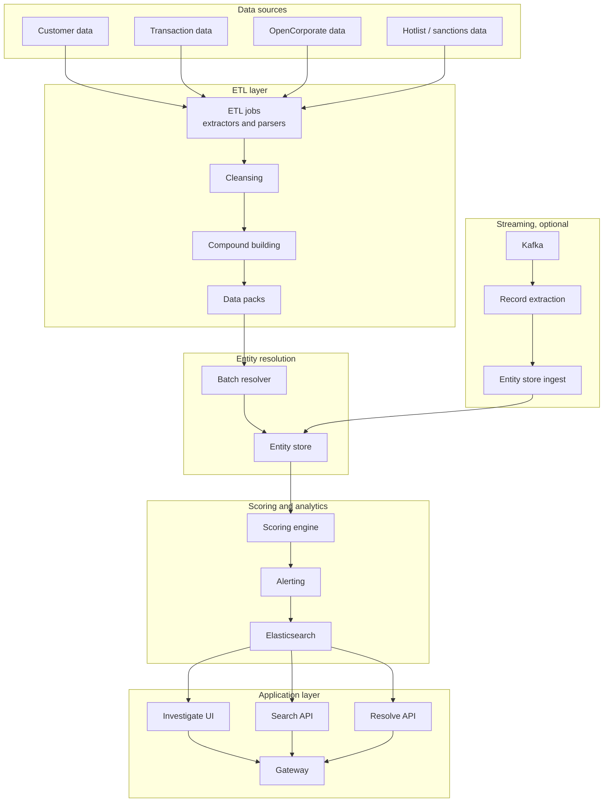
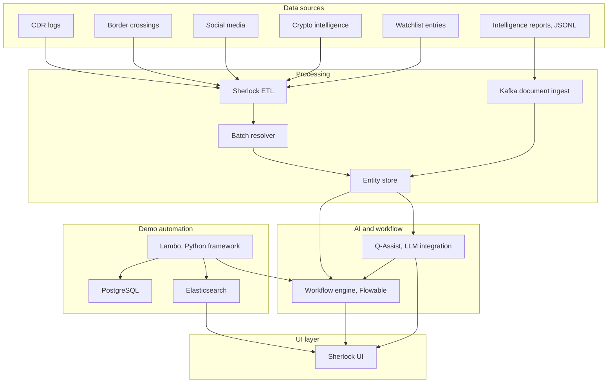

# Quantexa Projects — Interview Reference Summary

**Role:** Lead Data Engineer, Quantexa
**Covers:** dc-datagen / dc-dataquality (Delivery Community Tools), Project-Example-Published-270, Project-Sherlock (World Police Summit demo)

---

# Project 1: Delivery Community Tools (dc-dataquality + dc-datagen)

**This is your strongest project — you owned it end to end as lead developer, architect, and product owner. Lead with this one.**

## 1. Problem statement

Every Quantexa delivery project was independently solving the same two problems: profiling raw client data quality, and generating test/synthetic data when real client data wasn't yet available. There was no shared tooling, so every team duplicated the effort with inconsistent quality standards.

## 2. What was built

Two enterprise Scala/Spark tools, used together as a pipeline, adopted across 50+ Quantexa projects:
- **dc-dataquality (DQ):** automated data profiling and quality analysis — outputs Excel reports for business analysts and an auto-generated config for the DataGen tool.
- **dc-datagen (DG):** synthetic data generation, schema- and config-driven, consuming DQ's output to produce realistic, relationship-aware test data without real PII.

## 3. Architecture

## 4. Step-by-step flow

1. A delivery team points **dc-dataquality** at a raw dataset (any columnar format).
2. Spark reads the data once and runs five analyzer types in a **single pass** for performance: numerical metrics (min/max/mean/stddev/percentiles), qualitative metrics (null %, distinct %, duplicate %), language detection (60+ languages, statistical model), table linking (candidate foreign-key relationships between tables), and date/time distribution analysis.
3. Results are written as multi-sheet **Excel reports** (via Apache POI) for business analysts to review directly — no need to query Spark output themselves.
4. DQ simultaneously **auto-generates a DataGen config** describing the real data's shape (types, distributions, cardinality, relationships) without including any actual sensitive values.
5. **dc-datagen** parses that config (or a manually written one) via Circe/HOCON.
6. **Field generators** produce realistic values per column (respecting type, distribution, pattern); the **relationship engine** enforces referential integrity and realistic cardinality across tables (e.g. one customer → many transactions).
7. Generation is **deterministic** (seed-based), so the same config always produces the same dataset — critical for reproducible tests.
8. Output is written via pluggable writers to CSV, Parquet, JSON, ORC, or Avro.
9. Teams get PII-free, realistic test data without waiting on real client data access.

## 5. Key design decisions (be ready to justify each)

| Decision | Why |
|---|---|
| Scala/Spark over Python/Pandas | Needed to handle 100M+ row datasets; type safety catches errors at compile time rather than in a long-running job; consistency with the rest of the Quantexa platform stack |
| Single-pass analysis | Running 5 analyzers as 5 separate full scans over 100M rows would be far slower; combining them into one DataFrame pass was the single biggest performance lever |
| Approximate algorithms (HyperLogLog, t-digest) | Exact cardinality counts and exact percentiles don't scale to 100M+ rows in reasonable time/memory; HyperLogLog estimates distinct counts, t-digest estimates percentiles, both at ~98-99% accuracy for a fraction of the cost |
| HOCON config over plain YAML | Supports variable substitution and is the Typesafe Config standard already used elsewhere on the platform |
| Hybrid config + code (not pure code, not pure config) | Non-developers can edit configs directly; developers can still extend with Scala generators for complex logic that doesn't fit a config schema |
| Multi-module Gradle monorepo | Shared dependencies, atomic releases across dq/dg/shared-utils, easier cross-module refactoring |
| DQ → DataGen integration, but DataGen also standalone | Most teams have real data to profile first, but some need synthetic data before any real data is available — the tool has to work either way |

## 6. Performance story (have these numbers ready verbatim)

- 100M rows profiled in **under 2 hours** (down from an original ~6 hours before optimization — the 6h → 88min jump came from HyperLogLog + t-digest + single-pass scanning + partitioning tuning).
- DQ tool: **70% reduction** in data profiling time (weeks → hours).
- DataGen tool: **90% reduction** in test data generation effort.
- Adoption: 0 → 50+ projects in 18 months, 200+ active engineers.
- ~30,000 lines of Scala across both tools combined, 90%+ test coverage, effectively zero critical production bugs over two years.

## 7. Production incident — have this ready as a STAR story

A dependency upgrade (Circe) caused a **Date → String** type coercion bug that silently corrupted data for some downstream consumers. Root cause was found in about 1.5 hours; a hotfix shipped in 2.5 hours from detection. Followed up with a post-mortem and added a regression test class specifically for type-coercion edge cases on config parsing. This is your best "describe a production incident" answer — concrete root cause, concrete timeline, concrete prevention step.

## 8. Practice questions

- Walk me through what happens when a 100M-row dataset is profiled — where does the time actually go, and what made it faster?
- Why HyperLogLog instead of an exact `countDistinct`? What's the accuracy trade-off, and when would that trade-off not be acceptable?
- How does the relationship engine guarantee a synthetic transaction always references a synthetic customer that actually exists?
- What was the actual root cause of the Date → String incident, and what's the lasting fix, not just the hotfix?
- Why did you choose a hybrid config+code design instead of going fully config-driven?
- How do you handle competing feature requests from 50+ different delivery teams with a small tooling team?

---

# Project 2: Project-Example-Published-270 (Quantexa Reference Implementation)

**Note before using this in interviews:** your contribution here is logged as **inferred** rather than confirmed against personal records — specific module ownership, the "40% faster project setup" and "10M+ record" figures should be verified against your own notes/commits before stating them as confirmed personal claims. Safer framing if unverified: "I contributed to this reference project" rather than "I led/owned X module."

## 1. Problem statement

Quantexa delivery teams had no single reference implementation showing production-ready patterns for ETL, entity resolution, scoring, and full-stack UI integration — every project re-derived these patterns from scratch.

## 2. What it is

A generic AML (anti-money-laundering) reference project — customers, transactions, corporate entities — used as a copyable template, an onboarding resource for new teams, and a regression-testing surface for new Quantexa platform releases.

## 3. Architecture

## 4. Step-by-step flow

1. Four data source modules feed in: `data-source-customer`, `data-source-transaction`, `data-source-opencorporate`, `data-source-hotlist`.
2. **ETL jobs** (`app-fusion`) extract and parse each source, then **cleanse** the data (standardize formats, types, encodings).
3. Cleansed records are turned into **compounds** — reusable atomic data elements like `NameCompound` and `AddressCompound` — and assembled into **data packs**, the standard input format the Batch Resolver expects.
4. The **Batch Resolver** (`app-resolve`) runs entity resolution (see Section 6 — Entity Resolution Process Deep Dive below) and writes deduplicated entities to the **Entity Store**.
5. The **Scoring Engine** (`app-scoring`) reads resolved entities and runs risk scoring; alerts above threshold are written through to **Elasticsearch**.
6. The **application layer** — Investigate UI, Search API, Resolve API — sits on top of Elasticsearch via a common gateway, giving investigators search and case-investigation access to resolved, scored entities.
7. Optionally, a **Kafka streaming path** runs in parallel: a record-extraction consumer ingests new records in near-real-time and feeds them into the Entity Store, complementing the nightly batch resolver with incremental updates.

## 5. Batch vs. Dynamic resolver

| | Batch | Dynamic |
|---|---|---|
| Trigger | Scheduled (e.g. nightly) | Real-time, on new records |
| Scope | All data | New/changed records only |
| Latency | Hours | Milliseconds |
| Accuracy | Highest | Good, slightly lower than full batch |

## 6. Entity resolution process deep dive (core concept to know cold)

1. **Cleansing** — standardize raw data (casing, formats, encodings).
2. **Compounds** — build atomic elements (name, address, phone) that are reused across entity types.
3. **Document roots** — flatten entities with their compounds into a resolvable record.
4. **Blocking** — hash records into candidate buckets so you only compare records within the same bucket, instead of comparing every record to every other record. This turns an N² comparison problem into something tractable — e.g. 10M × 10M naive comparisons reduced to roughly 10M comparisons total, a >99.99% reduction.
5. **Scoring** — pairwise similarity scoring (0–1) between candidates in the same block, using algorithms like Jaro-Winkler for name similarity.
6. **Clustering** — a graph algorithm (connected components) groups matched pairs into resolved entities, applying **transitive closure**: if A matches B and B matches C, then A and C are treated as the same entity even if they were never directly compared.
7. **Entity Store** — the final deduplicated, resolved entity output.

**Thresholds:** score > 0.95 = auto-match, 0.80–0.95 = manual review, < 0.80 = no match.

## 7. Graph analytics and scoring, once entities are resolved

- **Nodes** = entities (Person, Company, Account); **edges** = relationships (Owns, Transacts, DirectorOf).
- **Network expansion** — BFS/DFS traversal outward from an entity of interest, typically 2–3 hops, to find connected entities (e.g. Person → Accounts → Transactions → other Persons).
- **Community detection** (connected components) — surfaces clusters that may represent crime rings.
- **Centrality metrics** — degree, betweenness, PageRank — identify key/central players in a network.
- **Pattern detection** — circular transactions, smurfing (structuring transactions to avoid reporting thresholds), shell company chains.
- **Scoring framework** — modular scoring steps (velocity, sanctions exposure, network risk) combine into a weighted **scorecard**; score > 70 triggers an alert. Batch scoring re-scores everything nightly; dynamic scoring runs in real time on new transactions.

## 8. Practice questions

- Walk me through entity resolution end to end — cleansing through to the entity store.
- Why is blocking necessary, and what's the actual computational savings?
- What's the difference between the batch resolver and the dynamic resolver, and when would you use each?
- What is a compound, concretely, and why build it as a reusable atomic element rather than inline per entity type?
- How does graph analytics add value beyond entity resolution alone — what can you see with a network that you can't see with a single resolved entity?
- (If asked about your specific contribution) — be ready to answer honestly that this was a reference/shared project and describe the parts you can confirm you worked on, rather than overstating ownership.

---

# Project 3: Project-Sherlock (World Police Summit 2025 Demo)

**Note before using this in interviews:** your specific contribution here is also logged as **inferred** (likely data pipeline / ETL / entity-resolution-configuration work, performance tuning for demo responsiveness) — verify against your own records before stating specifics. This project is strongest used to demonstrate breadth (you understand the AI/workflow layer of the platform, not just the data layer) rather than to claim deep ownership.

## 1. Problem statement

Quantexa needed a compelling, purpose-built demo to win law enforcement and government contracts at the World Police Summit 2025 (Dubai) — showcasing AI-assisted investigation (Q-Assist), case/workflow management, and real-time multi-modal data ingestion in a law-enforcement context.

## 2. What it is

An end-to-end demo system combining the standard entity resolution pipeline (same core pattern as Project-Example) with two additions specific to this use case: an LLM-powered investigation assistant, and a Python-based demo automation framework for reliably seeding/running live demos.

## 3. Architecture

## 4. Step-by-step flow

1. Five structured source types feed the standard ETL/resolution path: CDR (call detail record) logs, border crossing records, social media data, crypto intelligence, and watchlist entries — same cleansing → compound → batch resolver → entity store pattern as Project-Example.
2. A sixth source — **unstructured intelligence reports** in JSONL — bypasses the batch ETL path entirely and goes through a **Kafka document ingest** pipeline directly into the Entity Store, demonstrating the platform's ability to handle unstructured/streaming data alongside structured batch data.
3. Once entities are resolved, **Q-Assist** (LLM integration) sits on top of the Entity Store, allowing investigators to query in natural language and get contextual recommendations grounded in the resolved entity/relationship data.
4. A **Workflow Engine** built on **Flowable** (an open-source BPMN engine) manages case creation, task assignment, and approval workflows — Q-Assist can trigger or feed into workflow tasks (e.g. "flag this entity for review").
5. **Lambo**, a Python demo-automation framework, seeds PostgreSQL and Elasticsearch with realistic demo data and can simulate live events and trigger workflow actions — this is what makes a complex multi-system demo reliably repeatable in front of an audience rather than depending on manual setup each time.
6. The **Sherlock UI** is the single front end pulling together Elasticsearch (search/entities), the Workflow Engine (case state), and Q-Assist (AI assistant) into one investigator-facing interface.

## 5. What's genuinely new here versus Project-Example

| Project-Example | Project-Sherlock adds |
|---|---|
| Structured ETL → resolver → entity store → scoring → UI | Same core pattern, plus: |
| — | Unstructured data ingestion via Kafka (JSONL intelligence reports) |
| — | LLM-powered investigation assistant (Q-Assist) |
| — | Case/workflow management (Flowable workflow engine) |
| — | Demo automation framework (Lambo) for repeatable live demos |

This is a useful way to frame it in an interview: "the data foundation is the same entity resolution pattern as our reference implementation, but this demo layers AI assistance and workflow management on top, plus a separate automation framework just to make the demo itself reliable."

## 6. Practice questions

- How does an unstructured intelligence report actually become part of a resolved entity's profile — walk through the Kafka ingest path?
- What does Q-Assist actually do technically — is it doing retrieval-augmented generation against the Entity Store, or something else? (Be honest if you don't know the internals — this is exactly where you should say "the AI layer wasn't my area, but here's how the data fed into it.")
- Why build a separate automation framework (Lambo) just for a demo — what does that solve that manual demo prep doesn't?
- Why use a BPMN engine (Flowable) rather than a custom-built workflow system?
- What was your actual role on this project — be ready to scope this honestly rather than claiming the AI/workflow pieces if your work was on the data pipeline side.

---

# Cross-project quick reference

## Technologies across all three projects

**Core:** Scala 2.12, Apache Spark 3.3/3.5, Gradle 8.4, ScalaTest
**Data processing:** Circe (JSON), Apache POI (Excel), HyperLogLog, t-digest
**Quantexa platform:** Fusion Framework, Batch Resolver, Entity Store, Scoring Framework
**Infrastructure:** GCP Dataproc, Elasticsearch, PostgreSQL, Kafka, Airflow, Docker Compose, Jenkins

## Architecture patterns to be able to name and explain

1. Modular plugin architecture (extensible generators/analyzers)
2. Single-pass analysis (combine metrics in one DataFrame scan)
3. Streaming processing (`toLocalIterator()` over `collect()` for large datasets)
4. Approximate algorithms (HyperLogLog, t-digest — accuracy/speed trade-off)
5. Deterministic generation (seed-based reproducibility)
6. Entity-aware relationships (referential integrity in synthetic data)
7. Config-driven design (HOCON + Circe, type-safe)
8. Multi-datasource orchestration (dependency resolution, shared Spark session)
9. Salted joins (handling skewed high-cardinality keys)
10. Incremental entity resolution (batch baseline + dynamic real-time)

## Most likely cross-cutting interview questions

- "Tell me about your most complex project" → DQ tool: 100M-row profiling, 5 analysis types, approximate algorithms, single-pass distributed processing.
- "Biggest performance optimization you've made?" → DQ tool: 6h → 88min for 100M rows via HyperLogLog, streaming Excel writes, single-pass analysis, partition tuning.
- "Describe a production incident" → Circe Date→String corruption bug: root cause in 1.5h, hotfix in 2.5h, post-mortem, added regression coverage for type coercion.
- "How do you manage competing stakeholders?" → Impact-vs-effort prioritization, transparent roadmap, saying no with alternatives, regular office hours for the 50+ teams using the tools.
- "What's entity resolution, in your own words?" → Linking fragmented records to real-world entities via compound matching (name, address, DOB), blocking to make comparison tractable, probabilistic scoring, graph clustering with transitive closure.
- "Why Scala over Python for this kind of work?" → Type safety catches errors at compile time at 100M-row scale where a runtime failure is expensive; native Spark integration; consistency with the rest of the platform. Python still has its place for exploration/ML, just not for this production pipeline.
- "How do you mentor junior engineers?" → Incremental complexity, daily reviews, pairing on the hard parts, asking guiding questions rather than handing over answers.

## Honesty checkpoint before interviews

For **Project-Example** and **Project-Sherlock**, your documented contribution is marked as inferred rather than confirmed. Before stating specific ownership claims (module names, specific metrics like "40% faster setup" or "10M+ records"), check these against your own work history, commit history, or performance reviews. If you can't confirm them, use safer framing: describe the project and your general area of contribution honestly, rather than presenting inferred details as verified personal achievements. The dc-datagen/dc-dataquality project, by contrast, is well-documented as yours end to end — lead with that one.
