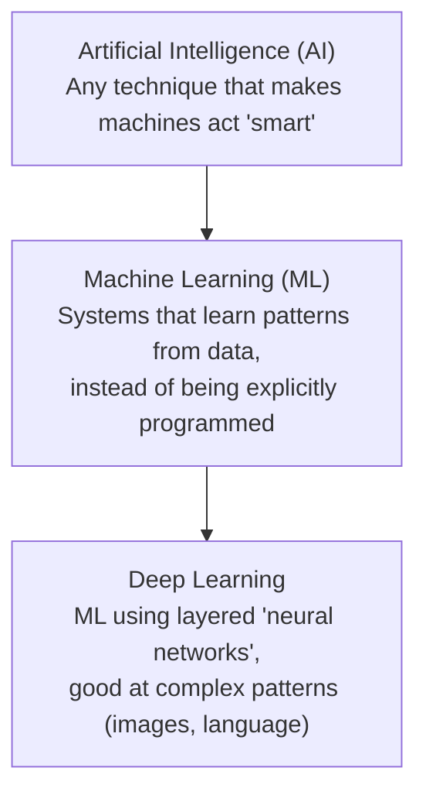
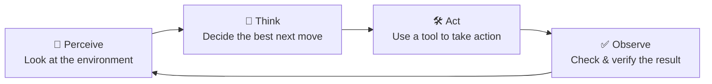
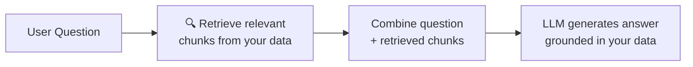

# AI & Agentic AI — Generic Terms Revision Notes
---

# PART 1 — Foundations

## 1. AI → ML → Deep Learning (The Nesting Doll)

These three terms are often used loosely, but they're **nested inside each other**, not separate things:

- **AI** — the broadest umbrella: any technique that makes a machine behave intelligently (includes simple rule-based systems too, not just learning-based ones).
- **ML (Machine Learning)** — a subset of AI: systems that **learn patterns from data** rather than being hand-coded with explicit rules.
- **Deep Learning** — a subset of ML: uses layered **neural networks** to learn very complex patterns — this is the technique behind modern LLMs, image recognition, etc.

> Simple way to remember: **Deep Learning ⊂ Machine Learning ⊂ AI** — every deep learning system is ML, and every ML system is AI, but not the other way around.

## 2. What Is an LLM (Large Language Model)?

An LLM is a type of deep learning model trained on **massive amounts of text** (essentially a huge slice of the internet, books, code, etc.) to learn statistical patterns in language.

**What it actually does:** an LLM's core job is to **predict the next token**, over and over, based on everything that came before it.

- **Token** — a small chunk of text (roughly a word, part of a word, or punctuation mark) — the basic unit an LLM reads and generates. E.g., "unbelievable" might be split into tokens like `un`, `believ`, `able`.
- The model doesn't "know facts" the way a database does — it's generating the **statistically most plausible next token**, based on patterns learned from its training data.

> Example: given "The capital of France is", the model predicts "Paris" as the most likely next token — not because it looked it up, but because that pattern appeared overwhelmingly often in its training data.

**The Transformer Breakthrough (2017)**
The architecture that made modern LLMs possible was introduced in the 2017 paper *"Attention Is All You Need"* — the **Transformer**. Its key innovation, the **attention mechanism**, lets the model weigh the relevance of *every* other word in the input when processing each word, rather than reading strictly left-to-right — this is what allows LLMs to handle long-range context and nuance so much better than earlier architectures (like RNNs).

## 3. Temperature & Context Window

Two settings that shape how an LLM behaves 

**Temperature** — controls **randomness/creativity** in the model's next-token predictions.
- **Low temperature** (e.g., 0–0.3) → the model almost always picks the most likely next token → consistent, predictable, "textbook" answers. Good for factual Q&A, code generation.
- **High temperature** (e.g., 0.8–1+) → the model is more willing to pick less-likely tokens → more varied, creative, sometimes less coherent output. Good for brainstorming, creative writing.

**Context Window** — the **maximum amount of text** (measured in tokens) the model can "see" at once — both what you input *and* what it generates, combined.
- Everything the model knows about the current conversation must fit inside this window — anything older gets pushed out/forgotten (this connects directly to the "Memory" problem in §8).
- **Bigger isn't automatically better** — feeding a model far more context than it needs can actually make it *worse* at finding the relevant needle in the haystack, and costs more (see §14). The goal is giving it the **right, relevant amount** of context — not just the maximum possible.

---

# PART 2 — From Chatbots to Agents

## 4. Chatbot vs. AI Agent

|                 | Chatbot                                              | AI Agent                                                                     |
|-----------------|------------------------------------------------------|------------------------------------------------------------------------------|
| **Behavior**    | **Reactive** — waits for a question, gives an answer | **Proactive** — works toward a goal, decides its own steps                   |
| **Has tools?**  | Usually not — just generates text                    | Yes — can call tools/APIs to actually *do* things                            |
| **Multi-step?** | Typically one question → one answer                  | Can plan and execute a whole sequence of actions                             |
| **Example**     | Answering "What's the capital of France?"            | "Book me the cheapest flight to Paris next week" — searches, compares, books |

**The Agentic Revolution**
This is the shift from AI that only *talks* (chatbots) to AI that can **take actions and make decisions on your behalf** — booking things, writing and running code, searching the web, updating records — not just answering questions in a chat window.

> A helpful (if informal) way to picture an **Agent**: think of it as a tireless virtual assistant — it doesn't just answer when asked, it can independently pursue a goal you gave it, using tools, until the goal is done.

## 5. The Core Agent Loop

Every AI agent, no matter how sophisticated, runs on a repeating cycle:

| Step         | What happens                                                        | Who's responsible                       |
|--------------|---------------------------------------------------------------------|-----------------------------------------|
| **Perceive** | The agent takes in relevant information about its current situation | **You** provide the environment/context |
| **Think**    | Decides the best next step, given the goal                          | **The LLM** does the reasoning          |
| **Act**      | Executes an action using an available tool                          | **You** provide the tools               |
| **Observe**  | Checks whether the action actually worked / what the result was     | **You** provide the feedback mechanism  |

> This loop repeats until the agent decides the goal is complete (or it hits a limit you've set, like a max number of steps — an important safety guardrail, see §15).

## 6. The ReAct Pattern (Reasoning + Acting)

A widely-used prompting pattern where the agent is explicitly instructed to **write out its reasoning ("thought")** before actually taking each action, rather than jumping straight to an action.

> Example flow: *"Thought: I need to check the current weather before recommending an outfit. Action: call weather_api('Paris'). Observation: 12°C, rainy. Thought: I should recommend a raincoat, not a t-shirt."*

**Why it matters:** forcing the model to articulate its reasoning **before** acting significantly reduces impulsive, poorly-thought-out actions — and makes the agent's decision-making **visible and debuggable** for you, rather than a black box.

---

# PART 3 — Giving Agents Superpowers

## 7. Tools — Letting the AI Touch the Real World

An LLM on its own is like **a genius locked in a room with no windows or phone** — it can reason brilliantly, but it can't check today's weather, send an email, or query a live database. It only knows what was in its training data, frozen at a point in time.

**Tools** solve this — they're functions the LLM is given access to, letting it **call real APIs** to fetch live information or take real actions.
> Example: giving the model a `get_stock_price(ticker)` tool lets it answer "what's Tesla's stock price right now?" with a real, current number — instead of guessing or refusing.

## 8. Memory — Fixing AI's "Amnesia"

By default, an LLM has **no memory of past conversations** — every new conversation starts completely blank; it doesn't remember you or anything discussed yesterday (or even five conversations ago).

To fix this, agent systems bolt on **external memory** — typically a database that stores past interactions, facts, or preferences, which gets **re-fed back into the context window** at the start of future conversations, creating the *illusion* of persistent memory.

> This connects directly to the **Context Window** limit (§3) — memory systems exist precisely because you can't just keep stuffing the entire conversation history in forever; it has to be selectively stored and retrieved.

## 9. RAG — Retrieval-Augmented Generation

**RAG** gives an AI access to **your own private/current data**, without the expensive process of retraining the model itself.

**How it works, simply:**
1. Your private documents (PDFs, wikis, databases, etc.) are stored in a searchable form.
2. When a question comes in, the system first **retrieves** the most relevant chunks of your data.
3. Those chunks are **inserted into the prompt** as extra context.
4. The LLM then generates its answer **grounded in that retrieved information**, instead of relying purely on what it memorized during training.

> Example: A company chatbot answering "What's our refund policy?" using RAG will retrieve the actual current refund policy document and answer from that — instead of hallucinating a generic answer from its general training knowledge.

## 10. Vector Databases — How RAG Actually Finds Things

To make RAG's retrieval step work, text needs to be converted into **vectors** — long lists of numbers that act as a kind of **mathematical fingerprint** for the *meaning* of that text (this conversion step is called **embedding**).

- Similar meanings → similar/nearby vectors, even if the exact wording is completely different.
- This lets you **search by meaning**, not just exact keyword matching.
> Example: searching "how do I get my money back" can correctly match a document titled "Refund Policy" — even though **no words overlap** — because their vector "fingerprints" are close together in meaning.
- A **Vector Database** (e.g., Pinecone, Weaviate, Chroma, or vector features built into Postgres/Databricks) is a database purpose-built to store these vectors and quickly find the "nearest" ones to a given query.

## 11. MCP — Model Context Protocol

Connecting an AI to different external apps/tools **used to require writing messy, custom integration code for every single tool** — one-off code for connecting to Slack, another one-off for Google Drive, another for your internal database, etc.

**MCP (Model Context Protocol)** standardizes this — it acts like a **universal connector/"USB port"** for AI: any tool/app that supports MCP can be plugged into any AI system that supports MCP, **without custom one-off integration code** for each pairing.

> Simple analogy: before USB, every device needed its own unique cable/port. MCP is trying to be the "USB-C" of AI tool integrations — one standard connector, works everywhere.

---

# PART 4 — Building Real Agent Systems

## 12. Agent Architectures — Different Problems Need Different Setups

Not every task needs the same agent design. Common patterns:

| Pattern                    | How it works                                                                                                                         | Best for                                                                                                       |
|----------------------------|--------------------------------------------------------------------------------------------------------------------------------------|----------------------------------------------------------------------------------------------------------------|
| **Chain of Thought**       | The model reasons step-by-step in plain text before giving a final answer, without necessarily taking real-world actions in between. | Reasoning-heavy questions (math, logic) where you just need a better *answer*, not tool use.                   |
| **Plan and Execute**       | The agent first drafts a **full multi-step plan** upfront, *then* executes each step (possibly re-planning if something goes wrong). | Complex, multi-step tasks where thinking through the whole approach before acting avoids wasted/wrong actions. |
| **Evaluator / Reflection** | The agent (or a second LLM) **checks its own output** against criteria and iterates/improves before finalizing.                      | Tasks where quality matters more than speed — content generation, code review.                                 |

> This maps directly to the "workflow patterns" (prompt chaining, routing, evaluator-optimizer, etc.) in your earlier AI Agent Concepts notes — same underlying ideas, described here in more general/product-agnostic terms.

## 13. Multi-Agent Systems — When One Agent Isn't Enough

Complex jobs sometimes need a **team of specialized agents** instead of one generalist agent trying to do everything.

- A **manager/orchestrator agent** can create and delegate to **worker agents**, each handling a sub-piece of the task (similar to the Orchestrator-Worker pattern you've already studied).
- **The real trade-off: cost.** Running multiple agents (each making their own LLM calls, potentially in parallel or back-and-forth) is **significantly more expensive** than a single agent call — more tokens, more latency, more complexity to debug.
- **Decision point:** whether multi-agent is worth it depends on your actual constraints — **how much time you have** vs. **how much you're willing to spend**. For many tasks, a single well-designed agent is more than sufficient, and multi-agent setups should be reserved for genuinely complex work that benefits from specialization.

## 14. Safety & Guardrails

Giving an AI agent access to real tools (that can send emails, modify data, spend money) is inherently **risky** — a bad decision doesn't just produce a wrong sentence, it can cause a **real-world action** you didn't want.

Key safety practices:
- **Input validation** — check/sanitize data **before** it's sent to the LLM (e.g., screening for injected malicious instructions hidden in a document the agent is reading).
- **Output validation** — check the LLM's output **before** it's acted upon or shown to the user (catching hallucinations, unsafe suggestions, or policy violations).
- **Human-in-the-loop** — for high-stakes or irreversible actions (sending money, deleting data, publishing content), require **explicit human approval** before the agent proceeds, rather than letting it act fully autonomously.

> This is essentially the same concept as **Guardrails** and **Tripwires** covered in your OpenAI Agents SDK notes — this section is the general theory; that one is the concrete implementation.

## 15. Cost Management — The "Route to the Cheapest Capable Model" Idea

Not every task needs your most powerful (and most expensive) model. A common cost-optimization heuristic — often described loosely as something like a **60-30-10 split** — is to **route tasks to different model tiers based on difficulty**:

| Task complexity | Model tier | Example |
|---|---|---|
| **~60% — Simple tasks** | Fast, cheap, smaller model | Basic classification, simple lookups, formatting |
| **~30% — Mid-complexity tasks** | Mid-tier model | Summarization, moderate reasoning |
| **~10% — Hardest tasks** | Most powerful (and expensive) model | Complex multi-step reasoning, high-stakes decisions |

> ⚠️ Treat the exact percentages as a **rough mental model, not a strict rule** — the real point is: **don't default to your most expensive model for everything.** Profile your actual task mix and route intelligently; this is sometimes called **model routing** in production agent systems, and can cut costs dramatically without hurting quality where it matters.

---

## 16. How to Actually Get Good at Agentic AI (A Practical Roadmap)

A sensible learning progression, rather than trying to absorb everything at once:

1. **Start small** — build the simplest possible agent (one tool, one clear task) before attempting anything complex.
2. **Learn by building** — this area is genuinely learned hands-on; reading alone won't build real intuition for how these systems actually behave/fail.
3. **Add a tool** — extend your simple agent with one real tool/API call, and see how it changes what it can do.
4. **Add memory and RAG** — once comfortable with tools, layer in persistent memory and retrieval over your own data.
5. **Get your hands dirty with failures** — deliberately push your agent until it breaks (bad tool calls, hallucinated actions, runaway loops) — debugging *why* it failed teaches you more about guardrails and architecture than any tutorial.

---

## Quick Recap Table

| Term | One-liner |
|---|---|
| AI / ML / Deep Learning | Broadest umbrella → learns from data → uses layered neural networks |
| LLM | Deep learning model trained to predict the next token from massive text data |
| Token | The small chunk of text (word/sub-word) an LLM reads and generates |
| Transformer (2017) | The "attention"-based architecture that made modern LLMs possible |
| Temperature | Controls randomness — low = predictable, high = creative |
| Context Window | The max amount of text (tokens) a model can "see" at once |
| Chatbot vs. Agent | Reactive Q&A vs. proactive, goal-driven, tool-using |
| Agentic Revolution | The shift from AI that talks to AI that takes real actions |
| Core Agent Loop | Perceive → Think → Act → Observe, repeating |
| ReAct Pattern | Write out reasoning before acting — reduces impulsive mistakes |
| Tools | Give the LLM the ability to call real APIs / take real actions |
| Memory | External storage that fixes the LLM's default lack of persistent memory |
| RAG | Retrieve your private data, feed it into the prompt, ground the answer in it |
| Vector Database | Stores "meaning fingerprints" (embeddings) for fast, meaning-based search |
| MCP | A universal, standardized connector between AI systems and external tools |
| Chain of Thought | Step-by-step reasoning in text before answering |
| Plan and Execute | Draft a full plan first, then execute it step by step |
| Evaluator/Reflection | Agent checks and improves its own output before finalizing |
| Multi-Agent System | A team of specialized agents — powerful, but expensive |
| Guardrails / Human-in-the-loop | Validate input/output; require approval for risky, irreversible actions |
| Model Routing | Send tasks to the cheapest model capable of handling them well |

