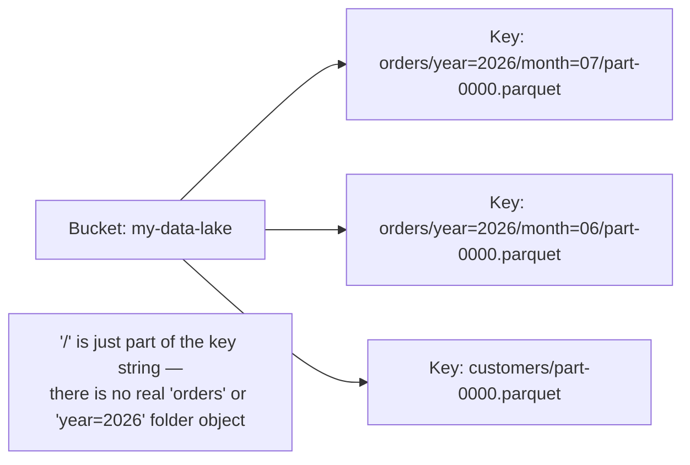
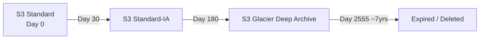
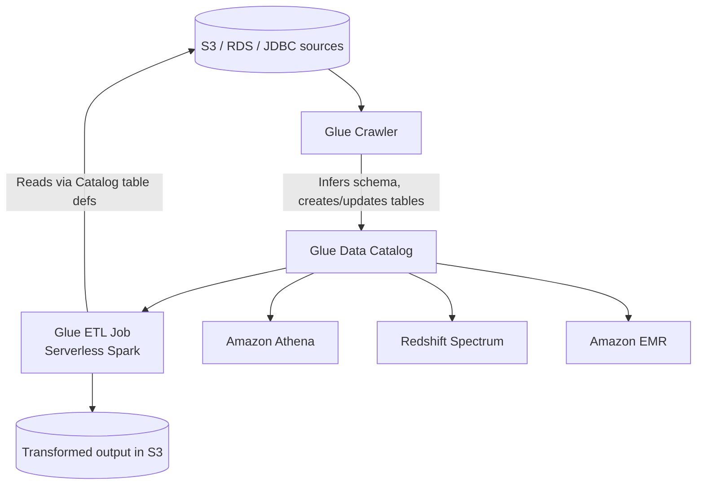
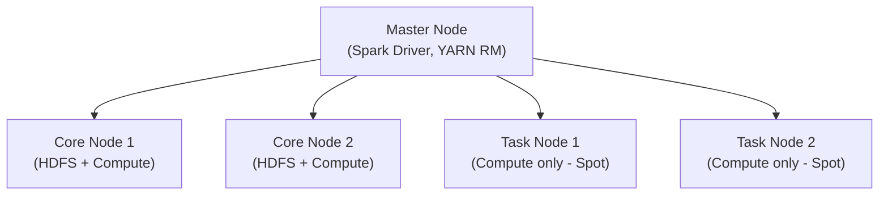
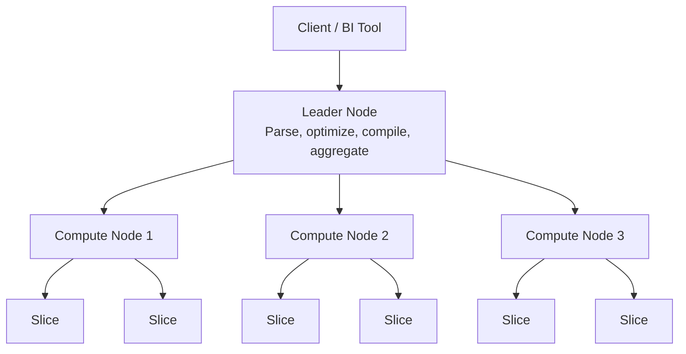
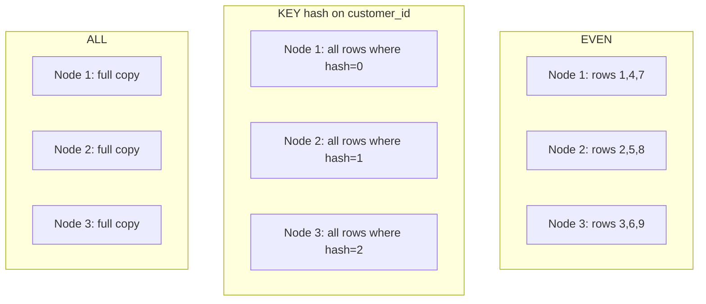
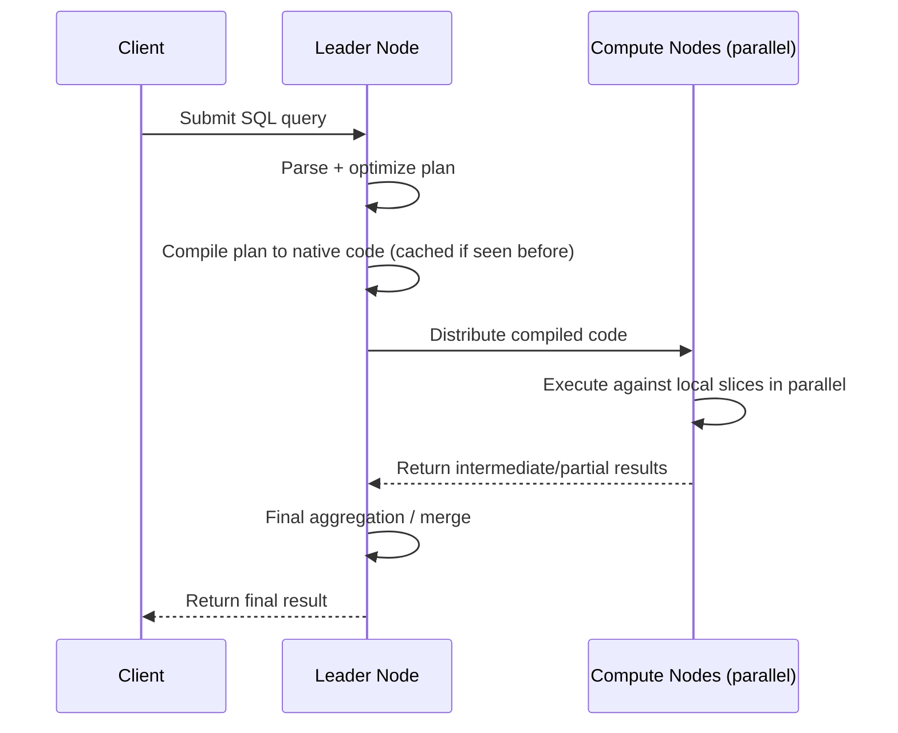

# AWS for Data Engineering — S3, Glue, EMR, Redshift

> Reviewed, corrected, and expanded from original study notes. Includes definitions, examples, diagrams, and corrections to inaccuracies in the original draft.

---

## 📌 Index

1. [Amazon S3](#1-amazon-s3)
   - 1.1 [S3 is an Object Store, Not a File System](#11-s3-is-an-object-store-not-a-file-system)
   - 1.2 [Storage Classes](#12-storage-classes)
   - 1.3 [Lifecycle Policies](#13-lifecycle-policies)
   - 1.4 [Versioning](#14-versioning)
   - 1.5 [Encryption Options](#15-encryption-options)
   - 1.6 [Bucket Policies vs IAM Policies](#16-bucket-policies-vs-iam-policies)
   - 1.7 [Pre-Signed URLs](#17-pre-signed-urls)
   - 1.8 [Multipart Upload](#18-multipart-upload)
   - 1.9 [S3 Transfer Acceleration](#19-s3-transfer-acceleration)
   - 1.10 [Byte-Range Fetch & S3 Select](#110-byte-range-fetch--s3-select)
2. [AWS Glue](#2-aws-glue)
   - 2.1 [Glue Components Overview](#21-glue-components-overview)
   - 2.2 [Glue Data Catalog](#22-glue-data-catalog)
   - 2.3 [Glue Crawler](#23-glue-crawler)
   - 2.4 [DynamicFrame vs DataFrame](#24-dynamicframe-vs-dataframe)
   - 2.5 [Glue Job Types](#25-glue-job-types)
   - 2.6 [Glue Job Bookmarks](#26-glue-job-bookmarks)
   - 2.7 [Worker Types](#27-worker-types)
   - 2.8 [Triggers & Orchestration](#28-triggers--orchestration)
   - 2.9 [Glue Data Quality, Glue Studio, Connections](#29-glue-data-quality-glue-studio-connections)
3. [Amazon EMR](#3-amazon-emr)
   - 3.1 [What EMR Solves](#31-what-emr-solves)
   - 3.2 [Node Types](#32-node-types)
   - 3.3 [Deployment Options](#33-deployment-options)
   - 3.4 [Transient vs Long-Running Clusters](#34-transient-vs-long-running-clusters)
   - 3.5 [Managed Scaling vs Auto Scaling](#35-managed-scaling-vs-auto-scaling)
   - 3.6 [Storage: HDFS vs EMRFS (S3)](#36-storage-hdfs-vs-emrfs-s3)
   - 3.7 [Performance & Cost Optimization](#37-performance--cost-optimization)
4. [Amazon Redshift](#4-amazon-redshift)
   - 4.1 [Architecture Overview](#41-architecture-overview)
   - 4.2 [Columnar Storage](#42-columnar-storage)
   - 4.3 [Distribution Styles](#43-distribution-styles)
   - 4.4 [Sort Keys](#44-sort-keys)
   - 4.5 [Zone Maps](#45-zone-maps)
   - 4.6 [Workload Management (WLM)](#46-workload-management-wlm)
   - 4.7 [Redshift Spectrum](#47-redshift-spectrum)
   - 4.8 [Query Execution Flow](#48-query-execution-flow)
   - 4.9 [Scaling](#49-scaling)

---

## 1. Amazon S3

### 1.1 S3 is an Object Store, Not a File System

S3 stores data as **objects** (key–value pairs: a key/name, the object's byte content, and metadata) inside **buckets** — it is **not** a hierarchical file system. The `/` characters in object keys are purely a **naming convention**; S3 has no real concept of "folders." Tools like the AWS Console, CLI, and S3 SDKs simulate a directory-like view by parsing `/` in key names, but under the hood, `s3://bucket/2026/07/04/data.parquet` is just a single object whose entire key happens to contain slashes — there is no actual `2026` directory object that "contains" it.

This matters practically:
- **Listing operations** (`ListObjectsV2`) are the mechanism used to simulate "browsing a folder" — and this is exactly why S3 listing at scale is slower/costlier than a real file system's directory lookup (relevant to the small-file problem discussed in the partitioning notes).
- There's no atomic "rename a folder" operation — renaming a "folder" actually means copying every object under that prefix to new keys and deleting the old ones.



### 1.2 Storage Classes

> Correction: the original list mixed old and current naming and missed a couple of tiers. Current storage classes (as of this writing):

| Storage Class | Use Case | Retrieval |
|---|---|---|
| **S3 Standard** | Frequently accessed, general-purpose data | Immediate |
| **S3 Intelligent-Tiering** | Unknown/changing access patterns — automatically moves objects between access tiers based on usage, with no retrieval fees | Immediate (for the frequent/infrequent tiers) |
| **S3 Standard-IA** (Infrequent Access) | Infrequently accessed but needs millisecond access when needed | Immediate, but with a per-GB retrieval fee |
| **S3 One Zone-IA** | Same as Standard-IA but stored in a **single** Availability Zone (cheaper, less resilient — fine for easily reproducible data) | Immediate |
| **S3 Glacier Instant Retrieval** | Archive data needing millisecond retrieval, accessed roughly once a quarter | Immediate |
| **S3 Glacier Flexible Retrieval** | Archive data, retrieval within minutes to hours acceptable | Minutes–hours |
| **S3 Glacier Deep Archive** | Long-term archive/compliance retention (lowest cost), retrieval tolerance of hours | ~12 hours |

**Example — moving cold data down the tiers via lifecycle rules** (see below): raw ingestion logs land in S3 Standard, move to Standard-IA after 30 days, then Glacier Deep Archive after 180 days for 7-year compliance retention.

### 1.3 Lifecycle Policies

**Lifecycle rules** automatically transition objects between storage classes, or expire (delete) them, based on age — a key cost-optimization lever, since manually moving/deleting objects at scale isn't practical.

```json
{
  "Rules": [
    {
      "ID": "archive-old-logs",
      "Filter": { "Prefix": "logs/" },
      "Status": "Enabled",
      "Transitions": [
        { "Days": 30, "StorageClass": "STANDARD_IA" },
        { "Days": 180, "StorageClass": "GLACIER_DEEP_ARCHIVE" }
      ],
      "Expiration": { "Days": 2555 }
    }
  ]
}
```



### 1.4 Versioning

When **versioning** is enabled on a bucket, every write to the same key creates a **new version** rather than overwriting the old one — all prior versions remain retrievable.

- A "delete" on a versioned object doesn't actually remove data — it adds a **delete marker** (a zero-byte placeholder that makes the object appear deleted in normal listing/GET operations), while the underlying prior versions remain in the bucket until explicitly deleted by version ID (or expired via lifecycle rules targeting **non-current versions**).
- This protects against accidental overwrite/delete, and underpins some replication and compliance (Object Lock/WORM) features — but without a lifecycle policy to clean up non-current versions, storage costs grow indefinitely since nothing is actually deleted by default.

### 1.5 Encryption Options

| Method | Who manages the key | Notes |
|---|---|---|
| **SSE-S3** | AWS manages the key entirely | Simplest; AES-256, no extra configuration |
| **SSE-KMS** | AWS KMS-managed key (customer can control via KMS key policy) | Adds audit trail (CloudTrail logs key usage), supports key rotation, access control at the key level — most common choice when compliance/audit matters |
| **SSE-C** | Customer provides their own encryption key with each request | AWS never stores the key — customer fully responsible for key management |
| **Client-Side Encryption** | Customer encrypts data **before** uploading, using their own key management | AWS never sees plaintext data at all |

> Correction: the original notes wrote "SSE-S£" — this should be **SSE-S3**.

### 1.6 Bucket Policies vs IAM Policies

Both are JSON-based access control, but attached differently and used for different purposes:

| | Bucket Policy | IAM Policy |
|---|---|---|
| Attached to | The **bucket** itself (resource-based policy) | A **user/role/group** (identity-based policy) |
| Controls | Who (including **cross-account** principals) can access this specific bucket, and how | What actions this specific identity can perform, across whichever resources the policy allows |
| Typical use | Granting **cross-account** access, making a bucket public (rare/careful use), enforcing bucket-wide conditions (e.g., require encryption on upload) | Controlling what a given application/user/role within *your* account can do generally |

Both are evaluated together — an action is only allowed if **no explicit deny** exists in either, and **at least one** applicable policy explicitly allows it.

### 1.7 Pre-Signed URLs

A **pre-signed URL** grants **temporary, time-limited access** to a specific S3 object, generated by someone who already has the necessary permissions, without requiring the recipient to have any AWS credentials at all.

```python
import boto3

s3 = boto3.client("s3")
url = s3.generate_presigned_url(
    "get_object",
    Params={"Bucket": "my-bucket", "Key": "reports/q2-summary.pdf"},
    ExpiresIn=3600  # URL valid for 1 hour
)
```
Common use: letting an external user download/upload a specific file (e.g., a customer downloading their invoice, or a partner uploading a batch file) without granting them broader bucket access or IAM credentials.

### 1.8 Multipart Upload

**Multipart upload** splits a large object into parts, uploaded independently (and in parallel), then reassembled by S3 on completion.

- **Mandatory** for objects **larger than 5GB** (S3's single-PUT upload limit is 5GB; multipart is the only way to upload anything bigger).
- **Optional but recommended** for objects as small as ~100MB, since it improves upload throughput (parallel part uploads) and resilience (a failed part can be retried individually instead of restarting the entire upload).
- Minimum part size is 5MB (except the last part), maximum object size overall is 5TB.

### 1.9 S3 Transfer Acceleration

Uses **CloudFront's globally distributed edge locations** to speed up uploads/downloads over long distances — the client uploads to the nearest edge location, which then routes the data to the target bucket over AWS's optimized backbone network, instead of the public internet path all the way to the bucket's region.

### 1.10 Byte-Range Fetch & S3 Select

- **Byte-range fetch**: request only a specific byte range of an object (`Range: bytes=0-1023` HTTP header) instead of downloading the whole object — useful for reading just a footer/header of a large file (e.g., Parquet footer metadata) or resuming an interrupted download.
- **S3 Select**: run a simple SQL-like query (`SELECT * FROM S3Object WHERE ...`) directly against a CSV/JSON/Parquet object stored in S3, having S3 return only the matching/needed data rather than the client downloading and filtering the entire object itself — reduces data transfer and client-side processing for simple filters.

---

## 2. AWS Glue

### 2.1 Glue Components Overview

AWS Glue is a **serverless data integration service** composed of three core pieces working together:

- **Glue Data Catalog** — a persistent, central metadata store (database/table/partition/schema definitions) — effectively a managed Hive Metastore-compatible catalog shared across many AWS analytics services (Athena, EMR, Redshift Spectrum, Glue ETL).
- **Glue Crawler** — connects to a data source, infers its schema, and populates/updates the Data Catalog automatically.
- **Glue ETL Jobs** — serverless Spark (or Python Shell/Ray) jobs that read, transform, and write data, typically using the Data Catalog for source/target table definitions.



### 2.2 Glue Data Catalog

Stores, per table: **database** name, **table** name, physical **location** (S3 path), **columns**/schema, **file format** details (Parquet/CSV/JSON, SerDe info), and **partition** definitions. This catalog is the shared metadata backbone that lets Athena, Redshift Spectrum, EMR (Hive/Spark), and Glue ETL jobs all query the same tables consistently without each maintaining separate metadata.

### 2.3 Glue Crawler

A crawler automates metadata discovery:
1. **Connects** to a data source (S3, RDS, any JDBC-compatible database, DynamoDB, etc.).
2. **Samples** the data to determine its structure.
3. **Infers the schema** (column names, types).
4. **Creates or updates** the corresponding table(s) in the Glue Data Catalog.
5. On subsequent runs, **detects new partitions** (e.g., a new `dt=2026-07-04` folder appearing) and registers them automatically — avoiding the need to manually run `MSCK REPAIR TABLE`-style partition registration.

⚠️ Practical note: crawlers can be a hidden cost/latency source at scale (frequent runs against large, high-partition-count S3 prefixes can be slow and add unnecessary Glue costs) — many teams instead register partitions directly from the ETL job itself, or use **partition projection** (Athena/Glue feature that computes partition locations algorithmically from a naming pattern, avoiding the need to crawl/store every partition explicitly).

### 2.4 DynamicFrame vs DataFrame

```python
# Glue DynamicFrame — Glue's own abstraction, schema-flexible
dynamic_frame = glueContext.create_dynamic_frame.from_catalog(
    database="flights_db", table_name="raw_flights"
)

# Convert to a standard PySpark DataFrame for transformations
df = dynamic_frame.toDF()

# Do your PySpark transformations
df_clean = df.filter(col("delay") > 0)

# Convert back to a DynamicFrame to write via Glue's writers
output = DynamicFrame.fromDF(df_clean, glueContext, "output")
glueContext.write_dynamic_frame.from_options(
    frame=output,
    connection_type="s3",
    connection_options={"path": "s3://my-bucket/output/"},
    format="parquet"
)
```

**Why `DynamicFrame` exists:** it tolerates **schema inconsistencies** across records (missing fields, mixed types across files in the same table) without failing the job outright — ambiguous columns are represented using **choice types** (e.g., a column that's sometimes an int and sometimes a string is tagged as `choice<int,string>` rather than erroring), which is valuable when ingesting messy, semi-structured, or evolving raw source data.

**In practice:** most engineers convert to a standard `DataFrame` almost immediately after reading, because standard PySpark's API is more expressive, better documented, and has a much larger ecosystem (and better Spark SQL/Catalyst optimizer support) than Glue's DynamicFrame-specific transforms. DynamicFrame is typically used only at the **read/write boundary** (via `from_catalog`/`write_dynamic_frame`), with all actual transformation logic done in plain PySpark.

### 2.5 Glue Job Types

| Type | Use Case |
|---|---|
| **Spark** | Large-scale, distributed batch transformations (the default/most common Glue job type) |
| **Spark Streaming** | Near-real-time/continuous processing (e.g., reading from Kinesis/Kafka) |
| **Python Shell** | Lightweight scripts that don't need distributed Spark (e.g., simple API calls, small file manipulations, orchestration glue-code) — cheaper and faster to start than a Spark job |
| **Ray** | Python-native distributed compute, geared toward ML/data-science workloads that benefit from Ray's task-parallel model rather than Spark's DataFrame model |

### 2.6 Glue Job Bookmarks

**Job bookmarks** let a Glue job track which source data (files/partitions, or JDBC primary key ranges) has **already been processed** in previous runs, so subsequent runs only process new/changed data instead of reprocessing everything — a form of built-in incremental processing state, closely related to partition pruning (the bookmark state lets the job skip already-processed partitions entirely rather than reading and then discarding them).

### 2.7 Worker Types

| Worker Type | vCPUs | Memory |
|---|---|---|
| **G.1X** | 4 | 16 GB |
| **G.2X** | 8 | 32 GB |
| **G.4X / G.8X** | 16 / 32 | 64 / 128 GB |

> Correction: the original notes wrote these as `g1.x`, `g2.x`, `g4.x` — the correct naming is **G.1X / G.2X / G.4X / G.8X**. Larger worker types suit memory-intensive transformations (large joins/shuffles, wide aggregations); more (smaller) workers suit highly parallel, less memory-hungry jobs.

### 2.8 Triggers & Orchestration

Glue supports **triggers** to chain jobs/crawlers together (on a schedule, on job completion, or on-demand), and integrates with **AWS Step Functions** / **Amazon MWAA (managed Airflow)** for more complex, multi-service orchestration (e.g., a pipeline spanning Glue, Lambda, and Redshift).

### 2.9 Glue Data Quality, Glue Studio, Connections

- **Glue Data Quality**: define and evaluate data quality rules (e.g., "column X must not be null," "values in column Y must be unique") against a dataset, using **DQDL** (Data Quality Definition Language), with results trackable over time and usable to fail/flag a job if quality thresholds aren't met.
- **Glue Studio**: a visual, drag-and-drop interface for building ETL jobs (source → transform → target) without hand-writing all the Spark code, while still allowing custom code insertion where needed.
- **Connections**: reusable, securely-stored connection configurations (JDBC credentials, VPC/subnet/security-group settings) that Glue jobs and crawlers reference to reach data sources like RDS, Redshift, or on-prem databases (via VPC).

---

## 3. Amazon EMR

### 3.1 What EMR Solves

**Amazon EMR (Elastic MapReduce)** is a managed platform for running big-data frameworks (Spark, Hadoop/HDFS, Hive, Presto/Trino, HBase, Flink) without manually provisioning, configuring, and patching a cluster yourself. Before EMR, running Spark/Hadoop on AWS meant manually launching EC2 instances, installing and configuring the entire Hadoop ecosystem, managing cluster scaling, and handling failures yourself — EMR automates all of that provisioning and lifecycle management.

### 3.2 Node Types

| Node Type | Role |
|---|---|
| **Master Node** | Manages the cluster — runs the Spark **driver**, YARN ResourceManager, and cluster coordination processes. |
| **Core Nodes** | Run both **HDFS DataNodes** (storage) **and** compute (Spark/YARN executors) — losing a core node risks losing HDFS data blocks stored on it. |
| **Task Nodes** | **Compute only** — no HDFS storage role, so they're safe to run on **Spot Instances** (interruption just loses in-progress compute work, not stored data) for significant cost savings. |



### 3.3 Deployment Options

EMR clusters can run on:
- **EC2** — the traditional/classic deployment, full control over instance types/cluster configuration.
- **EMR on EKS** — runs Spark jobs as pods on an existing Kubernetes (EKS) cluster, useful for organizations standardizing compute orchestration on Kubernetes.
- **EMR Serverless** — no cluster/node management at all; submit a Spark/Hive job and AWS provisions and scales compute automatically per job, billed per resource-second actually used — best fit for intermittent or unpredictable workloads where managing cluster sizing isn't worth the operational effort.

### 3.4 Transient vs Long-Running Clusters

A recurring interview topic because it drives cost and architecture decisions:

| | Transient Cluster | Long-Running (Persistent) Cluster |
|---|---|---|
| Lifecycle | Spun up for a **specific job/workflow**, then **terminated** automatically on completion | Stays running continuously, serving many jobs over time |
| Cost model | Pay only for the duration of the actual job | Pay continuously, even during idle periods (unless separately scaled down) |
| Best for | Scheduled batch ETL (e.g., nightly jobs), unpredictable/bursty workloads | Interactive workloads (ad hoc Hive/Presto queries), shared multi-tenant clusters, workloads needing a "warm" cluster to avoid startup latency |
| HDFS data | Typically **not** relied upon for durable storage (data lives in S3 via EMRFS) since the cluster (and its HDFS) is destroyed after the job | Can rely more on local HDFS for intermediate/frequently accessed data, though S3/EMRFS is still generally preferred for durability |

### 3.5 Managed Scaling vs Auto Scaling

- **Managed Scaling** (modern, AWS-recommended approach): EMR automatically adds/removes core and task nodes based on workload demand (YARN memory/resource utilization), without the user defining explicit scaling rules/thresholds — simpler to configure and generally more responsive.
- **Auto Scaling** (legacy, EMR's older scaling mechanism, based on CloudWatch custom rules): requires manually defining scaling policies (e.g., "add a node if YARN memory available < 15% for 5 minutes") — more configuration overhead, being superseded by Managed Scaling for most new clusters.

### 3.6 Storage: HDFS vs EMRFS (S3)

- **HDFS**: local, ephemeral storage tied to the cluster's core nodes — fast, but disappears when the cluster terminates (a key reason transient clusters typically don't rely on it for durable data).
- **EMRFS**: EMR's implementation of the Hadoop FileSystem interface backed by **S3**, letting Spark/Hive/etc. read and write data in S3 as if it were HDFS — enabling the now-standard pattern of **decoupling storage (S3) from compute (EMR cluster)**, so clusters can be transient/short-lived while data persists durably and independently in S3.

### 3.7 Performance & Cost Optimization

- Use **Spot Instances** for task nodes (and even core nodes for fault-tolerant, restartable workloads) to cut compute costs significantly.
- Prefer **transient clusters** for scheduled/batch workloads; reserve long-running clusters for genuinely continuous/interactive needs.
- Right-size **instance types** and **Managed Scaling** limits to the actual workload's memory/CPU profile — oversized clusters waste cost, undersized ones bottleneck on shuffle/memory pressure.
- Use **EMRFS** with S3 (rather than relying on HDFS) so storage costs and durability aren't tied to cluster lifetime.
- Consider **EMR Serverless** for spiky/intermittent workloads to avoid managing cluster sizing entirely.
- Tune Spark configuration (executor sizing, partition counts, AQE) the same way you would on any Spark platform — EMR doesn't change fundamental Spark tuning principles, just the infrastructure management around them.

---

## 4. Amazon Redshift

### 4.1 Architecture Overview

Redshift is AWS's managed **MPP (Massively Parallel Processing)** data warehouse, built for **OLAP** (analytical) workloads rather than OLTP.

- **Leader Node**: receives incoming queries, parses and optimizes them, generates a query execution plan, compiles it, and coordinates execution across compute nodes; also performs final result aggregation before returning to the client. (Note: with newer **RA3** node types and **Redshift Serverless**, some of this architecture is abstracted away from the user, but the underlying leader/compute concept still applies.)
- **Compute Nodes**: execute the actual query workload in parallel, each operating over its own local portion of the data.
- **Slices**: each compute node is further divided into **slices** — the actual unit of parallel processing within a node, each slice handling a portion of the node's data and workload independently (a node with more vCPUs typically gets more slices).



### 4.2 Columnar Storage

Redshift stores data **column-by-column** rather than row-by-row — each column's values are stored contiguously on disk. This dramatically improves analytical query performance because:
- Queries typically only need a **subset of columns**, so only those columns' data needs to be read (row stores must read entire rows even if only 2 of 50 columns are needed).
- Similar values stored together compress far better (Redshift applies column-level compression encodings automatically), reducing both storage and I/O.

### 4.3 Distribution Styles

Distribution style determines **how table rows are physically distributed across compute nodes/slices** — a critical performance lever, especially for joins.

| Style | Behavior | Best for |
|---|---|---|
| **EVEN** | Rows distributed round-robin across all slices, regardless of value | Tables with no natural join key, or where even load distribution matters more than co-location |
| **KEY** | Rows distributed based on the hash of a specified column (like hash partitioning) — rows with the same key value always land on the same slice | Large tables frequently **joined** on that key — co-locating matching keys avoids expensive network shuffle during the join |
| **ALL** | The **entire table** is replicated in full to every node | Small, frequently-joined dimension tables — avoids any shuffle at join time since every node already has a full local copy, at the cost of storing N copies of the table |



### 4.4 Sort Keys

A **sort key** determines the **physical on-disk ordering** of rows within each column's storage — similar in spirit to an index, enabling:
- Efficient **range-restricted scans** (e.g., `WHERE order_date BETWEEN ...` can skip large chunks of data if the table is sorted by `order_date`).
- Better compression (sorted data often compresses better, since similar/adjacent values group together).

Two types:
- **Compound sort key**: sorts by multiple columns **in the order specified** (like a composite index) — most effective when queries filter on a prefix of those columns in the same order.
- **Interleaved sort key**: gives roughly equal weight to multiple columns for filtering, useful when queries filter on different columns unpredictably — at the cost of more expensive `VACUUM`/maintenance.

### 4.5 Zone Maps

Redshift automatically maintains **zone maps** — in-memory metadata tracking the **min/max value** of each column for each 1MB storage block. When a query filters on a column, Redshift checks the zone map first and **skips blocks** whose min/max range can't possibly contain matching rows — a form of automatic, block-level pruning that works best when data is well-sorted on the filtered column (via an appropriate sort key), since sorting increases the odds that a block's min/max range is narrow enough to be skippable.

### 4.6 Workload Management (WLM)

**WLM** controls how query **concurrency and resources** are allocated across different workloads/users, via **query queues**:
- Define multiple queues (e.g., "ETL," "BI dashboards," "ad hoc analyst queries") with configured concurrency limits and memory allocation per queue.
- **Query prioritization** and queue assignment (often via user group or query group tagging) prevent, for example, a long-running ad hoc analyst query from starving a time-sensitive scheduled ETL job of resources.
- **Automatic WLM** (AWS-managed, simpler) vs **Manual WLM** (explicit queue/slot configuration) — Automatic WLM is generally recommended unless there's a specific need for fine-grained manual control.
- **Concurrency Scaling**: automatically spins up additional, transient capacity to handle bursts of concurrent read queries beyond what the main cluster can handle, without needing to permanently resize the cluster.

### 4.7 Redshift Spectrum

**Redshift Spectrum** lets Redshift query data **directly in S3** (via the Glue Data Catalog for table definitions) **without loading it into Redshift's own storage first** — extending Redshift's SQL engine over your data lake. Useful for querying large historical datasets that don't justify the cost of full ingestion into Redshift's local (compute-node) storage, or for joining "hot" Redshift-native tables with "cold" S3-resident data in a single query.

### 4.8 Query Execution Flow

1. **Leader node** receives the query, parses it, and generates/optimizes an execution plan.
2. The plan is **compiled into machine code** (Redshift genuinely compiles query segments — historically to C++ then native code — rather than purely interpreting a plan at runtime), which allows highly optimized, low-overhead execution per node. (Note: Redshift **caches compiled code** for repeated/similar query patterns, which is why the *first* run of a new query shape often has noticeably higher latency than subsequent, structurally similar queries — the "compile cost" is paid once and amortized.)
3. The compiled code is **distributed to compute nodes**.
4. Each node executes the compiled code against its **local slices**, in parallel.
5. **Intermediate results** from each node are sent back to the leader node.
6. The **leader node performs final aggregation/merge** (e.g., combining partial `GROUP BY` results from each node) and returns the final result to the client.



### 4.9 Scaling

- **Elastic Resize**: quickly add/remove nodes (or change node type) to an existing cluster, with only brief downtime — for planned capacity changes.
- **Concurrency Scaling**: automatically adds transient capacity for bursts of concurrent queries (see [4.6](#46-workload-management-wlm)), billed separately, without a manual resize.
- **RA3 node types**: decouple compute from storage — data is stored in a managed, S3-backed layer rather than tied to local node disks, allowing compute to be scaled independently of storage size (closer in spirit to the modern Lakehouse compute/storage separation pattern).
- **Redshift Serverless**: fully removes cluster/node-count management — Redshift automatically provisions and scales compute capacity based on workload, billed on resource usage, best suited to unpredictable or intermittent workloads similar in philosophy to EMR Serverless.

---

*Notes reviewed and structured for quick revision — use the [Index](#-index) above to jump directly to any topic.*
