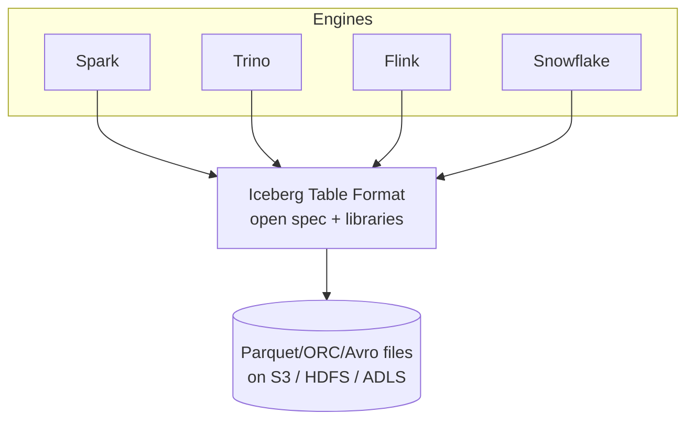
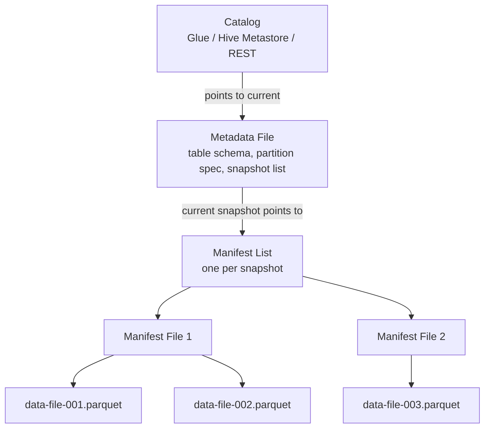
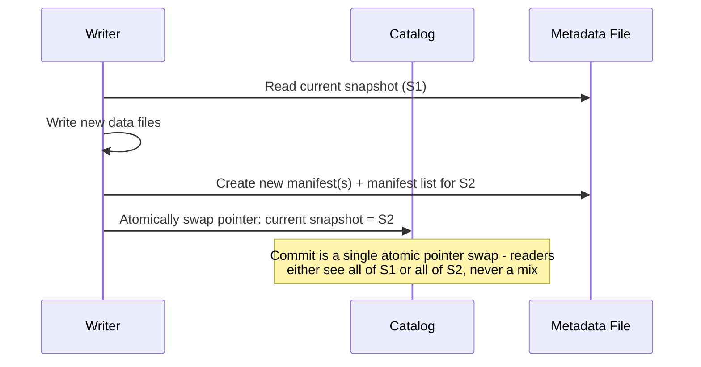
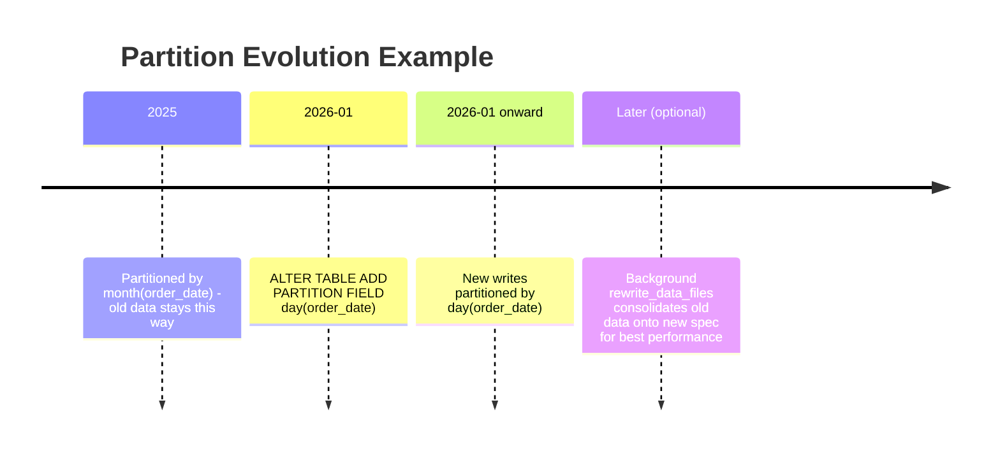

# Apache Iceberg — Data Engineering Notes

> Reviewed, corrected, and expanded from original study notes. Includes definitions, examples, diagrams, and interview-style Q&A (FAQ + scenario + system design + follow-ups).

---

## 📌 Index

1. [Why Hive-Style Data Lakes Fall Short](#1-why-hive-style-data-lakes-fall-short)
2. [What is Apache Iceberg?](#2-what-is-apache-iceberg)
3. [The Iceberg Metadata Layer](#3-the-iceberg-metadata-layer)
4. [Snapshots](#4-snapshots)
5. [Hidden Partitioning](#5-hidden-partitioning)
6. [Partition Evolution](#6-partition-evolution)
7. [Partition Transforms](#7-partition-transforms)
8. [Schema Evolution](#8-schema-evolution)
9. [Time Travel & Snapshot Isolation](#9-time-travel--snapshot-isolation)
10. [Catalogs](#10-catalogs)
11. [Compaction](#11-compaction)
12. [Snapshot Expiration](#12-snapshot-expiration)
13. [Optimization Checklist](#13-optimization-checklist)
14. [Q&A — Frequently Asked (Conceptual)](#14-qa--frequently-asked-conceptual)
15. [Q&A — Scenario-Based](#15-qa--scenario-based)
16. [Q&A — Lead Data Engineer Design Questions](#16-qa--lead-data-engineer-design-questions)
17. [Q&A — Common Follow-Ups](#17-qa--common-follow-ups)

---

## 1. Why Hive-Style Data Lakes Fall Short

Traditional Hive-style tables (a Hive Metastore tracking directories of files, partitioned by physical folder structure) run into a well-known set of problems at scale:

| Problem                                       | Why it happens                                                                                                                                                                                                                                                                              |
|-----------------------------------------------|---------------------------------------------------------------------------------------------------------------------------------------------------------------------------------------------------------------------------------------------------------------------------------------------|
| **No atomic multi-file commits**              | A "table" is really just "whatever files happen to be in these folders" — there's no single atomic pointer to a consistent table state, so a reader can see a half-written batch.                                                                                                           |
| **No ACID guarantees**                        | Same root cause — no transaction boundary around a write touching multiple files/partitions.                                                                                                                                                                                                |
| **Slow listing**                              | Hive relies on **directory listing** (`LIST` calls on S3, or NameNode listing on HDFS) to discover which files belong to a partition/table — this gets slower and more expensive as file/partition counts grow, and is especially painful on S3 (rate-limited, per-request-billed listing). |
| **Partition evolution is next to impossible** | The partition scheme is physically baked into the directory layout; changing it means rewriting the entire table.                                                                                                                                                                           |
| **Schema evolution is clunky**                | Column changes (renames, type widening, reordering) are risky and often require careful, manual coordination with the physical file schema.                                                                                                                                                 |
| **No time travel**                            | Once a file is overwritten, the previous state is gone — no way to query "the table as of yesterday" or roll back a bad write.                                                                                                                                                              |

**Apache Iceberg** was created specifically to solve these problems while remaining **fully open and engine-agnostic** (not tied to any single processing engine or vendor), with first-class support for **partition evolution** as a headline feature.

---

## 2. What is Apache Iceberg?

Iceberg is an **open table format** — a specification (plus reference libraries) for how to track a large collection of data files as a single, versioned, transactional "table," independent of which storage system or query engine is used.

Instead of a table being defined by "whatever's in this directory," Iceberg introduces a **metadata layer** that sits between the query engine and the raw data files, tracking exactly which files make up the table **at each point in time**.



---

## 3. The Iceberg Metadata Layer

Iceberg's metadata is organized as a **three-level tree**, so an engine never needs to `LIST` a directory to find files — it just follows pointers:



| Layer | What it stores |
|---|---|
| **Catalog** | A pointer to the **current metadata file** for each table — this is the single source of truth for "what's the latest version of this table" (implemented via Glue Catalog, Hive Metastore, a REST catalog, Nessie, JDBC, etc.) |
| **Metadata file** (JSON) | Table **schema** (with full history of schema versions), **partition spec** (with history, enabling partition evolution), and the **list of all snapshots** with their IDs/timestamps |
| **Manifest list** (Avro, one per snapshot) | Tracks the set of **manifest files** that make up a given snapshot, along with summary stats per manifest (e.g., partition value ranges) used for pruning at the manifest level |
| **Manifest file** (Avro) | Tracks individual **data files**: their paths, partition values, and column-level stats (min/max, null counts) used for **file-level pruning** |

Because pruning happens by reading small metadata files (manifest lists → manifests → matching data files) rather than listing directories, query planning is fast and **independent of the number of partitions/files** in the way that directory listing is not.

---

## 4. Snapshots

A **snapshot** is an immutable, complete view of the table's data files at a specific point in time. Every write operation (insert, update, delete, or schema/partition change) creates a **new snapshot** rather than modifying existing files or metadata in place.

- Each snapshot references a manifest list, which references the exact set of data files valid **as of that snapshot**.
- Snapshots are what make **time travel** and **snapshot isolation** possible — readers always read from a single, consistent snapshot, never a partially-updated mix of old and new files.
- Old snapshots accumulate over time (every commit = a new snapshot) and need periodic cleanup — see [Section 12](#12-snapshot-expiration).



---

## 5. Hidden Partitioning

**Hidden partitioning** means Iceberg manages the mapping between logical column values and physical partition layout **internally** — users query by the actual data column (e.g., `event_timestamp`), and Iceberg figures out which physical partition(s) that maps to, **without the user needing to know or reference the partition layout at all**.

Contrast with Hive, where users often have to filter on (or at least be aware of) the literal partition column (e.g., a separate derived `event_date` column matching the folder name), and mismatches (like filtering on the raw timestamp instead of the derived partition column) silently defeat pruning.

```sql
-- Iceberg: query the actual business column directly
SELECT * FROM events WHERE event_timestamp >= '2026-07-01' AND event_timestamp < '2026-07-02';
-- Iceberg automatically prunes to the correct underlying partition(s),
-- even though the partition transform is e.g. day(event_timestamp),
-- with no separate partition column the user needs to know about.
```

**Why it matters:** it removes a whole class of user error (forgetting to filter on the "right" partition column), and it's the enabling mechanism behind **partition evolution** — since users never reference the physical partition layout directly, that layout is free to change underneath them without breaking queries.

---

## 6. Partition Evolution

Because Iceberg — not the user — fully controls the mapping from data to physical partitions (via hidden partitioning), it can offer **partition evolution**: the ability to **change a table's partition scheme going forward without rewriting existing data**.

- Existing data files remain under the **old** partition spec.
- New writes use the **new** partition spec.
- The metadata layer tracks **multiple partition specs** over the table's history, and Iceberg's query planner is spec-aware, so it correctly prunes across both old and new data in the same query.

```sql
-- Table originally partitioned by month(order_date)
ALTER TABLE orders ADD PARTITION FIELD day(order_date);
-- No data rewrite triggered. Historical data stays month-partitioned;
-- new data going forward is day-partitioned; queries prune correctly across both.
```

⚠️ **Correction/clarification on the original note:** partition evolution avoiding a rewrite is a **short-to-medium-term convenience**, not a free long-term substitute for proper partitioning. Over time, having a table split across multiple partition specs means metadata/manifests get more complex to plan against, and older data under a stale/coarser spec may not prune as efficiently as it would under the new scheme. **Best practice:** use partition evolution to avoid disruptive, urgent rewrites, but periodically run a background rewrite (`rewrite_data_files`, potentially with a full re-partition) to consolidate historical data onto the current spec once feasible, for optimal long-term query performance.



---

## 7. Partition Transforms

A **partition transform** is metadata-level rule defining how a column's value is mapped to a physical partition — declared once at the table/write level, rather than requiring a separately maintained partition column.

Built-in transforms:

| Transform | Description | Example |
|---|---|---|
| **Identity** | Partition directly by the column's raw value | `PARTITIONED BY (region)` |
| **Bucketing** | Hash the column into a fixed number of buckets | `PARTITIONED BY (bucket(16, customer_id))` — good for high-cardinality columns |
| **Truncate** | Truncate a value (string prefix, or numeric rounding) to a coarser granularity | `PARTITIONED BY (truncate(4, zip_code))` |
| **Temporal transforms** | Derive a time-based partition value directly from a timestamp column | `PARTITIONED BY (day(event_timestamp))`, also `year()`, `month()`, `hour()` |

**Example — composite partition spec:**
```sql
CREATE TABLE orders (
  order_id BIGINT,
  customer_id BIGINT,
  order_date TIMESTAMP,
  region STRING
)
USING iceberg
PARTITIONED BY (day(order_date), bucket(32, customer_id));
```
This gives date-based pruning **and** avoids a small-file explosion from `customer_id`'s high cardinality, all without a manually maintained partition column.

---

## 8. Schema Evolution

Iceberg supports **full schema evolution** — adding, dropping, renaming, reordering, and widening (e.g., `int` → `long`) columns — as safe, in-place metadata operations that **don't require rewriting existing data files**.

```sql
ALTER TABLE customers ADD COLUMN loyalty_tier STRING;
ALTER TABLE customers RENAME COLUMN email TO email_address;
ALTER TABLE customers ALTER COLUMN customer_id TYPE BIGINT;
ALTER TABLE customers DROP COLUMN legacy_flag;
```

Because Iceberg tracks columns by a **stable internal column ID** (not by name or physical file position), renames and reorders are pure metadata operations — the underlying Parquet files don't need to change at all, and old files are still read correctly against the new schema (missing new columns simply read as `null`).

---

## 9. Time Travel & Snapshot Isolation

Because every table state is a **snapshot**, Iceberg can query "the table as it looked" at any historical snapshot ID or timestamp:

```sql
-- By timestamp
SELECT * FROM orders FOR SYSTEM_TIME AS OF '2026-06-30 00:00:00';

-- By snapshot ID
SELECT * FROM orders FOR SYSTEM_VERSION AS OF 8123456789012345678;
```
```python
# PySpark equivalent
spark.read.format("iceberg").option("as-of-timestamp", "1719705600000").load("db.orders")
spark.read.format("iceberg").option("snapshot-id", "8123456789012345678").load("db.orders")
```

**Snapshot isolation**: every read operation is bound to a single snapshot for its entire duration — even if new commits happen concurrently while a long-running query executes, that query keeps reading consistently from the snapshot it started with, never seeing a partial mix of old and new data.

---

## 10. Catalogs

Iceberg requires an **external catalog** to track the current metadata-file pointer for each table (Iceberg itself doesn't run as a metadata service — it's a library + spec that different catalog implementations plug into). Common choices:

- **AWS Glue Catalog** — natural fit in an AWS-native stack; integrates directly with Athena, EMR, Glue ETL.
- **Hive Metastore (HMS)** — common in existing Hadoop/on-prem or multi-cloud environments already using Hive.
- **REST Catalog** (Iceberg's catalog REST spec) — increasingly the recommended path for **multi-engine, multi-cloud** setups, since any engine that speaks the REST catalog protocol can interoperate without being tied to one cloud's proprietary catalog.
- **Nessie** — adds Git-like versioning/branching semantics across tables (useful for multi-table transactional workflows or branch-based data testing).
- **JDBC catalog** — backed by a plain relational database, useful for lightweight/self-hosted setups.

The catalog is critical for **cross-engine interoperability**: as long as Spark, Trino, and Flink all point at the same catalog, they see the same current table state and commit through the same atomic pointer-swap mechanism.

---

## 11. Compaction

Frequent small writes (streaming ingestion, frequent small batch jobs, or many small updates/deletes) cause a table to accumulate **many small data files**, hurting read performance (per-file open/read overhead, more tasks to schedule than necessary).

**Compaction** (Iceberg's `rewrite_data_files` procedure) merges many small files into fewer, appropriately-sized larger files:

```sql
CALL catalog.system.rewrite_data_files(
  table => 'db.orders',
  options => map('target-file-size-bytes','536870912') -- 512MB target
);
```

Related maintenance procedures worth knowing:
```sql
-- Compact manifest files (many small manifests from frequent commits also hurt planning speed)
CALL catalog.system.rewrite_manifests('db.orders');
```

---

## 12. Snapshot Expiration

Every commit creates a new snapshot, and old snapshots (plus the data files they exclusively reference) accumulate indefinitely unless cleaned up — consuming storage and slowing down metadata operations (more manifest lists to track).

**`expire_snapshots`** removes old snapshots (and physically deletes any data files no longer referenced by any *remaining* snapshot), reclaiming storage:

```sql
CALL catalog.system.expire_snapshots(
  table => 'db.orders',
  older_than => TIMESTAMP '2026-06-27 00:00:00',
  retain_last => 5   -- always keep at least the last 5 snapshots regardless of age
);
```

⚠️ Expiring snapshots too aggressively removes the ability to time-travel to those points, and can invalidate any long-running query or downstream job still referencing an old snapshot ID — similar to the Delta Lake `VACUUM` caution (see the companion Delta Lake notes).

---

## 13. Optimization Checklist

- **Use bucketing** on high-cardinality columns instead of identity-partitioning them (avoids small-file/partition explosion).
- **Use hidden partitioning** (i.e., just declare transforms in the partition spec) rather than manually maintaining derived partition columns — reduces user error and enables partition evolution.
- **Regularly run `rewrite_data_files`** (compaction) after periods of frequent small writes/updates.
- **Regularly run `rewrite_manifests`** after many commits, since manifest file count/size also affects query planning speed, not just data file count.
- **Run `expire_snapshots`** on a schedule to bound storage growth and manifest-list size — balanced against time-travel/audit retention needs.
- **Prefer partition evolution for agility, but periodically consolidate** old data onto the current spec via a background rewrite once feasible, rather than leaving many partition specs active indefinitely.

---

## 14. Q&A — Frequently Asked (Conceptual)

**Q1: What problem does Iceberg solve that Hive tables don't?**
A: Hive tables rely on directory listing to discover files (slow and expensive at scale), have no atomic multi-file commit (so partial/inconsistent reads are possible), no ACID guarantees, essentially no practical partition evolution (partition scheme is physically baked into folder layout), and no time travel. Iceberg adds a metadata layer (metadata file → manifest list → manifest files) that tracks exact file membership per snapshot, enabling atomic commits, fast metadata-driven pruning instead of listing, safe schema/partition evolution, and time travel — all while remaining engine-agnostic. See [Section 1](#1-why-hive-style-data-lakes-fall-short).

**Q2: Explain Iceberg's metadata layer structure (metadata file → manifest list → manifest files).**
A: The **catalog** points to the current **metadata file**, which holds table schema/partition-spec history and the list of snapshots. Each snapshot points to a **manifest list** (which manifests make up this snapshot, with summary stats for manifest-level pruning). Each **manifest file** then lists individual data files with their partition values and column stats, enabling file-level pruning. This tree means query planning never requires listing storage directories. See [Section 3](#3-the-iceberg-metadata-layer).

**Q3: What is hidden partitioning and why does it matter?**
A: Iceberg manages the mapping from logical column values to physical partition layout internally, so users query the actual data column and Iceberg applies the correct pruning — without users needing to know or reference the physical partition scheme. It matters because it eliminates a common class of pruning-defeating user error, and is the foundation that makes partition evolution possible (since nothing user-facing depends on the physical layout). See [Section 5](#5-hidden-partitioning).

**Q4: What is partition evolution and how is it different from Hive's fixed partitioning?**
A: Partition evolution lets you change a table's partition scheme going forward (e.g., month → day) without rewriting historical data — old data stays under the old spec, new data uses the new spec, and Iceberg's planner handles both correctly. Hive's partition scheme is physically fixed in the directory structure, so any change requires a full table rewrite. See [Section 6](#6-partition-evolution).

**Q5: How does Iceberg achieve time travel and snapshot isolation?**
A: Every write creates a new immutable **snapshot** rather than mutating existing files/metadata. Time travel resolves a requested timestamp/snapshot ID to the corresponding snapshot and reads exactly the files it references. Snapshot isolation follows naturally: a read is bound to one snapshot for its whole duration, so concurrent commits during a long-running query never produce an inconsistent mixed read. See [Section 4](#4-snapshots) and [Section 9](#9-time-travel--snapshot-isolation).

**Q6: What's the difference between Iceberg and Delta Lake?**
A: Both provide ACID transactions, schema evolution, and time travel on top of Parquet-based lake storage, but differ in emphasis and ecosystem fit:

| | Iceberg | Delta Lake |
|---|---|---|
| Metadata structure | 3-tier (metadata file → manifest list → manifest files) | Single-tier JSON commit log + periodic Parquet checkpoints |
| Partition evolution | First-class, headline feature | Not natively supported the same way (would typically require a rewrite) |
| Engine support | Very broad multi-engine support (Spark, Trino, Flink, Snowflake, BigQuery, Athena, etc.) via open catalog spec | Strongest/most mature on Databricks/Spark; growing but historically narrower multi-engine support |
| Catalog | Requires external catalog (Glue, HMS, REST, Nessie, JDBC) | Can work directory-based (log co-located with data) or via catalog |
| Hidden partitioning | Yes | No (partition columns are explicit) |

Practical takeaway: Iceberg tends to be favored for **multi-engine, engine-agnostic** platforms and where partition evolution is a real requirement; Delta Lake tends to be favored in **Databricks-centric** stacks. (See also the companion Delta Lake notes for the Delta-side details.)

---

## 15. Q&A — Scenario-Based

**Q1: Your table's monthly partitions have grown too large for efficient queries — how do you fix this without downtime, using Iceberg?**
A: Use **partition evolution** to switch to a finer granularity (e.g., `month(order_date)` → `day(order_date)`, or add a secondary `bucket()` transform on a high-cardinality column) via `ALTER TABLE ... ADD PARTITION FIELD ...` — this takes effect immediately for new writes with **zero rewrite and zero downtime**, since old data simply remains under the old spec while Iceberg's planner handles both correctly. If query performance on the **existing** large-partition historical data also needs improving (not just new data going forward), schedule a background `rewrite_data_files` job (potentially targeting the new partition spec) to consolidate historical data — run during low-traffic windows since it's a normal (if I/O-heavy) background operation, not a locking one.

**Q2: You need Spark, Trino, and Snowflake to all read/write the same table without duplicating data — how would you design this?**
A: Use Iceberg as the shared open table format, with a **single external catalog** all three engines are configured to use — a **REST catalog** is generally the best fit for true multi-engine, multi-vendor interoperability (avoids being tied to one engine's proprietary catalog implementation), though AWS Glue Catalog is a reasonable alternative if all engines/tools involved support it well in an AWS-native environment. All engines then read/write the exact same underlying Parquet files and metadata tree — no data duplication, no separate per-engine copies — with Iceberg's atomic snapshot-commit mechanism (see [Section 17, Q2](#17-qa--common-follow-ups)) coordinating safe concurrent access across engines.

**Q3: A table has accumulated thousands of small files from streaming writes — what commands/procedures would you use to fix it?**
A: Run `CALL catalog.system.rewrite_data_files(table => '...', options => map('target-file-size-bytes', '...'))` to compact small data files into fewer, appropriately-sized ones. Since frequent small commits also bloat manifest files, also run `CALL catalog.system.rewrite_manifests('...')` to compact those. Follow up with `expire_snapshots` (with a sensible `retain_last`/age threshold) to clean up the now-superseded snapshots and physically reclaim the space of the old small files. Going forward, consider tuning the streaming writer's batch/commit interval or enabling any available auto-compaction feature of the ingestion engine to prevent recurrence.

---

## 16. Q&A — Lead Data Engineer Design Questions

**Q1: How would you design a multi-engine Lakehouse platform (Spark, Trino, Flink) using Iceberg, including catalog choice and governance?**
A:
- **Storage:** Parquet files on S3 (or equivalent), organized under Iceberg's metadata tree.
- **Catalog:** a **REST catalog** (or Glue if fully AWS-native and all engines support it well) shared by all three engines, so table discovery and commits are consistent across Spark batch jobs, Trino ad hoc/BI queries, and Flink streaming ingestion.
- **Governance:** centralize access control at the catalog/lake level (e.g., via Lake Formation, or a catalog that supports fine-grained authorization) rather than per-engine, since multiple engines touching the same tables need consistent, engine-independent permissions; maintain a data catalog/lineage layer (e.g., via OpenLineage-compatible tooling) since multi-engine writes make lineage harder to track informally.
- **Write coordination:** Flink handles continuous ingestion (small, frequent commits — schedule regular compaction), Spark handles batch transformations/backfills and heavier `MERGE`-style upserts, Trino is primarily a read/BI engine (occasional `INSERT`/`DELETE` if needed) — assign primary write ownership per table to avoid unnecessary concurrent-write conflict handling across three different engines' retry semantics.
- **Maintenance jobs** (compaction, manifest rewrite, snapshot expiration) run as a centralized scheduled process (e.g., via Spark), rather than being each engine's individual responsibility, to keep policy consistent.

**Q2: Compare Iceberg, Delta Lake, and Hudi — how would you decide which to adopt for a new platform, and what factors matter most?**
A: (See also [Section 14, Q6](#14-qa--frequently-asked-conceptual) for the Iceberg/Delta comparison.) Key decision factors:
- **Engine diversity requirement** — if the platform must serve genuinely varied engines (Trino, Flink, Snowflake, BigQuery, etc.) without duplicating data, Iceberg's broad multi-engine support and open REST catalog spec are the strongest fit.
- **Databricks-centricity** — if the stack is Databricks/Spark-first with limited need for other engines, Delta Lake is the path of least resistance (best-supported there).
- **Upsert/streaming latency** — Hudi's indexing is historically optimized for very high-frequency, low-latency record-level upserts (heavy CDC-streaming use cases); worth evaluating specifically if that's the dominant workload.
- **Partition evolution need** — if partition strategy is expected to change as the business/query patterns evolve, Iceberg's native partition evolution is a differentiator.
- **Team/operational familiarity and ecosystem momentum** — this space evolves quickly; validate current tooling maturity/support (e.g., managed service integrations, community activity) at decision time rather than relying solely on historical reputation.

**Q3: How would you design a migration path from an existing Hive-based data lake to Iceberg with minimal downtime and no data loss?**
A:
1. **In-place metadata migration where possible:** Iceberg provides migration procedures (e.g., Spark's `migrate` / `snapshot` procedures) that can create an Iceberg table **pointing at the existing Parquet/ORC data files** without rewriting them — generating Iceberg metadata (manifests) from the current Hive partition layout. `snapshot` creates a new Iceberg table alongside the Hive table (non-destructive, safe to validate first); `migrate` converts the existing table in place.
2. **Validate** the new Iceberg table against the original (row counts, checksums, sample query parity) before cutting over any consumers.
2. **Dual-read/dual-write window (optional, for critical tables):** keep the Hive table live while pointing a subset of read traffic at the new Iceberg table to validate under real query load.
3. **Cutover** consumers table-by-table (or via a view/alias layer) rather than all at once, prioritizing lower-risk tables first.
4. **Decommission** the old Hive table/metastore entries after a safety window, once all consumers are confirmed migrated and no rollback is needed.
5. Going forward, apply Iceberg-native features (hidden partitioning, partition evolution) rather than replicating the old Hive-style manual partition columns.

**Q4: How do you design snapshot expiration and compaction schedules to balance cost, compliance/audit requirements, and query performance?**
A: Similar tension to Delta Lake's `VACUUM` policy design: longer snapshot retention supports audit/rollback needs but grows storage and metadata (manifest) overhead; aggressive expiration keeps costs/performance in check but limits recoverability window. Approach:
- **Tier by table criticality/regulatory need:** tables with compliance/audit requirements get longer `expire_snapshots` retention (and/or `retain_last` set generously); high-churn, low-criticality tables get aggressive, frequent expiration to control storage/metadata bloat.
- **Decouple long-term audit needs from snapshot retention:** for genuine compliance audit trails, don't rely solely on Iceberg snapshot history (meant primarily for operational time travel) — maintain an explicit audit log/export where required, so snapshot expiration policy can still be cost-optimized without compromising compliance.
- **Schedule compaction (`rewrite_data_files`) and manifest rewrite (`rewrite_manifests`) based on write frequency**, not on a fixed calendar alone — high-frequency streaming tables need more frequent compaction than daily-batch tables.
- **Coordinate expiration with compaction:** run `expire_snapshots` after compaction/rewrite jobs (not before), since rewrites themselves create new snapshots referencing the old files as "removed" — expiring too early relative to rewrite scheduling can create unnecessary churn or, conversely, delay actual storage reclamation.

---

## 17. Q&A — Common Follow-Ups

**Q1: What catalog would you choose in an AWS-native environment vs a multi-cloud environment?**
A: **AWS-native:** AWS Glue Catalog is usually the natural choice — it integrates directly with Athena, EMR, Glue ETL, and Lake Formation for governance, with no separate catalog service to operate. **Multi-cloud / multi-engine-vendor:** a **REST catalog** (Iceberg's catalog REST spec) is generally preferable, since it's cloud/vendor-neutral and any compliant engine (across clouds) can interoperate with it consistently, avoiding a hard dependency on one cloud's proprietary catalog service.

**Q2: How does Iceberg handle concurrent writes from two different engines (e.g., Spark and Flink) at the same time?**
A: Iceberg uses **optimistic concurrency** at the catalog level: each writer reads the current metadata pointer, prepares its new snapshot (new manifests/manifest list), and attempts an **atomic compare-and-swap** of the catalog's pointer to the new metadata file. If another writer (from either engine) already advanced the pointer in the meantime, the swap fails and the writer must retry — re-reading the new current state and reapplying its change if compatible (similar in spirit to Delta Lake's optimistic concurrency, but coordinated through whichever catalog implementation is in use, e.g., Glue's conditional-update semantics or HMS's locking). This is engine-agnostic since the coordination happens at the catalog layer, not inside a specific engine's runtime.

**Q3: What happens to query performance if you never run `expire_snapshots` or `rewrite_manifests`?**
A: Snapshots (and the files they reference) accumulate indefinitely — storage costs grow from retaining superseded data files that are never physically reclaimed, and more critically, the **manifest list and manifest file count/size keep growing** with every commit. Since query planning has to read manifest lists/manifests to determine which files to scan, un-compacted, ever-growing metadata directly slows down **query planning time** (not just execution time) — potentially becoming a bigger bottleneck than the actual data scan for tables with a long history of frequent small commits. In the worst case, planning overhead can dominate total query latency for tables that have never had maintenance run.

---

*Notes reviewed and structured for quick revision — use the [Index](#-index) above to jump directly to any topic.*
