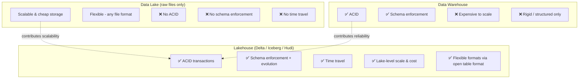
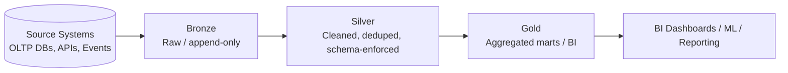
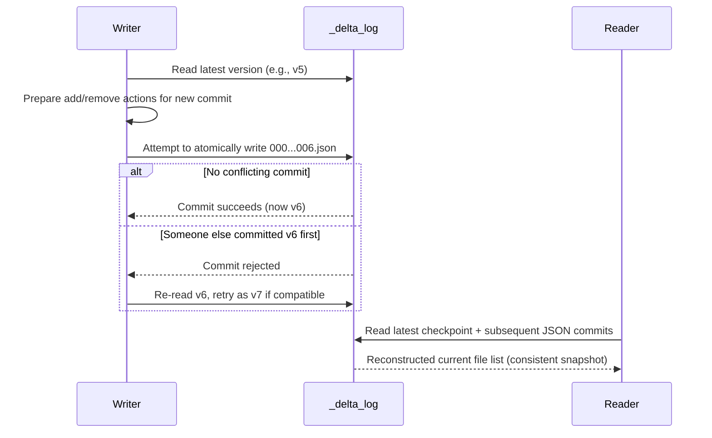
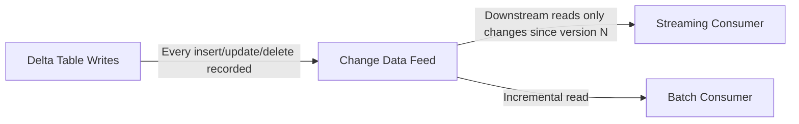
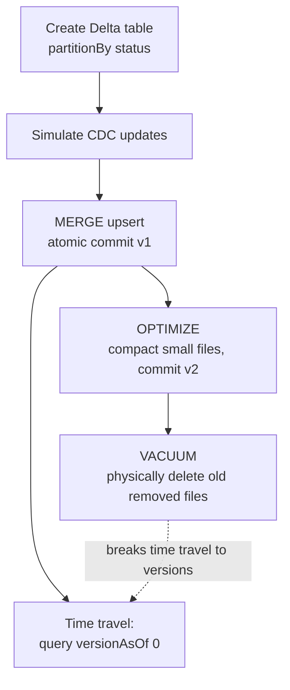
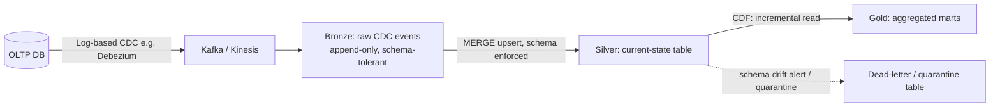

# Delta Lake & Lakehouse Architecture — Data Engineering Notes

> Reviewed, corrected, and expanded from original study notes. Includes definitions, examples, diagrams, worked code, and interview-style Q&A (FAQ + scenario + system design + follow-ups).

---

## 📌 Index

1. [Why Plain Data Lakes Aren't Enough](#1-why-plain-data-lakes-arent-enough)
2. [Lakehouse Architecture](#2-lakehouse-architecture)
3. [ACID Transactions in Delta Lake](#3-acid-transactions-in-delta-lake)
4. [The Delta Transaction Log (`_delta_log`)](#4-the-delta-transaction-log-_delta_log)
5. [Time Travel](#5-time-travel)
6. [Schema Enforcement vs Schema Evolution](#6-schema-enforcement-vs-schema-evolution)
7. [MERGE (Upsert)](#7-merge-upsert)
8. [Optimistic Concurrency Control](#8-optimistic-concurrency-control)
9. [OPTIMIZE / Compaction](#9-optimize--compaction)
10. [Z-Ordering](#10-z-ordering)
11. [VACUUM](#11-vacuum)
12. [Change Data Feed (CDF)](#12-change-data-feed-cdf)
13. [Worked Example: End-to-End Delta Workflow](#13-worked-example-end-to-end-delta-workflow)
14. [Q&A — Frequently Asked (Conceptual)](#14-qa--frequently-asked-conceptual)
15. [Q&A — Scenario-Based](#15-qa--scenario-based)
16. [Q&A — Lead Data Engineer Design Questions](#16-qa--lead-data-engineer-design-questions)
17. [Q&A — Common Follow-Ups](#17-qa--common-follow-ups)

---

## 1. Why Plain Data Lakes Aren't Enough

A data lake (raw files Parquet/CSV/JSON on S3/HDFS/ADLS) gives you **scalability at low cost** and the **flexibility** to store structured, semi-structured, and unstructured data without a rigid upfront schema. But that flexibility comes at the cost of **reliability**, because there's no schema enforced at write time — only "schema-on-read," where correctness is only checked (or discovered) when something tries to read the data.

**Consequences in practice:**

| Problem                             | What actually happens                                                                                                                                                        |
|-------------------------------------|------------------------------------------------------------------------------------------------------------------------------------------------------------------------------|
| **No write-time validation**        | Incorrect / malformed / wrong-type data can be written silently — nothing stops it.                                                                                          |
| **Partial writes on job failure**   | If a Spark job dies mid-write, some output files may exist and some may not — readers can pick up a half-written, corrupt dataset without any signal that something's wrong. |
| **No ACID guarantees**              | No atomicity (a failed job can leave partial state), no isolation (concurrent writers/readers can interfere with each other).                                                |
| **Concurrent write/read conflicts** | Two jobs writing to the same location simultaneously can corrupt each other's output; a reader mid-scan can see a mix of old and new files ("dirty reads").                  |
| **No time travel / audit trail**    | Once a file is overwritten or deleted, the previous state is gone — no way to see "what did this table look like yesterday," and no easy way to roll back a bad write.       |

**Delta Lake** (along with **Apache Iceberg** and **Apache Hudi**) emerged specifically to fix this: they add a **transactional metadata layer** on top of plain files in a data lake, bringing warehouse-like reliability (ACID, schema enforcement, time travel) while keeping the lake's scalability, low cost, and openness. This combined architecture is called the **Lakehouse**.



---

## 2. Lakehouse Architecture

The Lakehouse pattern layers a **transactional metadata format** (Delta Lake / Iceberg / Hudi) on top of columnar files (almost always Parquet) sitting in cheap object storage (S3/ADLS/GCS). Data is typically organized using the **Medallion architecture**:

- **Bronze** — raw, ingested-as-is data (append-only, minimal transformation), preserving full fidelity/history of source.
- **Silver** — cleaned, validated, conformed data (deduplicated, schema-enforced, joined/enriched as needed).
- **Gold** — business-level aggregates and marts, ready for BI/ML consumption.



---

## 3. ACID Transactions in Delta Lake

Delta Lake brings the four ACID properties to data lake writes:

- **Atomicity** — a write either fully commits or has no effect at all; no partial files are ever visible to readers.
- **Consistency** — the table always reflects a schema-valid, structurally sound state after every commit.
- **Isolation** — concurrent readers/writers don't see each other's uncommitted changes (snapshot isolation via the transaction log).
- **Durability** — once committed, changes are permanently recorded in the transaction log and underlying files.

This is achieved **without a traditional database engine** — Delta Lake is just Parquet files plus a **transaction log** that records every change as an atomic, ordered sequence of JSON commit files. Readers and writers coordinate purely through this log, not through a central database server.

---

## 4. The Delta Transaction Log (`_delta_log`)

Every Delta table has a hidden `_delta_log/` directory alongside its data files. This is the source of truth for "what does this table currently look like."

```
/mnt/delta/customers/
 ├── status=active/
 │    └── part-00000-....snappy.parquet
 ├── status=inactive/
 │    └── part-00000-....snappy.parquet
 └── _delta_log/
      ├── 00000000000000000000.json   # commit 0: initial write
      ├── 00000000000000000001.json   # commit 1: merge/update
      ├── 00000000000000000002.json   # commit 2: optimize
      ├── 00000000000000000010.checkpoint.parquet   # periodic checkpoint
      └── _last_checkpoint
```

**How it works:**
- Every write (insert, update, delete, merge, optimize, vacuum-metadata) creates a new numbered **JSON commit file**, recording which files were **added** and which were **removed** (Delta never mutates a Parquet file in place — it always writes new files and marks old ones as logically removed).
- To know the table's *current valid state*, an engine reads the log **from the last checkpoint forward**, replaying the add/remove actions to reconstruct the current list of active files.
- **Checkpoints**: because replaying thousands of JSON commits from the beginning would get slow, Delta periodically writes a **Parquet checkpoint file** (by default every 10 commits) that captures the *full current state* — so readers only need the latest checkpoint + any commits after it.
- **Commits are atomic** via an optimistic-concurrency protocol: a writer reads the current log version, prepares its change, and tries to atomically create the *next* numbered JSON file. If another writer got there first, the commit is rejected and retried against the new state (see [Section 8](#8-optimistic-concurrency-control)).



---

## 5. Time Travel

Because every historical state of the table is reconstructable by replaying the log up to any given commit, Delta Lake lets you **query the table as it existed at a previous version or timestamp** — this is *time travel*.

```python
# Query the table as it looked at a specific version
df_v0 = spark.read.format("delta").option("versionAsOf", 0).load("/mnt/delta/customers")

# Query the table as it looked at a specific timestamp
df_yesterday = spark.read.format("delta") \
    .option("timestampAsOf", "2026-06-30") \
    .load("/mnt/delta/customers")

# View full commit history
delta_table.history().select("version", "timestamp", "operation").show()
```

**How it works internally:** the reader simply resolves the requested version/timestamp to a specific commit number, replays the log up to (and including) that commit, gets the resulting file list, and reads only those Parquet files — **as long as they still physically exist** (this is the key interaction with `VACUUM`, see [Section 17](#17-qa--common-follow-ups)).

---

## 6. Schema Enforcement vs Schema Evolution

- **Schema enforcement** (default behavior): writes are **rejected** if the incoming data's schema doesn't match the target table's schema (wrong column names, types, or extra/missing columns). This is what prevents "garbage" or drifted data from silently corrupting a table.
- **Schema evolution**: explicitly opting in to **allow** a write to change the table's schema (e.g., add a new column), via:
```python
df.write.format("delta") \
    .mode("append") \
    .option("mergeSchema", "true") \
    .save("/mnt/delta/customers")
```
  or at the Spark session level: `spark.databricks.delta.schema.autoMerge.enabled = true`.

**Rule of thumb:** keep enforcement **on** by default everywhere (protects against silent corruption); only enable evolution deliberately for known, intentional schema changes (e.g., a new column being added upstream) — not as a blanket setting, since that would defeat the purpose of enforcement.

---

## 7. MERGE (Upsert)

Delta supports SQL-style `MERGE INTO`, letting you perform **insert, update, and delete in a single atomic operation** — critical for CDC-style upserts (e.g., syncing changes from an OLTP source).

```sql
MERGE INTO customers AS target
USING updates AS source
ON target.customer_id = source.customer_id
WHEN MATCHED THEN
  UPDATE SET target.name = source.name,
             target.email = source.email,
             target.status = source.status
WHEN NOT MATCHED THEN
  INSERT (customer_id, name, email, status)
  VALUES (source.customer_id, source.name, source.email, source.status)
```

Equivalent PySpark:
```python
from delta.tables import DeltaTable

delta_table = DeltaTable.forPath(spark, "/mnt/delta/customers")

delta_table.alias("target").merge(
    updates_df.alias("source"),
    "target.customer_id = source.customer_id"
).whenMatchedUpdate(set={
    "name": "source.name",
    "email": "source.email",
    "status": "source.status"
}).whenNotMatchedInsert(values={
    "customer_id": "source.customer_id",
    "name": "source.name",
    "email": "source.email",
    "status": "source.status"
}).execute()
```
- `whenMatchedUpdate` → handles existing rows (e.g., an updated email for an existing customer).
- `whenNotMatchedInsert` → handles brand-new rows (e.g., a new customer).
- The whole operation is a **single atomic commit** — it either fully succeeds or fully fails; there's no possibility of a reader seeing a half-applied merge.

You can also add `whenMatchedDelete()` for full upsert+delete (soft-delete/CDC-style) handling.

---

## 8. Optimistic Concurrency Control

Multiple processes **can** attempt to write to the same Delta table at the same time. Delta uses **optimistic concurrency control (OCC)**, not locking:

1. A writer reads the table's current version.
2. It computes its changes (new files to add/remove) **without locking anything**.
3. At commit time, it tries to atomically create the *next* log file (`version + 1`).
4. If no one else committed in the meantime → success.
5. If someone else already committed that version → Delta checks whether the two commits **actually conflict** (e.g., did they touch overlapping files/partitions?). If not conflicting, the write can be retried and re-committed against the new version automatically. If they do conflict, the second writer's commit **fails** and must be retried by the application.

This is why "two jobs writing concurrently and one keeps failing" is expected behavior under contention — see [Section 15, Q2](#15-qa--scenario-based).

---

## 9. OPTIMIZE / Compaction

Frequent small writes (e.g., streaming micro-batches, one file every minute) leave a Delta table with **many small files**, hurting read performance (more file-open/list overhead per query).

`OPTIMIZE` **compacts many small files into fewer, larger files** (Delta's recommended target is roughly ~1GB per file), without changing the logical data:

```python
delta_table.optimize().executeCompaction()
```
```sql
OPTIMIZE customers;
```

This is a normal, atomic Delta commit itself — it adds new (larger) files and marks the old small files as removed in the log, but **doesn't physically delete them immediately** (that's `VACUUM`'s job, and it's also why time travel to a version before an `OPTIMIZE` still works, until vacuumed).

---

## 10. Z-Ordering

**Z-Ordering** is a technique to **co-locate related data within the same set of files** by sorting/clustering data along multiple columns simultaneously, using a space-filling curve (Z-order curve) that interleaves the bits of multiple column values into a single sortable value.

```python
delta_table.optimize().executeZOrderBy("customer_id", "region")
```
```sql
OPTIMIZE customers ZORDER BY (customer_id, region);
```

**How it's different from partitioning:**

| | Partitioning | Z-Ordering |
|---|---|---|
| Mechanism | Physically separates data into different **directories** by a column's value | Physically **sorts/clusters** data *within* files using multiple columns via a space-filling curve |
| Cardinality fit | Best for low/medium cardinality | Works well even for **high-cardinality** columns |
| Number of columns | Typically 1 (or a small composite) | Can effectively combine **multiple** columns for multi-dimensional clustering |
| Skew risk | High-cardinality partition key → small-file explosion | No directory explosion — same file count, better internal organization |
| Use case | Coarse-grained filtering (e.g., `date`) | Fine-grained filtering / range queries on multiple secondary columns (e.g., `customer_id` AND `region` together) |

Think of partitioning as "which folder do I even look in," and Z-Ordering as "within these files, are the rows I need physically packed together so I read fewer files/row-groups."

---

## 11. VACUUM

`VACUUM` **physically deletes** data files that are no longer referenced by the current table version **and** are older than a retention threshold (default 7 days / 168 hours) — reclaiming storage space.

```python
delta_table.vacuum(168)   # retain files for at least 168 hours (7 days, the default)
```
```sql
VACUUM customers RETAIN 168 HOURS;
```

**Important:** `VACUUM` only removes files that are (a) no longer part of the *current* table state (i.e., already marked "removed" by some prior commit like a merge/optimize/delete) **and** (b) older than the retention window. It does **not** touch files still needed by the current version. But it **breaks time travel** to any version that depended on files it deletes — see [Section 17](#17-qa--common-follow-ups) for what happens if this overlaps a live time-travel query.

⚠️ Reducing the retention window below the default (e.g., `VACUUM customers RETAIN 0 HOURS`) is possible but dangerous — it can delete files still being read by a long-running concurrent query, causing that query to fail mid-read.

---

## 12. Change Data Feed (CDF)

By default, if a downstream consumer wants "what changed since I last read this table," they'd have to **re-read and diff the entire table** — expensive and slow at scale.

**Change Data Feed (CDF)** solves this by having Delta record **row-level change events** (insert/update/delete, with before/after values for updates) alongside normal commits, queryable incrementally.

Enable it (per table, or as a default for all new tables):
```sql
ALTER TABLE customers SET TBLPROPERTIES (delta.enableChangeDataFeed = true);
```

Read only the changes since a given version:
```python
changes_df = spark.read.format("delta") \
    .option("readChangeFeed", "true") \
    .option("startingVersion", 5) \
    .load("/mnt/delta/customers")

changes_df.show()
# Includes extra columns: _change_type (insert/update_preimage/update_postimage/delete),
# _commit_version, _commit_timestamp
```

This lets downstream pipelines do **true incremental processing** — reading only the rows that changed since their last checkpoint — instead of re-reading and re-diffing the whole table every run.



---

## 13. Worked Example: End-to-End Delta Workflow

**Step 1 — Create the initial Delta table:**
```python
from pyspark.sql import SparkSession
from pyspark.sql.functions import col

spark = SparkSession.builder.appName("DeltaDemo").getOrCreate()

# Sample existing "customers" data (Silver layer)
data = [
    (1, "Alice", "alice@example.com", "active"),
    (2, "Bob", "bob@example.com", "active"),
    (3, "Charlie", "charlie@example.com", "inactive"),
]
columns = ["customer_id", "name", "email", "status"]

df = spark.createDataFrame(data, columns)

# Write as a Delta table, partitioned by status
df.write.format("delta") \
    .mode("overwrite") \
    .partitionBy("status") \
    .save("/mnt/delta/customers")
```

**Step 2 — Simulate incoming CDC updates:**
```python
updates = [
    (2, "Bob", "bob_new@example.com", "active"),   # updated email
    (4, "Diana", "diana@example.com", "active"),   # new customer
]

updates_df = spark.createDataFrame(updates, columns)
updates_df.createOrReplaceTempView("updates")
```

**Step 3 — MERGE (Upsert) using the PySpark DeltaTable API:**
```python
from delta.tables import DeltaTable

delta_table = DeltaTable.forPath(spark, "/mnt/delta/customers")

delta_table.alias("target").merge(
    updates_df.alias("source"),
    "target.customer_id = source.customer_id"
).whenMatchedUpdate(set={
    "name": "source.name",
    "email": "source.email",
    "status": "source.status"
}).whenNotMatchedInsert(values={
    "customer_id": "source.customer_id",
    "name": "source.name",
    "email": "source.email",
    "status": "source.status"
}).execute()
```
- `whenMatchedUpdate` handles existing customers (updates Bob's email).
- `whenNotMatchedInsert` handles new customers (inserts Diana).
- The whole operation is atomic — it either fully succeeds or fully fails, with no partial state ever visible.

**Step 4 — Equivalent in SQL:**
```sql
MERGE INTO customers AS target
USING updates AS source
ON target.customer_id = source.customer_id
WHEN MATCHED THEN
  UPDATE SET target.name = source.name,
             target.email = source.email,
             target.status = source.status
WHEN NOT MATCHED THEN
  INSERT (customer_id, name, email, status)
  VALUES (source.customer_id, source.name, source.email, source.status)
```

**Step 5 — Time travel:**
```python
# Query the table as it looked before the merge
df_v0 = spark.read.format("delta").option("versionAsOf", 0).load("/mnt/delta/customers")

# Or check full history
delta_table.history().select("version", "timestamp", "operation").show()
```

**Step 6 — Optimize + Vacuum:**
```python
delta_table.optimize().executeCompaction()   # compact small files
delta_table.vacuum(168)                       # remove files older than 7 days (default retention)
```



---

## 14. Q&A — Frequently Asked (Conceptual)

**Q1: What problem does Delta Lake solve that plain Parquet on S3 doesn't?**
A: Plain Parquet on S3 has no transactional layer — writes aren't atomic (a failed job can leave partial files), there's no isolation between concurrent readers/writers, no schema enforcement (bad data can be written silently), and no way to see previous states of the data. Delta Lake adds a transaction log on top of the same Parquet files to provide ACID guarantees, schema enforcement/evolution, and time travel, without giving up the lake's scalability and cost profile. See [Section 1](#1-why-plain-data-lakes-arent-enough).

**Q2: How does the Delta transaction log (`_delta_log`) work?**
A: Every write is recorded as an atomically-created, sequentially-numbered JSON commit file listing which files were added/removed. Readers reconstruct the table's current state by starting from the latest checkpoint (a periodic Parquet snapshot of full state) and replaying subsequent JSON commits. See [Section 4](#4-the-delta-transaction-log-_delta_log).

**Q3: What is the difference between `OPTIMIZE` and `VACUUM`?**
A: `OPTIMIZE` compacts many small files into fewer larger ones (and can also Z-Order data) — it's a **logical** operation that adds new files and marks old ones removed in the log, without physically deleting them immediately. `VACUUM` is the operation that **physically deletes** old, no-longer-referenced files past a retention threshold, reclaiming storage. See [Section 9](#9-optimize--compaction) and [Section 11](#11-vacuum).

**Q4: How does Delta Lake implement ACID transactions without a traditional database?**
A: Through the append-only, atomically-written JSON transaction log combined with optimistic concurrency control — writers never mutate files in place, they only add/remove file references via atomic log commits, and conflicting concurrent commits are detected and rejected/retried at commit time rather than through database-style locking. See [Section 3](#3-acid-transactions-in-delta-lake) and [Section 8](#8-optimistic-concurrency-control).

**Q5: What is Z-Ordering and how is it different from partitioning?**
A: Z-Ordering clusters/sorts data across multiple columns within files using a space-filling curve, improving multi-column filter performance without creating new directories — unlike partitioning, which physically splits data into separate directories by one (typically low-cardinality) column's value. See [Section 10](#10-z-ordering).

**Q6: How does time travel work internally?**
A: A version/timestamp is resolved to a specific commit number in the transaction log; the log is replayed up to that commit to reconstruct the exact file list that made up the table at that point; those specific Parquet files are then read — provided they still physically exist (i.e., haven't been vacuumed). See [Section 5](#5-time-travel).

---

## 15. Q&A — Scenario-Based

**Q1: You have a streaming pipeline writing to Delta every minute and query performance has degraded over time — what's happening and how do you fix it?**
A: This is almost certainly the **small file problem** — a write every minute creates a huge number of small Parquet files over time (and a long transaction log), increasing file-listing and open overhead on every query. Fixes: schedule regular `OPTIMIZE` (compaction) jobs, e.g., hourly or daily; consider `OPTIMIZE ... ZORDER BY` if queries filter on specific columns; enable **auto-compaction** / **optimized writes** (`delta.autoOptimize.optimizeWrite` / `delta.autoOptimize.autoCompact` in Databricks) so the pipeline self-manages file sizes; and periodically run `VACUUM` to clean up the now-superseded small files so storage/listing overhead doesn't keep growing.

**Q2: Two Spark jobs are writing to the same Delta table concurrently and one keeps failing — why, and how do you handle it?**
A: Delta uses **optimistic concurrency control** — writers don't lock, they commit-and-check. If both jobs' commits touch **overlapping data** (e.g., both updating overlapping rows/partitions, such as two concurrent `MERGE`s touching the same partition), the second commit will detect a conflict against the now-newer table version and fail rather than corrupt state. Handle it by: (a) implementing **retry logic with backoff** in the writer application (many Delta client libraries/orchestrators already do this), (b) restructuring writes to **partition/shard the work** so concurrent jobs touch disjoint partitions (avoids conflicts entirely), or (c) serializing genuinely conflicting writes (e.g., via a queue) if true concurrent writes to the same rows are unavoidable.

**Q3: You need to support GDPR "right to be forgotten" (deleting a specific user's data) in Delta Lake — how would you approach it, considering time travel and Vacuum?**
A: A straightforward `DELETE FROM customers WHERE customer_id = X` is atomic and removes the row from the **current** version — but because of time travel, that user's data would still be recoverable from **older versions** until those versions' files are vacuumed. A compliant approach:
1. Run the `DELETE` (or `MERGE ... WHEN MATCHED THEN DELETE`) to remove the row from the current state.
2. **Reduce/enforce the time-travel retention window** for the table (`delta.deletedFileRetentionDuration` / `delta.logRetentionDuration`) so old versions referencing the deleted data don't linger indefinitely.
3. Run `VACUUM` with a retention period **short enough to satisfy compliance SLAs** (balancing against the risk of breaking in-flight long-running queries — see [Section 17, Q1](#17-qa--common-follow-ups)) to physically purge the old files.
4. Confirm no downstream copies (CDF consumers, replicated Silver/Gold tables, backups/snapshots, cache layers) retain the data either — deletion needs to be tracked end-to-end, not just at the source Delta table.
5. Document/log the deletion event itself for audit purposes (which is a legitimate use of metadata retention, distinct from retaining the personal data itself).

---

## 16. Q&A — Lead Data Engineer Design Questions

**Q1: Design a CDC ingestion pipeline from an OLTP database into a Delta Lakehouse (Bronze → Silver → Gold), including how you'd handle schema drift.**
A:
- **Capture:** Use a CDC tool (e.g., Debezium, AWS DMS, or native log-based CDC) to stream row-level changes (insert/update/delete + before/after images) from the OLTP database's transaction/binlog into a message bus (Kafka/Kinesis).
- **Bronze:** Land the raw CDC events **as-is**, append-only, with source metadata (LSN/commit timestamp, operation type) preserved — this is the immutable, replayable source of truth. Partition by ingestion date.
- **Silver:** Apply `MERGE` (upsert) logic keyed on the source primary key to materialize the **current state** table, deduplicating and applying updates/deletes in commit order; enforce schema here (reject/quarantine malformed records rather than let them through).
- **Schema drift handling:** Bronze should tolerate drift (store the raw event with whatever fields arrived, e.g., as a semi-structured column, or via `mergeSchema` for genuinely additive changes). Silver enforces a controlled schema — new columns get evaluated/added deliberately (`mergeSchema` on a reviewed, intentional basis), while breaking changes (type changes, renames) trigger alerting/quarantine rather than silently corrupting the table.
- **Gold:** Aggregate Silver into business-level marts/star schemas for BI/ML.
- Use **CDF** on Silver so Gold-layer jobs (and any other downstream consumers) can process incrementally instead of re-scanning Silver every run.



**Q2: How would you decide between Delta Lake, Iceberg, and Hudi for a new Lakehouse platform?**
A: All three now offer ACID, schema evolution, and time travel — the decision is usually driven by ecosystem and operational fit rather than raw feature checklists:
- **Delta Lake** — strongest fit if you're heavily invested in the **Databricks** ecosystem (best-supported there); mature Spark integration; good general-purpose choice.
- **Apache Iceberg** — strongest for **multi-engine interoperability** (Spark, Trino/Presto, Flink, Snowflake, Athena, BigQuery all have first-class Iceberg support) and especially for **partition evolution** without rewriting data — a good default if you need engine-agnosticism or expect partition strategy to change over time.
- **Apache Hudi** — historically strongest for **low-latency upserts / near-real-time ingestion** use cases (its indexing structures are optimized for fast record-level upserts), often favored in heavy CDC-streaming-first architectures.
- Practical decision factors: which query engines need to read the table (multi-engine → lean Iceberg), whether you're on/off Databricks (on Databricks → Delta is the path of least resistance), upsert latency requirements (very high-frequency upserts → evaluate Hudi), team familiarity/operational maturity with each project, and community/ecosystem momentum (worth checking current state, since this space moves quickly).

**Q3: How do you handle backfills/reprocessing in a Medallion architecture without breaking downstream consumers?**
A:
- **Isolate the backfill** — write to a **new/shadow table or new partition range**, not in-place over the currently-served table, so live consumers never see a half-reprocessed state.
- **Idempotent MERGE** keyed on business/primary key + a **watermark/version column** so reprocessing the same source data twice doesn't duplicate or corrupt rows.
- **Validate** the backfilled data (row counts, checksums, spot-check business rules) before cutover.
- **Atomic cutover**: swap a table alias/view pointer (or do a final `MERGE`/`REPLACE` from shadow into production) rather than a long window of "half old, half new" data.
- For downstream **CDF consumers**, a backfill can generate a large volume of change events unrelated to genuine business changes — consider whether downstream jobs need to distinguish "backfill" commits from organic ones (e.g., via a commit metadata tag) so they don't double-count in incremental aggregations.
- Communicate the reprocessing window to consuming teams if Gold-layer numbers will visibly shift (e.g., historical corrections).

**Q4: How would you design retention/vacuum policies to balance storage cost vs audit/compliance requirements?**
A: There's an inherent tension: longer retention → better time-travel/audit coverage and safer recovery from bad writes, but higher storage cost (superseded files aren't reclaimed) and longer compliance-deletion latency. A layered approach:
- **Tiered retention by layer:** Bronze (raw/immutable) often needs the **longest** retention for audit/compliance/replay purposes — consider retaining it in cold/archive storage tiers rather than relying on Delta version history alone. Silver/Gold can have **shorter** Delta-native retention (e.g., 7–30 days) since they're derived and reprocessable from Bronze if needed.
- **Separate "audit trail" from "time travel":** for genuine compliance audit requirements, don't rely solely on Delta's version history (which is meant for operational recovery, not long-term audit) — write an explicit, append-only audit log (who changed what, when) that's independent of `VACUUM`'s retention window.
- **Compliance deletion needs its own path** (see [Section 15, Q3](#15-qa--scenario-based)) with a defined, shorter retention specifically for tables containing regulated PII, decoupled from the general operational retention policy used elsewhere.
- **Cost control:** aggressive `VACUUM` on high-churn tables (e.g., frequently-updated Silver tables) to reclaim space from superseded files quickly, while keeping longer retention only where genuinely justified by audit/recovery needs — retention should be a deliberate, documented, per-table policy, not a single global default.

---

## 17. Q&A — Common Follow-Ups

**Q1: What happens if `VACUUM` runs while a time-travel query is in progress against an older version?**
A: If `VACUUM`'s retention window is shorter than the running query's target version's age (or the query is unusually long-running), `VACUUM` can delete files that the in-flight query still needs — causing that query to **fail** with a "file not found" error mid-read, since Delta doesn't coordinate `VACUUM` with concurrent long-running readers by default. This is exactly why the **default retention is 7 days** and why reducing it (e.g., to 0) is flagged as dangerous — it should only be done with certainty that no long-running queries or time-travel dependencies are active against older versions.

**Q2: How does Delta handle schema evolution differently from schema enforcement, and when would you allow each?**
A: **Enforcement** is the default, protective behavior — reject any write whose schema doesn't match the table. **Evolution** is an explicit opt-in (`mergeSchema=true`, or auto-merge session settings) that allows specific, intentional schema changes (typically additive, like a new column) to succeed. Allow evolution deliberately at points where a schema change is expected and reviewed (e.g., a new field being added by an upstream source, coordinated with the pipeline owner) — not as a blanket setting, since that would let *any* drifted/malformed write silently redefine the table schema, defeating the purpose of enforcement.

**Q3: What's the tradeoff of using CDF vs re-reading the whole table for downstream consumers?**
A: **CDF** is far more efficient for high-frequency, incremental downstream processing — consumers read only the rows that actually changed since their last checkpoint, dramatically reducing I/O and processing time as the source table grows. Trade-offs: CDF requires the feature to be **enabled in advance** (changes before enabling aren't captured), consumes **additional storage** for the change data itself, and adds a bit of operational complexity (consumers must track their own version/checkpoint state and handle the `_change_type` semantics correctly, including `update_preimage`/`update_postimage` pairs). Re-reading the whole table is simpler to reason about and requires no special setup, but its cost **scales with total table size**, not with the amount of actual change — fine for small tables or infrequent full-refresh use cases, but doesn't scale for large, frequently-updated tables needing near-real-time downstream propagation.

---

*Notes reviewed and structured for quick revision — use the [Index](#-index) above to jump directly to any topic.*
