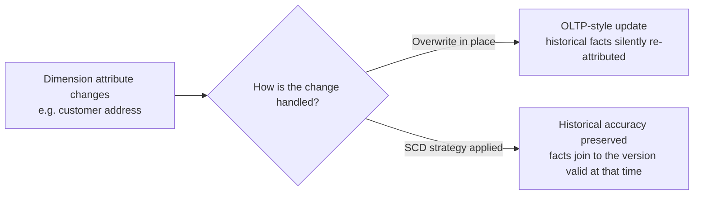
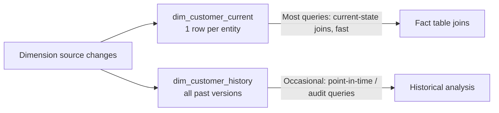
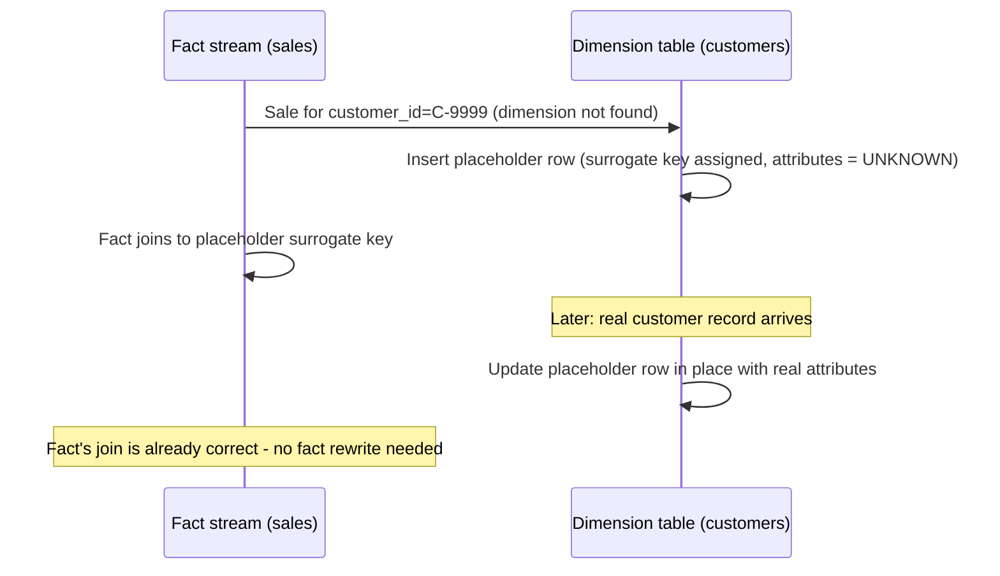
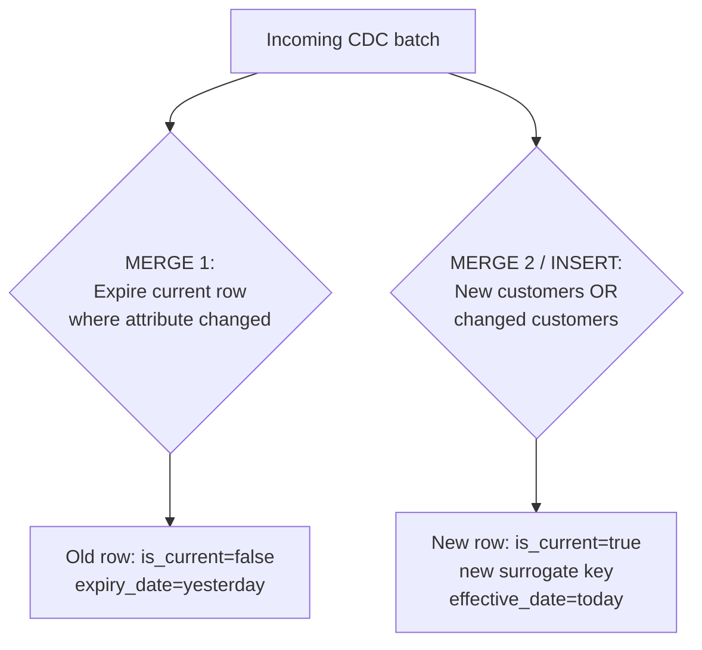
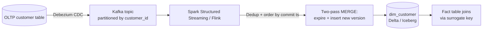

# Slowly Changing Dimensions (SCD) — Data Engineering Notes

> Reviewed, corrected, and expanded from original study notes. Includes definitions, examples, diagrams, worked Spark/SQL implementation, and interview-style Q&A (FAQ + scenario + system design + follow-ups).

---

## 📌 Index

1. [Why Dimensions Change — and Why It Matters](#1-why-dimensions-change--and-why-it-matters)
2. [Key Concepts & Terminology](#2-key-concepts--terminology)
3. [SCD Type 0 — Fixed / Immutable](#3-scd-type-0--fixed--immutable)
4. [SCD Type 1 — Overwrite](#4-scd-type-1--overwrite)
5. [SCD Type 2 — Full History (New Row per Change)](#5-scd-type-2--full-history-new-row-per-change)
6. [SCD Type 3 — Previous-Value Column](#6-scd-type-3--previous-value-column)
7. [SCD Type 4 — Current + History Tables](#7-scd-type-4--current--history-tables)
8. [SCD Type 6 — Hybrid (1 + 2 + 3)](#8-scd-type-6--hybrid-1--2--3)
9. [Choosing the Right SCD Type — Comparison Table](#9-choosing-the-right-scd-type--comparison-table)
10. [Late-Arriving Dimensions](#10-late-arriving-dimensions)
11. [Spark Implementation: SCD Type 2 via `MERGE INTO`](#11-spark-implementation-scd-type-2-via-merge-into)
12. [Q&A — Frequently Asked (Conceptual)](#12-qa--frequently-asked-conceptual)
13. [Q&A — Scenario-Based](#13-qa--scenario-based)
14. [Q&A — Lead Data Engineer Design Questions](#14-qa--lead-data-engineer-design-questions)
15. [Q&A — Common Follow-Ups](#15-qa--common-follow-ups)

---

## 1. Why Dimensions Change — and Why It Matters

In dimensional data warehouse modeling, data is split into:
- **Fact tables** — measurable, transactional events (e.g., a sale, an order line), typically numeric and high-volume.
- **Dimension tables** — descriptive, reference data that gives facts context (e.g., `customer`, `product`, `employee`, `store`).

Dimension attributes **change over time** — a customer moves address, a product gets reclassified into a different category, an employee changes department. This is fine in an **OLTP** system: a simple `UPDATE` changes the row, and every transactional system referencing it immediately reflects the new value — because OLTP generally only cares about the **current** state.

But in a **data warehouse**, this is a real problem: facts (e.g., past sales) are meant to reflect business reality **as it was at the time the fact occurred**. If a dimension table simply gets overwritten like an OLTP table, historical facts silently get re-attributed to the *current* dimension values, corrupting historical analytics (e.g., a sale made to a customer's old region now appears to belong to their new region).

**Slowly Changing Dimension (SCD)** strategies define standardized, well-understood approaches for handling this trade-off between:
- **Historical accuracy** (being able to correctly answer "what was true at the time"), vs.
- **Manageability/performance** (keeping every version of every dimension row can make already-large dimension tables enormous, slowing scans/joins).



---

## 2. Key Concepts & Terminology

| Term | Definition |
|---|---|
| **Dimension table** | Descriptive/reference data table (customer, product, employee, store, etc.) that gives context to facts. |
| **Surrogate key** | A system-generated, meaningless artificial key (e.g., an auto-incrementing integer or UUID) used as the table's primary key — **not** derived from any business meaning. Enables multiple rows to represent the *same* real-world entity across different time periods (essential for SCD Type 2). |
| **Natural / business key** | The real-world identifier for an entity (e.g., `customer_id` from the source system, an employee number) — stays constant across the entity's entire history, unlike the surrogate key which is unique **per version**. |
| **Effective date / Expiry date** | Columns marking the time range during which a given dimension row version was the "current, valid" one. |
| **Current flag** | A boolean column (`is_current`) marking whether a given row is the currently active version of that entity. |
| **Version number** | An incrementing integer tracking which iteration of change a row represents, often used alongside effective/expiry dates. |
| **Late-arriving dimension** | A situation where a **fact record arrives before its corresponding dimension record** even exists yet (e.g., a sale is recorded before the customer master record has been created/synced) — requires special handling so the fact isn't dropped or mis-joined. |

**Example dimension row (Type 2 style) showing several of these together:**

| surrogate_key | customer_id (natural key) | name | address | effective_date | expiry_date | is_current | version |
|---|---|---|---|---|---|---|---|
| 1001 | C-500 | Alice | 12 Elm St | 2024-01-01 | 2025-06-14 | false | 1 |
| 1002 | C-500 | Alice | 45 Oak Ave | 2025-06-15 | 9999-12-31 | true | 2 |

---

## 3. SCD Type 0 — Fixed / Immutable

The attribute is **never changed** once written — it stays constant for the life of the record, even if the real-world value changes. Used for attributes that are meant to represent an **original/fixed fact**, not a current state (e.g., "original signup channel," "date of birth" in some designs, "original credit score at account opening").

- ✅ Simplest possible handling — no update logic needed at all.
- ❌ Not suitable for any attribute where tracking the *current* or *historical progression* of a value actually matters.

---

## 4. SCD Type 1 — Overwrite

The changed attribute is **simply overwritten** in place — no history is kept at all.

```sql
UPDATE dim_customer
SET address = '45 Oak Ave'
WHERE customer_id = 'C-500';
```

- ✅ Simple, minimal storage, dimension table stays small.
- ❌ **All history is lost** — any historical fact joined to this dimension row will now show the *current* address, even for sales that happened under the old address. Use only for attributes where historical accuracy genuinely doesn't matter (e.g., correcting a data-entry typo).

---

## 5. SCD Type 2 — Full History (New Row per Change)

When an attribute changes, **insert a new row** with the new value (and a new surrogate key), and **expire the old row** (via an expiry date and/or flipping the current flag to false).

```sql
-- Expire the old version
UPDATE dim_customer
SET expiry_date = CURRENT_DATE - 1, is_current = false
WHERE customer_id = 'C-500' AND is_current = true;

-- Insert the new version
INSERT INTO dim_customer (surrogate_key, customer_id, name, address, effective_date, expiry_date, is_current, version)
VALUES (1002, 'C-500', 'Alice', '45 Oak Ave', CURRENT_DATE, '9999-12-31', true, 2);
```

- ✅ **Preserves full history** — facts join to the surrogate key that was current at the time of the transaction, so historical reports remain accurate even as the dimension changes.
- ❌ The dimension table **grows over time** (one row per change per entity) — for high-churn dimensions with millions of rows and frequent updates, this can become very large, slowing scans/joins if not managed (partitioning, avoiding unnecessary full-table rewrites, periodic archiving of very old inactive versions).

This is the **most commonly used** SCD type in practice, since it's the only one of the "simple" types that gives you true point-in-time historical accuracy.

---

## 6. SCD Type 3 — Previous-Value Column

Instead of adding a new row, add a **new column** to store the *previous* value of the changed attribute (e.g., `previous_address` alongside `current_address`).

```sql
ALTER TABLE dim_customer ADD COLUMN previous_address STRING;

UPDATE dim_customer
SET previous_address = address, address = '45 Oak Ave'
WHERE customer_id = 'C-500';
```

- ✅ Relatively simple; no table growth from row duplication.
- ❌ Only preserves the **immediately preceding** value — a second change overwrites `previous_address` again, losing the value before that. Not suitable when you need arbitrary point-in-time history, only "what was it right before this change."

---

## 7. SCD Type 4 — Current + History Tables

Maintain **two separate tables**: one holding only the **current** version of each dimension row (small, fast to query/join — since most queries only need current attributes), and a separate **history table** holding all past versions (only queried when historical/point-in-time analysis is actually needed).



- ✅ Solves the "huge dimension table" problem directly — the vast majority of day-to-day queries (which only need the *current* attribute values) hit the small current table, and only genuinely historical queries pay the cost of scanning the larger history table.
- ❌ Increases operational/ETL complexity — two tables to maintain, keep in sync, and a duplicated write path (every change must be applied to *both* tables consistently).

---

## 8. SCD Type 6 — Hybrid (1 + 2 + 3)

Combines all three simpler types: like Type 2, a **new row is added** for every attribute change (full history preserved via effective/expiry dates and a current flag) — **but** like Type 3, each historical row *also* carries a column showing the **current/latest** value of the attribute (updated retroactively across all historical rows whenever a new change occurs), giving you Type 1-style "always know the latest value" convenience even when looking at an old row.

**Example:**

| surrogate_key | customer_id | address (as of that version) | address_current (always latest) | effective_date | expiry_date | is_current |
|---|---|---|---|---|---|---|
| 1001 | C-500 | 12 Elm St | 45 Oak Ave | 2024-01-01 | 2025-06-14 | false |
| 1002 | C-500 | 45 Oak Ave | 45 Oak Ave | 2025-06-15 | 9999-12-31 | true |

- ✅ Most flexible — supports point-in-time historical queries (via the versioned column), "what's the current value" queries even from a historical row (via the `_current` column), and change-tracking, all in one structure.
- ❌ Most complex to implement and maintain — every new change requires **retroactively updating the `_current` column across all historical rows** for that entity, in addition to the normal Type 2 insert/expire logic.

---

## 9. Choosing the Right SCD Type — Comparison Table

| Type | History kept | Table growth | Complexity | Best for |
|---|---|---|---|---|
| **0** | None (immutable) | None | Trivial | Attributes that should never change (e.g., original signup channel) |
| **1** | None (overwritten) | None | Trivial | Corrections/typos, attributes where history truly doesn't matter |
| **2** | Full history | High (new row per change) | Moderate | Most common case — need accurate point-in-time historical reporting |
| **3** | Only immediately previous value | None | Low | Simple "what changed most recently" tracking, not full history |
| **4** | Full history (separate table) | Moderate (split across 2 tables) | High (2 tables to maintain) | Huge dimensions where most queries only need current state |
| **6** | Full history + always-current value | High | Highest | Need both full history *and* easy access to latest value from any row |

---

## 10. Late-Arriving Dimensions

A **late-arriving dimension** (also called a late-arriving fact problem, viewed from the other side) occurs when a **fact record arrives before the corresponding dimension record exists** — e.g., a sale transaction streams in referencing `customer_id = C-9999`, but the customer master record for `C-9999` hasn't been created/synced into the dimension table yet.

**Handling strategies:**
1. **Placeholder/"inferred member" row**: insert a temporary dimension row with just the natural key and placeholder/unknown attribute values (e.g., `name = 'UNKNOWN'`), assign it a surrogate key so the fact can still join correctly, then **update this row in place** (Type 1-style, just this once) when the real dimension data arrives later.
2. **Hold/quarantine the fact** until the dimension record exists (acceptable for low-latency-tolerant batch pipelines, unacceptable for real-time streaming use cases).
3. **Retroactive correction**: let the fact join to the placeholder initially, then run a reconciliation job that updates the fact's dimension key reference once the real record arrives (more common in CDC/streaming architectures where you don't want to block the fact stream).



---

## 11. Spark Implementation: SCD Type 2 via `MERGE INTO`

The general SCD2 upsert pattern in Spark/Delta (or Iceberg/Snowflake, syntax is very similar) is a **two-step `MERGE`**: first expire changed rows, then insert new versions. A common trick is a single `MERGE` that expires matched-and-changed rows, followed by a second `MERGE`/`INSERT` for the new versions — because a single `MERGE` statement can't both update an existing row *and* insert a brand-new row *for the same natural key* in one pass.

```python
from delta.tables import DeltaTable
from pyspark.sql.functions import current_date, lit

dim_customer = DeltaTable.forName(spark, "dim_customer")

# incoming_df: natural key + latest attribute values from source (e.g., CDC feed)
# Step 1: Expire rows where the tracked attributes have changed
dim_customer.alias("target").merge(
    incoming_df.alias("source"),
    "target.customer_id = source.customer_id AND target.is_current = true"
).whenMatchedUpdate(
    condition="target.address <> source.address",   # only expire if a tracked attribute actually changed
    set={
        "expiry_date": "current_date() - 1",
        "is_current": "false"
    }
).execute()

# Step 2: Insert new-version rows for changed records, and brand-new customers
new_versions_df = incoming_df.alias("source").join(
    dim_customer.toDF().alias("target"),
    (col("source.customer_id") == col("target.customer_id")) & (col("target.is_current") == True),
    "left_anti"   # source rows with no *current* matching target row (either new, or was just expired above)
)

new_versions_df.withColumn("effective_date", current_date()) \
    .withColumn("expiry_date", lit("9999-12-31")) \
    .withColumn("is_current", lit(True)) \
    .write.format("delta").mode("append").saveAsTable("dim_customer")
```

**Equivalent conceptual SQL (Delta/Snowflake-style `MERGE`, two-pass pattern):**
```sql
-- Pass 1: expire changed current rows
MERGE INTO dim_customer AS target
USING staged_updates AS source
ON target.customer_id = source.customer_id AND target.is_current = true
WHEN MATCHED AND target.address <> source.address THEN
  UPDATE SET target.expiry_date = current_date() - 1,
             target.is_current = false;

-- Pass 2: insert new current-version rows (new customers + changed customers)
INSERT INTO dim_customer (customer_id, name, address, effective_date, expiry_date, is_current, version)
SELECT source.customer_id, source.name, source.address,
       current_date(), '9999-12-31', true,
       COALESCE((SELECT MAX(version) FROM dim_customer WHERE customer_id = source.customer_id), 0) + 1
FROM staged_updates source
LEFT JOIN dim_customer target
  ON source.customer_id = target.customer_id AND target.is_current = true
WHERE target.customer_id IS NULL OR target.address <> source.address;
```

⚠️ Note: the surrogate key in a real implementation should be generated (e.g., `monotonically_increasing_id()`, a UUID, or an identity column), not reused from the natural key — the whole point of the surrogate key is that each **version** gets its own unique key while the natural key stays constant.



---

## 12. Q&A — Frequently Asked (Conceptual)

**Q1: What is a Slowly Changing Dimension and why is it needed?**
A: An SCD is a dimension table attribute that changes over time (e.g., customer address). SCD strategies (Types 0–6) define how to handle those changes so that historical facts still join to the dimension values that were correct **at the time the fact occurred**, rather than silently getting overwritten with current values as in an OLTP system. See [Section 1](#1-why-dimensions-change--and-why-it-matters).

**Q2: Explain the difference between SCD Type 1, Type 2, and Type 3.**
A: Type 1 overwrites the value in place (no history at all). Type 2 inserts a new row per change, preserving full history via effective/expiry dates and a current flag (dimension table grows over time). Type 3 adds a `previous_value` column to track only the immediately preceding value (no row growth, but no deep history either). See [Section 4](#4-scd-type-1--overwrite), [5](#5-scd-type-2--full-history-new-row-per-change), [6](#6-scd-type-3--previous-value-column).

**Q3: Why do we need surrogate keys for SCD Type 2?**
A: Because the natural/business key (e.g., `customer_id`) stays the same across **every version** of an entity in a Type 2 table — if it were the primary key, you couldn't have multiple rows for the same customer. The surrogate key gives each *version* of the entity its own unique identity, which is exactly what fact tables need to reference: a specific version of a dimension row valid at a specific point in time, not just "this customer" generically.

**Q4: What is a late-arriving dimension and how do you handle it?**
A: It's when a fact record arrives before its corresponding dimension record exists. Common handling: insert a placeholder/"inferred member" dimension row with just the natural key so the fact can join correctly, then update that row in place once the real dimension data arrives. See [Section 10](#10-late-arriving-dimensions).

**Q5: How would you implement SCD Type 2 using `MERGE INTO` in Spark/Delta/Snowflake?**
A: Typically as a two-pass pattern: one `MERGE`/`UPDATE` to expire currently-active rows whose tracked attributes have changed (set `expiry_date`/`is_current=false`), followed by an `INSERT` of new rows (new surrogate key, `effective_date=today`, `is_current=true`) for both brand-new entities and entities whose attributes changed. A single `MERGE` can't both update an existing row and insert a new row for the *same* natural key in one pass, hence the two-step approach. See [Section 11](#11-spark-implementation-scd-type-2-via-merge-into).

---

## 13. Q&A — Scenario-Based

**Q1: A customer's address changes and you need historical sales reports to still reflect the address that was correct at the time of sale — which SCD type would you use and why?**
A: **SCD Type 2.** It's the only simple type that preserves a distinct, joinable historical record per version — the sale's fact row references the surrogate key for the dimension version that was current *at the time of the sale*, so the report correctly shows the old address for old sales, even after the customer's address changes going forward. Type 1 would overwrite history (wrong), and Type 3 would only preserve the immediately preceding value (insufficient if there have been multiple changes since the sale).

**Q2: Your SCD Type 2 dimension table has grown to billions of rows and queries are slowing down — how would you redesign it?**
A:
- **Split current vs. history (move toward SCD Type 4 pattern):** maintain a small `dim_customer_current` table (one row per entity, `is_current=true` only) for the vast majority of queries that just need current attributes, and a separate, larger `dim_customer_history` table for point-in-time/audit queries — most joins get dramatically cheaper.
- **Partition/cluster the history table** on a relevant dimension (e.g., `effective_date` range, or a hash bucket on the natural key) so historical lookups don't scan the whole table.
- **Archive very old, rarely-queried historical versions** to cheaper storage if audit requirements allow, rather than keeping everything in the hot query path.
- **Compact/optimize** the underlying files regularly (small-file problem is common in high-churn SCD2 tables written via frequent CDC merges) — see the companion Delta Lake/Iceberg notes for `OPTIMIZE`/`rewrite_data_files`.
- Consider whether all attributes truly need Type 2 tracking — sometimes only a subset of "slowly changing" attributes actually need full history, while others could be Type 1 within the same table, reducing unnecessary row churn.

**Q3: You're getting duplicate "current" rows for the same customer in your SCD2 table — what could be causing this and how do you fix it?**
A: Common causes:
- **Race condition / concurrent merge jobs** running the expire-and-insert logic for the same natural key at the same time, both seeing the "old" row as still current and both inserting a new version.
- **Out-of-order or duplicate CDC events** in the same or overlapping batches being processed without deduplication, so the same logical change gets applied (and a new row inserted) more than once.
- **Merge condition bug** — e.g., the expire step's `WHERE`/`ON` clause not correctly scoping to `is_current = true`, so multiple historical rows end up flagged current.
**Fixes:** enforce a **uniqueness constraint** (application-level or via a periodic validation query) on `(natural_key) WHERE is_current = true`; deduplicate/order incoming CDC batches by source commit timestamp/LSN before merging (see [Section 15, Q2](#15-qa--common-follow-ups)); serialize writes to the same dimension table (avoid two concurrent jobs processing overlapping natural keys); and run a reconciliation/cleanup job to detect and correct any existing duplicate-current rows (keep the latest, re-expire the rest).

---

## 14. Q&A — Lead Data Engineer Design Questions

**Q1: Design an end-to-end CDC pipeline (source DB → Kafka → Spark/Flink → Delta/Iceberg) implementing SCD Type 2 for a customer dimension at scale.**
A:
- **Capture:** Log-based CDC (Debezium/DMS) streams row-level changes (insert/update/delete + before/after images, with source commit LSN/timestamp) from the OLTP customer table into Kafka.
- **Ordering:** Partition the Kafka topic by the natural key (`customer_id`) so all changes for a given customer land on the same partition, preserving per-customer ordering (critical for correct SCD2 sequencing).
- **Processing (Spark structured streaming or Flink):** For each micro-batch/window, deduplicate/order events by source commit timestamp per natural key, then apply the two-pass `MERGE` pattern (expire changed current rows, insert new versions) against the Delta/Iceberg dimension table (see [Section 11](#11-spark-implementation-scd-type-2-via-merge-into)).
- **Late-arriving handling:** if a fact references a `customer_id` not yet in the dimension, insert a placeholder row (see [Section 10](#10-late-arriving-dimensions)) so the fact pipeline never blocks.
- **Idempotency:** track processed offsets/commit versions so replays/restarts don't double-apply the same change (checkpointing in Spark Structured Streaming / Flink state).
- **Storage layer:** Delta or Iceberg both support the atomic `MERGE` semantics needed here; choose based on the platform's broader multi-engine requirements (see the companion Delta/Iceberg notes).
- **Maintenance:** schedule regular compaction given the high write frequency typical of CDC-driven SCD2 tables.



**Q2: How would you decide between SCD Type 2 and Type 4 for a dimension with millions of rows and frequent updates?**
A: The deciding factor is the **read pattern**, not just row count: if the overwhelming majority of queries only need the **current** dimension state (typical BI dashboards, operational reporting), Type 4's split current/history tables keep the hot query path fast regardless of how large history grows. If historical/point-in-time queries are frequent and central to the workload (not a rare audit-only case), the added ETL complexity of maintaining two synchronized tables (Type 4) may not be worth it versus a well-partitioned/optimized single Type 2 table. Frequent updates favor Type 4 specifically because it isolates write-heavy history accumulation away from the table that read-heavy queries hit most often.

**Q3: How do you handle SCD Type 2 in a multi-engine Lakehouse (e.g., Iceberg tables read by Spark, Trino, and Snowflake) while keeping consistent history across all engines?**
A: Because Iceberg (or Delta) stores the SCD2 logic's *result* (the versioned rows with effective/expiry dates and current flags) as ordinary table data — not engine-specific logic — any engine reading the table sees the same consistent history, **as long as all writers go through the same catalog and commit protocol** (see the companion Iceberg notes on catalogs and concurrent multi-engine writes). Practical design points: designate a **single engine/job as the writer** for the SCD2 merge logic (e.g., Spark or Flink handles the CDC-driven merge) to avoid needing to reimplement identical merge logic per engine and to reduce concurrent-write conflict handling; Trino/Snowflake then act purely as **readers** of the resulting table, needing no special SCD-awareness beyond querying `is_current`/effective-date columns normally, since the table itself already encodes the history correctly.

**Q4: How would you design dimension versioning to satisfy both business reporting needs and regulatory audit requirements (relevant to financial services)?**
A:
- **Business reporting** typically needs standard SCD Type 2 (or Type 4 for scale) — point-in-time accuracy for facts, fast current-state queries.
- **Regulatory audit** requirements often go further: they may require **immutable, tamper-evident** records of *every* change (not just business-relevant attribute changes), including who/what/when made the change, retained for a defined regulatory period regardless of business need.
- Design approach: layer an **append-only audit log** (separate from the query-optimized SCD2 dimension) capturing every raw change event (from the CDC source) with full metadata (source system, timestamp, change type) — this is the compliance source of truth, retained per regulatory retention rules independent of the dimension table's own maintenance (compaction/snapshot-expiration) policy. The SCD2 dimension table itself stays optimized for business query performance, while the audit log satisfies "prove exactly what changed and when" requirements without forcing the reporting-facing table to carry every non-business-relevant field change or excessive retention baggage.

---

## 15. Q&A — Common Follow-Ups

**Q1: How do you handle a fact record that references a dimension key from a row that's since been expired (i.e., how do fact tables join correctly to the right historical version)?**
A: This is actually the **expected, correct behavior** in SCD Type 2 — the fact table stores the **surrogate key** of the dimension version that was current *at the time the fact occurred*, not the natural key. That surrogate key never changes and always points to that specific historical row, even after it's expired (i.e., no longer `is_current`). So a join on `fact.customer_sk = dim.surrogate_key` (not on the natural key) always returns the correct historical attribute values for that fact, regardless of how many times the dimension has changed since. The key design discipline is: **facts must be loaded using the surrogate key that was current at fact-load time**, looked up via the natural key + effective/expiry date range (or `is_current=true` if loading in near-real-time), never joined to dimensions purely by natural key.

**Q2: What happens if two changes to the same customer arrive in the same batch — how do you avoid creating rows in the wrong order (out-of-order updates)?**
A: If processed naively (e.g., both changes matched and merged without ordering), you risk either applying them in the wrong sequence (final state ends up as the *first* change instead of the *second*) or creating malformed overlapping effective/expiry ranges. Fix: **deduplicate and sort by source commit timestamp/LSN per natural key** before applying the merge, so only the **latest** change per key is actually applied to reach current state, while intermediate changes within the same micro-batch are collapsed correctly (or, if intermediate history genuinely matters, process them **sequentially** — e.g., via `foreachBatch` with an explicit per-key ordered loop, or windowed micro-batching small enough that ordering issues within a batch are minimized) rather than assuming one merge call handles arbitrary intra-batch ordering automatically.

**Q3: How would you backfill SCD2 history if you're migrating from a system that only kept current-state data?**
A: If the source system has never tracked history, true historical states genuinely **cannot be reconstructed** unless there's some other trail to source from (e.g., audit logs, periodic snapshots/backups, change-event archives, or downstream systems that happened to capture point-in-time copies). Practical approach:
1. Check for any available secondary sources of historical state (nightly snapshot backups, application audit tables, data warehouse extract history if one already existed) — even partial history is valuable.
2. If no historical trail exists at all, the honest approach is to **seed the SCD2 table with a single "as of migration date" version** for each entity (effective_date = migration date, `is_current=true`) and be explicit with stakeholders that **true history starts from the migration date forward** — don't fabricate synthetic history.
3. Going forward, ensure the *new* CDC-based pipeline captures every change from that point on, so the gap is a one-time, clearly documented limitation rather than an ongoing one.
4. If regulatory/audit needs require historical accuracy going further back than available data, that's a business/compliance conversation about data retention gaps — not something that can be engineered around from the current-state-only source.

---

*Notes reviewed and structured for quick revision — use the [Index](#-index) above to jump directly to any topic.*
