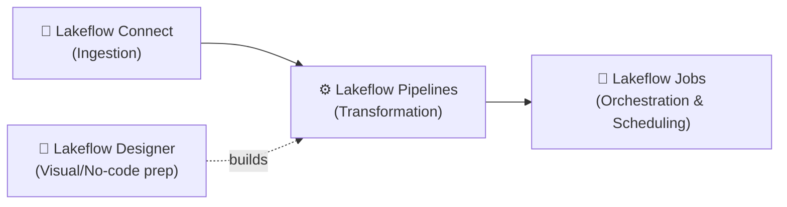
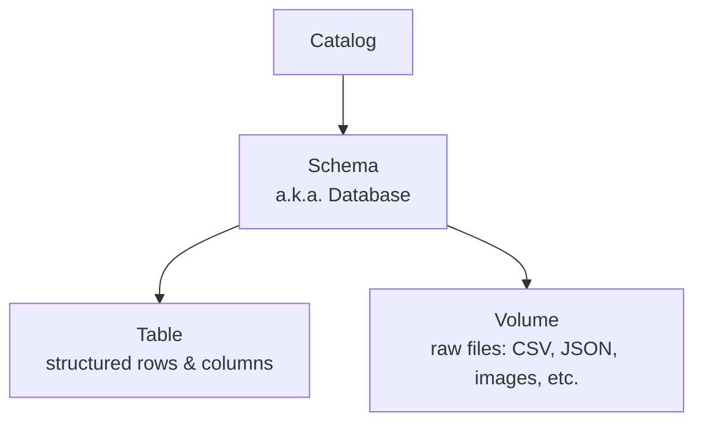
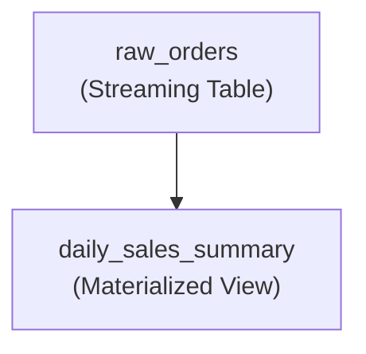

# Databricks — Lakeflow, Auto Loader & Compute (Part 2)
*(Continuation of your Databricks notes — covers the Lakeflow suite, data organization, Auto Loader, Declarative Pipelines, and Compute)*

---

# PART 1 — The Lakeflow Suite (Overview)

## 1. What Is Lakeflow?

**Lakeflow** is Databricks' **end-to-end data engineering solution** — it's an umbrella term covering everything needed to get data from a raw source into a high-quality, analytics/AI-ready table: ingestion, transformation, and orchestration, all in one connected suite.

It's made up of **four main pieces**, each solving a different part of the pipeline:



| Piece | What it does |
|---|---|
| **Lakeflow Connect** | Gets data **into** the lakehouse — connectors for databases, SaaS apps, cloud storage, message buses, files. |
| **Lakeflow Pipelines** | **Transforms** raw data into clean, structured, business-ready tables (this is where Declarative Pipelines / DLT lives). |
| **Lakeflow Designer** | A **visual, drag-and-drop / natural-language** way to build transformation workflows — for people who'd rather not write Spark code directly. |
| **Lakeflow Jobs** | **Orchestrates and schedules** everything — notebooks, pipelines, SQL, ML training — as one coordinated workflow. |

> Simple way to remember: **Connect gets it in, Pipelines clean/shape it, Designer is the no-code way to build pipelines, Jobs runs and schedules the whole thing.**

---

## 2. Lakeflow Connect (Ingestion)

Simplifies bringing data **into** the lakehouse from a wide range of sources — enterprise apps, databases, cloud storage, message buses, and local files.

- **Managed connectors** — a simple, configuration-based UI experience; you point-and-click to set up ingestion without writing pipeline code yourself.
- **Standard connectors** — broader, more flexible access across a wide range of data sources (more setup/control than managed connectors).
- Built on an **open** platform — you're not locked in; you can still bring your own preferred third-party ingestion tools if needed.

**Incremental ingestion & checkpointing**
Like Auto Loader (§9), Lakeflow Connect tracks what's already been ingested so re-runs only pick up **new** data, not the entire source again — checkpointing is what makes this safe and resumable after failures.

**When you still need to write it yourself**
Managed connectors cover common, well-supported sources. For **niche/custom APIs**, unusual authentication schemes, or sources without a pre-built connector, you'll still write custom ingestion logic (e.g., a Python script using Auto Loader or a custom Spark data source) — Lakeflow Connect isn't a universal replacement for all custom ingestion work.

---

## 3. Lakeflow Designer (Visual, No-Code)

A **visual data preparation tool** for building transformation workflows without writing code directly.

- Build pipelines via a **drag-and-drop canvas**, or by describing what you want in **natural language**.
- Includes **built-in operators** for common transformation steps.
- Can **ingest data** directly, not just transform existing tables.
- Supports updating/modifying a pipeline using **natural-language prompts**, not just the visual canvas.

> Positioning: this is aimed at users who want pipeline-building power **without** writing PySpark/SQL by hand — analysts, less code-heavy data practitioners — while still producing a real, governed Lakeflow Pipeline underneath.

---

# PART 2 — Databricks Data Organization

## 4. The Catalog → Schema → Table/Volume Hierarchy

Databricks (via Unity Catalog) organizes data in a **three-level namespace**:



- **Catalog** — the top-level container (often maps to an environment or business unit, e.g., `prod`, `dev`, or a team name).
- **Schema** — a collection of related tables, views, and volumes (equivalent to a "database" in traditional SQL terms).
- **Table** — structured data, organized in rows and columns.
- **Volume** — a place to store and access **raw, non-tabular files** (CSVs, JSON, images, etc.) that haven't been (or won't be) turned into a table.

**Handy commands**
```sql
SELECT current_catalog(), current_schema();  -- what am I currently using?
SHOW TABLES;
SHOW VOLUMES;
LIST '<path>';  -- list raw files inside a volume path
```

**Reading raw files directly & creating a table from them**
```sql
-- Just read/preview the raw file
SELECT * FROM read_files('/Volumes/dbacademy/get_started_de/myfiles/employees.csv');

-- Create a managed table from it (CTAS = Create Table As Select)
CREATE TABLE IF NOT EXISTS employees AS
SELECT * FROM read_files('/Volumes/dbacademy/get_started_de/myfiles/employees.csv');
```

**CTAS with explicit read options**
```sql
CREATE TABLE IF NOT EXISTS current_employees_ctas AS
SELECT ID, FirstName, Country, Role
FROM read_files(
  '/Volumes/dbacademy/get_started_de/myfiles/employees.csv',
  format => 'csv',
  header => true,
  inferSchema => true
);
```
> Tables can also be created via the Databricks UI directly (upload a file → "Create Table" wizard) — useful for quick, one-off table creation without writing SQL.

**Loading data incrementally**
```sql
COPY INTO employees
FROM '/Volumes/dbacademy/get_started_de/myfiles/'
FILEFORMAT = CSV;
```
`COPY INTO` tracks which files it has **already loaded**, so re-running it only picks up **new** files — a simple, SQL-native way to do incremental batch loading (a lighter-weight alternative to Auto Loader for simpler use cases).

**Lineage**
Full column/table-level **lineage** (where data came from, what it feeds into) is viewable directly in the **Catalog Explorer**, for any table registered in Unity Catalog.

---

## 5. Delta Table Version History (Time Travel)

Every write to a Delta table (INSERT/UPDATE/DELETE) creates a **new version** — this is a core Delta Lake feature, letting you query or restore historical states.

```sql
DESCRIBE HISTORY employees;
```
Shows, per version:
| Column | Meaning |
|---|---|
| `version` | Version number, starting at 0 |
| `timestamp` | When the operation happened |
| `operation` | Type of change: `CREATE TABLE`, `WRITE`, `UPDATE`, `DELETE`, etc. |
| `userName` | Who made the change |

**Querying a past version ("Time Travel")**
```sql
SELECT * FROM employees VERSION AS OF 0;

-- Shorthand syntax
SELECT * FROM employees@v0;
```

**Comparing versions**
```sql
SELECT 'Current' AS version, COUNT(*) AS row_count FROM employees
UNION ALL
SELECT 'Version 0', COUNT(*) FROM employees VERSION AS OF 0;
```

> This is what makes SCD Type 2-style auditing and "what did this table look like last Tuesday" questions possible natively, without you having to build your own history-tracking mechanism from scratch.

---

# PART 3 — Auto Loader

## 6. What Is Auto Loader & Why It Exists

**Auto Loader** incrementally and efficiently processes **new files** as they arrive in cloud storage — with almost no manual setup. It's exposed as a Structured Streaming source called **`cloudFiles`**.

**Benefits over plain Structured Streaming directly on files** *(a gap in your original notes — this is a common interview question)*:
- Plain file-based streaming re-lists **the entire directory** on every trigger to find new files — this gets **slower and more expensive** as the directory grows to millions of files.
- Auto Loader instead **tracks discovered file metadata** in a scalable state store, so it doesn't need to re-scan everything every time.
- Auto Loader also adds **automatic schema inference/evolution** and **bad-record handling** (see below) — capabilities plain file streaming doesn't give you out of the box.

## 7. How Auto Loader Tracks State (Checkpointing)

- As files are discovered, their metadata is persisted in a **scalable key-value store (RocksDB)**, kept inside the Auto Loader **checkpoint location**.
- On failure, Auto Loader **resumes exactly where it left off**, using this checkpoint state — providing **exactly-once** guarantees when writing into Delta Lake.
- Inside **Lakeflow Pipelines** specifically, you typically **don't need to manually specify** a schema or checkpoint location — the pipeline framework manages these settings automatically for you.

## 8. File Discovery Modes

| Mode | How it works | Best for |
|---|---|---|
| **Directory Listing** (default) | Scans cloud storage using an optimized lexicographical listing strategy to check file modification times. | Small-to-medium volumes (fewer than a few million files). |
| **File Notification** | Sets up a cloud-native **event queue** (e.g., AWS S3 Event Notifications → SQS, Azure Event Grid → Storage Queue), and Auto Loader reads directly from that queue instead of listing the bucket. | Large-scale ingestion — tens of millions of files/day. |

## 9. Schema Inference & Evolution

- Rather than scanning an **entire** multi-terabyte dataset to infer schema, Auto Loader **samples a subset of files** (configurable via `cloudFiles.maxFilesPerTrigger`) to build the initial schema efficiently.
- Handles schemas that **change over time** upstream (common with JSON/CSV/XML sources) automatically, based on your configured `schemaEvolutionMode`.

## 10. Handling Bad & Malformed Data

Two complementary safety nets, so **one bad record doesn't break your whole pipeline**:

**Rescued Data Column (`_rescued_data`)**
An extra column Auto Loader automatically appends to the target table, capturing data that doesn't cleanly fit the expected schema:
- **Type mismatches** — e.g., a string `"ABC"` where an integer was expected.
- **Case mismatches** — e.g., `UserID` in the source vs. `user_id` expected.
- **Undeclared fields** — any field missing from the target schema (while in rescue mode).

**Bad Records Path (`badRecordsPath`)**
For records that are **completely unparseable** (a fully corrupted CSV row, a truncated JSON blob):
```python
.option("badRecordsPath", "s3://my-bucket/bad_records/")
```
Auto Loader redirects these corrupted raw records into this path as JSON files for later debugging — while the **main stream keeps running safely**, rather than crashing.

## 11. Backfilling With Auto Loader (Without Reprocessing Everything)

**Scenario:** you have years of historical logs, but only need to backfill a specific past period (say, 2023) — while your live pipeline keeps processing today's data uninterrupted.

**Option A — Time-based filters**
Run a one-time batch limited to a specific date range:
```python
df_backfill = (spark.readStream
  .format("cloudFiles")
  .option("cloudFiles.format", "json")
  .option("modifiedAfter", "2023-01-01T00:00:00.000Z")
  .option("modifiedBefore", "2023-12-31T23:59:59.000Z")
  .load("s3://my-bucket/raw-data/"))
```

**Option B — A dedicated checkpoint for the backfill**
⚠️ **Rule: never point a backfill stream at your production checkpoint directory** — this would corrupt your live pipeline's progress tracking.
```python
(df_backfill.writeStream
  .format("delta")
  .option("checkpointLocation", "s3://my-bucket/checkpoints/backfill_2023/")  # UNIQUE checkpoint
  .trigger(availableNow=True)  # process all matching historical files, then stop
  .table("bronze_events"))
```
> This directly matches the general **backfilling** best practices covered in your Kafka/Streaming notes — same principle (separate checkpoint, `Trigger.AvailableNow`), applied specifically to Auto Loader.

## 12. Full Production Example (Condensed)

```python
from pyspark.sql.types import StructType, StructField, StringType, TimestampType

user_schema = StructType([
    StructField("user_id", StringType(), True),
    StructField("event_type", StringType(), True),
    StructField("timestamp", TimestampType(), True)
])

df = (spark.readStream
    .format("cloudFiles")
    .option("cloudFiles.format", "json")
    .option("cloudFiles.useNotifications", "true")               # File Notification mode
    .option("cloudFiles.schemaEvolutionMode", "addNewColumns")   # Auto-evolve schema
    .option("cloudFiles.schemaLocation", "s3://my-bucket/schemas/users_stream/")
    .option("badRecordsPath", "s3://my-bucket/corrupt_files/users/")
    .schema(user_schema)
    .load("s3://my-bucket/raw_landing/users/"))

query = (df.writeStream
    .format("delta")
    .outputMode("append")
    .option("checkpointLocation", "s3://my-bucket/checkpoints/users_stream/")  # exactly-once
    .trigger(processingTime="10 seconds")
    .table("hive_metastore.bronze.users_raw"))
```

---

# PART 4 — Declarative Pipelines (Lakeflow Pipelines)

## 13. Imperative vs. Declarative — The Core Distinction

*(This was a gap in your notes — worth understanding clearly, since it's the foundational idea behind this whole feature.)*

- **Imperative** — you write out **every step**, in order: "read this, transform it this way, then write it here, and make sure Table A runs before Table B because B depends on it." **You** manage the sequencing and dependencies.
- **Declarative** — you describe **what** the final result/table should look like (its logic/query), and the **engine figures out** the correct execution order, parallelism, and retries **for you**, by analyzing dependencies between your defined datasets automatically.

> Simple analogy: **Imperative** is giving turn-by-turn driving directions. **Declarative** is giving someone your destination address and letting GPS/the engine figure out the route.

**Lakeflow Pipelines (formerly "Delta Live Tables"/DLT) are declarative** — you define *what* each table/view should contain, and Databricks handles orchestration, parallelization, and retries automatically.

## 14. What a Pipeline Actually Produces — Three Dataset Types

| Type | Processing semantics | Use case |
|---|---|---|
| **Streaming Table** | Each record processed **exactly once**, assuming an append-only source. A Delta table with extra support for incremental processing. | Ongoing ingestion of new/changed data (e.g., raw events landing continuously). |
| **Materialized View** | Results are **recomputed as needed** to reflect the current state — Databricks decides when/how much to recompute. | Aggregations/summaries that should always reflect the latest underlying data, without you manually managing refresh logic. |
| **View** | Evaluated **on demand**, never persisted to storage. | Intermediate transformation steps/checks that don't need their own catalog table. |

## 15. Flows, Sinks & Pipelines — How the Pieces Fit

- **Flow** — the **foundational processing unit**: reads from a source, applies your transformation logic, writes to a target. Supports the same streaming semantics as Spark Structured Streaming (**Append, Update, Complete**).
- **Sink** — an **external** streaming target: Delta tables, Kafka topics, Azure Event Hubs topics, Unity Catalog-managed external tables, or custom Python-defined sinks.
- **Pipeline** — the **overall container**: the unit of development and execution, holding all your Flows, Streaming Tables, Materialized Views, and Sinks. While running, it automatically analyzes dependencies between everything you've defined and orchestrates execution order + parallelism.

**Example (Python)**
```python
import dlt
from pyspark.sql.functions import sum, count

@dlt.table(name="raw_orders", comment="Incremental ingestion of orders")
def raw_orders():
    return (spark.readStream
        .format("cloudFiles")
        .option("cloudFiles.format", "json")
        .load("s3://my-bucket/orders/"))

@dlt.table(name="daily_sales_summary", comment="Daily aggregated revenue")
def daily_sales_summary():
    return (dlt.read("raw_orders")
        .groupBy("order_date")
        .agg(sum("amount").alias("total_revenue"), count("order_id").alias("total_orders")))
```

## 16. Automatic Dependency Detection (The DAG)

The pipeline engine **scans your source code** for dataset references (`LIVE.raw_orders` in SQL, or `dlt.read("raw_orders")` in Python), builds an **in-memory Directed Acyclic Graph (DAG)** from those references, identifies which datasets are independent of each other, and runs those **concurrently** — all automatically, no manual sequencing needed.



## 17. The AUTO CDC API

Handling **out-of-order or late-arriving CDC events** normally takes hundreds of lines of manual Spark merge logic, watermarks, and stateful processing. Lakeflow's **AUTO CDC API** (`AUTO CDC INTO` in SQL, `create_auto_cdc_flow` in Python) handles this natively:

- **SCD Type 1** — overwrites target records with latest values (no history).
- **SCD Type 2** — maintains full history with start/end timestamps.
- **Automatically handles out-of-order records** — using a sequencing key (e.g., `updated_at`) to process events in the correct logical order, regardless of the order they physically arrived in.

```sql
-- Applying SCD Type 1 via AUTO CDC
AUTO CDC INTO LIVE.target_customers
FROM STREAM(LIVE.cdc_raw_stg)
KEYS (customer_id)
APPLY AS DELETE WHEN operation = 'DELETE'
SEQUENCE BY event_timestamp
COLUMNS * EXCEPT (operation, event_timestamp);
```
> This is the concrete implementation of the AUTO CDC concepts already covered in Part 1 of your notes (CDC/Snapshots section) — same theory, this is the actual SQL syntax.

## 18. Data Quality — Expectations

**Expectations** are declarative validation rules attached directly to a pipeline dataset, checked as data flows through:

```sql
CREATE OR REFRESH STREAMING TABLE clean_orders (
  CONSTRAINT valid_amount EXPECT (amount > 0) ON VIOLATION DROP ROW,
  CONSTRAINT valid_id EXPECT (order_id IS NOT NULL) ON VIOLATION FAIL UPDATE
)
AS SELECT * FROM STREAM(LIVE.raw_orders);
```

| Violation behavior | What happens |
|---|---|
| **`ON VIOLATION WARN`** (default) | Record passes through unchanged; the violation is just logged in pipeline metrics. |
| **`ON VIOLATION DROP ROW`** | The bad record is filtered out before it lands in the target dataset. |
| **`ON VIOLATION FAIL UPDATE`** | **Halts the entire pipeline immediately** if even one record breaches the rule — use for truly critical constraints only. |

## 19. Development Mode vs. Production Mode

| | Development Mode | Production Mode |
|---|---|---|
| Compute lifecycle | Stays **warm/active** between runs to avoid spin-up delays | **Terminates immediately** after job completion |
| Retries | **Disabled** — errors surface to developers instantly | **Automatic, progressive retries** for failed flows/tasks |
| Purpose | Fast, iterative code-test cycles | Cost-efficient, resilient production execution |

## 20. Diagnosing a Failed Pipeline Run

A structured troubleshooting approach (also a common interview scenario question):

1. **Check the DAG visualization** — the Pipeline UI highlights **failed nodes in red**, showing exactly which Flow/Dataset threw the error.
2. **Examine the Event Log** — Lakeflow automatically logs execution state to a backing **event log table**:
   ```sql
   SELECT timestamp, message, level, details
   FROM event_log("your-pipeline-id")
   WHERE level = 'ERROR';
   ```
3. **Audit Data Quality metrics** — if the failure was due to `ON VIOLATION FAIL UPDATE`, check expectation metrics in the UI to see exactly which constraint broke and how many records violated it.
4. **Classify the failure type:**
   - **Transient** (network blip, cluster hiccup) → Production Mode automatically retries task → flow → pipeline, progressively.
   - **Deterministic** (schema mismatch, bad code logic) → fails **permanently** until you actually fix the code/data — retries won't help.

---

# PART 5 — Compute

## 21. The Three Compute Types

| Type | What it is |
|---|---|
| **Serverless Compute** | On-demand, **fully managed** compute that scales automatically to your workload — you don't provision or manage anything. |
| **Classic Compute** | Provisioned compute (VMs) that **you** create, configure, and manage yourself. |
| **SQL Warehouses** | Compute optimized specifically for **SQL workloads** — can themselves be configured as either serverless or classic under the hood. |

## 22. Classic vs. Serverless — Trade-offs

| | Classic Compute | Serverless Compute |
|---|---|---|
| **How it works** | VMs (EC2/Azure VMs) provisioned directly inside **your** cloud subscription/VPC | Runs in a secure, **pre-warmed pool** inside Databricks' own control plane |
| **Startup time** | **Slow** — 3 to 7+ minutes for nodes to spin up | **Near-instant** — starts processing in seconds |
| **Scaling** | Waits on cloud provider instance provisioning | **Automatic, scale-to-zero** — no idle cost when unused |
| **Control** | Full control: custom VPC config, security, custom libraries/init scripts, specific hardware (e.g., particular GPU models) | Limited — custom networking or legacy non-standard libraries may need special config |
| **Operational overhead** | High — you own infra management | **Near-zero** — no driver config, memory tuning, or OS patching needed |

> **Rule of thumb:** default to **Serverless** unless you have a specific reason not to (e.g., a required custom VPC setup, a specific GPU type, or a legacy library serverless doesn't support) — the near-instant startup and scale-to-zero cost profile make it the easy default answer for most new workloads.

## 23. Clusters vs. SQL Warehouses — Different Purposes

| | **Clusters** (Data Engineering / ML / Data Science) | **SQL Warehouses** (BI / Analytics / Interactive SQL) |
|---|---|---|
| Engine | General-purpose Apache Spark | Highly optimized, vectorized C++ engine (**Photon**) |
| Languages | Python, Scala, SQL, R, ML libraries (e.g., PyTorch) | Tailored specifically for ANSI SQL |
| Typical use | Notebooks, pipelines, ML training | Power BI / Tableau / Lakeview dashboards, interactive SQL |
| Sizing | Node count (Driver + Worker VMs) | "T-shirt size" (2X-Small → Large, etc.) |

## 24. All-Purpose vs. Job Compute

| | All-Purpose Compute | Job Compute |
|---|---|---|
| **Created** | Manually, for interactive work | Dynamically, by Databricks Workflows/Jobs |
| **Sharing** | Multiple users share the same cluster (notebooks, ad-hoc code) | Dedicated to **one single job execution** |
| **Lifecycle** | Stays running until manually paused or auto-terminated | **Terminates automatically** the moment the job completes |
| **Relative cost (DBU rate)** | Higher (~3x) | Lower (~1x) |

> Practical implication: **scheduled production pipelines should use Job Compute** (cheaper, auto-terminates), while **All-Purpose is for people actively working in notebooks** during the day.

## 25. Reading the Cost — DBUs

Databricks bills based on **DBUs (Databricks Units)** — a measure of processing capability consumed per hour, which varies by compute type/size. Job Compute's lower DBU rate compared to All-Purpose Compute is exactly *why* production workloads should run on Job Compute, not on a shared interactive cluster left running.

---

# PART 6 — Lakeflow Jobs & Orchestration

## 26. Core Concepts

- **Job** — the primary resource for **coordinating, scheduling, and running** your work. Ranges from a single-task notebook run to hundreds of tasks with conditional logic. Represented visually as a **DAG**.
  - Configurable properties: **Trigger** (when to run), **Parameters** (runtime values passed to tasks), **Notifications** (alerts on failure/slow runs), **Git** (source control settings for job code).
- **Task** — a **specific unit of work** inside a job. Common types: notebook task, pipeline task (runs a Lakeflow Pipeline), Python script task, SQL query, ML training/deployment task, and more.
  - Tasks can have **dependencies** on other tasks, and support **conditional execution**.
- **Trigger** — what actually **kicks off** a job run: time-based (e.g., "every day at 2 AM") or event-based (e.g., "when new data lands in cloud storage").

**Control Flow**
Jobs support real control-flow logic via a visual authoring UI:
- **Branching** — if/else-style conditional task execution.
- **Looping** — for-each-style task repetition over a set of inputs.

## 27. Monitoring & Observability

| Capability | What it gives you |
|---|---|
| **Job UI monitoring** | View job owner, last run result, filter by properties, drill into run history and per-task detail. |
| **Run status & metrics** | Success/failure status plus logs/metrics per task, for diagnosing issues and performance. |
| **Notifications & alerts** | Email, Slack, custom webhooks, and more, triggered on job events. |
| **System tables** | Query job run/task history across your **entire account** via SQL — build dashboards on job cost/performance trends, join with billing tables for cost monitoring. |

## 28. Workspace Limits (Good to Know for Design/Interview Discussions)

| Limit | Value |
|---|---|
| Concurrent task runs per workspace | **2,000** (returns HTTP 429 if exceeded) |
| Jobs created per hour (includes "runs submit") | **10,000** |
| Saved jobs per workspace | **12,000** |
| Tasks per job | **1,000** |
| Dynamic parameter value length | **10,000 characters** |

> These limits matter at real scale — e.g., if you're tempted to create one job per customer/tenant, hitting the 12,000 saved jobs or 10,000 jobs/hour limits is a realistic design constraint worth planning around upfront, rather than discovering it in production.

---

## Quick Recap Table

| Term | One-liner |
|---|---|
| Lakeflow | Databricks' end-to-end suite: Connect (ingest) → Pipelines (transform) → Jobs (orchestrate) |
| Lakeflow Connect | Managed/standard connectors for ingesting from apps, DBs, storage, files |
| Lakeflow Designer | Visual/no-code, drag-and-drop or natural-language pipeline building |
| Catalog → Schema → Table/Volume | Three-level namespace: environment → database → structured/raw data |
| Time Travel | Query/compare historical Delta table versions via `VERSION AS OF` |
| Auto Loader (`cloudFiles`) | Incremental, stateful, exactly-once file ingestion from cloud storage |
| Directory Listing vs. File Notification | Scan-based discovery vs. event-queue-based discovery (small vs. huge volumes) |
| `_rescued_data` | Auto-captures schema-mismatched fields instead of dropping/failing |
| `badRecordsPath` | Redirects totally unparseable records so the main stream keeps running |
| Imperative vs. Declarative | You sequence every step vs. you describe the result and the engine sequences it |
| Streaming Table / Materialized View / View | Exactly-once incremental / auto-recomputed / not persisted |
| Flow / Sink / Pipeline | Read→transform→write unit / external target / the container orchestrating it all |
| AUTO CDC | Declarative SCD Type 1/2 handling with automatic out-of-order event resolution |
| Expectations | Declarative data quality rules: WARN / DROP ROW / FAIL UPDATE |
| Dev Mode vs. Prod Mode | Warm cluster, no retries, fast iteration vs. auto-terminate, auto-retry, cost-efficient |
| Serverless vs. Classic Compute | Instant/managed/scale-to-zero vs. full control but slow startup & self-managed |
| Clusters vs. SQL Warehouses | General Spark engine vs. Photon-optimized SQL/BI engine |
| All-Purpose vs. Job Compute | Shared interactive (pricier) vs. dedicated per-job, auto-terminates (cheaper) |
| Job / Task / Trigger | The workflow container / a unit of work / what kicks off a run |

