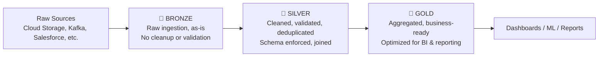
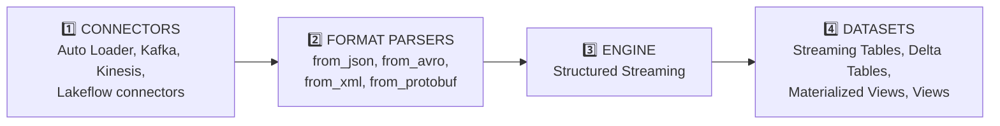
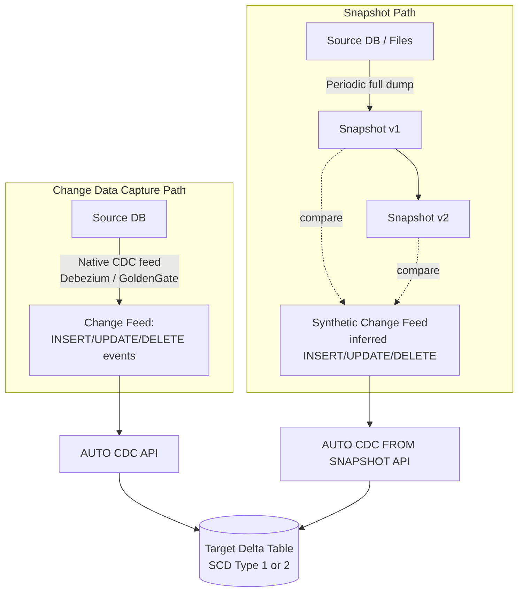

# Databricks Lakehouse — Revision Notes
*(Organized basic → advanced: what a lakehouse is → architecture → processing modes → schema evolution → CDC & snapshots)*

> 📌 A correction upfront: your rough notes had the **Batch vs. Streaming** section mixed up (some streaming characteristics were listed under "Batch" and vice versa, along with swapped code snippets). I've corrected this in §6/§7 — flagged there so you know what changed.

---

# Lakehouse Fundamentals

## 1. What Is a Data Lakehouse?

A **Data Lakehouse** is a data management architecture that combines the **low-cost, flexible storage of a data lake** with the **performance, structure, and reliability of a data warehouse** — so organizations don't need two separate, disconnected systems for cheap raw storage vs. fast structured analytics.

- Provides **scalable storage and processing** in one unified system, avoiding isolated silos for different workloads (BI, ML, streaming, ad-hoc analysis).
- Uses a **layered design pattern** — data incrementally improves, gets enriched, and is refined in stages as it moves through the system (this is the **Medallion Architecture**, covered in Part 2).

### Lakehouse vs. Data Warehouse vs. Data Lake

|                             | **Data Warehouse**                                     | **Data Lake**                                          | **Data Lakehouse**                           |
|-----------------------------|--------------------------------------------------------|--------------------------------------------------------|----------------------------------------------|
| **Data types**              | Structured only                                        | Any format (structured, semi-structured, unstructured) | Any format                                   |
| **ACID compliance**         | ✅ Yes                                                  | ❌ No                                                   | ✅ Yes (via Delta Lake)                       |
| **Governance**              | Strong                                                 | Weak/inconsistent                                      | Strong (via Unity Catalog)                   |
| **Schema approach**         | Schema-on-write                                        | Schema-on-read                                         | Supports both, with enforcement where needed |
| **ML/Data Science support** | Limited                                                | Strong                                                 | Strong                                       |
| **BI query performance**    | Very fast (optimized for it)                           | Weaker without extra tooling                           | Fast (optimized)                             |
| **Cost at scale**           | Expensive at petabyte scale                            | Cheap                                                  | Cheap, with warehouse-like performance       |
| **Concurrency handling**    | Designed to avoid conflicts between concurrent queries | Limited concurrency guarantees                         | Strong, via ACID transactions                |

> Simple way to remember: **Data Warehouse** = fast & structured, but rigid and expensive at scale. **Data Lake** = cheap & flexible, but no guarantees (no ACID, weak governance). **Lakehouse** = tries to get **both** — cheap, flexible storage **plus** warehouse-grade reliability and performance.

---

## 2. The Two Key Technologies Behind the Databricks Lakehouse

**Delta Lake**
An **optimized storage layer** (built on top of Parquet files) that adds:
- **ACID transactions** — safe, reliable reads/writes even with concurrent operations.
- **Schema enforcement** — rejects data that doesn't match the expected structure (and supports controlled schema evolution — see Part 4).
> This is what gives the lakehouse its warehouse-like reliability, while data still physically sits in cheap cloud object storage.

**Unity Catalog**
A **unified, fine-grained governance solution** for both data *and* AI assets across the lakehouse.
- Central place to manage **access control** and **data isolation boundaries**.
- Tracks **data lineage** — how data flows and transforms across every layer.
- Enforces a single, consistent governance model to keep sensitive data private/secure across all workloads (SQL, ML, streaming).

---

## 3. Capabilities of a Databricks Lakehouse (Quick Reference)

| Capability                | What it means                                                             |
|---------------------------|---------------------------------------------------------------------------|
| Real-time data processing | Handles both streaming and batch workloads natively                       |
| Data integration          | Unifies data into one system — a single source of truth for collaboration |
| Schema evolution          | Adapts table structure over time without breaking existing pipelines      |
| Data transformations      | Powered by Apache Spark — scalable, fast, reliable                        |
| Data analysis & reporting | An engine optimized for data-warehouse-style analytical queries           |
| Machine learning & AI     | Apply ML directly on the same governed data, no separate copy needed      |
| Versioning & lineage      | Full dataset version history + traceability of how data was derived       |
| Data governance           | One unified system (Unity Catalog) for access control + auditing          |
| Data sharing              | Share curated datasets/reports across teams safely                        |
| Operational analytics     | Monitor data quality, model quality, and drift over time                  |

---

# The Medallion Architecture

## What Is the Medallion Architecture?

A layered data design pattern using **Bronze, Silver, and Gold** layers to represent increasing levels of **data quality and refinement** as data flows through the lakehouse. Each layer's transformations/validations help guarantee data reliability before it reaches the layer optimized for actual analytics use.

### Bronze Layer — Raw Data Ingestion
- Ingests **raw data as-is** from sources like cloud storage, Kafka, Salesforce, etc.
- **No cleanup or validation** happens here — it's a faithful, permanent copy of the source in its original format, converted into Delta tables.
- **Grows incrementally** over time (append-only).
- **Schema enforcement** (via Delta Lake) checks for missing/unexpected fields even at this raw stage, and **Unity Catalog** registers these tables according to the org's governance model.

### Silver Layer — Cleaning & Validation
- Data is **cleaned**: dropping nulls, quarantining invalid records, deduplication, normalization.
- Handles **schema enforcement**, missing/null values, and **out-of-order/late-arriving data** issues.
- Datasets get **joined together** into new, more useful combined datasets — early-stage modeling happens here.
- Uses a **schema-on-write** approach for this layer — combined with Delta's schema evolution features, this layer can adapt to source changes **without necessarily rewriting** all the downstream logic that depends on it.

### Gold Layer — Business-Ready, Aggregated Data
- Contains **aggregated data** tailored specifically for analytics and reporting use cases.
- Aligned with actual **business logic/requirements** (e.g., "monthly revenue by region").
- **Optimized for query/dashboard performance** — this is what BI tools and end users actually query.
- Final tables are designed to serve **all** relevant use cases, with layouts optimized per task.
- A unified governance model (Unity Catalog) lets you trace any Gold-layer number **all the way back** to its original raw source — a single source of truth.

---

# Batch vs. Streaming Processing

## Batch Processing

- Processes **all data currently available** in the source, in one go, at the time of processing.
- **Processing logic is simpler** — you're working with a complete, static snapshot of data each run, so you don't need to worry about "what happens when more data shows up mid-calculation."
- **Results are always complete and accurate** *as of that run*, since all available data is considered.
- Typically runs on a **schedule** (e.g., hourly/daily) — latency is measured in **minutes to hours**, not real-time.
- **APIs:** `spark.read.load()` and `spark.write.save()`

## Streaming Processing (Structured Streaming)

- In Databricks, "streaming" has a **broader meaning** than just Kafka-style event streams — the engine can treat sources like **cloud object storage and Delta Lake itself** as streaming sources, enabling efficient **incremental processing** (only processing what's new since last time).
- Can run in two modes:
  - **Triggered (micro-batch)** — processes new data at defined intervals (see your Kafka/Spark streaming notes for `Trigger` types).
  - **Continuous** — much lower latency processing, closer to real-time (sub-second), though with more operational complexity.
- The engine **tracks what's already been processed** (via checkpointing) and only processes new data on each subsequent run — this is what makes it "incremental."
- **Logic is often more complex** than batch — especially for **stateful** operations like joins, aggregations, and deduplication across a continuously arriving stream (see your Kafka streaming notes for windowing/watermarking).
- **Results can be affected by out-of-order or late-arriving data** — unlike batch, which always sees the complete picture, streaming has to make a call on when a result is "final" (this is exactly what watermarking addresses).
- **APIs:** `spark.readStream.load()` and `spark.writeStream.start()`

**Quick Comparison**

|                     | Batch                          | Streaming                                      |
|---------------------|--------------------------------|------------------------------------------------|
| Data scope per run  | Everything currently available | Only new data since last run                   |
| Logic complexity    | Simpler                        | More complex (stateful ops, late data)         |
| Result completeness | Always complete for that run   | Can be affected by late/out-of-order data      |
| Typical latency     | Minutes to hours               | Seconds (triggered) to sub-second (continuous) |
| Spark API           | `spark.read` / `spark.write`   | `spark.readStream` / `spark.writeStream`       |

---

# Schema Evolution

## What Is Schema Evolution?

**Schema evolution** is a system's ability to **adapt to changes in data structure over time**, without requiring a full manual rebuild every time the source data shape changes slightly.

**Common types of schema changes:**

| Change                 | Meaning                                                             | Example                            |
|------------------------|---------------------------------------------------------------------|------------------------------------|
| **New columns**        | Fields added that weren't there before                              | A new `phone_number` field appears |
| **Column renaming**    | A column's name changes                                             | `name` → `full_name`               |
| **Dropped columns**    | A column is removed                                                 | `fax_number` no longer sent        |
| **Type widening**      | A column's type changes to a *broader* compatible type              | `INT` → `DOUBLE`                   |
| **Other type changes** | A column's type changes to something *not* automatically compatible | `INT` → `STRING`                   |

## 9. The Four Independent Components Involved

This is the key mental model: schema evolution in Databricks is **not one single setting** — it's handled **independently** at four different stages of the pipeline. You must configure each stage separately to get the behavior you want end-to-end.

- **Connectors** — ingest data from external sources (Auto Loader, Kafka, Kinesis, Lakeflow connectors).
- **Format Parsers** — decode raw formats into structured columns (`from_json`, `from_avro`, `from_xml`, `from_protobuf`).
- **Engine** — the actual processing engine executing the query (Structured Streaming).
- **Datasets** — where processed data ends up and is served from (Streaming Tables, Delta Tables, Materialized Views, Views).

> 💡 **Practical implication:** e.g., when Auto Loader (connector) evolves its schema based on new incoming data, the *target Delta table* (dataset) must **also** evolve, or the pipeline fails. You either (a) enable schema evolution on the Delta table / use a DDL command, or (b) do a full table rewrite.

## 10. Schema Evolution Support — Condensed Reference

*(Consolidated from the detailed docs into quick-lookup tables — check official docs for exact config flags when implementing.)*

**By Connector**

| Connector                              | New Columns                                                                                                                  | Rename                                        | Drop                   | Type Widening                                  | Other Type Changes               |
|----------------------------------------|------------------------------------------------------------------------------------------------------------------------------|-----------------------------------------------|------------------------|------------------------------------------------|----------------------------------|
| **Auto Loader**                        | ✅ (via `schemaEvolutionMode`, requires restart)                                                                              | ✅ (old col treated as dropped, new col added) | ✅ (soft delete → NULL) | ✅ (DBR 16.4+, `addNewColumnsWithTypeWidening`) | ❌ (only via `rescuedDataColumn`) |
| **Delta connector**                    | ✅ (`mergeSchema`, no rewrite needed)                                                                                         | ✅ (via Spark config, needs column mapping)    | ✅ (via Spark config)   | ✅ (DBR 16.4 LTS+)                              | ❌                                |
| **SaaS / CDC connectors**              | ✅ (auto restart)                                                                                                             | ✅ (treated as new column)                     | ✅ (soft delete → NULL) | ❌ (needs full refresh)                         | ❌ (needs full refresh)           |
| **Kinesis / Kafka / Pub/Sub / Pulsar** | Not natively handled — returns a raw **binary blob**; schema evolution is entirely delegated to the **Format Parser** stage. |                                               |                        |                                                |                                  |

**By Format Parser**

| Parser                        | Support                                                                                                              |
|-------------------------------|----------------------------------------------------------------------------------------------------------------------|
| `from_json`                   | ❌ Manual by default. Inside **Lakeflow pipelines**, can behave like Auto Loader if `schemaEvolutionMode` is enabled. |
| `from_avro` / `from_protobuf` | ✅ Automatic **if** using Confluent Schema Registry; otherwise manual schema updates required.                        |
| `from_csv` / `from_xml`       | ❌ Not supported at all — always manual.                                                                              |

**By Engine**

| Engine                   | Behavior                                                                                                                                                                                                                                                           |
|--------------------------|--------------------------------------------------------------------------------------------------------------------------------------------------------------------------------------------------------------------------------------------------------------------|
| **Structured Streaming** | Schema is **locked in at planning time**; all micro-batches reuse that plan. **Any** mid-execution schema change (new/renamed/dropped columns, type changes) causes the query to **fail**, requiring a manual restart so Spark can re-plan against the new schema. |

**By Dataset (where data lands)**

| Dataset               | New Columns                                                                   | Rename                                            | Drop                                              | Type Widening                       | Other Type Changes                                          |
|-----------------------|-------------------------------------------------------------------------------|---------------------------------------------------|---------------------------------------------------|-------------------------------------|-------------------------------------------------------------|
| **Streaming Table**   | ✅ auto-restart                                                                | ✅ (treated as new column)                         | ✅ (soft delete → NULL)                            | ✅ (must be explicitly enabled)      | ❌ requires full refresh                                     |
| **Materialized View** | Any schema/query change triggers a **full recompute** — no partial evolution. |                                                   |                                                   |                                     |                                                             |
| **Delta Table**       | ✅ auto with `mergeSchema`                                                     | ✅ via `ALTER TABLE` + column mapping (no rewrite) | ✅ via `ALTER TABLE` + column mapping (no rewrite) | ✅ auto or via `ALTER TABLE`         | ✅ but requires a **full table rewrite** (`overwriteSchema`) |
| **Views**             | ✅ with `SCHEMA EVOLUTION` mode (auto, if no explicit column list)             | ✅ same as above                                   | ✅ same as above                                   | ✅ with `SCHEMA TYPE EVOLUTION` mode | ✅ same as type widening                                     |

> 🎯 **Key takeaway for interviews/design decisions:** **Delta Tables are the most flexible** target — most changes don't need a rewrite, except genuinely incompatible type changes. **Materialized Views are the least flexible** — any schema change forces a full recompute, so use them where the schema is expected to be stable.

---

# Change Data Capture (CDC) & Snapshots

## What Is CDC?

**Change Data Capture (CDC)** treats a source database as a **stream of changes** (inserts, updates, deletes) rather than a static, complete dataset you re-read every time.

- Each CDC record typically includes: the **operation type** (INSERT/UPDATE/DELETE), the **actual data values**, and a **sequence number/timestamp** for correct ordering (so out-of-order updates are handled deterministically).
- Traditional databases (SQL Server, MySQL, Oracle) can generate CDC feeds natively (often via tools like **Debezium** or **Oracle GoldenGate**). Delta tables generate their own version, called a **Change Data Feed (CDF)**.

**Why use CDC?**
- Change data is **much smaller** than the full dataset — enables efficient **incremental** downstream processing.
- Enables **reconstructing historical state** — full audit trail, point-in-time reporting, trend analysis.
- Enables **stable surrogate keys** over time (since you're tracking the same logical row's changes, not re-deriving keys from scratch each load).

## What Is a Snapshot?

A **snapshot** is the **complete state** of a table at one point in time (as opposed to a CDC feed, which only contains what *changed*).

**Why teams use snapshots instead of CDC:**
- CDC isn't always available — cost concerns, performance impact on the source production database, legacy systems without CDC support, or the ingestion team simply doesn't own/control the upstream database.
- Snapshots can come from: periodic exports (Oracle/Postgres/SQL Server), cloud storage file dumps, Delta table versions, or shared data from another org (OpenSharing).
- Since a snapshot alone doesn't show *what changed*, you must **compare consecutive snapshots** to infer inserts/updates/deletes.

> ⚠️ **Limitation to know:** snapshot comparison only sees the difference between two points in time — any changes that happened **and reverted in between** snapshots are invisible. E.g., daily snapshots won't catch a customer changing their address twice in one day (A→B→C) — you'll only see the net change (A→C).

## SCD Type 1 vs. Type 2 (Databricks-Specific Implementation)

**SCD Type 1 — Current State Only**
- Overwrites old data with new data — **no history retained**, only the latest version of each record survives.
- **Use when:** you only need the current state; you want downstream **materialized views to incrementally refresh** rather than fully recompute; you need **stable surrogate keys** for joins.

**SCD Type 2 — Full Historical Tracking**
- Maintains **multiple versions** of a record over time, each timestamped.
- Uses **`__START_AT`** and **`__END_AT`** columns to define each version's validity window. The **current/active** record has `__END_AT = NULL`.
- **Use when:** auditability/regulatory requirements demand history; customer analytics needs to see how an entity evolved; point-in-time reporting or trend analysis is required.

## AUTO CDC vs. AUTO CDC FROM SNAPSHOT

Databricks (via **Lakeflow pipelines**) provides two APIs that automate applying CDC logic — instead of hand-writing complex, error-prone `MERGE INTO` logic with staging tables and window functions yourself.

| API                        | Use When                                                                                                           | What it does                                                                                                 |
|----------------------------|--------------------------------------------------------------------------------------------------------------------|--------------------------------------------------------------------------------------------------------------|
| **AUTO CDC**               | Your source already emits a change feed (native DB CDC via Debezium/GoldenGate, or a Delta table with CDF enabled) | Applies incoming change events (in correct sequence order) directly to the target table as SCD Type 1 or 2   |
| **AUTO CDC FROM SNAPSHOT** | Your source only gives you periodic full-table dumps, no CDC feed available                                        | Compares consecutive snapshots, **infers** a synthetic change feed, then applies the same SCD Type 1/2 logic |

**Important details for AUTO CDC:**
- Requires a **sequencing column** — must be **monotonically increasing** per key, with one distinct value per update. `NULL` sequencing values aren't supported.
- **Initial hydration** (loading all historical data before switching to ongoing incremental processing) is handled via a **"once" flow** — processes everything available one time, then stops; you then switch to a triggered/continuous flow for ongoing processing. This keeps the logic consistent between the bulk initial load and later incremental runs.

**Important details for AUTO CDC FROM SNAPSHOT:**
- **Python-only** (not available in the SQL pipeline interface).
- Snapshots must be processed in **ascending version order** — an out-of-order snapshot is simply **ignored**.
- Not just for initial loads — designed for **ongoing** processing every time a new snapshot lands.
- Two patterns for determining snapshot versions:
  - **Pipeline ingestion time** — the snapshot version = when the pipeline actually read it. Use when snapshots arrive regularly, in order.
  - **Version function** — you supply a function returning `(DataFrame, version_number)` explicitly. Use when snapshots can arrive out of order, multiple at once, or you need explicit control over sequencing.

## 15. A Few Extra AUTO CDC Capabilities Worth Knowing

- **Direct edits still work** — unlike standard streaming tables, Unity Catalog tables that are AUTO CDC targets still support direct `INSERT`/`UPDATE`/`DELETE`/`MERGE` statements even while the pipeline is actively running.
- **Downstream CDF** — AUTO CDC target tables (and even Materialized Views, in Beta) can emit their **own** Change Data Feed — so downstream pipelines/teams can consume changes from your AUTO CDC output, chaining CDC through multiple layers.
- **Built-in metrics** — every pipeline run automatically captures `num_upserted_rows` and `num_deleted_rows` for monitoring.
- **Tracking a column subset for SCD Type 2** — by default, *any* column change creates a new historical version. You can restrict this to only track specific "important" columns — changes to untracked columns just update the current row in place instead of creating a new history row. Reduces storage/query cost while still preserving history where it actually matters.

---

## Quick Recap Table

| Term                                   | One-liner                                                                       |
|----------------------------------------|---------------------------------------------------------------------------------|
| Lakehouse                              | Combines data-lake flexibility/cost with data-warehouse reliability/performance |
| Delta Lake                             | Storage layer adding ACID transactions + schema enforcement on top of Parquet   |
| Unity Catalog                          | Unified governance: access control, lineage, and auditing across data & AI      |
| Medallion Architecture                 | Bronze (raw) → Silver (cleaned/validated) → Gold (business-ready/aggregated)    |
| Batch Processing                       | Processes all currently available data at once; simpler logic, higher latency   |
| Streaming Processing                   | Incremental processing of new data only; more complex, lower latency            |
| Schema Evolution                       | A system's ability to adapt to structural changes in data over time             |
| 4 Independent Components               | Connectors → Format Parsers → Engine → Datasets, each configured separately     |
| Delta Table (schema flexibility)       | Most flexible target — most changes don't require a full rewrite                |
| Materialized View (schema flexibility) | Least flexible — any schema change triggers a full recompute                    |
| CDC (Change Data Capture)              | Treats a DB as a stream of INSERT/UPDATE/DELETE changes, not a static dump      |
| Snapshot                               | Full state of a table at one point in time; changes inferred by comparison      |
| SCD Type 1                             | Overwrite — current state only, no history                                      |
| SCD Type 2                             | New row per change, with `__START_AT`/`__END_AT` validity window                |
| AUTO CDC                               | Applies a native change feed to a target table automatically (SCD 1 or 2)       |
| AUTO CDC FROM SNAPSHOT                 | Infers a synthetic change feed by comparing consecutive snapshots               |

