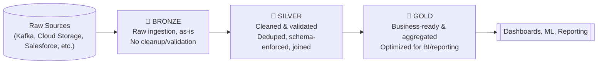
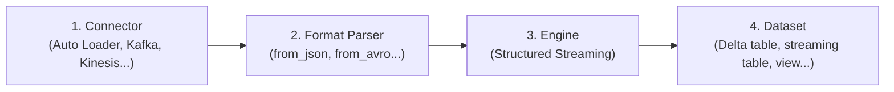
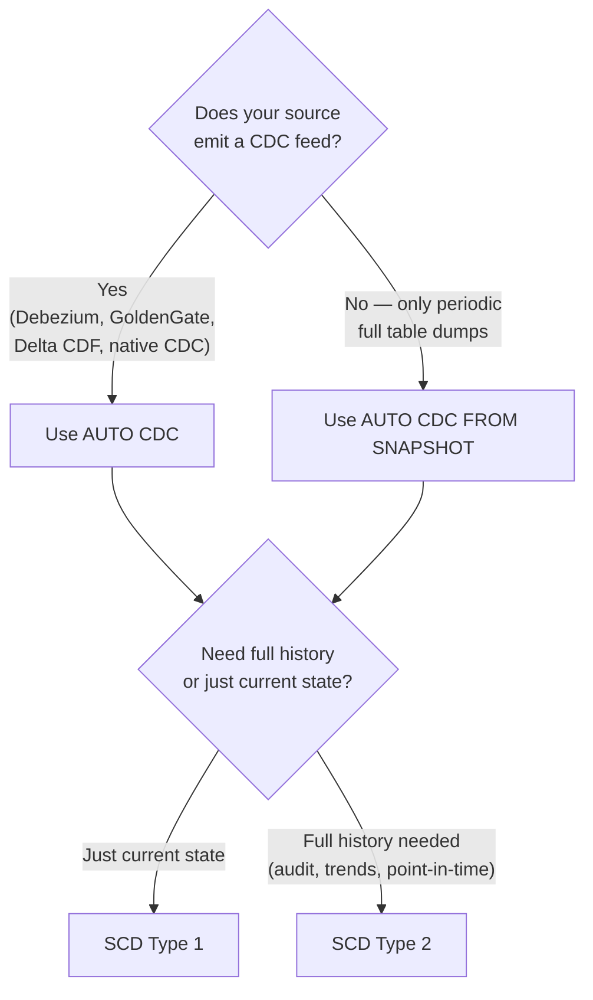

# Databricks Lakehouse — Revision Notes
*(Condensed & reorganized: what a lakehouse is → medallion architecture → batch vs. streaming → schema evolution → CDC & snapshots)*

---

# PART 1 — What Is a Data Lakehouse?

## 1. The Core Idea

A **Data Lakehouse** combines the strengths of a **Data Lake** (cheap, flexible storage for any data type) and a **Data Warehouse** (fast, reliable, structured querying) — into a **single system**, so organizations don't need separate, disconnected tools for different workloads (BI, ML, streaming, ad-hoc analytics all on the *same* data).

It typically follows a design pattern where data is **incrementally improved and refined** as it flows through layers — raw → cleaned → business-ready (this becomes the **Medallion Architecture**, see Part 2).

**The two technologies that make Databricks' Lakehouse work:**
| Technology | What it does |
|---|---|
| **Delta Lake** | An optimized storage layer on top of your files, adding **ACID transactions** and **schema enforcement** — the missing pieces that made raw data lakes unreliable. |
| **Unity Catalog** | A **unified governance layer** for data *and* AI — access control, data lineage, and cataloging, all in one place across the whole lakehouse. |

## 2. Lakehouse vs. Data Lake vs. Data Warehouse

| | **Data Warehouse** | **Data Lake** | **Lakehouse** |
|---|---|---|---|
| **Data types** | Structured only | Any format (structured/semi/unstructured) | Any format |
| **Storage cost at scale** | Expensive at petabyte scale | Cheap | Cheap (built on lake storage) |
| **ACID compliance** | ✅ Yes | ❌ No (by default) | ✅ Yes (via Delta Lake) |
| **Schema** | Schema-on-write | Schema-on-read | Both — flexible ingestion, enforced structure downstream |
| **ML/Data Science support** | Limited | Good (raw data access) | Good — optimized indexing for ML too |
| **BI query performance** | Very fast (purpose-built) | Weak (no optimization) | Fast (optimized like a warehouse) |
| **Governance** | Strong | Historically weak | Strong (via Unity Catalog) |

> Simple way to remember: **Warehouse = fast & structured but rigid and costly at scale. Lake = cheap & flexible but unreliable and ungoverned. Lakehouse = tries to get "cheap + flexible" AND "reliable + fast + governed" at the same time**, by adding a transactional/governance layer (Delta Lake + Unity Catalog) on top of lake storage.

## 3. Key Capabilities (Condensed)

- **Real-time + batch processing** on the same platform (see Part 3).
- **Unified governance** — one system for access control, auditing, and **lineage tracking** (where did this data come from, what transformed it).
- **Schema evolution** — adapt to changing data structures without breaking downstream pipelines (see Part 4).
- **Spark-powered transformations** — speed, scale, reliability.
- **ML/AI support** — same governed data can feed both BI dashboards and ML models.
- **Data sharing** — collaborate across teams using the same curated, governed datasets.
- **Data quality monitoring** — track data/model quality and drift over time.

---

# PART 2 — Medallion Architecture (Bronze → Silver → Gold)

## 4. The Concept

The **Medallion Architecture** organizes lakehouse data into **progressive quality layers** — each layer is a real, queryable Delta table, and data gets more refined/trustworthy as it moves through the stages. This design also enforces ACID guarantees at each transformation step.



## 5. The Three Layers

**🥉 Bronze — Raw Ingestion**
- Ingests raw data from sources (cloud storage, Kafka, Salesforce, etc.) in its **original format**, exactly as received.
- **No cleanup or validation** happens here — it's a permanent, "as-received" record of the source.
- **Append-only** — grows incrementally over time, never overwritten.

**🥈 Silver — Cleaning & Validation**
- Nulls dropped, invalid records quarantined, **deduplication**, normalization.
- **Schema enforcement** applied (via Delta Lake).
- Handles **out-of-order and late-arriving data** (see your Kafka/Streaming notes for why this matters).
- Datasets get **joined/modeled together** here — this is where real data modeling starts to happen.

**🥇 Gold — Business-Ready & Aggregated**
- Aggregated data, shaped specifically for **analytics and reporting** (often dimensional/star-schema style — see your Data Modeling notes).
- Aligned with actual **business logic and requirements**.
- **Optimized for query/dashboard performance** — this is what BI tools and end users actually query.

> Rule of thumb: **Bronze = "what we received." Silver = "what we can trust." Gold = "what the business actually asks for."**

---

# PART 3 — Batch vs. Streaming Processing

## 6. The Databricks Definition

Databricks treats streaming more broadly than you might expect: even **cloud object storage and Delta tables** can act as **streaming sources**, letting Databricks do **efficient incremental processing** on data that isn't "streaming" in the traditional Kafka sense.

- Streaming can run in **triggered** mode (batches at intervals) or **continuous** mode — giving you a cost/performance dial to turn (see your Kafka/Streaming notes on triggers — same underlying idea).
- The engine **tracks what's already been processed**, so subsequent runs only touch **new** data — this is exactly the "incremental processing" idea from your streaming notes.
- Streaming latency in Databricks realistically ranges from **minutes to hours** — not built for true seconds/milliseconds latency.

## 7. Batch vs. Streaming — Comparison

| | **Batch** | **Streaming** |
|---|---|---|
| **What's processed** | All currently available data, all at once | Only *new* data since the last run |
| **Processing logic** | Simpler | Can get complex — stateful ops (joins, aggregations, dedup) |
| **Accuracy** | Always reflects all available data at that moment | Can be affected by out-of-order/late-arriving data |
| **API (Python)** | `spark.read.load()` / `spark.write.save()` | `spark.readStream.load()` / `spark.writeStream.start()` |

> This maps directly onto your earlier Kafka/Spark Structured Streaming notes — **Databricks just extends "streaming" to include file/Delta sources, not only Kafka-style message queues.**

---

# PART 4 — Schema Evolution

## 8. What Is Schema Evolution?

A system's ability to **adapt automatically (or semi-automatically) to changes in data structure over time**, without breaking the whole pipeline.

**Common types of schema changes:**
| Change | Example |
|---|---|
| **New columns** | A `middle_name` field appears that wasn't there before. |
| **Column renaming** | `name` → `full_name` |
| **Dropped columns** | A field stops being sent. |
| **Type widening** | `INT` → `DOUBLE` (a "safe" broadening of type). |
| **Other type changes** | `INT` → `STRING` (not automatically "safe" — needs explicit handling). |

## 9. The Four Independent Components

⚠️ **Key concept:** schema evolution in Databricks is handled **independently at four different layers** — configuring one doesn't automatically configure the others. You (the data engineer) are responsible for making sure all relevant layers are configured consistently.



| Layer | Role | Examples |
|---|---|---|
| **Connectors** | Ingest data from external sources | Auto Loader, Kafka, Kinesis, Lakeflow connectors |
| **Format Parsers** | Decode raw bytes into structured data | `from_json`, `from_avro`, `from_xml`, `from_protobuf` |
| **Engines** | Actually execute the query | Structured Streaming |
| **Datasets** | Persist/serve the final data | Delta tables, streaming tables, materialized views, views |

> ⚠️ Real-world gotcha (straight from the docs): if **Auto Loader** (connector) evolves its schema based on new incoming data, but the **target Delta table** (dataset) isn't also configured to evolve, the query simply **fails** — you have to explicitly keep both layers in sync.

## 10. Schema Evolution Support — Condensed Reference Table

*(This consolidates the very detailed per-component breakdown into one scannable table — use the docs for exact config flags when actually implementing.)*

| Component | New Columns | Rename | Drop | Type Widening | Other Type Changes |
|---|---|---|---|---|---|
| **Auto Loader** | ✅ (config-dependent, may need restart) | ✅ (treated as new col + old set NULL) | ✅ (soft delete → NULL) | ✅ (DBR 16.4+) | ❌ Manual only (or rescued data column) |
| **Delta connector (streaming source)** | ✅ (with `mergeSchema`) | ✅ (needs Spark config flag) | ✅ (needs Spark config flag) | ✅ (DBR 16.4 LTS+) | ❌ Not supported |
| **SaaS/CDC connectors** | ✅ (auto-restart) | ✅ (treated as new col) | ✅ (soft delete) | ❌ Needs full refresh | ❌ Needs full refresh |
| **Kinesis/Kafka/Pub-Sub/Pulsar** | Delegated to the **format parser** (connector itself returns raw binary blob) | — | — | — | — |
| **`from_json`** | ❌ Manual by default (auto if using Lakeflow schema evolution mode) | Same as above | Same as above | Same as above | Same as above |
| **`from_avro` / `from_protobuf`** | ✅ if using Confluent Schema Registry, else manual | ✅ if Schema Registry | ✅ if Schema Registry | ✅ if Schema Registry | ✅ if Schema Registry |
| **`from_csv` / `from_xml`** | ❌ Not supported at all | ❌ | ❌ | ❌ | ❌ |
| **Structured Streaming (engine)** | ✅ but **query fails, needs manual restart** to re-plan | Same | Same | Same | Same |
| **Streaming tables (dataset)** | ✅ (auto-restart) | ✅ (treated as new col) | ✅ (soft delete → NULL) | ✅ (must be enabled) | ❌ Needs full refresh |
| **Materialized views (dataset)** | ⚠️ **Any** schema/query change triggers a **full recompute** | Same | Same | Same | Same |
| **Delta tables (dataset)** | ✅ auto with `mergeSchema` | ✅ via `ALTER TABLE` + column mapping | ✅ via `ALTER TABLE` + column mapping | ✅ via type widening + `mergeSchema` | ✅ but requires **full table rewrite** (`overwriteSchema`) |
| **Views (dataset)** | ✅ with `SCHEMA EVOLUTION` mode | ✅ with `SCHEMA EVOLUTION` mode | ✅ with `SCHEMA EVOLUTION` mode | ✅ with `SCHEMA TYPE EVOLUTION` mode | ✅ with `SCHEMA TYPE EVOLUTION` mode |

**Key takeaways to actually remember (skip memorizing every cell above):**
- **Delta tables are the most flexible dataset** for schema evolution — rename/drop/widen without a full rewrite; only a genuine type *change* (not widening) forces a full rewrite.
- **Materialized views are the least flexible** — *any* schema change = full recompute, no exceptions.
- **`from_avro`/`from_protobuf` + Confluent Schema Registry** is the cleanest path for automatic schema evolution on Kafka-sourced data — `from_csv`/`from_xml` give you *nothing* automatic.
- **Structured Streaming always requires a restart** on schema change — the execution plan is locked in at planning time and can't be changed mid-flight.

## 11. Minimal Example — Kafka (Avro) → Bronze Delta Table

*(Condensed from the full example — showing just the schema-evolution-relevant parts.)*

```python
from pyspark.sql.functions import col
from pyspark.sql.avro.functions import from_avro

# 1. Read raw bytes from Kafka (connector — no native schema evolution, returns binary blob)
raw_df = (spark.readStream.format("kafka")
    .option("kafka.bootstrap.servers", BOOTSTRAP)
    .option("subscribe", TOPIC)
    .option("startingOffsets", "earliest")
    .load())

# 2. Decode Avro using Confluent Schema Registry (format parser — handles schema evolution here)
decoded = from_avro(
    data=col("value"), jsonFormatSchema=None, subject=f"{TOPIC}-value",
    schemaRegistryAddress=SCHEMA_REG,
    options={"avroSchemaEvolutionMode": "restart", "mode": "FAILFAST"}
).alias("payload")

bronze_df = raw_df.select(decoded, "timestamp").select("payload.*", "timestamp")

# 3. Write to Delta with schema evolution enabled (dataset layer)
(bronze_df.writeStream
    .format("delta")
    .option("checkpointLocation", CHECKPOINT)
    .option("mergeSchema", "true")   # only handles NEW columns; rename/drop/type-change need separate handling
    .outputMode("append")
    .trigger(availableNow=True)
    .toTable(BRONZE_TABLE))
```
> Notice all **three** schema-evolution-aware layers being configured separately: Kafka (raw, no evolution), `from_avro` (Schema Registry-driven evolution), and the Delta write (`mergeSchema`) — exactly the "four independent components" concept from §9.

---

# PART 5 — Change Data Capture (CDC) & Snapshots

## 12. What Is CDC?

**Change Data Capture (CDC)** treats a source database as a **stream of changes** (inserts/updates/deletes), instead of re-reading the entire table every time.

> Example: An `employees` table has 50 rows. One employee's title changes. The CDC feed contains just **one UPDATE record** — not all 50 rows — so downstream processing only touches what actually changed.

**Each CDC record typically includes:**
- The **operation type** (`INSERT`/`UPDATE`/`DELETE`)
- The actual **data values**
- A **sequence number/timestamp** — critical for correctly applying out-of-order or late-arriving changes (same underlying challenge as late data in streaming — see your Kafka notes).

**Benefits of CDC:**
- Change data is much **smaller** than the full dataset → efficient incremental downstream processing.
- Enables reconstructing **historical state** ("what did this record look like at time X") for auditing/point-in-time reporting.
- Enables **stable surrogate keys** over time (ties back to your Data Modeling notes — surrogate keys shouldn't change even as underlying data does).

## 13. CDC Feed vs. Snapshot

| | **CDC Feed** | **Snapshot** |
|---|---|---|
| **What it contains** | Only the **changes** (inserts/updates/deletes) | The **entire table state** at one point in time |
| **When it's used** | Source natively supports CDC (e.g., via Debezium, Oracle GoldenGate, or Delta's own Change Data Feed) | Source **doesn't** support CDC — due to cost, performance concerns on the source DB, legacy systems, or the ingestion team not owning the source |
| **How changes are found** | Already explicit in the feed | Must be **inferred** by comparing consecutive snapshots |
| **Limitation** | None significant | Only captures **net** change between snapshots — misses interim changes (e.g., address changed twice in one day between snapshots → you only see the final state, not the intermediate one) |

## 14. SCD Type 1 vs. Type 2 — Databricks-Specific Details

*(You already have the general SCD concept in your Data Modeling notes — here's how Databricks specifically implements it via CDC processing.)*

| | **SCD Type 1** | **SCD Type 2** |
|---|---|---|
| **What's kept** | Only the **current/latest** state | **Full history** of every change |
| **Use when** | You only need current state; want downstream materialized views to **incrementally refresh** rather than fully recompute; need stable surrogate keys | Auditability/regulatory needs; customer analytics needs to see how entities evolved; point-in-time reporting |
| **How it's tracked in Databricks** | Simple overwrite — old value replaced | Uses **`__START_AT`** and **`__END_AT`** metadata columns per row to define each version's validity period. **`__END_AT = NULL`** marks the currently active row. |

> Example (Type 2 in practice): Chris's `role` changes from `Owner` to `Manager`. Instead of overwriting, a **new row** is inserted for `Manager` (with `__END_AT = NULL`), and the old `Owner` row gets its `__END_AT` set to the change timestamp — so you can query "what was Chris's role on date X" and get the correct historical answer.

## 15. AUTO CDC vs. AUTO CDC FROM SNAPSHOT (Databricks Lakeflow APIs)

Databricks provides purpose-built APIs so you don't have to hand-write fragile `MERGE INTO` logic with staging tables and window functions yourself.



**AUTO CDC**
- Use when the source already emits a **change feed** (native CDC, Debezium/GoldenGate, or a Delta table with **Change Data Feed** enabled).
- Automatically handles **out-of-sequence records** using a required **sequencing column** (must be monotonically increasing, no NULLs, one update per key per sequence value).
- **Initial hydration**: uses a **"once" flow** to fully load historical data one time, then switches to triggered/continuous mode for ongoing changes — same logic reused for both bulk and incremental loads (conceptually the same idea as `Trigger.AvailableNow` from your Spark Streaming notes, used specifically for backfilling).

**AUTO CDC FROM SNAPSHOT**
- Use when the source **doesn't** support CDC — only periodic full snapshots are available.
- Compares **consecutive snapshots** to infer inserts/updates/deletes, generating a **synthetic change feed** — then applies the same SCD Type 1/2 logic as AUTO CDC.
- ⚠️ Only sees **net** change between snapshots, not interim changes (see §13).
- Two ways to determine snapshot ordering:
  - **Pipeline ingestion time** — simplest; assumes snapshots arrive regularly, in order.
  - **Version function** — you explicitly return `(DataFrame, version_number)`; use when snapshots can arrive out of order or multiple can arrive at once.
- Python-only API (not available in the SQL pipeline interface).

**A few extra practical details:**
- Target tables from AUTO CDC uniquely support `INSERT`/`UPDATE`/`DELETE`/`MERGE` **even while the pipeline is still running** — not true of standard streaming tables.
- AUTO CDC targets (and even materialized views, in Beta) can **emit their own downstream Change Data Feed** — so CDC benefits can propagate further downstream, not just at the first hop.
- You can track **only a subset of columns** for SCD Type 2 — so a change to an *untracked* column updates the row in place instead of creating a new historical version, saving storage/complexity when only certain fields matter for history.
- Databricks auto-captures `num_upserted_rows` / `num_deleted_rows` metrics per run, for monitoring.

---

## Quick Recap Table

| Term | One-liner |
|---|---|
| Lakehouse | Combines data lake flexibility + data warehouse reliability/performance in one system |
| Delta Lake | Storage layer adding ACID transactions + schema enforcement to lake files |
| Unity Catalog | Unified governance layer — access control, lineage, cataloging for data & AI |
| Medallion Architecture | Bronze (raw) → Silver (cleaned) → Gold (business-ready) progressive data layers |
| Schema-on-read vs write | Structure applied at query time vs. enforced at insert time |
| Schema Evolution | A system's ability to adapt to structural data changes over time |
| 4 Independent Components | Connector → Format Parser → Engine → Dataset — each configured separately |
| mergeSchema | Delta option auto-adding new columns on write |
| CDC (Change Data Capture) | Treats a source as a stream of inserts/updates/deletes, not a full table |
| Snapshot | Full table state at one point in time; changes must be inferred by comparison |
| SCD Type 1 | Overwrite — current state only |
| SCD Type 2 | Full history — new row per change, tracked via `__START_AT`/`__END_AT` |
| AUTO CDC | Databricks API applying SCD logic from a native CDC/change feed |
| AUTO CDC FROM SNAPSHOT | Databricks API deriving a synthetic change feed by comparing snapshots |
| Once Flow | One-time full historical load, then switches to ongoing incremental processing |

