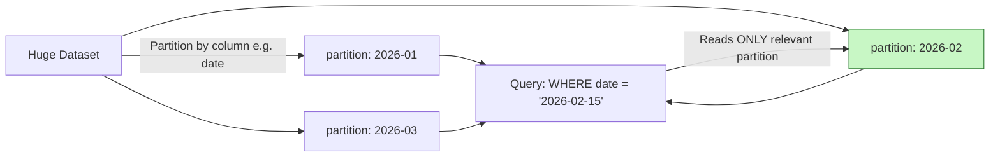
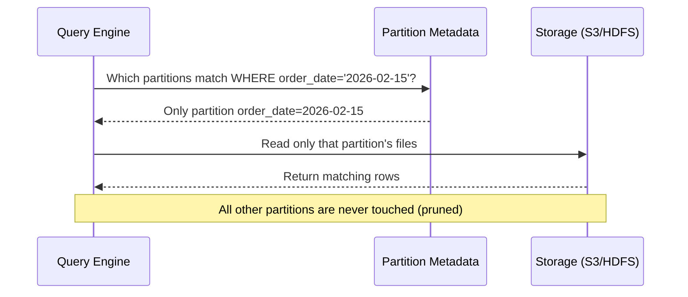
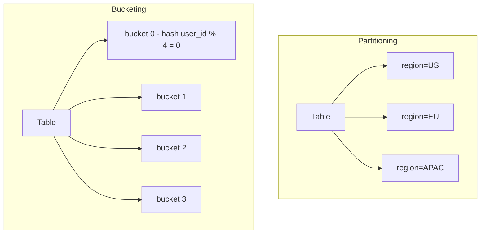
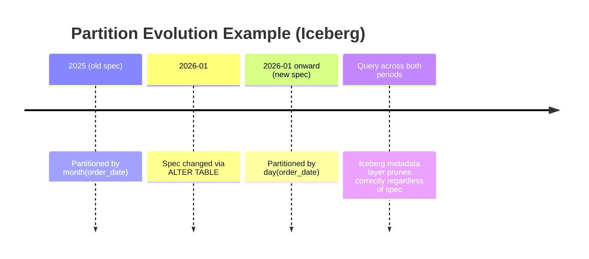
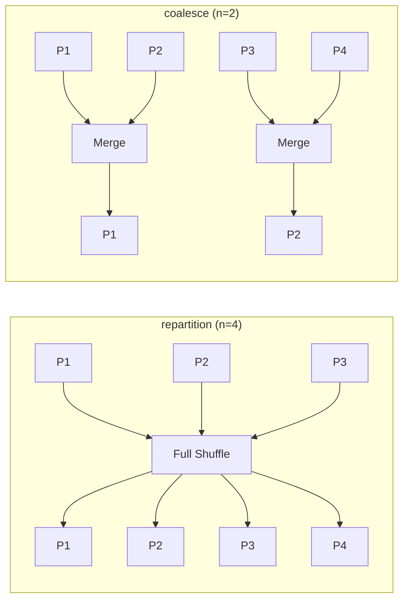
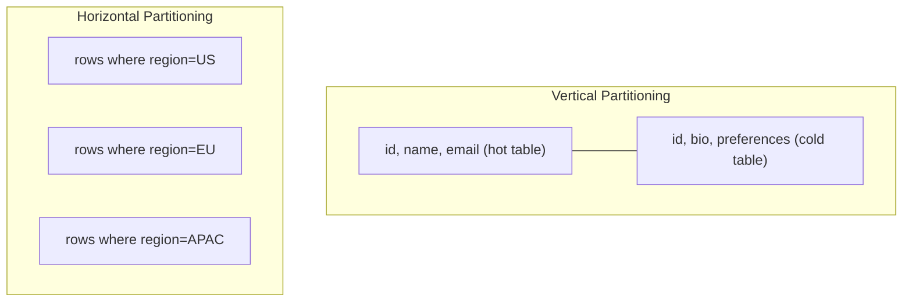
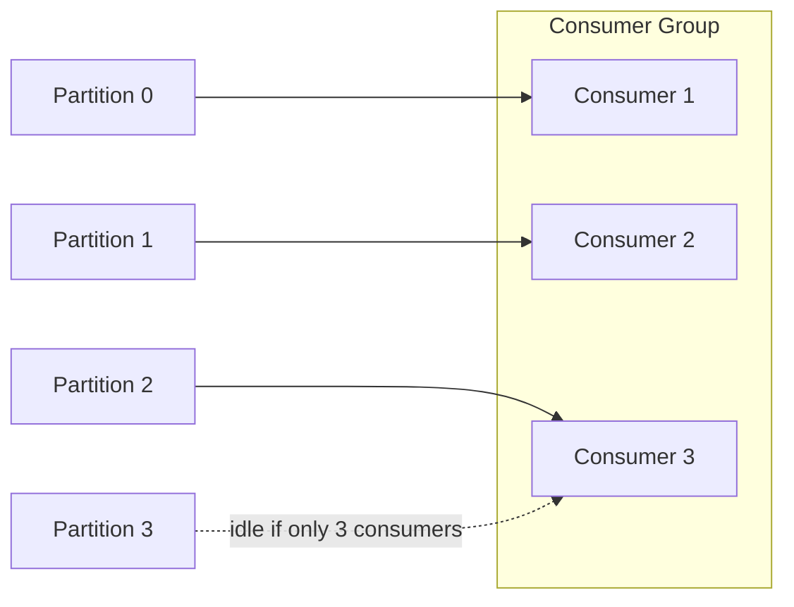

# Data Partitioning — Data Engineering Notes

> Reviewed, corrected, and expanded from original study notes. Includes definitions, examples, diagrams, and interview-style Q&A (conceptual + scenario/system design).

---

## Index

1. [Why Partitioning?](#1-why-partitioning)
2. [What is a Partition?](#2-what-is-a-partition)
3. [Partition Pruning](#3-partition-pruning)
4. [Partitioning vs Bucketing](#4-partitioning-vs-bucketing)
5. [Partition Key Selection](#5-partition-key-selection)
6. [Static vs Dynamic Partitioning](#6-static-vs-dynamic-partitioning)
7. [Partition Evolution (Apache Iceberg)](#7-partition-evolution-apache-iceberg)
8. [Compute-Side Partitioning: `repartition()` vs `coalesce()`](#8-compute-side-partitioning-repartition-vs-coalesce)
9. [Partitioning Strategies](#9-partitioning-strategies)
   - 9.1 [Horizontal vs Vertical Partitioning (concept)](#91-horizontal-vs-vertical-partitioning-concept)
   - 9.2 [Hash Partitioning](#92-hash-partitioning)
   - 9.3 [Range Partitioning](#93-range-partitioning)
   - 9.4 [List Partitioning](#94-list-partitioning)
   - 9.5 [Composite Partitioning](#95-composite-partitioning)
10. [The Small File Problem](#10-the-small-file-problem)
11. [Kafka Partitioning](#11-kafka-partitioning)
12. [Q&A — Conceptual](#12-qa--conceptual)
13. [Q&A — Scenario / System Design](#13-qa--scenario--system-design)

---

## 1. Why Partitioning?

When a dataset grows beyond what a single machine (or a single scan) can efficiently handle, two problems show up:

- **Read/scan cost** — every query has to read the *entire* dataset even if it only needs a small slice of it.
- **Processing cost** — a single machine or single task becomes a bottleneck; there's no way to split work across a cluster.

**Partitioning** solves this by splitting a large dataset into smaller, manageable chunks based on the values of one or more columns, and storing each chunk separately (typically as separate directories in a data lake, e.g., `s3://bucket/table/year=2026/month=07/`).

Benefits:
- **Partition pruning** — skip reading irrelevant data entirely.
- **Parallelism** — each partition can be read/processed independently across a distributed cluster.
- **Reduced shuffle** — if data is already partitioned on a join/aggregation key, expensive shuffles can sometimes be avoided.
- **Manageability** — easier to expire, archive, or reprocess data (e.g., "drop the partition for a specific day" instead of rewriting the whole table).



---

## 2. What is a Partition?

A **partition** is a logical (and usually physical) subdivision of a dataset, grouped by the value(s) of one or more columns, stored as a separate unit (directory/file group) so that it can be read, written, or dropped independently of the rest of the data.

Partitions can be created using different strategies:
- **By static value** (static partitioning)
- **By range of values** (range partitioning)
- **By discrete list of values** (list partitioning)
- **By hash of a value** (hash partitioning)
- Or a **combination** of the above (composite partitioning)

**Example (Hive/S3 layout):**
```
s3://sales-data/orders/
 ├── year=2025/
 │    ├── month=11/
 │    └── month=12/
 └── year=2026/
      ├── month=01/
      └── month=02/
```

---

## 3. Partition Pruning

**Partition pruning** is the query engine's ability to skip scanning partitions that cannot possibly contain data relevant to a query's filter conditions, based purely on partition metadata (not by opening and reading the actual files).

**Why it matters:**
- Directly reduces I/O — the single biggest cost driver in most big-data query engines (Spark, Athena, Presto/Trino, BigQuery).
- Reduces query latency and $ cost (e.g., Athena/BigQuery charge per GB *scanned*).
- Only works if:
  1. The table is partitioned on the column(s) actually used in the query's `WHERE` clause.
  2. The filter is a **static, sargable** predicate the engine can evaluate against partition metadata (e.g., `WHERE order_date = '2026-02-15'`), not something like `WHERE UPPER(order_date) = ...` or a filter on a derived/wrapped column, which can defeat pruning.

**Example:**
```sql
-- Table partitioned by order_date
SELECT * FROM orders WHERE order_date = '2026-02-15';
-- Engine reads ONLY the order_date=2026-02-15 partition directory,
-- ignoring every other day's data entirely.
```



---

## 4. Partitioning vs Bucketing

*(Not present in the original notes — added since it's frequently confused with partitioning.)*

| Aspect | Partitioning | Bucketing (a.k.a. Clustering) |
|---|---|---|
| Mechanism | Splits data into **separate directories** by column value | Splits data into a **fixed number of files** within a partition/table using a **hash of a column**, modulo bucket count |
| Cardinality fit | Best for **low-to-medium cardinality** columns | Best for **high cardinality** columns (e.g., `user_id`) |
| Directory structure | Creates new folders per value | No new folders — bucket = a physical file |
| Number of units | Grows dynamically with distinct values | **Fixed** at table creation (e.g., 256 buckets) |
| Primary benefit | Partition pruning (skip whole directories) | Efficient joins/aggregations (avoids shuffle when both tables bucketed the same way) & avoids small-file explosion from over-partitioning |
| Small file risk | High, if key has high cardinality | Low — bucket count is fixed and controlled |

**Rule of thumb:** Partition on low-cardinality columns used in filters (e.g., `date`, `region`, `country`). Bucket on high-cardinality columns used in joins/lookups (e.g., `user_id`, `customer_id`).



---

## 5. Partition Key Selection

Choosing the right partition key is one of the most important design decisions in a big-data system. Get it wrong and you either create a **small-file/metadata explosion** or **data skew / oversized partitions**.

**Guidelines:**
- ✅ Should be used in `WHERE` filters regularly (otherwise pruning never kicks in and partitioning adds overhead for no benefit).
- ✅ Should produce **evenly distributed** data across partition values.
- ❌ Avoid **very high cardinality** columns (e.g., `user_id`, `transaction_id`) as a *directory* partition key.
- ❌ Avoid **very low cardinality** columns (e.g., a boolean flag) as the *sole* partition key.

**Consequences of a bad choice:**

| Problem | Cause | Symptom |
|---|---|---|
| Small file problem / metadata overhead | Key has **too high** cardinality | Millions of tiny partitions/files; slow metadata listing; NameNode/Hive Metastore/S3 listing pressure |
| Oversized partitions / data skew | Key has **too low** cardinality | A few partitions become huge; parallelism suffers; those tasks become stragglers |
| Data skew | Values not evenly distributed (even with reasonable cardinality) | Some tasks take far longer than others (e.g., "Black Friday" partition 100x larger than a normal day) |
| No benefit | Key not used in filters | Extra write complexity, no pruning gain |

**Common good choices:** `date` / `event_date` (time-series data, naturally bounded cardinality, almost always filtered on), `region`/`country` (bounded, often filtered on), or a **coarser bucket** derived from a high-cardinality key (e.g., `customer_id % 100` as a secondary partition, combined with bucketing for the fine-grained key — see [Section 13, Q1](#13-qa--scenario--system-design)).

---

## 6. Static vs Dynamic Partitioning

### Static Partitioning
The partition value is **explicitly specified** by the user/job at write time.
```sql
INSERT INTO orders PARTITION (order_date='2026-02-15')
SELECT * FROM staging_orders WHERE order_date = '2026-02-15';
```
- Predictable, but requires the writer to know the exact partition value in advance — impractical when a single batch spans many partition values.

### Dynamic Partitioning
The partition value(s) are **derived automatically from the data itself** — Spark/Hive inspects the column values in each row and routes rows to the correct partition.
```sql
SET hive.exec.dynamic.partition.mode = nonstrict;
INSERT INTO orders PARTITION (order_date)
SELECT *, order_date FROM staging_orders;  -- order_date decides partition per row
```
- Convenient for backfills/multi-day loads, but riskier: a bug or bad data can silently create thousands of unwanted partitions ("partition explosion").

---

## 7. Partition Evolution (Apache Iceberg)

Traditional Hive-style partitioning **bakes the partition column into the physical data layout**. If business requirements change (e.g., you partitioned by `month` but now need `day`), you must **rewrite the entire table** — extremely expensive at petabyte scale, and it breaks all existing partition pruning until the rewrite completes.

**Apache Iceberg** (and similar modern table formats like Delta Lake, Apache Hudi) solve this with **partition evolution**:
- You can **change the partition spec going forward** without touching or rewriting existing data.
- Old data stays under the old partition layout; new data is written under the new layout.
- Iceberg tracks partition specs as **metadata**, and its query planner is spec-aware, so it can still prune correctly across both old and new layouts in the same table.

**Example:**
```sql
-- Table originally partitioned by month
ALTER TABLE orders ADD PARTITION FIELD day(order_date);
-- No rewrite needed. New writes use day-level partitioning.
-- Old files remain month-partitioned; Iceberg's metadata layer
-- handles pruning correctly across both.
```



---

## 8. Compute-Side Partitioning: `repartition()` vs `coalesce()`

While *storage-side* partitioning is about how data is laid out on disk, **compute-side partitioning** is about how data is split into in-memory partitions during Spark processing — this determines task parallelism.

| | `repartition(n)` | `coalesce(n)` |
|---|---|---|
| Shuffle? | **Full shuffle** across the cluster | **No full shuffle** — merges adjacent existing partitions |
| Can increase partitions? | Yes | **No** (only decreases; increasing with coalesce is a no-op / not supported properly) |
| Can decrease partitions? | Yes | Yes (its main use case) |
| Data distribution after | Even (random/hash-based redistribution) | Uneven — can leave few partitions doing most of the work |
| Cost | Expensive (network + disk I/O for shuffle) | Cheap (minimizes data movement) |
| Typical use | Fix data skew, increase parallelism, prep for wide operations, control output file *count* upward | Reduce output file count cheaply after a job, especially before writing (e.g., avoid small files) *when data isn't skewed* |

**Example:**
```python
# Job produced 5000 tiny files due to over-partitioned upstream data
df = df.coalesce(200)   # cheap, merges existing partitions
df.write.parquet("s3://bucket/output/")

# Job is skewed / needs more parallelism before a heavy join
df = df.repartition(400, "customer_id")   # full shuffle, evens things out
```



---

## 9. Partitioning Strategies

### 9.1 Horizontal vs Vertical Partitioning (concept)

- **Horizontal partitioning (a.k.a. sharding at the row level):** splits a table **by rows** — each partition/shard has the *same columns* but a *subset of rows*, grouped by a key's value (this is what Hive/S3/date-partitioning normally does).
- **Vertical partitioning:** splits a table **by columns** — e.g., splitting rarely-used or large columns (like a `bio_text` blob) into a separate physical table/file, joined back by a common key, to keep the "hot" columns compact and fast to scan.

Big-data lake partitioning (Hive-style `year=/month=/day=` directories) is a form of **horizontal partitioning**.



### 9.2 Hash Partitioning

Computes a hash of the partition key and assigns rows to a partition based on the hash value (typically `hash(key) % num_partitions`).

- The **same key always maps to the same partition**.
- Useful when:
  - The key has **very high cardinality** (so range/list partitioning would create too many small partitions).
  - Tables are **joined** on that key — co-locating matching keys in the same partition can avoid shuffles during joins.
- Downside: doesn't inherently support range-based pruning (e.g., "give me all orders in Q1" doesn't map cleanly to hash buckets).

**Example:** Kafka topic partitioning by `customer_id` — `partition = hash(customer_id) % num_partitions` ensures all events for a given customer land on the same partition (preserving per-customer ordering).

### 9.3 Range Partitioning

Partitions data based on **ranges of values** of the partition key — most common for time-series data.

**Example:** `year=2026/month=02/`, or a numeric range partition like `id_range=0-999999`.

- ✅ Great for pruning date-range queries (`WHERE order_date BETWEEN ...`).
- ❌ Can cause skew if data isn't evenly distributed across ranges (e.g., a viral sales day gets 50x normal volume).

### 9.4 List Partitioning

Partitions data based on an **explicit, discrete list of values** you define — not a computed range or hash.

**Example:** Partition orders by `region` where region ∈ `{US, EU, APAC, LATAM}` — each named value gets its own partition, and values can be grouped arbitrarily (e.g., `{CA, US} → 'north_america'`).

- ✅ Good when you have a known, bounded, meaningful set of categories.
- ❌ New/unexpected values need explicit handling (or a default/"other" bucket).

### 9.5 Composite Partitioning

Combines **two or more strategies**, typically a coarse partition plus a finer sub-partition or bucket.

**Example:** Partition by `range(order_date)` (yearly/monthly) **and then** `hash(customer_id)` bucketing within each date partition — gets date-based pruning *and* avoids high-cardinality small-file explosion from `customer_id`.

```
s3://orders/order_date=2026-02/customer_bucket=03/part-0000.parquet
s3://orders/order_date=2026-02/customer_bucket=07/part-0000.parquet
```

---

## 10. The Small File Problem

**What it is:** A situation where a dataset ends up split across a very large number of small files (often far below the storage/file-system's optimal block size — e.g., KBs instead of the ideal ~128MB–1GB per file for Parquet/ORC on S3/HDFS).

**Why it's a problem:**
- Each file requires a separate open/read/metadata call — massive overhead in listing, planning, and task scheduling (especially painful on S3, where listing/HEAD requests are rate-limited and billed).
- Spark/Hive creates one task per file (roughly), so thousands of tiny files create thousands of tiny tasks — task scheduling overhead dwarfs actual processing time.
- Metastore/catalog bloat (Hive Metastore, Glue Catalog) from tracking huge partition/file counts.

**Common causes:**
- Over-partitioning on a high-cardinality key.
- Many small streaming micro-batches each writing their own files.
- Highly parallel jobs (many tasks) writing output without a final consolidation step.

**How to avoid/fix it:**
1. **`coalesce()`** before writing, to merge into fewer, larger files.
2. Use **`repartition(n)`** by a sensible key before write if data is skewed (worth the shuffle cost to get uniform file sizes).
3. Set target file size configs (e.g., Spark's `spark.sql.files.maxRecordsPerFile`, or adaptive query execution `spark.sql.adaptive.coalescePartitions.enabled`).
4. Periodic **compaction jobs** — e.g., Iceberg/Delta Lake's `OPTIMIZE`/rewrite-data-files procedures merge small files in the background.
5. Choose a **coarser partition key** (avoid partitioning directly on high-cardinality columns — bucket instead, see [Section 4](#4-partitioning-vs-bucketing)).
6. For streaming ingestion, batch writes over a time/size window rather than writing every micro-batch immediately.

---

## 11. Kafka Partitioning

*(Not present in original notes — added since it's asked about directly below.)*

A Kafka **topic** is split into **partitions**, each of which is an ordered, append-only log. Partitioning in Kafka drives both **throughput** and **consumer scalability**:

- **Parallelism is bounded by partition count.** Within a consumer group, each partition is consumed by **at most one consumer** at a time. So:
  - If a topic has **P** partitions, you can have **at most P active consumers** in a single consumer group usefully processing in parallel.
  - More consumers than partitions → extra consumers sit **idle**.
  - Fewer consumers than partitions → some consumers handle **multiple partitions** (fine, just less parallelism).
- **Ordering is only guaranteed within a partition**, not across the whole topic. This is why a key (e.g., `customer_id`) is typically hashed to choose the partition — ensuring all events for that key stay in order.
- **Choosing partition count matters upfront** because:
  - Increasing partitions later is possible but **breaks key-to-partition mapping** for existing keys (since `hash(key) % old_count` ≠ `hash(key) % new_count`), which can break ordering guarantees for that key going forward.
  - Decreasing partitions is **not supported** at all without recreating the topic.



---

## 12. Q&A — Conceptual

**Q1: What is partition pruning and why does it matter?**
A: It's the query engine's ability to skip reading partitions that can't match the query's filter, based on partition metadata alone. It matters because it directly cuts I/O — which is usually the dominant cost in big-data query performance and, in engines like Athena/BigQuery, directly reduces $ cost (billed per GB scanned).

**Q2: What's the difference between partitioning and bucketing?**
A: Partitioning splits data into separate directories by (typically low-cardinality) column values, enabling pruning of whole directories. Bucketing splits data into a **fixed number** of hashed files, better suited to high-cardinality columns, primarily to speed up joins/aggregations and avoid small-file explosion. See [Section 4](#4-partitioning-vs-bucketing).

**Q3: How do you choose a good partition key?**
A: Pick a column that (a) is regularly used in query filters, (b) has moderate, bounded cardinality, and (c) distributes data evenly. Common choices: `date`, `region`. Avoid very high-cardinality columns (e.g., `user_id`) as a direct partition key — bucket those instead. See [Section 5](#5-partition-key-selection).

**Q4: What is the small file problem and how do you avoid it?**
A: Millions of tiny files causing high listing/scheduling overhead relative to actual data volume. Avoid it via coalescing before write, compaction jobs (Iceberg/Delta `OPTIMIZE`), choosing coarser partition keys, and batching streaming writes. See [Section 10](#10-the-small-file-problem).

**Q5: Difference between `repartition()` and `coalesce()` in Spark?**
A: `repartition()` does a full shuffle and can increase or decrease partition count with even redistribution; `coalesce()` avoids a full shuffle by merging existing partitions and can only decrease count, potentially leaving data unevenly distributed. See [Section 8](#8-compute-side-partitioning-repartition-vs-coalesce).

**Q6: How does Kafka partitioning affect consumer scalability?**
A: Parallelism within a consumer group is capped by the number of partitions — one partition can only be actively read by one consumer in the group at a time. Too few partitions limits scale-out; too many partitions relative to consumers just means each consumer handles more than one (not necessarily bad), but you can't exceed partition count in useful parallel consumers. See [Section 11](#11-kafka-partitioning).

---

## 13. Q&A — Scenario / System Design

**Q1: You have a 500GB table queried mostly by `customer_id` with 10M unique values — how would you partition it?**
A: `customer_id` alone is far too high-cardinality for directory-style partitioning (would create millions of tiny partitions → small-file problem). Better approach:
- If queries mostly filter by a **date** too (common in practice), partition by `date` (coarse, range) and **bucket** by `hash(customer_id)` within each date partition (e.g., 64–256 buckets) — composite partitioning (see [9.5](#95-composite-partitioning)).
- If there's genuinely no date/other low-cardinality dimension, skip directory partitioning altogether and rely purely on **bucketing/clustering by `hash(customer_id) % N`** (e.g., using Iceberg's bucket transform), so lookups by `customer_id` still prune to a small number of files without exploding partition count.

**Q2: A Spark job is producing thousands of tiny output files — how do you fix it?**
A: Diagnose first — check if it's from an over-partitioned upstream shuffle, a high-cardinality partition-by-column write, or many small streaming batches. Fixes: `coalesce(n)` before write (cheap) or `repartition(n)` if data is skewed and you want an even spread (accept the shuffle cost); enable `spark.sql.adaptive.coalescePartitions.enabled`; set a target file size; if using Iceberg/Delta, schedule periodic compaction (`OPTIMIZE`/rewrite-data-files) as a longer-term fix rather than tuning every job.

**Q3: One partition in your Spark job is taking 10x longer than others — how do you diagnose and fix this?**
A: This is **data skew**. Diagnose via the Spark UI: look at the stage's task duration distribution / shuffle read size per task — a single straggler task with disproportionate input size confirms skew. Fixes:
- **Salting**: add a random suffix to the skewed key to spread it across multiple partitions, then aggregate in two phases.
- **Broadcast join** instead of shuffle join if the skew is on a join key and one side is small enough to broadcast.
- Use Spark's **Adaptive Query Execution (AQE)** skew join optimization (`spark.sql.adaptive.skewJoin.enabled`), which auto-splits skewed partitions.
- Repartition explicitly on a better-distributed key or composite key.

**Q4: Your Athena costs have spiked — how would you investigate and reduce data scanned?**
A: Athena bills per GB scanned, so investigate: (1) check recent query patterns/CloudWatch/`information_schema` for queries with full-table scans (missing partition filters, or filters on non-partition columns); (2) verify the table is actually partitioned appropriately and that queries filter on the partition column with a sargable predicate (not wrapped in a function); (3) check file format — ensure columnar formats (Parquet/ORC) with compression are used, not raw CSV/JSON, since columnar formats let Athena skip unneeded columns too; (4) check for small-file sprawl inflating scan overhead; (5) consider adding partition projection (avoids expensive `MSCK REPAIR`/Glue crawler overhead) and, if queries are ad hoc and inconsistent, consider a **result/materialized view** or a cheaper serving layer for the hottest query patterns.

**Q5: What would you do if the partition key needs to change after the table already has petabytes of data?**
A: With legacy Hive-style tables, this typically requires a **full backfill/rewrite** — expensive, and needs careful coordination (dual-write period, or batch-rewrite with a cutover, validated with row-count/checksum reconciliation). Where possible, this is exactly the situation to prefer **Iceberg/Delta Lake**, whose partition evolution lets you change the partition spec **going forward with zero rewrite** of historical data (see [Section 7](#7-partition-evolution-apache-iceberg)). If already on Hive and a migration isn't immediately possible, consider migrating the table format itself before changing partitioning again.

**Q6: How does Iceberg's partition evolution solve a real production problem Hive can't?**
A: In Hive, partitioning is physically encoded in the directory layout, so changing the partition spec (e.g., `month` → `day`) requires rewriting **all** existing data to the new layout — often infeasible at scale, and it breaks pruning during the transition. Iceberg decouples the partition spec from physical layout via metadata: old data stays under the old spec, new writes use the new spec, and Iceberg's planner is spec-aware so queries prune correctly across the boundary — no downtime, no rewrite, no broken pruning.

**Q7: How do you decide the number of Kafka partitions upfront? What happens if you get it wrong?**
A: Base it on target throughput ÷ per-partition throughput (empirically measured, often a few MB/s/partition), and on the maximum expected consumer parallelism you'll ever need (partitions are the ceiling on parallel consumers in a group) — usually with some headroom for growth, since you can add partitions later more easily than remove them. Getting it wrong: too few caps scale-out and can bottleneck consumers; too many adds broker overhead (more file handles, longer leader-election/rebalance times) with limited benefit. Adding partitions later changes `hash(key) % partitions` for existing keys, which can break per-key ordering guarantees going forward — so it's not a fully free fix.

**Q8: How would you design a partitioning strategy for a multi-tenant data platform serving different query patterns per team?**
A: Start from the query patterns, not a single "correct" scheme: (1) identify the dominant filter dimensions per consuming team (e.g., analytics team filters by date+region, ML team pulls by `customer_id` ranges); (2) use a **composite** partition/bucket scheme that serves the most common pattern (often date-based) as the primary partition, with bucketing on the secondary high-cardinality access pattern; (3) consider **per-tenant tables or partition-by-tenant-id** if tenants have very different sizes/SLAs, to isolate noisy neighbors; (4) expose curated, purpose-built views/marts per team on top of a shared raw layer rather than trying to make one physical layout optimal for everyone; (5) leverage a table format (Iceberg) so the layout can evolve as query patterns shift.

**Q9: Trade-offs between partitioning cost (write-side complexity, small files) vs query cost (scan cost) — how do you decide?**
A: More partitioning granularity generally **reduces query-side scan cost** (finer pruning) but **increases write-side overhead** (more files, more metadata, higher small-file risk, more complex writers). The decision should be driven by actual query patterns: if most queries filter tightly on a column, finer partitioning on it pays off; if writes are frequent/small (e.g., streaming), over-partitioning will hurt more than it helps. In practice: partition coarse enough to keep files reasonably sized (rule of thumb: aim for partitions with 100s of MBs to low GBs of data, files ~128MB–1GB), and use bucketing/compaction to handle the finer-grained access patterns without fragmenting the physical layout.

**Q10: How do you handle partition strategy changes in a live production pipeline with minimal downtime/reprocessing?**
A: Prefer a table format with partition evolution (Iceberg/Delta) so no reprocessing of history is required at all. If stuck with Hive-style tables: (1) create a new table with the new partition spec, (2) dual-write to both old and new tables for a transition window, (3) backfill history into the new table via a batch job (throttled to avoid resource contention with production), (4) validate via reconciliation (row counts, checksums, sampled diffs), (5) cut over readers to the new table, (6) decommission the old table after a safety window. Feature-flag or config-driven table names in downstream jobs make the cutover a config change rather than a code deploy.

**Q11: How does partitioning strategy interact with data governance/compliance requirements (e.g., regional data residency)?**
A: Partitioning by **region/country** (a list or range partition) can directly support residency requirements — e.g., storing `region=EU` partitions in an EU-only bucket/cluster, enforcing physical data locality per regulation (GDPR-style requirements). This also simplifies **right-to-be-forgotten**/deletion requests when combined with a secondary key, since compliance deletes can target specific partitions/files rather than scanning the whole table. It can, however, conflict with an "ideal" performance-driven partition key (e.g., `date`) — a common resolution is composite partitioning: `region` as the primary (governance-driven, coarse) partition, with `date` or a bucketed key as the secondary dimension for query performance.

---

*Notes reviewed and structured for quick revision — use the [Index](#-index) above to jump directly to any topic.*
