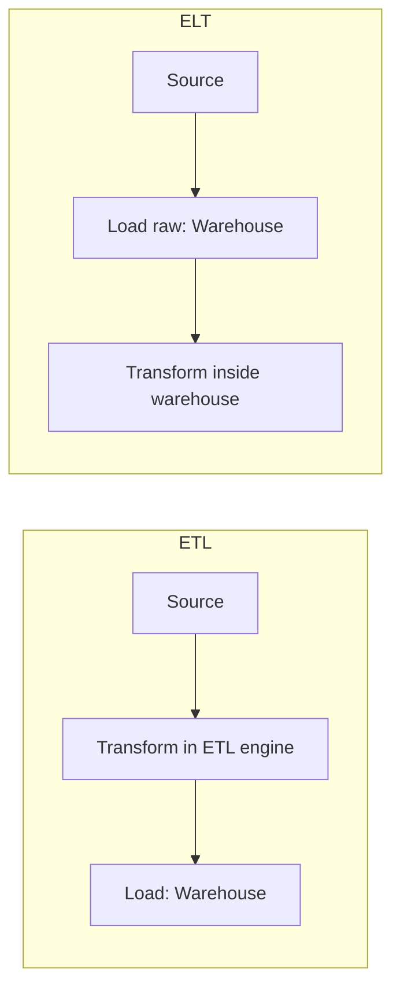

# Data Modeling & Data Warehousing — Consolidated Revision Notes

---

## 📌 Contents
1. [Data Modeling Fundamentals](#1-data-modeling-fundamentals)
2. [Normalization & Denormalization](#2-normalization--denormalization)
3. [OLTP vs. OLAP](#3-oltp-vs-olap)
4. [ETL vs. ELT](#4-etl-vs-elt)
5. [Dimensional Modeling: Facts & Dimensions](#5-dimensional-modeling-facts--dimensions)
6. [Star vs. Snowflake Schema](#6-star-vs-snowflake-schema)
7. [Surrogate Keys in a Warehouse](#7-surrogate-keys-in-a-warehouse)
8. [Slowly Changing Dimensions (SCD)](#8-slowly-changing-dimensions-scd)
9. [Special Dimension Patterns](#9-special-dimension-patterns)
10. [Warehouse Architecture: Top-Down vs. Bottom-Up & Data Marts](#10-warehouse-architecture-top-down-vs-bottom-up--data-marts)
11. [Row vs. Columnar Storage](#11-row-vs-columnar-storage)
12. [Data Vault Modeling (Advanced)](#12-data-vault-modeling-advanced)
13. [Modeling in Modern Data Lakes / Lakehouses](#13-modeling-in-modern-data-lakes--lakehouses)
14. [One-Page Glossary](#14-one-page-glossary)

---

## 1. Data Modeling Fundamentals

### 1.1 What Is Data Modeling?
**Definition:** The process of designing how data is organized, stored, and related — a blueprint created *before* building the actual database.

**Interview line:** *"A poorly modeled database leads to duplicate/inconsistent data and slow, painful-to-change queries — modeling upfront is what prevents that."*

### 1.2 The Three Levels of Data Models

| Level          | Captures                                                                                  | Example                                                       |
|----------------|-------------------------------------------------------------------------------------------|---------------------------------------------------------------|
| **Conceptual** | Big picture — entities & relationships, zero technical detail. For business stakeholders. | "A Customer places an Order."                                 |
| **Logical**    | Attributes, data types, keys, relationships — still database-agnostic.                    | `Customer(customer_id, name, email)`                          |
| **Physical**   | Actual implementation, specific to a DB engine — exact types, indexes, partitioning.      | `CREATE TABLE customer (customer_id BIGINT PRIMARY KEY, ...)` |

**Memory hook:** Conceptual = *what*, Logical = *how it's structured*, Physical = *how it's built*.

### 1.3 Entities, Attributes & Relationships (ER Modeling)
- **Entity** — a real-world "thing" (`Customer`, `Product`) → becomes a **table**.
- **Attribute** — a property of an entity (`name`, `email`) → becomes a **column**.
- **Relationship** — how two entities connect (`Customer` *places* `Order`).

### 1.4 Keys

| Key Type             | Meaning                                             | Example                  |
|----------------------|-----------------------------------------------------|--------------------------|
| **Primary Key (PK)** | Uniquely identifies each row; no duplicates/nulls   | `customer_id`            |
| **Candidate Key**    | Any column(s) that *could* be the PK — you pick one | `customer_id` or `email` |
| **Foreign Key (FK)** | References another table's PK — the link mechanism  | `customer_id` in `Order` |
| **Composite Key**    | PK made of 2+ columns combined                      | `(order_id, product_id)` |
| **Natural Key**      | Based on real business data                         | `email`                  |
| **Surrogate Key**    | Artificial, system-generated, no business meaning   | `customer_id = 10234`    |

**Natural vs. surrogate trade-off:** natural keys are meaningful but can change or collide across systems; surrogate keys are stable and simple but meaningless on their own. **Surrogate keys are strongly preferred** in most warehouse designs — expanded in [Section 7](#7-surrogate-keys-in-a-warehouse).

### 1.5 Relationship Types

| Type    | Meaning                             | Example                        |
|---------|-------------------------------------|--------------------------------|
| **1:1** | One row in A ↔ exactly one row in B | `Employee` ↔ `EmployeeBadge`   |
| **1:N** | One row in A ↔ many rows in B       | One `Customer` → many `Orders` |
| **N:N** | Many ↔ many                         | `Students` ↔ `Courses`         |

**Resolving N:N:** can't be represented directly — needs a **junction/bridge table** holding FKs to both sides, turning one N:N into two 1:N relationships:
```
Student(student_id, ...)
Course(course_id, ...)
Enrollment(student_id, course_id, enrollment_date)   -- junction table
```

---

## 2. Normalization & Denormalization

### 2.1 Why Normalize
**Definition:** Organizing tables to reduce redundancy and prevent **anomalies**:

| Anomaly    | What goes wrong                                                               |
|------------|-------------------------------------------------------------------------------|
| **Update** | Same fact duplicated across rows — update one, forget another → contradiction |
| **Insert** | Can't add data without unrelated data also being present                      |
| **Delete** | Deleting one row wipes out unrelated info you wanted to keep                  |

### 2.2 Normal Forms (1NF → 3NF)

**Rule of thumb for all three: "the key, the whole key, and nothing but the key."**

| Form    | Rule                                                                                              | Fixes                                                                 |
|---------|---------------------------------------------------------------------------------------------------|-----------------------------------------------------------------------|
| **1NF** | Every column holds a single atomic value; each row unique                                         | Repeating groups in one cell (e.g., `"9876543210, 9123456780"`)       |
| **2NF** | Must be 1NF + every non-key column depends on the **whole** PK (relevant only for composite keys) | Partial dependency                                                    |
| **3NF** | Must be 2NF + no non-key column depends on **another non-key column** (no transitive dependency)  | e.g., `customer_city` depending on `customer_name`, not on `order_id` |

**Worked example** — flatten `Order(OrderID, ProductID, ProductName, ProductPrice, CustomerName, CustomerCity)`:
- 2NF violation: `ProductName`/`ProductPrice` depend only on `ProductID`, not the full `(OrderID, ProductID)` key → split into `Product`.
- 3NF violation: `CustomerCity` depends on `CustomerName`, not `OrderID` → split into `Customer`.
- Result: `Order`, `Product`, `Customer` — three tables, each fact stored exactly once.

*(BCNF exists as a stricter edge-case version of 3NF — rarely needed for everyday modeling, worth a one-line mention if asked.)*

### 2.3 Denormalization — The Deliberate Trade-off
**Definition:** Intentionally reintroducing redundancy (merging tables back together) to make reads faster, at the cost of storage duplication and more complex updates.

**Why:** highly normalized data needs many `JOIN`s — great for transactional consistency, slow for large-scale analytics.

**Rule of thumb:** normalize for **transactional** systems (accuracy), denormalize for **analytical** systems (speed) → leads directly into OLTP vs. OLAP.

**Interview line:** *"Normalization and denormalization aren't 'good vs. bad' — they're opposite optimizations for opposite workloads: write-safety vs. read-speed."*

---

## 3. OLTP vs. OLAP

|                         | OLTP (Online Transaction Processing)                                                          | OLAP (Online Analytical Processing)                                                                               |
|-------------------------|-----------------------------------------------------------------------------------------------|-------------------------------------------------------------------------------------------------------------------|
| **Purpose**             | Run the business day-to-day                                                                   | Analyze the business over time                                                                                    |
| **Example systems**     | Banking app, e-commerce checkout                                                              | Sales dashboard, data warehouse                                                                                   |
| **Data shape**          | Highly normalized                                                                             | Denormalized (dimensional modeling)                                                                               |
| **Typical queries**     | "Insert this order," "Update this address"                                                    | "Total sales by region last quarter?"                                                                             |
| **Read vs. write**      | Frequent small writes                                                                         | Fewer, large, complex reads                                                                                       |
| **Concurrency/latency** | High concurrency, millisecond latency, row-oriented storage (fetch a full record in one read) | High throughput reads, latency in seconds–minutes, columnar storage (Parquet/Delta) for compression + I/O savings |
| **Priority**            | Low latency + write integrity                                                                 | High-throughput read performance                                                                                  |

**Memory hook:** OLTP = the cash register (recording each sale). OLAP = the year-end sales report (analyzing all sales together).

**Interview line — "why not just run analytics on the production DB?"**: *"It would compete for locks/resources with live transactions, and the normalized schema makes analytical aggregations slow and join-heavy — hence a separate OLAP warehouse, fed by ETL/ELT or CDC."*

*(For the deeper mechanics — MVCC, indexing, ACID, data-skipping stats, HTAP/Lakebase — see your separate OLTP vs. OLAP deep-dive notes; this section stays at the modeling-relevant level.)*

---

## 4. ETL vs. ELT

**Definition:** both move data from source systems into a warehouse — the difference is **where transformation happens**.

- **ETL (Extract → Transform → Load)** — transform in a separate processing engine, then load the already-clean result.
- **ELT (Extract → Load → Transform)** — load raw/near-raw first, transform *inside* the warehouse using its own compute (SQL, dbt).



**Why ELT became popular:** modern cloud warehouses (Snowflake, BigQuery, Databricks SQL) have cheap, elastic, massively parallel compute — cheaper/simpler to push raw data in and transform there than maintain a separate transformation cluster. **dbt** is built entirely around this pattern.

**Trade-off to name explicitly:** ELT trades "cheap elastic warehouse compute" for "raw data stored longer → more storage cost, needs strong governance on the raw zone" — not simply "ELT is newer/better."

**Interview line:** *"ETL cleans it in the truck before it enters the warehouse; ELT dumps it at the loading dock and cleans it with the warehouse's own machinery."*

---

## 5. Dimensional Modeling: Facts & Dimensions

**Definition:** The standard approach (Ralph Kimball) for OLAP/warehouse schemas — built from two table types:
- **Fact table** — measurable, quantitative events (`sales_amount`, `quantity_sold`); many rows, mostly FKs.
- **Dimension table** — descriptive context: who/what/where/when (`Customer`, `Product`, `Date`, `Store`); fewer rows, many descriptive columns.

**Why denormalize for OLAP:** every extra join to reassemble normalized data costs more at millions-of-rows scale — dimensional models flatten dimension attributes so a typical query joins a fact table to only a handful of dimensions, not a deep normalized chain.

### 5.1 Grain
**Definition:** exactly what **one row** in the fact table represents — the single most important fact-table design decision, since it drives everything else.
> Is one row "one receipt line item," "one entire order," or "total daily sales per store"? Each is valid — must be decided clearly and consistently.

### 5.2 Types of Fact Tables

| Type                      | Captures                                                                     | Example                                           |
|---------------------------|------------------------------------------------------------------------------|---------------------------------------------------|
| **Transactional**         | One row per individual event (finest grain)                                  | One row per sale                                  |
| **Periodic Snapshot**     | One row per entity per regular interval, even if nothing changed             | End-of-day account balance                        |
| **Accumulating Snapshot** | One row per process, **updated in place** as it moves through stages         | Order row updated: placed → shipped → delivered   |
| **Factless Fact Table**   | No numeric measures — just FKs recording that an event/relationship occurred | One row per class attendance (no "amount" to sum) |

### 5.3 Types of Measures (Facts)

| Type              | Summable across...                              | Example                                                                 |
|-------------------|-------------------------------------------------|-------------------------------------------------------------------------|
| **Additive**      | Any dimension                                   | `sales_amount`                                                          |
| **Semi-additive** | Some dimensions, not others (commonly not time) | `account_balance` — can sum across accounts on one day, not across days |
| **Non-additive**  | Nothing — must be recalculated                  | `profit_margin_%`, `unit_price`                                         |

**Interview line (favorite scenario question):** *"A user sums `account_balance` across a month and gets a nonsensical number — why, and how do you fix reporting? → Balance is semi-additive over time; report the last/average balance, not `SUM()`, when aggregating over the time dimension."*

---

## 6. Star vs. Snowflake Schema

**Star Schema** — one central fact table, directly connected to fully **denormalized** (flat) dimension tables.
```
        Date
          |
Product — Sales_Fact — Store
          |
       Customer
```

**Snowflake Schema** — dimension tables further normalized into sub-dimensions (`Product` → `Category` → `Department`).
```
Product → Category → Department
```

|                         | Star                             | Snowflake                                                                      |
|-------------------------|----------------------------------|--------------------------------------------------------------------------------|
| Dimension structure     | Flat, denormalized               | Normalized into sub-tables                                                     |
| Joins per query         | Fewer — simpler, faster          | More — extra hops                                                              |
| Storage                 | Slightly more (redundant values) | Slightly less                                                                  |
| Ease for business users | Easier — one hop                 | Harder — multiple hops                                                         |
| Typical use             | Most BI/reporting warehouses     | Very large, high-cardinality dimensions where storage/consistency matters more |

**Interview line — "why not always snowflake, since it removes redundancy?"**: *"Extra joins hurt query performance, and columnar compression in modern warehouses already squashes a star schema's redundant-storage cost to almost nothing — so the storage argument for snowflaking has weakened. Star is the default; snowflake is the exception."*

---

## 7. Surrogate Keys in a Warehouse

**Definition:** a warehouse-generated, meaningless key (usually an auto-incrementing integer) used **instead of** the source system's natural/business key.

**Why surrogate keys, specifically in a warehouse (beyond the general natural-vs-surrogate trade-off in 1.4):**
1. **Enables SCD** — multiple warehouse rows can represent the same real-world entity over time (e.g., a customer who moved), each with a different surrogate key, while the natural key stays constant.
2. **Insulates from source-system changes** — ID format changes, system merges, or ID reuse upstream don't affect the warehouse.
3. **Performance** — a small integer joins faster than a long natural/composite key.
4. **Multi-source integration** — two source systems might both use `CustomerID = 1001` for *different* people; surrogate keys prevent collisions when merging.

**Interview line:** *"Natural key answers 'who is this in the real world'; surrogate key answers 'which version of this row am I looking at in warehouse history.' You need both — and reason #1 (SCD) is the one that genuinely can't be solved any other way."*

---

## 8. Slowly Changing Dimensions (SCD)

**Definition:** strategies for handling changes to dimension attribute values over time (a customer moves city, a product gets reclassified).

| Type                        | Strategy                                                                    | History kept?                                         |
|-----------------------------|-----------------------------------------------------------------------------|-------------------------------------------------------|
| **Type 0**                  | Never changes                                                               | N/A — fixed at load                                   |
| **Type 1**                  | Overwrite old value                                                         | None                                                  |
| **Type 2**                  | New row + expire old row (`effective_date`/`end_date`/`is_current`)         | Full — **the most-asked type**                        |
| **Type 3**                  | New column for previous value (`current_city`/`previous_city`)              | Limited — only last value                             |
| **Type 4**                  | Move history to a **separate history table**; main table keeps current only | Full, but decoupled from main table for speed         |
| **Type 6** *(hybrid 1+2+3)* | Overwrite + new row + previous-value column combined                        | Full + easy current-vs-previous comparison in one row |

### Worked Example — SCD Type 2 (know this cold)
1. New source data for `CustomerID = 1001`: `City = Manchester` (was `London`).
2. ETL/ELT compares incoming row to the **current** row for that natural key.
3. Difference detected on a tracked attribute (`City`).
4. **Expire** the existing row: `end_date = today`, `is_current = false`.
5. **Insert** a new row: new **surrogate key**, `City = Manchester`, `start_date = today`, `end_date = NULL`, `is_current = true`.
6. Historical fact records still point to the **old** surrogate key (correctly showing "London" as of that sale date); new facts point to the new surrogate key.

**Interview line:** *"This is exactly why surrogate keys matter — a natural key can't have two 'current' rows without ambiguity, but two different surrogate keys can both legitimately map to the same natural key across time."*

---

## 9. Special Dimension Patterns

*(Signal "I've actually built dimensional models" — tie each to the problem it solves, don't memorize as isolated vocabulary.)*

| Pattern                     | Definition                                                                                                    | Example                                                                                                                               |
|-----------------------------|---------------------------------------------------------------------------------------------------------------|---------------------------------------------------------------------------------------------------------------------------------------|
| **Conformed Dimension**     | Shared, identically-structured dimension used across **multiple fact tables/marts**                           | Same `DIM_DATE`/`DIM_CUSTOMER` used by `FACT_SALES` and `FACT_SUPPORT_TICKETS` — enables cross-mart reporting                         |
| **Late-Arriving Dimension** | A fact arrives **before** its dimension record exists                                                         | Sale arrives for a new customer not yet in `DIM_CUSTOMER` → insert a placeholder/inferred row, update in place once real data arrives |
| **Degenerate Dimension**    | Dimension-like value stored **directly in the fact table** — no descriptive attributes worth a separate table | `OrderNumber`/`InvoiceNumber`                                                                                                         |
| **Junk Dimension**          | One table grouping several small, unrelated, low-cardinality flags                                            | `IsGiftWrapped`, `PaymentType`, `IsReturned` combined into `DIM_ORDER_JUNK`                                                           |
| **Role-Playing Dimension**  | **One physical table** used multiple times in the same fact table for different purposes                      | `DIM_DATE` joined 3x as `OrderDateKey`, `ShipDateKey`, `DeliveryDateKey`                                                              |

**Worked example — handling a late-arriving dimension:**
1. Fact record for `CustomerID = 2050` arrives; `DIM_CUSTOMER` lookup misses.
2. Insert a **placeholder row** with the known key + inferred/"Unknown" attributes, flagged `is_inferred_member = true`.
3. Fact loads normally, pointing to the placeholder's surrogate key.
4. When the real record arrives, **update the placeholder in place** (one of the few cases where updating a dimension row — not SCD-versioning it — is standard practice); since the fact already points to the correct surrogate key, no re-linking needed.

**Interview line:** *"Role-playing and junk dimensions especially come up in 'design a schema for X' whiteboard exercises — they're the fastest way to signal real dimensional-modeling experience, not textbook knowledge."*

---

## 10. Warehouse Architecture: Top-Down vs. Bottom-Up & Data Marts

Two competing philosophies for building the **whole warehouse**, not just one schema.

|                         | Top-Down (Inmon)                                                      | Bottom-Up (Kimball)                                                  |
|-------------------------|-----------------------------------------------------------------------|----------------------------------------------------------------------|
| **Starting point**      | One centralized, normalized **Enterprise Data Warehouse (EDW)** first | Individual **dimensional data marts** first, per business process    |
| **Data marts**          | Derived *from* the EDW afterward                                      | Built directly, unified later via **conformed dimensions**           |
| **Time to first value** | Slower — large upfront design                                         | Faster — a single mart can go live quickly                           |
| **Consistency risk**    | Low — single source of truth from day one                             | Higher — marts must discipline conformed-dimension use or they drift |
| **Best for**            | Large enterprises needing strict centralized governance               | Teams needing fast, iterative, process-by-process delivery           |

**Memory hook:** Top-down = "design the whole house, then furnish each room." Bottom-up = "furnish each room well with the same style of furniture (conformed dimensions) so it all matches later."

**Data Mart:** a smaller, subject-specific subset of the warehouse (Sales, Finance, HR), typically star-schema shaped, scoped to just what one business area needs. It can be **derived from** the EDW (top-down) or **built directly** and unified later (bottom-up) — a data mart's existence doesn't determine which philosophy you're following; direction/sequencing does.

**Interview line:** *"Most modern cloud-native warehouses — dbt-driven, Kimball-style marts on Snowflake/BigQuery/Databricks — lean bottom-up in practice, though regulated/enterprise contexts still sometimes favor top-down governance-first approaches."*

---

## 11. Row vs. Columnar Storage

|                     | Row-Oriented                             | Columnar                                             |
|---------------------|------------------------------------------|------------------------------------------------------|
| **Layout**          | All columns of one row stored together   | All values of one column stored together             |
| **Best for**        | OLTP — read/write a whole record at once | OLAP — aggregate/scan a few columns across many rows |
| **Compression**     | Weaker (mixed types together)            | Much stronger (same type/similar values together)    |
| **Example engines** | PostgreSQL, MySQL                        | Parquet, ORC, Redshift, BigQuery, Snowflake          |

**Why columnar wins for analytics — step by step:**
1. `SELECT AVG(sales_amount) FROM fact_sales` only needs the `sales_amount` column.
2. **Row store:** must still read every full row (all columns) from disk, then discard unneeded ones — wasted I/O.
3. **Columnar store:** reads only that column's data block — far less I/O, better compression (same data type together), and enables **vectorized execution** (processing whole column batches at once).

**Interview line:** *"Row store is optimized to fetch everything about one thing fast; columnar is optimized to fetch one thing about everything fast. This is exactly why Parquet underlies Delta Lake/Iceberg — analytical queries scan a handful of columns across huge tables, precisely the case columnar storage is built for."*

---

## 12. Data Vault Modeling (Advanced)

**Definition:** an alternative warehouse modeling approach (popular in large enterprises) optimized for **flexibility to change** and **full history/auditability**, built from three components:

- **Hub** — unique list of a core business concept + surrogate key (e.g., `Hub_Customer`: `customer_id`, business key).
- **Link** — relationships/transactions between hubs (e.g., `Link_Order` connecting `Hub_Customer` and `Hub_Product`).
- **Satellite** — descriptive attributes + their history for a hub or link (e.g., `Sat_Customer_Details`: name/address, full change history).

**Why it exists:** separates **identity** (hubs), **relationships** (links), and **descriptive detail** (satellites) — new sources/changed business rules can be added without redesigning existing tables, unlike star schemas which can require significant rework when the business changes.

**Interview line:** *"Data Vault trades query-time simplicity (more joins than a star schema) for structural resilience to change — it's the right call when the business/source landscape is expected to keep shifting, not for a stable, BI-facing reporting layer."*

---

## 13. Modeling in Modern Data Lakes / Lakehouses

With cloud lakehouses (Delta Lake, Iceberg), modeling philosophy has shifted:

- **Medallion Architecture** — Bronze (raw, as-is) → Silver (cleaned/validated/lightly modeled) → Gold (fully modeled, often dimensional/star-schema-style, business-ready). *(Full detail in your Databricks lakehouse notes.)*
- **One Big Table (OBT) / Wide Table** — instead of separate fact + dimension tables, flatten everything into one big denormalized table. Trades redundancy/storage for maximum query simplicity/speed — feasible now because cloud storage is cheap and columnar formats compress repeated values very efficiently.
- **Schema-on-read vs. schema-on-write** — lakehouses often ingest raw data without a strict upfront schema (schema-on-read), applying real structure later in Silver/Gold, rather than modeling strictly upfront (schema-on-write) as traditional warehousing does.

**Interview line:** *"Traditional warehousing models data strictly upfront; modern lakehouses ingest first and model later — more flexibility, but it shifts the discipline burden onto the transformation layers instead of the ingestion layer."*

---

## 14. One-Page Glossary

| Term                                     | One-liner                                                                          |
|------------------------------------------|------------------------------------------------------------------------------------|
| Conceptual / Logical / Physical Model    | What → how it's structured → how it's actually built                               |
| Entity / Attribute / Relationship        | A "thing" → its property → how two things connect                                  |
| PK / FK / Composite Key                  | Uniquely IDs a row → links to another table → multi-column unique ID               |
| Natural vs. Surrogate Key                | Meaningful business value vs. artificial, stable system-generated ID               |
| Junction Table                           | Resolves N:N into two 1:N relationships                                            |
| Normalization / 1NF–3NF                  | Reduce redundancy — atomic values → full key dependency → no transitive dependency |
| Denormalization                          | Deliberately reintroducing redundancy for faster reads                             |
| OLTP vs. OLAP                            | Transactional day-to-day ops vs. analytical reporting                              |
| ETL vs. ELT                              | Transform-then-load vs. load-then-transform-in-warehouse                           |
| Fact / Dimension Table                   | Quantitative measures vs. descriptive context                                      |
| Grain                                    | What exactly one fact-table row represents                                         |
| Additive / Semi-additive / Non-additive  | Always summable / summable except some dims / never summable                       |
| Star vs. Snowflake Schema                | Flat denormalized dimensions vs. further-normalized sub-dimensions                 |
| Surrogate Key (warehouse)                | Enables SCD, insulates from source changes, faster joins, multi-source-safe        |
| SCD Type 0–6                             | Strategies for handling dimension changes over time (Type 2 = most important)      |
| Conformed Dimension                      | Shared, consistent dimension across multiple fact tables                           |
| Late-Arriving Dimension                  | Placeholder row inserted until real dimension data arrives                         |
| Degenerate Dimension                     | Identifier stored directly in the fact table                                       |
| Junk Dimension                           | One table grouping several small unrelated flags                                   |
| Role-Playing Dimension                   | One physical dimension table, multiple logical roles in one fact table             |
| Top-Down (Inmon) vs. Bottom-Up (Kimball) | Centralized EDW-first vs. marts-first-then-unified                                 |
| Data Mart                                | Subject-specific subset of the warehouse                                           |
| Row vs. Columnar Storage                 | Whole-record fetch (OLTP) vs. single-column scan (OLAP)                            |
| Data Vault (Hub/Link/Satellite)          | Flexible, history-preserving alternative to star schema                            |
| Medallion Architecture                   | Bronze (raw) → Silver (cleaned) → Gold (business-ready)                            |
| One Big Table (OBT)                      | Flattened, denormalized alternative to star schema                                 |
| Schema-on-read vs. schema-on-write       | Model later (lakehouse) vs. model upfront (traditional warehouse)                  |

---
