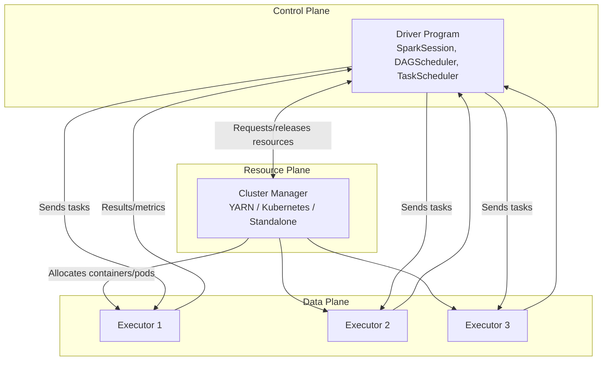
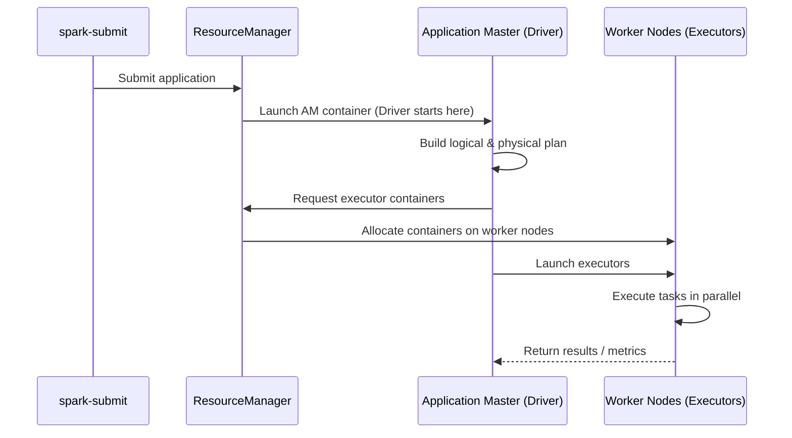
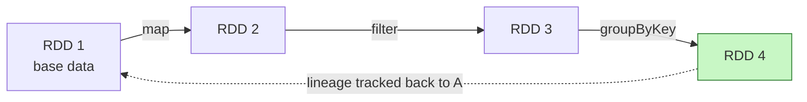
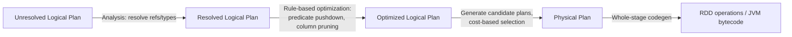
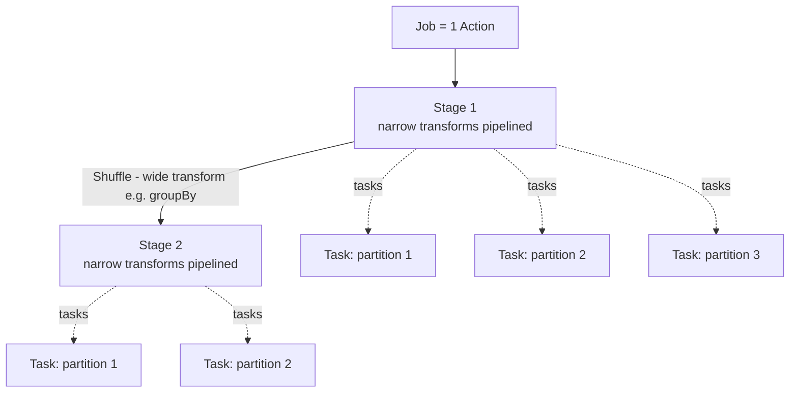
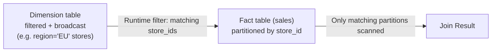
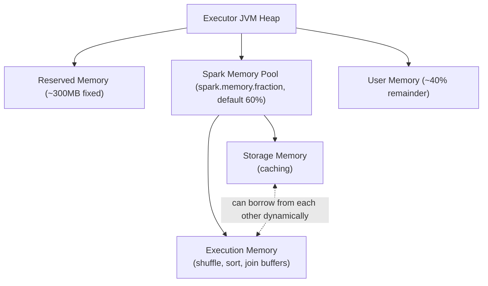
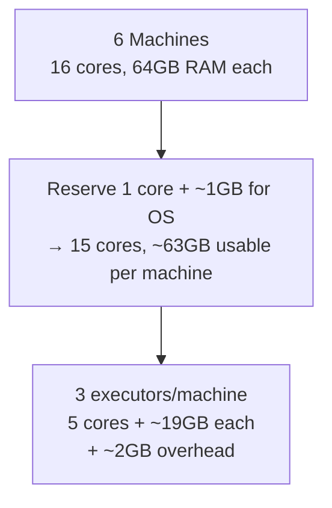

# Apache Spark — Data Engineering Notes

> Reviewed, corrected, and expanded from original study notes. Restructured into sections/subsections for quick revision, with diagrams, worked examples, and an expanded interview Q&A bank.

---

## 📌 Table of Contents

1. [Section 1: Apache Spark Architecture & Core Concepts](#section-1-apache-spark-architecture--core-concepts)
   - [1.1 Fundamentals & Master-Slave Model](#11-fundamentals--master-slave-model)
   - [1.2 Execution Modes: Client vs Cluster vs Local](#12-execution-modes-client-vs-cluster-vs-local)
   - [1.3 End-to-End Application Execution Flow](#14-end-to-end-application-execution-flow)
2. [Section 2: Deep Dive into RDDs](#section-2-deep-dive-into-rdds)
   - [2.1 Internal Architecture & Lineage Graph](#21-internal-architecture--lineage-graph)
   - [2.2 RDD Creation Methods](#22-rdd-creation-methods)
   - [2.3 Transformations: Narrow vs Wide](#23-transformations-narrow-vs-wide)
   - [2.4 Actions & Eager Execution](#24-actions--eager-execution)
   - [2.5 Pair RDDs & Custom Partitioning](#25-pair-rdds--custom-partitioning)
   - [2.6 Drawbacks & Bottlenecks of RDDs](#26-drawbacks--bottlenecks-of-rdds)
3. [Section 3: Structural API Layer (DataFrames & Spark SQL)](#section-3-structural-api-layer-dataframes--spark-sql)
   - [3.1 Architectural Superiority over RDDs](#31-architectural-superiority-over-rdds)
   - [3.2 Catalyst Optimizer Deep Dive](#32-catalyst-optimizer-deep-dive)
   - [3.3 Tungsten Execution Engine Deep Dive](#33-tungsten-execution-engine-deep-dive)
   - [3.4 DataFrame Operations & Code Examples](#34-dataframe-operations--code-examples)
   - [3.5 Working with Missing/Corrupt Data](#35-working-with-missingcorrupt-data)
   - [3.6 Temporary Views (Session vs Global)](#36-temporary-views-session-vs-global)
4. [Section 4: Execution Model: Jobs, Stages, Tasks & Scheduling](#section-4-execution-model-jobs-stages-tasks--scheduling)
   - [4.1 Hierarchy: Job → Stage → Task](#41-hierarchy-job--stage--task)
   - [4.2 Physical Plan Analysis via `explain()`](#42-physical-plan-analysis-via-explain)
   - [4.3 Shuffle Map Tasks vs Result Tasks](#43-shuffle-map-tasks-vs-result-tasks)
   - [4.4 Scheduling Modes: FIFO vs FAIR](#44-scheduling-modes-fifo-vs-fair)
   - [4.5 Tuning Parallelism & Partition Sizing](#45-tuning-parallelism--partition-sizing)
   - [4.6 Adaptive Query Execution (AQE) & Dynamic Partition Pruning (DPP)](#46-adaptive-query-execution-aqe--dynamic-partition-pruning-dpp)
5. [Section 5: Memory Management, Caching & Checkpointing](#section-5-memory-management-caching--checkpointing)
   - [5.1 Spark Unified Memory Architecture](#51-spark-unified-memory-architecture)
   - [5.2 Caching vs Persisting (Storage Levels)](#52-caching-vs-persisting-storage-levels)
   - [5.3 Checkpointing vs Caching (Lineage Truncation)](#53-checkpointing-vs-caching-lineage-truncation)
   - [5.4 Data Redistribution: `repartition()` vs `coalesce()`](#54-data-redistribution-repartition-vs-coalesce)
6. [Section 6: Application Monitoring & Debugging](#section-6-application-monitoring--debugging)
   - [6.1 Spark Web UI Tabs Analysis](#61-spark-web-ui-tabs-analysis)
   - [6.2 Application Logging & Metrics Sinks](#62-application-logging--metrics-sinks)
7. [Section 7: Interview Q&A Section](#section-7-interview-qa-section)
   - [7.1 Frequently Asked Questions](#71-frequently-asked-questions)
   - [7.2 Scenario-Based Questions](#72-scenario-based-questions)
   - [7.3 Common Follow-up Questions](#73-common-follow-up-questions)
8. [Section 8: Appendix — Optimization, Errors & Cluster Sizing](#section-8-appendix--optimization-errors--cluster-sizing)
   - [8.1 Optimization Guidelines](#81-optimization-guidelines)
   - [8.2 Common Errors & OOM Root Causes](#82-common-errors--oom-root-causes)
   - [8.3 Cluster Resource Sizing — Worked Example](#83-cluster-resource-sizing--worked-example)

---

## Section 1: Apache Spark Architecture & Core Concepts

### 1.1 Fundamentals & Master-Slave Model

Apache Spark is a **distributed computing framework** for fast, scalable big-data processing.

- Its foundational data abstraction is the **RDD (Resilient Distributed Dataset)** — a read-only, partitioned collection of data spread across a cluster (see [Section 2](#section-2-deep-dive-into-rdds)).
- Spark keeps data **in memory** across operations where possible — the primary reason it's dramatically faster than disk-based MapReduce for iterative/multi-step workloads.
- Every Spark program is internally represented as a **DAG (Directed Acyclic Graph)** of operations, built from the transformations the user chains together (see [Section 4](#section-4-execution-model-jobs-stages-tasks--scheduling)).
- Spark integrates with cluster resource managers — historically YARN and Mesos, now predominantly **Kubernetes** and **Standalone** — for allocating executors across a cluster (see [1.3](#13-resource-managers--application-master)).

Spark follows a **master–slave (driver–executor)** architecture, which is what allows it to scale from a laptop to thousands of nodes. A Spark application is composed of three conceptual "planes":

| Component           | Plane          | Role                                                                   |
|---------------------|----------------|------------------------------------------------------------------------|
| **Driver Program**  | Control plane  | Where user code runs; builds the logical/physical plan; schedules work |
| **Executors**       | Data plane     | JVM processes on worker nodes that actually run tasks and hold data    |
| **Cluster Manager** | Resource plane | Allocates the machines/containers the driver and executors run in      |

**Applications don't share executors** — each Spark application gets its own dedicated set of executor JVMs, ensuring isolation between concurrently running applications (no cross-application memory sharing, no noisy-neighbor interference at the executor level).



**The Driver — "brain" of the application:**
- Runs `main()` and creates the `SparkSession`.
- Requests executor containers from the cluster manager.
- Builds the **logical plan → physical plan** (via Catalyst, for DataFrame/SQL code).
- Schedules work via:
  - **DAGScheduler** — splits a job into stages based on shuffle boundaries.
  - **TaskScheduler** — assigns individual tasks to available executor cores.
  - **SchedulerBackend** — communicates with the cluster manager to launch/manage executors. *(Correction: the original notes' "BackendScheduler" is a naming slip — the correct term is SchedulerBackend.)*
- Tracks metadata — RDD lineage, partition info.
- Collects/aggregates final results.
- Hosts the **Spark Web UI** (default port `4040`).
- If the driver dies, the **entire application fails** — no in-application driver failover.
- Should run **close to executors** for low latency — a core reason cluster mode is preferred over client mode in production (see [1.2](#12-execution-modes-client-vs-cluster-vs-local)).

**The Executor — worker JVM:**
- Runs tasks sent by the driver; performs the actual computation.
- Reads/writes data from external storage (HDFS, S3, JDBC, etc.).
- Holds cached data and shuffle data (read + write side).
- Reports results/metrics back to the driver.
- **Lifecycle**: **static allocation** (fixed executors for the app's life) vs **dynamic allocation** (executors scale up/down with workload — typically paired with an external shuffle service so removed executors don't lose shuffle data other stages still need).
- **One JVM per application** per node — avoids noisy-neighbor issues; no cross-application in-memory data sharing (only via external storage).

### 1.2 Execution Modes: Client vs Cluster vs Local

| Mode             | Driver location                                     | Executor location                         | Notes                                                                                                                                                |
|------------------|-----------------------------------------------------|-------------------------------------------|------------------------------------------------------------------------------------------------------------------------------------------------------|
| **Local mode**   | Single machine                                      | Same machine (threads, not separate JVMs) | Parallelism = number of local threads; good for learning/testing, **not** production. `--master local[*]`                                            |
| **Client mode**  | The machine that submitted the job                  | Cluster                                   | Logs easily accessible locally, but driver is bound by the submitting machine's resources/network — **not suitable for heavy production workloads**. |
| **Cluster mode** | Inside the cluster (managed by the cluster manager) | Cluster                                   | Scales better, doesn't tie the app's survival to the client machine — the **standard choice for production**.                                        |

```bash
# Client mode
spark-submit --master yarn --deploy-mode client ...

# Cluster mode (production standard)
spark-submit --master yarn --deploy-mode cluster ...
```

### 1.3 End-to-End Application Execution Flow

Typical `spark-submit` (cluster mode, YARN) flow:

1. `spark-submit` contacts the **ResourceManager (RM)**, which starts an **Application Master (AM)** container.
2. The AM starts the **Driver**, which builds logical and physical plans.
3. The Driver **requests executor containers** from the RM.
4. The RM **allocates containers** on worker nodes.
5. The Driver **launches Spark Executors** in those containers.
6. Executors perform **distributed processing** and return results/status to the Driver.



---

## Section 2: Deep Dive into RDDs

### 2.1 Internal Architecture & Lineage Graph

An RDD is the **basic building block** of Spark: a **read-only**, **partitioned** collection of objects distributed across the cluster, processed in parallel.

**Resilient** — fault tolerance via **recomputation**, not replication:
- Every RDD tracks **lineage** — its parent RDD(s) and the transformation used to derive it.
- If a partition is lost, Spark **recomputes** just that partition by replaying the lineage from the nearest available ancestor data.
- Lineage-based recovery only works **because RDDs are immutable** — deterministic replay of the same operations against the same parent data always reproduces the same result.

**Immutable:**
- An RDD's data can never be modified in place.
- Every transformation returns a **new** RDD; the original stays untouched.
- This is what makes lineage-based fault tolerance sound — mutable shared state would make "just replay the lineage" unsafe.

**Distributed & Partitioned:**
- An RDD's dataset is split into **partitions**, each processed independently by a machine (conceptually similar to Hadoop MapReduce's input splits).
- **Partitioning/placement metadata** is tracked by Spark and used to drive optimizations (e.g., avoiding unnecessary shuffles when data is already co-located).

> Every Spark program — RDD, DataFrame, or Dataset API — ultimately compiles down to RDD operations at execution time; DataFrames/Datasets are a higher-level, more optimizable abstraction **on top of** RDDs.



### 2.2 RDD Creation Methods

Four ways to create an RDD:

1. **Parallelizing a collection**: `spark.sparkContext.parallelize(Seq(1,2,3,4,5))`.
2. **From an external dataset**: `spark.sparkContext.textFile("path/to/file.txt")`.
   - For **many small files**, prefer `wholeTextFiles()` over `textFile()`: each element becomes a key-value pair (`key` = file name, `value` = full file content) — useful when each file needs separate processing rather than merging all lines together.
3. **From another RDD**: via a transformation on an existing RDD.
4. **From a DataFrame/Dataset**: converting down to RDD level, useful when:
   - Data is **highly unstructured**.
   - Data has shrunk after heavy computation and you want fine-grained **custom control over physical partitioning**.
   - You have legacy RDD-based code or logic that only the RDD API supports.

### 2.3 Transformations: Narrow vs Wide

Transformations are **lazy** and always produce a **new RDD**.

**Narrow transformations** — no shuffle:
- Each output partition computed from a **single** corresponding input partition.
- Output RDD has the **same number of partitions** as its parent.

| Transformation | Behavior                                                                  | Example                                             |
|----------------|---------------------------------------------------------------------------|-----------------------------------------------------|
| `map()`        | Applies a function to every element, same output size                     | `numbersRDD.map(x => x * 2)` — doubles every number |
| `flatMap()`    | Applies a function returning an iterator per element, flattening results  | Splitting an RDD of lines into an RDD of words      |
| `filter()`     | Keeps elements satisfying a predicate                                     | `numbersRDD.filter(x => x > 5)`                     |
| `union()`      | Combines two RDDs, **without removing duplicates** (like SQL `UNION ALL`) | —                                                   |

**Wide transformations** — require a **shuffle** (output depends on data from multiple input partitions):

| Transformation   | Behavior                                            |
|------------------|-----------------------------------------------------|
| `distinct()`     | Removes duplicate elements                          |
| `sortBy()`       | Sorts by a key function                             |
| `intersection()` | Elements present in **both** RDDs                   |
| `subtract()`     | Removes elements of one RDD also present in another |
| `cartesian()`    | Full cartesian product of two RDDs                  |

`textFile()`/`wholeTextFiles()` are also technically transformations — lazily defined, nothing read until an action forces it.

### 2.4 Actions & Eager Execution

Actions **trigger execution** of the DAG needed to produce a result — they don't create a new RDD.

| Action             | Behavior                                                                                                                    |
|--------------------|-----------------------------------------------------------------------------------------------------------------------------|
| `collect()`        | Returns **all** elements to the driver — only use when confident the result is small enough; can crash the driver otherwise |
| `count()`          | Returns the number of elements                                                                                              |
| `take(n)`          | Returns the first `n` elements                                                                                              |
| `top(n)`           | Returns the top `n` elements                                                                                                |
| `takeOrdered(n)`   | Returns `n` elements based on a specified ordering (equivalent to `sortBy()` + `take()`) — both trigger a shuffle           |
| `first()`          | Returns the first element                                                                                                   |
| `countByValue()`   | Count of occurrences of each distinct element                                                                               |
| `reduce()`         | Combines elements in parallel via an associative function                                                                   |
| `saveAsTextFile()` | Writes RDD contents to external storage                                                                                     |
| `foreach()`        | Applies a function per element (side effects)                                                                               |

### 2.5 Pair RDDs & Custom Partitioning

A **Pair RDD** holds key-value tuples, enabling join/aggregation operations Spark can execute in an optimized way. Created most simply via `sc.parallelize(Seq(("US", 100), ("UK", 200)))`.

| Operation                  | Behavior                                                                                                                                                                                                                                 |
|----------------------------|------------------------------------------------------------------------------------------------------------------------------------------------------------------------------------------------------------------------------------------|
| `groupByKey()`             | Groups values by key — ⚠️ shuffles **all** values first, can be expensive/skew-prone                                                                                                                                                     |
| `reduceByKey()`            | **Local (map-side) aggregation first**, then shuffles only the reduced data — far less network traffic than `groupByKey()`                                                                                                               |
| `sortByKey()`              | Sorts by key                                                                                                                                                                                                                             |
| `join()`                   | Inner-join two pair RDDs on matching keys                                                                                                                                                                                                |
| `partitionBy(partitioner)` | Explicitly controls shuffle partitioning — e.g., `rdd.partitionBy(new HashPartitioner(100))` — aligns upstream/downstream shuffles and ensures large joins use **matching partitioners** (co-partitioning avoids a shuffle at join time) |

Other pair-RDD transforms: `aggregateByKey()`, `cogroup()`, `leftOuterJoin()`, `rightOuterJoin()`, `subtractByKey()`. Other pair-RDD actions: `countByKey()`, `collectAsMap()`, `lookup()`.

### 2.6 Drawbacks & Bottlenecks of RDDs

- **No query optimization** — Spark can't "see inside" lambdas; can't reorder/prune operations. *Example: a `filter` after a `groupBy` can't be pushed down before it, the way it could in a DataFrame plan.*
- **Slower in Python/R** — PySpark's separate Python process requires **serialization** across the JVM boundary for RDD operations implemented in Python; DataFrame/SQL operations avoid most of this since they execute via Catalyst/Tungsten-generated JVM code regardless of language.
- **Harder to debug/maintain** — long lambda chains are opaque; no schema enforcement means more runtime errors.
- **Inefficient for large pipelines** — misses automatic optimizations: **predicate pushdown**, **column pruning**, **join reordering**.

---

## Section 3: Structural API Layer (DataFrames & Spark SQL)

### 3.1 Architectural Superiority over RDDs

DataFrames are **distributed tables** with rows and named/typed columns, built **on top of RDDs**, adding:
- **Schema awareness** — Spark knows column names/types up front.
- **Catalyst optimization** — plan rewriting based on schema knowledge.
- **Columnar/binary processing (Tungsten)** — efficient off-heap layout and generated code.
- **Better memory management** than raw JVM object RDDs.
- **Multiple language APIs** (Scala, Java, Python, R, SQL) with equivalent performance, since the heavy lifting runs in the JVM via generated code regardless of the driving language.

**Key advantage:** because Spark *understands the structure*, it can optimize automatically — the single biggest reason DataFrames/SQL usually outperform equivalent hand-written RDD code.

**Key features:** reads/writes many formats (CSV, JSON, Parquet, ORC, Avro) and storages (HDFS, S3, Hive, JDBC); scales KB→PB; supports declarative SQL and the DataFrame API interchangeably (both compile to the same Catalyst plan).

> **Interview phrase:** DataFrames enable Spark to apply both **rule-based and cost-based optimization**, giving predictable and significantly faster execution than equivalent hand-written RDD code.

### 3.2 Catalyst Optimizer Deep Dive

Catalyst is Spark SQL's query-planning engine. It:
- **Rewrites queries** — transforms logical plans into efficient, equivalent plans.
- **Pushes filters down** — applies filters as early as possible, ideally at the source, to minimize data scanned.
- **Eliminates unnecessary scans** — skips columns/data never actually used downstream.
- **Reorders joins** — chooses an efficient join order using size statistics, minimizing shuffle volume.
- **Prunes unused columns** — reads/processes only referenced columns (particularly powerful with columnar formats).

> **Key interview insight:** Catalyst works best with DataFrames/Datasets/SQL because those expressions are analyzed into an **AST** Spark can reason about — RDD lambdas are opaque black boxes.



### 3.3 Tungsten Execution Engine Deep Dive

Tungsten focuses on low-level CPU/memory efficiency:
- **Memory layout (off-heap)** — compact binary format outside the JVM heap, reducing GC pressure from millions of small JVM objects.
- **Cache locality** — memory access patterns organized so the CPU accesses nearby addresses together, improving cache hit rates.
- **Whole-Stage Code Generation** — generates specialized JVM bytecode fusing multiple operators (filter + projection + aggregation) into a single tight loop, instead of the classic "Volcano model" of repeated `next()` calls across separate operator objects (which has real per-call dispatch overhead).

**Result:** faster, more predictable execution — this is why `explain()` shows a `*` marker next to stages where whole-stage codegen is active (see [4.2](#42-physical-plan-analysis-via-explain)).

### 3.4 DataFrame Operations & Code Examples

**Creating DataFrames:**
```scala
// From an RDD
val df = rdd.toDF("key", "value")

// With an explicit schema
val peopleRDD = spark.sparkContext.parallelize(Seq(
  Row(1L, "John Doe", 30L),
  Row(2L, "Mary Jane", 25L)
))
val schema = StructType(Seq(
  StructField("id", LongType, true),
  StructField("name", StringType, true),
  StructField("age", LongType, true)
))
val peopleDF = spark.createDataFrame(peopleRDD, schema)

// From a range of numbers
val df2 = spark.range(5).toDF("num")

// From a Scala collection
val movies = Seq(
  ("Damon, Matt", "The Bourne Ultimatum", 2007L),
  ("Damon, Matt", "Good Will Hunting", 1997L)
)
val moviesDF = movies.toDF("actor", "title", "year")

// From text files
val textDf = spark.read.text("README.md")

// From CSV, with inference / custom delimiter / explicit schema
val csvInferred = spark.read.option("header", "true").option("inferSchema", "true").csv("movies.csv")
val tsv = spark.read.option("header", "true").option("sep", "\t").csv("movies.tsv")

val movieSchema = StructType(Seq(
  StructField("actor_name", StringType),
  StructField("movie_title", StringType),
  StructField("produced_year", LongType)
))
val moviesTyped = spark.read.schema(movieSchema).option("header", "true").csv("movies.csv")

// From JSON, with explicit schema
val jsonSchema = StructType(Seq(
  StructField("actor_name", StringType),
  StructField("movie_title", StringType),
  StructField("produced_year", IntegerType)
))
val moviesJson = spark.read.schema(jsonSchema).json("movies.json")
```

**Structured operations:**

| Operation                                     | Behavior                                                                                                        |
|-----------------------------------------------|-----------------------------------------------------------------------------------------------------------------|
| `select(cols)`                                | Selects specific columns/expressions                                                                            |
| `selectExpr(exprs)`                           | Like `select`, but accepts one or more **SQL expression strings** rather than `Column` objects                  |
| `filter(condition)` / `where(condition)`      | Equivalent — filters rows by a boolean condition                                                                |
| `distinct()`                                  | Removes fully duplicate rows                                                                                    |
| `dropDuplicates(cols)`                        | Dedup based on specified columns; if none given, uses **all** columns (same as `distinct()`)                    |
| `sort(cols)` / `orderBy(cols)`                | Equivalent semantics; ascending by default                                                                      |
| `limit(n)`                                    | Returns the first `n` rows                                                                                      |
| `union(otherDf)`                              | Combines two DataFrames (column-positional — schemas must align in order/type)                                  |
| `withColumn(name, expr)`                      | Adds/replaces a column                                                                                          |
| `withColumnRenamed(old, new)`                 | Renames a column                                                                                                |
| `drop(col1, col2, ...)`                       | Drops specified columns; non-existent ones are **silently ignored**                                             |
| `sample(fraction[, seed[, withReplacement]])` | Random subset — `fraction` approximate (0–1), `seed` for reproducibility, `withReplacement=true` allows repeats |
| `randomSplit(weights)`                        | Splits into multiple DataFrames by weight (e.g., train/test)                                                    |
| `describe(cols)`                              | Basic stats (count, mean, stddev, min, max) for **string/numeric** columns — **not** date/timestamp             |

```scala
// Sampling examples
movies.sample(false, 0.0003).show(3)               // no replacement
movies.sample(true, 0.0003, 123456).show(3)         // with replacement + fixed seed
```

### 3.5 Working with Missing/Corrupt Data

**Handling nulls:**
```scala
df.na.drop()                     // drop rows with ANY null column (default = "any")
df.na.drop("all")                // drop rows only if ALL columns are null (keeps rows with ≥1 non-null value)
df.na.drop(Seq("actor_name"))    // drop rows where actor_name specifically is null
df.na.fill(Map("col1" -> value1, "col2" -> value2))   // impute/replace nulls with defaults
```
> Clarification: `drop("all")` keeps a row **as long as at least one column has a non-null value** — it only drops rows where **every** column is null. The default `drop("any")` drops a row if **any** column is null.

**Handling corrupt records (file read):**
- **Default mode (`PERMISSIVE`)**: sets the malformed row to `null` (or populates a `_corrupt_record` column) rather than failing.
- **`failFast` mode**: throws an exception immediately on a malformed record.
```scala
spark.read.option("mode", "failFast").json("movies.json")
```

### 3.6 Temporary Views (Session vs Global)

**Session-scoped** — disappears when the session ends:
```scala
sales_df.createOrReplaceTempView("sales")
spark.sql("SELECT * FROM sales").show()
```

**Global** — survives across sessions within the same application, under the `global_temp` database:
```scala
sales_df.createGlobalTempView("sales")
spark.sql("SELECT * FROM global_temp.sales").show()
spark.newSession().sql("SELECT * FROM global_temp.sales").show()  // accessible from a new session too
```

---

## Section 4: Execution Model: Jobs, Stages, Tasks & Scheduling

### 4.1 Hierarchy: Job → Stage → Task

**Action = one Spark Job.** Every action (`show`, `count`, `write`, `collect`, etc.) triggers a **new job**. Calling multiple actions on the same lineage without caching → Spark **recomputes the entire lineage from scratch each time** (a common performance pitfall — see [5.2](#52-caching-vs-persisting-storage-levels)).

**Wide transformation = new stage boundary.** `join`, `groupBy`, `agg`, `distinct`, `rollup`, `cube` force a stage boundary — each introduces shuffle write, shuffle read, network transfer, and often sort/grouping. More wide transformations → more stages → higher latency (a stage boundary is a synchronization point).

**Narrow transformation = tasks within the same stage.** `filter`, `select`, `withColumn`, `map`, `drop` operate per-partition with no shuffle — Spark **pipelines** all consecutive narrow transformations into a single stage.

**Task = smallest execution unit** — the work done on **one partition**. Number of tasks per stage ≈ number of partitions. Each task runs on one executor slot (typically one core), executes all narrow transforms in that stage pipelined, and reads an input partition → processes → produces an output partition.



### 4.2 Physical Plan Analysis via `explain()`

**DAG constructor**: builds a DAG from the chain of transformations, identifies **shuffle boundaries**, and splits the job into **stages**.

```
== Physical Plan ==
*(3) Sort [sum(AMOUNT)#345 DESC NULLS LAST], true, 0
+- Exchange rangepartitioning(sum(AMOUNT)#345 DESC NULLS LAST, 200)
   +- *(2) HashAggregate(keys=[COUNTRY_CODE#313], functions=[sum(AMOUNT#314)])
      +- Exchange hashpartitioning(COUNTRY_CODE#313, 200)
         +- *(1) HashAggregate(keys=[COUNTRY_CODE#313], functions=[partial_sum(AMOUNT#314)])
            +- *(1) FileScan csv [COUNTRY_CODE#313,AMOUNT#314] ...
```

Reading this plan:
- **Operators**, bottom to top: file scan → partial (map-side) aggregation → shuffle (`Exchange hashpartitioning`) → full aggregation → shuffle (`Exchange rangepartitioning`, for the global sort) → sort.
- **Shuffle boundaries**: every `Exchange` is a shuffle — there are **two** here (one for `GROUP BY`'s hash-partitioning, one for `ORDER BY`'s range-partitioning), meaning **3 stages** total.
- **Number of partitions**: the `200` reflects `spark.sql.shuffle.partitions` (default 200) — a very common tuning target, often replaced by AQE's dynamic coalescing (see [4.6](#46-adaptive-query-execution-aqe--dynamic-partition-pruning-dpp)).
- **Whole-stage codegen**: the `*(N)` prefix marks stages where Tungsten's whole-stage codegen fuses the operators shown under it into a single generated code path.

### 4.3 Shuffle Map Tasks vs Result Tasks

Tasks come in two flavors:

| Task Type            | When it runs                                | What it does                                                                                                                                                               |
|----------------------|---------------------------------------------|----------------------------------------------------------------------------------------------------------------------------------------------------------------------------|
| **Shuffle Map Task** | In a stage that **produces** shuffle output | Partitions and writes data for the next stage to read                                                                                                                      |
| **Result Task**      | In the **final** stage of a job             | Returns results directly to the driver (e.g., `collect()`/`count()`) **or** writes final output to storage — does **not** produce further shuffle output for another stage |

### 4.4 Scheduling Modes: FIFO vs FAIR

The **Task Scheduler** assigns tasks to executors, factoring in **data locality** and available cores. Default: **one core per task**, configurable via `spark.task.cpus`.

**Scheduling modes** (how the scheduler prioritizes across multiple concurrently submitted jobs within one SparkContext):
- **FIFO** (default): jobs run in submission order — simple, but a long-running job can **starve** later, shorter jobs.
- **FAIR**: distributes resources more evenly across concurrent jobs, preventing one job from monopolizing the cluster.
```scala
spark.conf.set("spark.scheduler.mode", "FAIR")
```

### 4.5 Tuning Parallelism & Partition Sizing

> Total parallel tasks = sum of executor cores across the cluster

*Example:* 5 executors × 4 cores = **20 tasks** run in parallel at once. A stage with 200 partitions completes in **10 waves**.

|                   | Too few partitions                               | Too many partitions                                   |
|-------------------|--------------------------------------------------|-------------------------------------------------------|
| Symptom           | Low parallelism, cluster underutilized, slow job | Excessive small tasks, high scheduling overhead       |
| Secondary effects | A few large/skewed partitions dominate runtime   | Heavy shuffle metadata, driver can become overwhelmed |

**Rule of thumb:** partition sizes in the **100–256MB** range, partition count a reasonably small multiple of total cores.

### 4.6 Adaptive Query Execution (AQE) & Dynamic Partition Pruning (DPP)

**AQE** — `spark.sql.adaptive.enabled = true` (default-on in modern Spark, 3.2+) — re-optimizes the plan **at runtime** using actual stage statistics, rather than pre-execution estimates alone:
1. **Dynamic Shuffle Partition Coalescing** — merges many small post-shuffle partitions into fewer, appropriately-sized ones.
2. **Dynamic Join Strategy Switching** — converts a planned Sort-Merge Join into a Broadcast Join at runtime if actual data turns out small enough.
3. **Skew Join Optimization** — detects a disproportionately large shuffle partition and splits it into multiple smaller tasks.

**DPP** — `spark.sql.optimizer.dynamicPartitionPruning.enabled = true` (also default-on) — works when the **fact table** is partitioned on the join key and the **dimension table** is broadcast: Spark injects a runtime filter from the dimension side's actual matching values into the fact table's partition pruning, skipping fact-table partitions entirely rather than scanning-then-discarding after the join.



---

## Section 5: Memory Management, Caching & Checkpointing

### 5.1 Spark Unified Memory Architecture

**Driver memory:**
- `spark.driver.memory` — driver JVM heap.
- `spark.driver.memoryOverhead` — off-heap overhead (default: greater of ~10% of driver memory, or 384MB).

**Executor memory:**
```
Total Executor Memory = Executor Heap + Overhead Memory + Off-Heap Memory + PySpark Memory
```
- `spark.executor.memory` — JVM heap size.
- `spark.executor.memoryOverhead` — off-heap overhead (default ~10%) — JVM internals, native library overhead, shuffle-related off-heap buffers.
- `spark.memory.offHeap.size` — explicit off-heap storage/execution memory, **if** enabled (`spark.memory.offHeap.enabled=true`).
- `spark.executor.pyspark.memory` — memory for the **Python worker processes** PySpark spawns alongside the JVM executor (relevant for Python UDFs/PySpark-heavy workloads).

**Executor JVM heap internals:**
1. **Reserved Memory** (~300MB fixed) — Spark's internal bookkeeping, not usable by application data.
2. **Spark Memory Pool** (`spark.memory.fraction`, default 60% of remainder):
   - **Storage memory** — caching (`.cache()`/`.persist()`).
   - **Execution memory** — shuffle buffers, sorts, aggregations, joins.
   - These **borrow from each other dynamically** (unified memory management, Spark 1.6+) — storage can be evicted to free space for execution and vice versa, bounded by `spark.memory.storageFraction` (minimum guaranteed storage share).
3. **User Memory** (~40% remainder) — user-defined data structures, UDF state, non-managed metadata.



### 5.2 Caching vs Persisting (Storage Levels)

`cache()` is shorthand for `persist(StorageLevel.MEMORY_ONLY)` (or `MEMORY_AND_DISK` in some contexts, depending on API/DataFrame vs RDD default) — `persist()` is the more general call, letting you pick **any** storage level explicitly.

| Storage Level                                  | Behavior                                                                                                          |
|------------------------------------------------|-------------------------------------------------------------------------------------------------------------------|
| `MEMORY_ONLY`                                  | Store as deserialized Java objects in memory; partitions that don't fit are **not** cached (recomputed on demand) |
| `MEMORY_AND_DISK`                              | Same, but spills partitions that don't fit in memory to **disk** instead of recomputing                           |
| `MEMORY_ONLY_SER`                              | Store as **serialized** bytes in memory — more compact (less GC pressure), slower to read (deserialization cost)  |
| `MEMORY_AND_DISK_SER`                          | Serialized, with disk spill for overflow                                                                          |
| `DISK_ONLY`                                    | Store only on disk                                                                                                |
| `OFF_HEAP`                                     | Store in off-heap memory (Tungsten-managed), if off-heap mode is enabled                                          |
| Any level + `_2` suffix (e.g. `MEMORY_ONLY_2`) | **Replicates** the cached data on **two** nodes, for resilience against losing a single node's cached copy        |

**Use when:** you need to run **multiple actions** against the same RDD/DataFrame, or reuse it after an expensive computation (join/groupByKey), to avoid recomputing the entire upstream lineage each time.

**Key behaviors:**
- **Caching is lazy** — `.cache()` only *records* the intent; actual computation + caching happens on the **first action** that touches it.
- Neither a transformation nor an action — a hint that takes effect only once an action forces evaluation.
- **Always `unpersist()`** once done, to free memory/disk for other operations.

```python
df.cache()              # or df.persist(StorageLevel.MEMORY_AND_DISK)
df.count()               # first action - triggers computation AND caching
df.filter(...).show()    # reuses cached data, no recomputation of upstream lineage
df.unpersist()           # release when done
```

### 5.3 Checkpointing vs Caching (Lineage Truncation)

A cached RDD's lifecycle ends when the **Spark session ends** — to reuse computed results across separate sessions/programs, use **`checkpoint()`**, which persists to **durable storage**.

```scala
spark.sparkContext.setCheckpointDir("/path/to/checkpoint/dir")
baseRDD.checkpoint()
baseRDD.count()   // action triggers the actual checkpoint write
```

**Useful when:** reusing a result in a separate/later program; lineage has become **extremely long** (iterative algorithms like PageRank) — replaying a thousands-of-steps lineage on failure is prohibitively expensive; you want fault tolerance **at a specific lineage boundary**.

|         | Caching                                          | Checkpointing                                                       |
|---------|--------------------------------------------------|---------------------------------------------------------------------|
| Storage | Memory (+ optional disk)                         | Disk / durable storage only                                         |
| Purpose | Performance optimization                         | **Lineage truncation** & durable fault tolerance beyond the session |
| Lineage | Still tracked (recompute possible if cache lost) | **Cut** — no dependency on prior lineage anymore                    |

### 5.4 Data Redistribution: `repartition()` vs `coalesce()`

|              | `repartition(n)`                                       | `coalesce(n)`                                                          |
|--------------|--------------------------------------------------------|------------------------------------------------------------------------|
| Direction    | Increase **or** decrease partitions                    | **Only decreases** partitions                                          |
| Shuffle      | **Always** a full shuffle                              | **Usually** avoids one (merges adjacent partitions) — not guaranteed   |
| Distribution | Even (full redistribution)                             | Can be uneven if merged partitions vary in size                        |
| Good for     | More parallelism, fixing skew, better slot utilization | Cheap reduction after heavy filtering, fewer output files before write |

⚠️ `coalesce()` **can** shuffle if the requested partition count is small enough (relative to nodes/current distribution) that data must move across executors to satisfy it — but in typical, moderate reductions, it remains cheaper than `repartition()`.

---

## Section 6: Application Monitoring & Debugging

### 6.1 Spark Web UI Tabs Analysis

The **Spark UI** launches on the driver host at port **4040** by default (next available port if taken; configurable via `spark.ui.port`).

| Tab             | Shows                                                         |
|-----------------|---------------------------------------------------------------|
| **Jobs**        | DAG, stages, tasks, duration per job                          |
| **Stages**      | Detailed info on every stage                                  |
| **Storage**     | Info about cached partitions                                  |
| **Environment** | Execution environment/config (e.g., `spark.scheduler.mode`)   |
| **Executors**   | Per-executor resource usage/status                            |
| **SQL**         | Info about structured API (SQL/DataFrame/Dataset) query plans |

### 6.2 Application Logging & Metrics Sinks

- **Application logs** — language-native logging libraries (Python's `logging`, `log4j` for Java/Scala) to capture events for later analysis.
- **External monitoring** — integrating with **Graphite, Ganglia, Splunk, the ELK stack (Elasticsearch, Logstash, Kibana), or Prometheus** — enables ad hoc querying and custom dashboards across many applications/clusters, beyond what the per-application Spark UI offers.

---

## Section 7: Interview Q&A Section

### 7.1 Frequently Asked Questions

**Q1: What is the difference between client mode and cluster mode in `spark-submit`?**
A: In **client mode**, the driver runs on the machine that submitted the job (outside the cluster), with executors on the cluster — convenient for local log access but tied to the submitting machine's resource limits/network stability, so it's discouraged in production. In **cluster mode**, the driver itself runs **inside** the cluster, managed by the cluster manager alongside the executors — this scales better and doesn't risk application failure if the submitting client machine disconnects, making it the standard production choice. See [1.2](#12-execution-modes-client-vs-cluster-vs-local).

**Q2: Explain how Spark provides fault tolerance using RDD lineage.**
A: Every RDD tracks its **lineage** — the parent RDD(s) and the transformation used to derive it. If a partition is lost (e.g., an executor crash), Spark doesn't need a replicated copy — it can **recompute just that partition** by replaying the lineage from the nearest available ancestor data. This only works because RDDs are **immutable**: since a parent RDD's data is guaranteed never to change, replaying the same deterministic transformation against it always reproduces the same lost partition. See [2.1](#21-internal-architecture--lineage-graph).

**Q3: Why is `reduceByKey` preferred over `groupByKey` in Pair RDDs?**
A: `groupByKey()` shuffles **all** values for every key across the network before any aggregation happens — expensive and skew-prone for large groups. `reduceByKey()` performs **local (map-side) partial aggregation first**, then shuffles only the already-reduced data, dramatically cutting network traffic for genuinely associative/commutative aggregations. Prefer `reduceByKey()` (or DataFrame `groupBy().agg()`, handled similarly under the hood by Catalyst) whenever the aggregation logic allows it. See [2.5](#25-pair-rdds--custom-partitioning).

**Q4: What are Narrow and Wide Transformations? Give examples.**
A: **Narrow** transformations compute each output partition from a single corresponding input partition, with no shuffle — e.g., `map()`, `filter()`, `flatMap()`, `union()`. **Wide** transformations require data from multiple input partitions and trigger a **shuffle** — e.g., `groupByKey()`, `distinct()`, `sortBy()`, `join()`, `repartition()`. Wide transformations create stage boundaries; narrow ones are pipelined within a stage. See [2.3](#23-transformations-narrow-vs-wide).

**Q5: What is the difference between `cache()` and `persist()`?**
A: `cache()` is shorthand for persisting at a **default storage level** (`MEMORY_ONLY` for RDDs; Spark chooses an appropriate default for DataFrames too) — it's a convenience call with no configurable level. `persist(storageLevel)` is the general form, letting you explicitly choose **any** storage level (`MEMORY_ONLY`, `MEMORY_AND_DISK`, `MEMORY_ONLY_SER`, `DISK_ONLY`, `OFF_HEAP`, or a `_2` replicated variant of any of these) based on your memory/CPU/resilience trade-off. See [5.2](#52-caching-vs-persisting-storage-levels).

**Q6: What is the difference between `repartition()` and `coalesce()`?**
A: `repartition(n)` can increase or decrease partition count and **always** triggers a full shuffle, producing an even distribution — good for increasing parallelism or fixing skew. `coalesce(n)` can only **decrease** partition count and **usually** avoids a full shuffle by merging adjacent partitions — cheaper, but distribution can be uneven, and it can still shuffle in some cases (see [7.3, Q2](#73-common-follow-up-questions)). See [5.4](#54-data-redistribution-repartition-vs-coalesce).

**Q7: What are the different types of joins in Spark?**
A: Two angles to this:
- **Logical join types** 
  - (SQL semantics): `inner`, `left outer` (`left`), `right outer` (`right`), `full outer` (`full`), 
  - `left semi` (returns left rows that have a match, without duplicating/including right columns), 
  - `left anti` (returns left rows with **no** match), and `cross` (cartesian product).
- **Physical join strategies** (how Spark actually executes a given logical join): 
  - **Broadcast Hash Join** (one side small enough to broadcast to all executors — avoids a shuffle entirely, fastest when applicable), 
  - **Shuffle Hash Join** (both sides shuffled/partitioned by join key, then a hash join per partition — used when broadcasting isn't possible but one side is still relatively small), 
  - **Sort-Merge Join** (both sides shuffled and sorted by join key, then merged — Spark's default/most robust strategy for large-large joins), and 
  - **Broadcast Nested Loop Join** / **Cartesian Join** (fallback for joins without an equi-join condition, or very small tables — expensive, generally avoided).

### 7.2 Scenario-Based Questions

**Scenario A: Your Spark job is failing with `java.lang.OutOfMemoryError: Java heap space` on the Driver node. How do you troubleshoot and fix this?**
A: First identify what's actually consuming driver heap:
1. **Check for `collect()` (or similar driver-collecting actions)** on a dataset that's larger than expected — this is the most common cause. Replace with `take(n)`, writing directly to storage, or distributed processing instead of pulling results to the driver.
2. **Check for an oversized broadcast join** — Spark ships the "small" table to the driver before broadcasting; if it's larger than assumed, this can exhaust driver memory. Check/tune `spark.sql.autoBroadcastJoinThreshold`, or explicitly disable broadcast for that join.
3. **Check driver-side accumulators or large closures** capturing more data than intended.
4. Review the **Spark UI's Executors tab** (driver is listed as an "executor" there too) for actual driver memory usage over time to confirm which stage/action correlates with the spike.
5. Only after ruling out the above, consider increasing `spark.driver.memory`/`spark.driver.memoryOverhead` — since throwing more memory at an architectural problem (e.g., a `collect()` that will keep growing with data volume) just delays the failure rather than fixing it.

**Scenario: You notice a severe Data Skew issue in a stage — 199 tasks finish in 5 seconds, but 1 task takes 45 minutes. How do you address this?**
A: This is a single straggler task caused by **data skew** — almost certainly one key (in a `groupBy`/`join`) has disproportionately more data than the others. Diagnose via the Spark UI's Stages tab: check the shuffle-read-size distribution across tasks — one massively larger input than the rest confirms it. Fixes:
- Enable/rely on **AQE's Skew Join Optimization**, which detects and automatically splits the oversized partition into multiple smaller tasks.
- Apply **salting**: append a random suffix to the skewed key (spreading it across several sub-keys), aggregate in two phases (first by salted key, then by original key), which manually spreads the hot key's data across multiple partitions/tasks.
- If it's a join and one side is small enough, force a **broadcast join** instead of a shuffle join, avoiding the shuffle (and thus the skew) on the join entirely.
- Investigate *why* the key is skewed at the business level too (e.g., a "null"/"unknown" placeholder key absorbing a disproportionate share of rows) — sometimes filtering or special-casing that key separately is the cleanest fix.

**Scenario: A Spark job reads 1,000,000 tiny files (10KB each) from HDFS/S3, and execution is extremely slow. How do you optimize it?**
A: This is the classic **small file problem** — Spark creates roughly one task per file/split, so a million tiny files means a million tiny tasks, and the fixed per-task scheduling/file-open overhead completely dwarfs the actual (trivial) amount of data each task processes; listing a million objects on S3 is also itself slow and rate-limited. Fixes:
- **Pre-consolidate**: run a one-time (or periodic) compaction job that reads and rewrites the data into far fewer, appropriately-sized files (target ~128MB–1GB each) — e.g., via `coalesce()`/`repartition()` before writing, or a table-format compaction procedure (`OPTIMIZE`/`rewrite_data_files`) if using Delta/Iceberg.
- **Reduce input partitions at read time**: configure the reader to combine multiple small input splits into a single task where the file format/source allows it (e.g., `spark.sql.files.maxPartitionBytes`, `spark.sql.files.openCostInBytes` tuning), rather than 1 task per tiny file.
- **Fix the root cause upstream**: if this job's own *output* becomes the next job's tiny-file input, fix the writer (batch more before writing, or schedule a target file size), not just this reader.
- For a genuinely one-off large tiny-file cleanup, a preliminary Spark job using `wholeTextFiles()` (grouping content by file) or a bulk file-merge utility outside Spark may be more efficient than trying to process a million files directly in one pass.

**Scenario: Skewness issue.**
A: (See the dedicated data-skew scenario above.) In short: identify skew via Spark UI task-duration/shuffle-size distribution, then apply AQE skew join handling, salting for skewed aggregations, or broadcast joins to avoid shuffling the skewed key at all — plus investigating whether the skew stems from a specific business-meaningful key (e.g., a dominant customer or a null-placeholder value) worth handling separately.

### 7.3 Common Follow-up Questions

**Q1: What happens if an Executor node crashes during the middle of a stage execution?**
A: The driver detects the executor's loss (via missed heartbeats) and marks any tasks that were running on it (or whose output — cached/shuffle data — lived on it) as failed. The **TaskScheduler re-schedules those specific tasks** on other available executors. Because RDD partitions are recomputable via **lineage**, Spark can regenerate whatever data was lost with that executor (recomputing from the nearest available ancestor stage/data, or re-reading shuffle output from other executors that already wrote it, if that data survived). The job **does not fail outright** just because one executor died — up to Spark's configured task/stage retry limits (`spark.task.maxFailures`); only if retries are exhausted does the whole job eventually fail.

**Q2: Does calling `coalesce(1)` trigger a shuffle? What is the risk?**
A: `coalesce(1)` **can** avoid a full shuffle (it tries to merge all existing partitions down onto a single partition without a full shuffle in the common case) — but the far bigger issue isn't the shuffle mechanics, it's the **result**: collapsing everything into **one partition** means only **one task/one core** can process all of that data — you lose all parallelism for that operation, and the single task/executor now needs enough memory to hold and process the entire dataset. This is a very common cause of a job that suddenly becomes extremely slow or OOMs right before a final write, when someone adds `.coalesce(1)` intending "just give me one output file" without accounting for the dataset's actual size. Prefer a **reasonable target partition count** (sized to the desired output file sizes) instead of `coalesce(1)`, unless the dataset is genuinely small.

**Q3: What is Whole-Stage Code Generation and how do you verify if it is active?**
A: It's Tungsten's technique of generating specialized JVM bytecode that **fuses multiple physical operators** (e.g., a filter, a projection, and a partial aggregation) into a single tight execution loop, avoiding the per-operator virtual-call overhead of the traditional "Volcano"/iterator execution model. **Verify it** by calling `df.explain()` (or `EXPLAIN` in SQL) and looking for a `*(N)` prefix — e.g., `*(1) HashAggregate`, `*(2) Sort` — the number identifies which generated "stage" (codegen group) that operator belongs to; operators without a `*` prefix (e.g., `Exchange`, some non-codegen-supported operators) are not part of a whole-stage-codegen path. You can also inspect the actual generated Java source via `df.queryExecution.debug.codegen()` (Scala/PySpark) for a deeper look.

---

#### Section 1 — Architecture & Core Concepts
How would you design a multi-tenant Spark platform where teams shouldn't be able to starve each other's jobs of cluster resources?
What's the operational difference between running Spark on YARN vs Kubernetes, and which would you pick for a greenfield platform today — why?
Walk me through what actually happens on the wire between spark-submit and the first executor becoming active. Where are the biggest sources of startup latency?
How do you handle driver high availability for long-running streaming applications, given the driver has no in-app failover?
When would you deliberately choose client mode in a production system, if ever?

#### Section 2 — RDDs
Give an example of a real transformation pipeline where you'd deliberately drop down to the RDD API instead of DataFrames, and justify it.
How does Spark decide how many partitions to create when reading from HDFS/S3 vs from a JDBC source?
What's the relationship between number of partitions and number of concurrent tasks when dynamic allocation is also enabled?
If you needed deterministic custom partitioning across a join and a downstream aggregation, how would you design it to avoid a second shuffle?
What are the risks of very long RDD lineage chains in production jobs, beyond just checkpointing cost?

#### Section 3 — DataFrames & Spark SQL
How would you convince a team still writing raw RDD pipelines to migrate to DataFrames — what's the actual measurable win, not just "it's more modern"?
Where does Catalyst's cost-based optimizer get its statistics from, and what happens when those stats are stale or missing?
What are the limits of predicate/filter pushdown — give an example of a filter that won't push down and why.
How do UDFs (especially Python UDFs) interact with Catalyst and Tungsten's optimizations — what do you lose by using one?
How would you enforce schema contracts across teams writing to a shared set of tables, to prevent silent schema drift breaking downstream DataFrame jobs?
#### Section 4 — Jobs, Stages, Tasks & Scheduling
You're told a job "has too many stages" — is that inherently a problem? How do you know if stage count is actually the bottleneck vs something else?
How would you design a shared cluster's scheduling policy (FIFO/FAIR pools) to support both SLA-bound ETL and ad hoc analyst queries?
Explain how you'd use the SQL tab / stage DAG in the Spark UI to distinguish "slow because of I/O" vs "slow because of shuffle" vs "slow because of GC."
What's your process for deciding spark.sql.shuffle.partitions in an AQE-enabled world — do you still tune it manually, and when?
How does DPP interact with bucketed tables, and when might it not kick in even though your join looks like a textbook fact/dimension case?
#### Section 5 — Memory, Caching & Checkpointing
How do you decide whether a dataset should be cached, checkpointed, or neither, in a multi-stage pipeline shared by several downstream jobs?
What's your mental model for diagnosing "GC overhead limit exceeded" vs a genuine OOM — do they need different fixes?
How would you size spark.memory.fraction / storageFraction differently for a cache-heavy interactive workload vs a shuffle-heavy ETL job?
What are the trade-offs of MEMORY_ONLY_SER vs MEMORY_ONLY in a latency-sensitive pipeline?
If a long-running Spark Streaming/Structured Streaming job's checkpoint directory grows unbounded, what's happening and how do you fix it operationally?
#### Section 6 — Monitoring & Debugging
How would you build a standardized "Spark job health dashboard" across dozens of pipelines run by different teams, without everyone learning the raw Spark UI?
What metrics would you alert on for a production Spark pipeline, beyond simple job success/failure?
How do you correlate a Spark UI stage slowdown with underlying infra issues (noisy neighbor, disk throttling, network) on a shared YARN/K8s cluster?
What's your approach to post-mortem debugging a job that failed once, non-reproducibly, in production?
#### Section 7 — General Lead-Level / Design
How would you set engineering standards (code review checklist) specifically to prevent common Spark performance foot-guns across a team of 15 engineers?
Design a self-service Spark platform where engineers submit jobs without needing to hand-tune executor/core/memory settings — what would you automate?
How do you evaluate whether a migration from Spark 2.x to 3.x/4.x is worth the risk for a critical revenue pipeline, and what would your rollout plan look like?
If cloud compute cost for Spark jobs doubled overnight with no code changes, what's your systematic investigation process?
How would you decide when a workload should move off Spark entirely (e.g., to a warehouse-native engine or streaming-first tool)?
#### Section 8 — Optimization, Errors & Cluster Sizing
Your cluster sizing "rule of thumb" (5 cores/executor, ~19GB/executor) — under what workload conditions would you deliberately deviate from it, and why?
How would you approach right-sizing Spark Serverless/EMR Serverless vs a manually-tuned persistent cluster for a cost-sensitive team?
Walk through your triage steps when a job that ran fine for months suddenly starts throwing intermittent executor OOMs with no code change — what upstream factors would you check first?
How do you balance aggressive dynamic allocation (fast scale-down) against shuffle-service dependency and job stability?
What's your framework for deciding whether a performance problem should be fixed via Spark config tuning vs a code/data-model change vs infrastructure change?


---
## Section 8: Appendix — Optimization, Errors & Cluster Sizing

### 8.1 Optimization Guidelines

**Code-level:**
- Avoid unnecessary actions (each triggers a full job).
- Minimize wide transformations where possible (fewer shuffle stage boundaries).
- Cache wisely — only data genuinely reused across multiple actions, and `unpersist()` when done.
- Broadcast small lookup/dimension tables explicitly (`broadcast(df)`) when the optimizer's auto-broadcast threshold might not catch it.

**Data-level:**
- Prefer columnar formats with compression (Parquet/ORC) over row-based formats (CSV/JSON).
- Partition data on commonly-filtered columns.
- Address skew via repartitioning, salting, or AQE's skew join handling.
- Avoid/reduce the small-file problem (coalescing before write, or table-format compaction).

**Engine-level:**
- Enable AQE (default-on in modern versions — verify).
- Rely on predicate pushdown (automatic with columnar formats + Catalyst, when filters are expressed in pushdown-friendly ways).
- Stay on a reasonably current Spark version.
- Prefer transactional table formats (Delta/Iceberg/Hudi) over plain Parquet-on-lake for reliability and maintenance features.

### 8.2 Common Errors & OOM Root Causes

**Common error categories:** Out-of-memory (driver or executor); schema mismatch; null handling issues; data skew; too many small files; invalid column names (special characters requiring backticks, e.g., `` `col.name` ``).

**Driver OOM:**
- **`collect()` on large datasets** — avoid on anything non-trivial in size.
- **Oversized broadcast joins** — tune `spark.sql.autoBroadcastJoinThreshold`, or avoid broadcasting an unexpectedly large table.

**Executor OOM:**
- **Overhead memory** (`spark.executor.memoryOverhead`, ~10% default) — off-heap buffers, string/Python interop, shuffle metadata; a common OOM source when undersized.
- **High concurrency (too many cores/executor)** — more concurrent tasks sharing the same heap increases memory pressure; keep cores/executor moderate (commonly **4–5**).
- **Huge partitions** — decompression + processing overhead per oversized partition; keep partitions in the **100–256MB** range.
- **Insufficient overhead memory** — starves shuffle buffers/off-heap needs; increase `spark.executor.memoryOverhead` explicitly if suspected.

### 8.3 Cluster Resource Sizing — Worked Example

**Given:** 6 machines, 16 cores each (96 total cores), 64GB RAM per machine.

**❌ Poor Option 1 — Tiny executors** (1 core, 4GB RAM each): only one core active per executor → poor intra-executor parallelism; memory underutilized; overhead dominates relative to actual work.

**❌ Poor Option 2 — Huge executors** (16 cores, 64GB RAM each): too many concurrent tasks competing for disk/network I/O; no headroom for OS or YARN off-heap buffers; larger GC pauses.

**✅ Optimized configuration:**
- **Cores**: reserve 1 core/machine for OS → 90 cores remain (15/machine); use **5 cores/executor** → **3 executors/machine**.
- **Memory**: reserve ~1GB OS/machine → ~63GB usable; ÷ 3 executors → 21GB/executor; reserve ~2GB overhead/executor → **~19GB usable executor memory**.

**Final recommended setup:** 3 executors/machine, 5 cores/executor, ~19GB executor memory, ~2GB overhead/executor — balancing CPU utilization, memory headroom, GC pressure, shuffle I/O contention, and overall throughput. *(This ratio is a commonly-cited illustrative starting point, not a universal constant — validate/tune against actual job metrics, since shuffle-heavy vs. CPU-heavy vs. memory-heavy workloads shift the ideal balance.)*



---

*Notes reviewed and restructured for quick revision — use the [Table of Contents](#-table-of-contents) above to jump directly to any section.*
