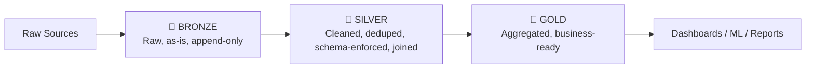
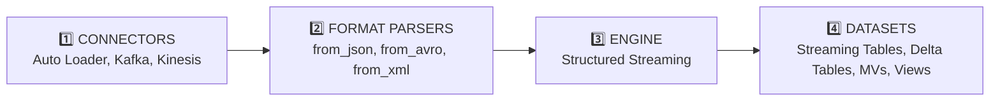
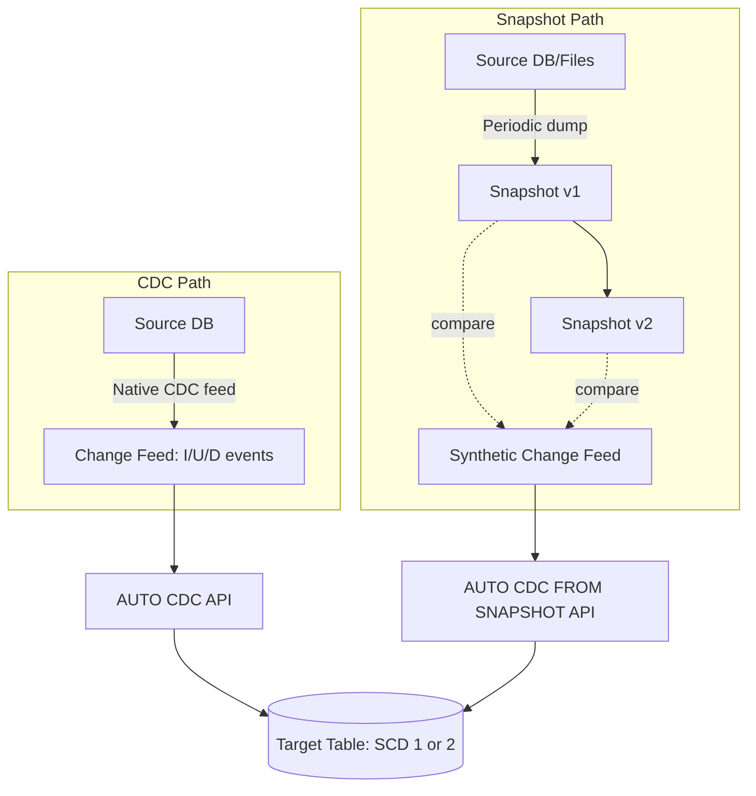
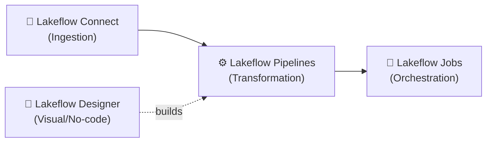

# Databricks & Lakehouse — Consolidated Revision Notes

> Consolidated from three source documents into one structured, non-redundant reference.
> Format per topic: **Definition → Key Details → Interview-Ready Line**

---

## 📌 Contents
1. [Lakehouse Foundations](#1-lakehouse-foundations)
2. [Unity Catalog & Data Organization](#2-unity-catalog--data-organization)
3. [Medallion Architecture](#3-medallion-architecture)
4. [Delta Lake Internals](#4-delta-lake-internals)
5. [Batch vs. Streaming](#5-batch-vs-streaming)
6. [CDC, Snapshots & SCD](#6-cdc-snapshots--scd)
7. [The Lakeflow Suite](#7-the-lakeflow-suite)
8. [Auto Loader](#8-auto-loader)
9. [Lakeflow Declarative Pipelines](#9-lakeflow-declarative-pipelines)
10. [Lakeflow Jobs & Orchestration](#10-lakeflow-jobs--orchestration)
11. [Compute & Cost](#11-compute--cost)
12. [One-Page Glossary](#12-one-page-glossary)

---

## 1. Lakehouse Foundations

### 1.1 The Problem: Why Plain Data Lakes Aren't Enough
**Definition:** A data lake (raw Parquet/CSV/JSON on S3/ADLS/HDFS) gives cheap, flexible storage with **schema-on-read** — but no engine enforces correctness at write time.

**Key problems this causes:**

| Problem                   | What happens                                                                     |
|---------------------------|----------------------------------------------------------------------------------|
| No write-time validation  | Malformed/wrong-type data written silently                                       |
| Partial writes on failure | A crashed job leaves half-written files; readers see corrupt data with no signal |
| No ACID guarantees        | No atomicity, no isolation between concurrent readers/writers                    |
| No time travel            | Once overwritten/deleted, previous state is gone — no audit trail, no rollback   |

**Interview line:** *"A data lake is cheap and flexible but has no transactional layer — Delta Lake (or Iceberg/Hudi) adds a metadata layer on top of the same Parquet files to bring warehouse-grade reliability (ACID, schema enforcement, time travel) without losing the lake's scale and cost profile. That combination is the Lakehouse."*

### 1.2 Lakehouse vs. Data Warehouse vs. Data Lake

|                      | Data Warehouse  | Data Lake                  | Data Lakehouse                    |
|----------------------|-----------------|----------------------------|-----------------------------------|
| Data types           | Structured only | Any format                 | Any format                        |
| ACID compliance      | ✅ Yes           | ❌ No                       | ✅ Yes (via Delta Lake)            |
| Governance           | Strong          | Weak/inconsistent          | Strong (via Unity Catalog)        |
| Schema approach      | Schema-on-write | Schema-on-read             | Both, enforced where needed       |
| ML/DS support        | Limited         | Strong                     | Strong                            |
| BI query performance | Very fast       | Weak without extra tooling | Fast (optimized)                  |
| Cost at scale        | Expensive       | Cheap                      | Cheap, warehouse-like performance |
| Concurrency handling | Strong          | Limited                    | Strong, via ACID                  |

**Memory hook:** Warehouse = fast/rigid/expensive. Lake = cheap/flexible/no guarantees. Lakehouse = both.

### 1.3 The Two Core Technologies

**Delta Lake** — an optimized storage layer on top of Parquet adding:
- ACID transactions (safe concurrent reads/writes)
- Schema enforcement + controlled schema evolution
- *This is what gives the lakehouse warehouse-like reliability while data still sits in cheap object storage.*

**Unity Catalog** — unified governance for data *and* AI assets:
- Central access control and data isolation boundaries
- Data lineage tracking end-to-end
- One consistent governance model across SQL, ML, and streaming workloads

---

## 2. Unity Catalog & Data Organization

**Definition:** Unity Catalog organizes all data/AI assets in a **three-level namespace**: `catalog.schema.table`.

```
Catalog (environment/business unit, e.g. prod/dev)
  └─ Schema (a.k.a. database — group of related objects)
       ├─ Table (structured rows & columns)
       └─ Volume (raw files: CSV, JSON, images — non-tabular)
```

**Handy commands:**
```sql
SELECT current_catalog(), current_schema();
SHOW TABLES; SHOW VOLUMES; LIST '<path>';

-- CTAS from raw files
CREATE TABLE IF NOT EXISTS employees AS
SELECT * FROM read_files('/Volumes/catalog/schema/myfiles/employees.csv',
  format => 'csv', header => true, inferSchema => true);

-- Incremental SQL-native loading (lighter alternative to Auto Loader)
COPY INTO employees FROM '/Volumes/catalog/schema/myfiles/' FILEFORMAT = CSV;
```
`COPY INTO` tracks already-loaded files, so reruns only pick up new ones.

**Lineage:** full column/table-level lineage is viewable directly in Catalog Explorer for any UC-registered table.

**Interview line:** *"Unity Catalog is a three-level namespace — catalog, schema, table/volume — that gives one governance model (access control, lineage, audit) across every workload type, replacing the old per-workspace Hive Metastore silos."*

---

## 3. Medallion Architecture

**Definition:** A layered design pattern — **Bronze → Silver → Gold** — where data quality and refinement increase at each stage.



| Layer      | Purpose               | Key behaviors                                                                                                                                              |
|------------|-----------------------|------------------------------------------------------------------------------------------------------------------------------------------------------------|
| **Bronze** | Raw ingestion         | No cleanup/validation; faithful copy of source as Delta; append-only; grows incrementally                                                                  |
| **Silver** | Cleaning & validation | Drop nulls, quarantine invalid rows, dedupe, normalize; handle late/out-of-order data; join into combined datasets; schema-on-write with evolution support |
| **Gold**   | Business-ready        | Aggregated per business logic (e.g. "monthly revenue by region"); optimized for BI/dashboard performance; traceable back to raw source via UC lineage      |

**Interview line:** *"Bronze is the immutable source of truth, Silver is where correctness/dedup/joins happen, Gold is shaped specifically for the consumer — and Unity Catalog lineage lets you trace any Gold number back to its raw Bronze origin."*

---

## 4. Delta Lake Internals

### 4.1 ACID Transactions
**Definition:** Delta brings all four ACID properties to lake writes **without a traditional database engine** — just Parquet files + an append-only transaction log.

| Property | What it means in Delta |
|---|---|
| Atomicity | A write fully commits or has zero effect — no partial files ever visible |
| Consistency | Table always reflects a schema-valid state after every commit |
| Isolation | Concurrent readers/writers don't see uncommitted changes (snapshot isolation via the log) |
| Durability | Once committed, permanently recorded in the log + files |

### 4.2 The Transaction Log (`_delta_log`)
**Definition:** A hidden directory that is the single source of truth for "what does this table look like right now."

```
/mnt/delta/customers/
 ├── status=active/part-00000....parquet
 ├── status=inactive/part-00000....parquet
 └── _delta_log/
      ├── 00000000000000000000.json   # commit 0
      ├── 00000000000000000001.json   # commit 1
      ├── 00000000000000000010.checkpoint.parquet
      └── _last_checkpoint
```

**How it works:**
- Every write creates a new **numbered JSON commit** listing files **added**/**removed** — Delta never mutates a file in place.
- Current state = replay the log **from the last checkpoint forward**.
- **Checkpoints**: a periodic Parquet snapshot (default every 10 commits) of the full current state, so readers don't replay from commit 0 every time.
- Commits are atomic via optimistic concurrency (see 4.3).

**Interview line:** *"Delta is just Parquet plus an ordered, atomically-written JSON log of add/remove file actions. Readers reconstruct current state from the latest checkpoint plus any commits after it — that's the entire mechanism, no external database needed."*

### 4.3 Optimistic Concurrency Control (OCC)
**Definition:** Multiple writers can attempt writes simultaneously; Delta doesn't lock — it detects conflicts at commit time.

**Flow:** writer reads current version → computes changes with no lock → tries to atomically write `version+1` → if someone beat it there, Delta checks whether the two commits **actually touch overlapping files/partitions**:
- **No overlap** → safe to retry automatically against the new version.
- **Overlap (conflict)** → commit fails; application must retry.

**Two named exceptions (streaming `MERGE` context):**
- **`ConcurrentAppendException`** — your transaction's matched-file-set is now stale because a concurrent write added files in the range you were scanning (e.g., two concurrent `MERGE`s on overlapping partitions).
- **`ConcurrentTransactionException`** — two commits from the **same streaming query's application ID** collide (protects exactly-once idempotency for a single logical stream, e.g., an accidental duplicate stream start).

**Architecting around conflicts:** partition/shard concurrent writers onto disjoint key ranges; scope `MERGE ON` predicates tightly (e.g., always partition-prune); implement retry-with-backoff in application code (Delta doesn't auto-retry conflicting commits); serialize genuinely overlapping writers through one upstream stream if disjointness isn't achievable.

**Interview line:** *"OCC means no locking — writers just try to commit the next version and get rejected if a real conflict occurred. `ConcurrentAppend` = your read-set went stale; `ConcurrentTransaction` = a duplicate write from the same streaming source."*

### 4.4 Time Travel
**Definition:** Query the table as it existed at a previous version/timestamp, since every historical state is reconstructable from the log.

```python
spark.read.format("delta").option("versionAsOf", 0).load("/mnt/delta/customers")
spark.read.format("delta").option("timestampAsOf", "2026-06-30").load("/mnt/delta/customers")
```
```sql
SELECT * FROM employees VERSION AS OF 0;   -- or employees@v0
DESCRIBE HISTORY employees;                 -- version, timestamp, operation, userName
```

**How it works:** resolve version/timestamp → replay log up to that commit → get file list → read those Parquet files **if they still physically exist**.

**Critical interaction:** time travel breaks the moment `VACUUM` deletes the files a historical version depends on (see 4.8).

### 4.5 Schema Enforcement vs. Schema Evolution
**Definition:**
- **Enforcement** (default) — writes are **rejected** if schema doesn't match (wrong names/types/extra/missing columns). Protects against silent corruption.
- **Evolution** — explicit opt-in to allow a schema-changing write to succeed.

```python
df.write.format("delta").mode("append").option("mergeSchema", "true").save(...)
# or session-wide: spark.databricks.delta.schema.autoMerge.enabled = true
```

**Rule of thumb:** keep enforcement **on** everywhere by default; enable evolution deliberately for known, intentional changes only — not as a blanket setting.

**The Four Independent Components (deeper mental model):** schema evolution is handled **separately** at four pipeline stages — misconfiguring any one breaks the chain:



| Stage              | Behavior summary                                                                                                                                                                          |
|--------------------|-------------------------------------------------------------------------------------------------------------------------------------------------------------------------------------------|
| **Connectors**     | Auto Loader/Delta connector handle new columns, renames, drops, type-widening well; Kafka/Kinesis/Pub-Sub deliver raw binary — evolution is entirely delegated to the Format Parser stage |
| **Format Parsers** | `from_json`/`from_csv`/`from_xml` = manual by default; `from_avro`/`from_protobuf` = automatic **only** with Confluent Schema Registry                                                    |
| **Engine**         | Structured Streaming locks schema at planning time — **any** mid-execution schema change fails the query; requires a manual restart to re-plan                                            |
| **Datasets**       | **Delta Tables = most flexible** (most changes need no rewrite, `mergeSchema` handles most cases); **Materialized Views = least flexible** (any schema change forces a full recompute)    |

**Interview line:** *"Schema evolution isn't one setting — it has to be configured independently at the connector, parser, engine, and target-table level. Delta tables are the most forgiving target; materialized views are the least, since any change there triggers a full recompute."*

### 4.6 MERGE (Upsert)
**Definition:** SQL-style `MERGE INTO` performs insert + update + delete in a **single atomic operation** — the backbone of CDC-style upserts.

```sql
MERGE INTO customers AS target
USING updates AS source
ON target.customer_id = source.customer_id
WHEN MATCHED THEN UPDATE SET target.name = source.name, target.email = source.email
WHEN NOT MATCHED THEN INSERT (customer_id, name, email) VALUES (source.customer_id, source.name, source.email)
```
```python
from delta.tables import DeltaTable
DeltaTable.forPath(spark, path).alias("target").merge(
    updates_df.alias("source"), "target.customer_id = source.customer_id"
).whenMatchedUpdate(set={...}).whenNotMatchedInsert(values={...}).execute()
```
Add `.whenMatchedDelete()` for full upsert+delete/soft-delete/CDC handling.

**Interview line:** *"MERGE is atomic — it either fully succeeds or fully fails, so a reader never sees a half-applied upsert. This is the mechanism virtually every CDC pipeline is built on."*

### 4.7 OPTIMIZE / Compaction & Z-Ordering
**`OPTIMIZE`** — bin-packs many small files into fewer, right-sized files (~1GB target), without changing logical data. It's a normal atomic commit: adds new files, marks old ones removed (doesn't physically delete — that's `VACUUM`'s job, which is also why time travel to a pre-`OPTIMIZE` version still works until vacuumed).
```python
delta_table.optimize().executeCompaction()
```

**`ZORDER BY`** — runs during `OPTIMIZE`; co-locates related values **across multiple columns** using a space-filling curve, maximizing file-level min/max-stat data skipping.
```sql
OPTIMIZE customers ZORDER BY (customer_id, region);
```

**Partitioning vs. Z-Ordering:**

|                  | Partitioning                                   | Z-Ordering                           |
|------------------|------------------------------------------------|--------------------------------------|
| Mechanism        | Physically separates data into **directories** | Sorts/clusters data **within** files |
| Best cardinality | Low/medium                                     | Works well even for high cardinality |
| Columns          | Typically 1                                    | Multiple, simultaneously             |
| Skew risk        | High-cardinality key → small-file explosion    | No directory explosion               |
| Use case         | Coarse filtering (e.g. `date`)                 | Fine-grained multi-column filtering  |

**When Z-Ordering can hurt:** too many Z-Order columns (curve loses discriminating power past ~3–4); Z-Ordering a column never actually filtered on in production queries (wasted compute, zero benefit); running it too frequently on a fast-changing table (full rewrite cost each time, write amplification); mixing with Liquid Clustering on the same table (alternative, not complementary, strategies).

**Interview line:** *"Partitioning answers 'which folder do I look in'; Z-Ordering answers 'within these files, are the rows I need physically packed together.' Z-Ordering is a data-skipping investment — its cost only pays off if you're actually filtering on those exact columns."*

### 4.8 VACUUM
**Definition:** **Physically deletes** data files no longer referenced by the current version **and** older than the retention threshold (default 7 days / 168 hours).
```python
delta_table.vacuum(168)
```
```sql
VACUUM customers RETAIN 168 HOURS;
```
- Only removes files already marked "removed" by a prior commit (merge/optimize/delete) **and** past retention.
- **Danger:** a concurrent streaming query or long-running batch reader holding file references from before the vacuum will hit a file-not-found error if those files get deleted mid-read. `RETAIN 0 HOURS` removes this safety margin entirely and should be used only in tightly controlled scenarios (e.g., pre-drop cleanup), never routinely on a live production table.
- Breaks time travel to any version depending on the deleted files.

**Interview line:** *"VACUUM's retention window is a concurrency safety margin for readers holding stale file references — not just a storage-cleanup setting. Reducing it to zero on a live table is destructive."*

---

## 5. Batch vs. Streaming

|                     | Batch                                        | Streaming (Structured Streaming)                           |
|---------------------|----------------------------------------------|------------------------------------------------------------|
| Data scope per run  | Everything currently available               | Only new data since last run                               |
| Logic complexity    | Simpler — static, complete snapshot each run | More complex — stateful ops, late/out-of-order data        |
| Result completeness | Always complete for that run                 | Can be affected by late-arriving data                      |
| Typical latency     | Minutes to hours                             | Seconds (triggered/micro-batch) to sub-second (continuous) |
| Spark API           | `spark.read` / `spark.write`                 | `spark.readStream` / `spark.writeStream`                   |

**Key Databricks nuance:** "streaming" here has a **broader meaning** than Kafka — cloud object storage and Delta tables themselves are treated as streaming sources, enabling incremental-only processing.

- **Checkpointing** tracks what's already processed so only new data is picked up on each run.
- **Trigger modes:** **Triggered/micro-batch** (fixed interval) vs. **Continuous** (near real-time, more operational complexity).
- **Watermarking** is what lets streaming decide when a result is "final" despite late-arriving data — batch never needs this since it always sees the complete picture.

**Interview line:** *"Batch always sees a complete snapshot, so it never has to answer 'is this result final yet.' Streaming does — that's exactly the problem watermarking solves."*

---

## 6. CDC, Snapshots & SCD

### 6.1 CDC vs. Snapshots
**CDC (Change Data Capture)** — treats a source DB as a **stream of changes** (insert/update/delete).
- each with operation type, values, and a sequence number/timestamp for correct ordering. 
- Native DB CDC via Debezium/GoldenGate; Delta's own version is **CDF**
**Why CDC:** 
- change data is much smaller than the full dataset (efficient incremental processing); 
- enables reconstructing full historical state (audit trail, point-in-time reporting); 
- enables stable surrogate keys over time.

**Snapshot** — 
- the **complete state** at one point in time.
- Used when CDC isn't available (cost/performance impact on source, legacy systems, lack of upstream ownership). 
- Since a snapshot alone shows no deltas, you must **compare consecutive snapshots** to infer changes.




### 6.2 SCD Type 1 vs. Type 2

|           | SCD Type 1                                                                          | SCD Type 2                                                                         |
|-----------|-------------------------------------------------------------------------------------|------------------------------------------------------------------------------------|
| Behavior  | Overwrites old with new — **no history**                                            | Maintains **multiple versions**, each timestamped                                  |
| Mechanism | In-place update                                                                     | `__START_AT` / `__END_AT` columns; current row has `__END_AT = NULL`               |
| Use when  | Only current state matters; want incremental MV refresh; need stable surrogate keys | Auditability/regulatory needs; entity-evolution analytics; point-in-time reporting |


---

## 7. The Lakeflow Suite

**Definition:** Lakeflow is Databricks' end-to-end data engineering suite — ingestion, transformation, and orchestration in one connected system.



| Piece                  | What it does                                                                                                                                                                                                                                                                                                                                                  |
|------------------------|---------------------------------------------------------------------------------------------------------------------------------------------------------------------------------------------------------------------------------------------------------------------------------------------------------------------------------------------------------------|
| **Lakeflow Connect**   | Managed (config-based, no-code) and standard (more flexible) connectors for DBs, SaaS, storage, message buses, files. Tracks ingested state for incremental, resumable reruns. Open — you can bring your own tooling. For niche APIs/unusual auth/no pre-built connector, you still write custom ingestion (e.g., Auto Loader or a custom Spark data source). |
| **Lakeflow Pipelines** | Transforms raw data into clean, business-ready tables — where Declarative Pipelines (formerly DLT) lives (Section 9).                                                                                                                                                                                                                                         |
| **Lakeflow Designer**  | Visual drag-and-drop or natural-language pipeline building; can ingest directly, not just transform; supports natural-language pipeline edits.                                                                                                                                                                                                                |
| **Lakeflow Jobs**      | Orchestrates/schedules everything — notebooks, pipelines, SQL, ML training — as one workflow (Section 10).                                                                                                                                                                                                                                                    |

**Memory hook:** *Connect gets it in, Pipelines shape it, Designer is the no-code way to build Pipelines, Jobs runs/schedules it all.*

---

## 8. Auto Loader

**Definition:** Incrementally and efficiently processes **new files** arriving in cloud storage, exposed as the Structured Streaming source **`cloudFiles`**.

**Why not plain file-based streaming:** plain streaming re-lists the **entire** directory every trigger — slow/expensive at millions of files. Auto Loader tracks discovered file metadata in a scalable state store instead, avoiding full re-scans.

**State tracking:** file metadata persisted in a scalable key-value store (**RocksDB**) inside the checkpoint location; on failure, resumes exactly where it left off → **exactly-once** guarantees into Delta. Inside Lakeflow Pipelines, schema/checkpoint locations are typically managed automatically.

**Discovery modes:**

| Mode | Mechanism | Best for |
|---|---|---|
| **Directory Listing** (default) | Optimized lexicographical listing scan | Small–medium volume (< a few million files) |
| **File Notification** | Cloud-native event queue (S3→SQS, Azure Event Grid→Storage Queue) | Large scale (tens of millions of files/day) |

**Schema inference & evolution:** samples a subset of files (`cloudFiles.maxFilesPerTrigger`) rather than scanning the whole dataset; handles upstream schema drift automatically per configured `schemaEvolutionMode`.

**Bad/malformed data — two safety nets:**
- **`_rescued_data` column** — auto-captures data that doesn't cleanly fit the schema (type mismatches, case mismatches, undeclared fields) instead of dropping it.
- **`badRecordsPath`** — redirects completely unparseable records (corrupted CSV row, truncated JSON) to a separate path as JSON, while the main stream keeps running.

**Backfilling without reprocessing everything:**
```python
# Option A: time-based filter for a one-time historical batch
.option("modifiedAfter", "2023-01-01T00:00:00.000Z")
.option("modifiedBefore", "2023-12-31T23:59:59.000Z")

# Option B: dedicated checkpoint (NEVER reuse the production checkpoint)
.option("checkpointLocation", "s3://bucket/checkpoints/backfill_2023/")
.trigger(availableNow=True)   # process all matches, then stop
```

**Interview line:** *"Auto Loader solves the re-listing bottleneck of plain streaming by tracking discovered files in a RocksDB-backed checkpoint — that's what gives it exactly-once, resumable ingestion at scale."*

---

## 9. Lakeflow Declarative Pipelines

*(Formerly Delta Live Tables / DLT — same engine, rebranded.)*

### 9.1 Imperative vs. Declarative
**Imperative** — you write every step and manage sequencing/dependencies yourself.
**Declarative** — you describe *what* each table should contain; the engine figures out execution order, parallelism, and retries by analyzing dependencies between defined datasets.

### 9.2 Three Dataset Types

| Type                  | Processing semantics                                                                                               | Use case                                                                       |
|-----------------------|--------------------------------------------------------------------------------------------------------------------|--------------------------------------------------------------------------------|
| **Streaming Table**   | Each record processed exactly once (append-only source assumed); a Delta table with incremental-processing support | Ongoing ingestion of continuously-arriving data                                |
| **Materialized View** | Recomputed as needed to reflect current state; engine decides refresh scope                                        | Aggregations that must always reflect latest data without manual refresh logic |
| **View**              | Evaluated on demand, never persisted                                                                               | Intermediate transformation steps that don't need a catalog table              |

**Refresh policy trade-off:** 
- continuous/triggered-continuous = lowest latency, highest cost; 
- triggered/scheduled = higher latency, materially lower cost — set per table based on actual downstream SLA, not a blanket default.

### 9.3 Flows, Sinks & Pipelines
- **Flow** — foundational unit: read → transform → write; supports Append/Update/Complete streaming semantics.
- **Sink** — external streaming target (Delta tables, Kafka, Event Hubs, UC external tables, custom Python sinks).
- **Pipeline** — the container holding all Flows/Tables/Views/Sinks; auto-analyzes dependencies and orchestrates execution + parallelism.

```python
import dlt
from pyspark.sql.functions import sum, count

@dlt.table(name="raw_orders")
def raw_orders():
    return spark.readStream.format("cloudFiles").option("cloudFiles.format", "json").load("s3://bucket/orders/")

@dlt.table(name="daily_sales_summary")
def daily_sales_summary():
    return dlt.read("raw_orders").groupBy("order_date").agg(sum("amount").alias("total_revenue"))
```

**Automatic DAG detection:** the engine scans source code for dataset references (`LIVE.x` in SQL, `dlt.read("x")` in Python), builds an in-memory DAG, and runs independent datasets **concurrently** with no manual sequencing.

### 9.4 Data Quality — Expectations
**Definition:** declarative validation rules attached to a dataset, checked as data flows through.

```sql
CREATE OR REFRESH STREAMING TABLE clean_orders (
  CONSTRAINT valid_amount EXPECT (amount > 0) ON VIOLATION DROP ROW,
  CONSTRAINT valid_id EXPECT (order_id IS NOT NULL) ON VIOLATION FAIL UPDATE
)
AS SELECT * FROM STREAM(LIVE.raw_orders);
```

| Violation mode | Behavior |
|---|---|
| `WARN` (default) | Record passes through; violation only logged in metrics |
| `DROP ROW` | Bad record filtered out before reaching target |
| `FAIL UPDATE` | **Halts the entire pipeline** on first violation — reserve for truly critical constraints |

### 9.5 Dev Mode vs. Production Mode

| | Development | Production |
|---|---|---|
| Compute lifecycle | Stays warm between runs | Terminates immediately after completion |
| Retries | Disabled — errors surface instantly | Automatic, progressive retries |
| Purpose | Fast iterative testing | Cost-efficient, resilient execution |

### 9.6 Diagnosing a Failed Pipeline Run
1. **DAG visualization** — Pipeline UI highlights failed nodes in red.
2. **Event log** — `SELECT timestamp, message, level, details FROM event_log("pipeline-id") WHERE level = 'ERROR'`.
3. **Data quality metrics** — if failure was `FAIL UPDATE`, check which constraint broke and row count.
4. **Classify:** transient (network/cluster blip) → auto-retries progressively; deterministic (schema mismatch, bad logic) → fails permanently until the actual code/data is fixed.

**Interview line:** *"Declarative pipelines trade control for automation — they're excellent when the pipeline genuinely is a DAG of tables with transformation logic, and a poor fit the moment you need imperative branching or non-table-shaped side effects."*

---

## 10. Lakeflow Jobs & Orchestration

**Core concepts:**
- **Job** — coordinates/schedules/runs work, from a single notebook to hundreds of conditional tasks; visualized as a DAG. Configurable: Trigger, Parameters, Notifications, Git source control.
- **Task** — a unit of work (notebook, pipeline, Python script, SQL query, ML training, etc.); supports dependencies and conditional execution.
- **Trigger** — what kicks off a run: time-based (schedule) or event-based (e.g., new data landing).
- **Control flow:** branching (if/else) and looping (for-each) supported via the visual authoring UI.

**Monitoring:** Job UI (owner, last result, run history, per-task detail); run status/logs/metrics per task; notifications (email/Slack/webhooks); **system tables** for account-wide SQL queries on job history, joinable with billing tables for cost dashboards.

**Workspace limits (good to know for design discussions):**

| Limit | Value |
|---|---|
| Concurrent task runs/workspace | 2,000 (HTTP 429 beyond this) |
| Jobs created/hour | 10,000 |
| Saved jobs/workspace | 12,000 |
| Tasks/job | 1,000 |
| Dynamic parameter value length | 10,000 chars |

---

## 11. Compute & Cost

### 11.1 The Three Compute Types

| Type | What it is |
|---|---|
| **Serverless** | Fully managed, auto-scales, you provision nothing |
| **Classic** | VMs you create/configure/manage yourself |
| **SQL Warehouses** | Optimized specifically for SQL workloads; can be serverless or classic underneath |

### 11.2 Classic vs. Serverless

| | Classic | Serverless |
|---|---|---|
| How it works | VMs provisioned in **your** cloud subscription/VPC | Runs in a pre-warmed pool inside Databricks' control plane |
| Startup time | Slow — 3–7+ min | Near-instant — seconds |
| Scaling | Waits on cloud provider provisioning | Automatic, **scale-to-zero** |
| Control | Full — custom VPC, security, libraries, specific hardware | Limited — custom networking/legacy libraries may need extra config |
| Operational overhead | High — you own infra | Near-zero |

### 11.3 Clusters vs. SQL Warehouses

| | Clusters (DE/ML/DS) | SQL Warehouses (BI/Analytics) |
|---|---|---|
| Engine | General-purpose Spark | Photon (vectorized C++) |
| Languages | Python, Scala, SQL, R, ML libs | ANSI SQL only |
| Typical use | Notebooks, pipelines, ML training | BI dashboards, interactive SQL |
| Sizing | Node count (Driver + Workers) | T-shirt size (2X-Small → Large) |

### 11.4 All-Purpose vs. Job Compute

| | All-Purpose | Job Compute |
|---|---|---|
| Created | Manually, for interactive work | Dynamically, by Workflows/Jobs |
| Sharing | Multiple users share one cluster | Dedicated to one job execution |
| Lifecycle | Runs until manually paused/auto-terminated | Terminates immediately on job completion |
| Relative DBU cost | ~3x higher | ~1x (baseline) |

**Practical rule:** scheduled production pipelines → **Job Compute** (cheaper, auto-terminates); interactive notebook work during the day → **All-Purpose**. Leaving All-Purpose clusters idle is one of the most common silent cost leaks in Databricks billing.

### 11.5 DBUs
Billing is based on **DBUs (Databricks Units)** — processing capability consumed per hour, varying by compute type/size. Job Compute's lower DBU rate vs. All-Purpose is exactly why production workloads shouldn't run on shared interactive clusters.

---

## 12. One-Page Glossary

| Term | One-liner |
|---|---|
| Lakehouse | Data-lake flexibility/cost + data-warehouse reliability/performance |
| Delta Lake | Storage layer adding ACID + schema enforcement on Parquet |
| Unity Catalog | Unified governance: access control, lineage, audit across data & AI |
| `_delta_log` | Ordered JSON commit log = source of truth for table state |
| Checkpoint (Delta) | Periodic Parquet snapshot of full state, avoids replaying from commit 0 |
| OCC | No locking — writers commit optimistically, conflicts detected/rejected at commit time |
| Time Travel | Query a table as of a past version/timestamp via the log |
| Schema Enforcement | Default: reject writes that don't match table schema |
| Schema Evolution | Opt-in: allow specific schema-changing writes to succeed |
| MERGE | Atomic insert+update+delete in one operation |
| OPTIMIZE | Compacts small files into fewer, larger ones |
| ZORDER | Multi-column co-location within files for better data skipping |
| VACUUM | Physically deletes old, unreferenced files past retention |
| CDF | Row-level change events (insert/update/delete) queryable incrementally |
| Medallion Architecture | Bronze (raw) → Silver (cleaned) → Gold (aggregated/business-ready) |
| Batch | All available data processed at once; simple, higher latency |
| Streaming | Only new data processed incrementally; complex, lower latency |
| CDC | Treats a DB as a stream of I/U/D changes, not a static dump |
| Snapshot | Full table state at one point in time; changes inferred by diff |
| SCD Type 1 | Overwrite — current state only |
| SCD Type 2 | New row per change, `__START_AT`/`__END_AT` validity window |
| AUTO CDC | Applies a native change feed to a target as SCD 1/2 |
| AUTO CDC FROM SNAPSHOT | Infers a synthetic change feed from consecutive snapshots |
| Lakeflow | End-to-end suite: Connect (ingest) → Pipelines (transform) → Jobs (orchestrate) |
| Auto Loader (`cloudFiles`) | Incremental, stateful, exactly-once file ingestion |
| `_rescued_data` | Captures schema-mismatched fields instead of dropping them |
| `badRecordsPath` | Redirects unparseable records so the main stream keeps running |
| Declarative Pipelines (DLT) | Describe the result; engine handles orchestration/parallelism/retries |
| Streaming Table / MV / View | Exactly-once incremental / auto-recomputed / not persisted |
| Expectations | Declarative data quality rules: WARN / DROP ROW / FAIL UPDATE |
| Serverless vs. Classic | Instant/managed/scale-to-zero vs. full control but slow & self-managed |
| All-Purpose vs. Job Compute | Shared interactive (pricier) vs. dedicated per-job (cheaper) |
| DBU | Databricks' billing unit — processing capability consumed per hour |

---

*End of consolidated notes — use the [Contents](#-contents) above to jump to any topic for quick revision.*
