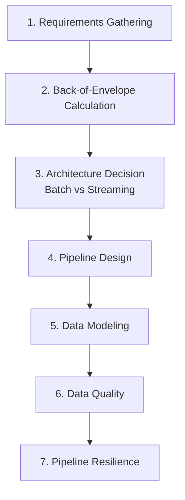
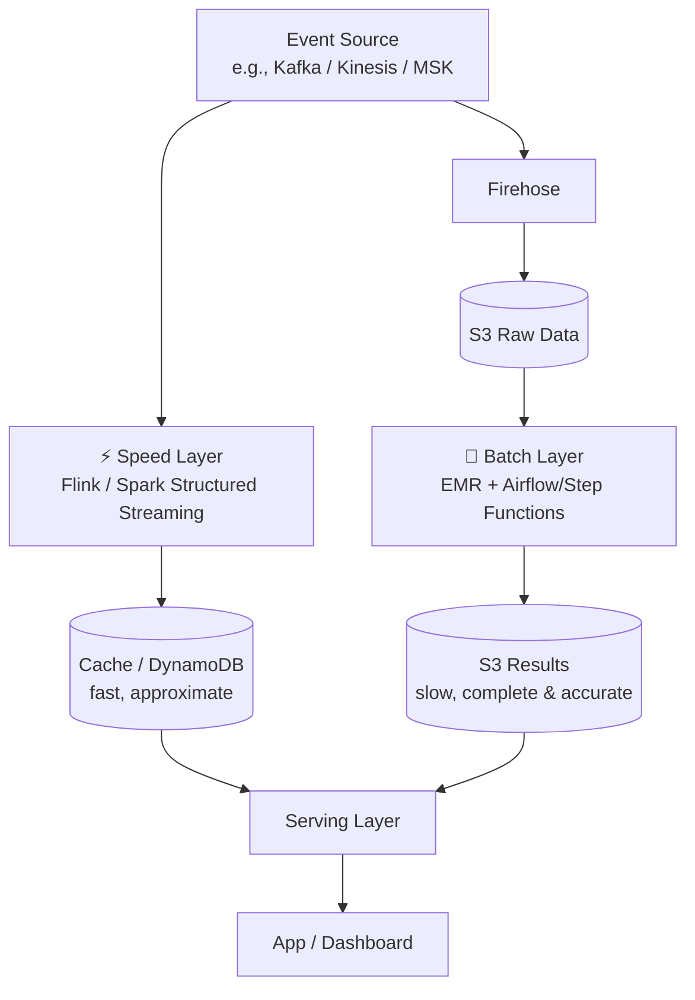
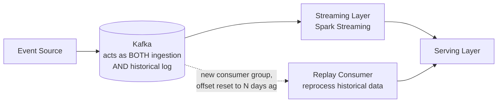
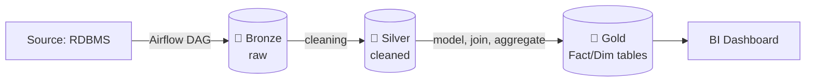
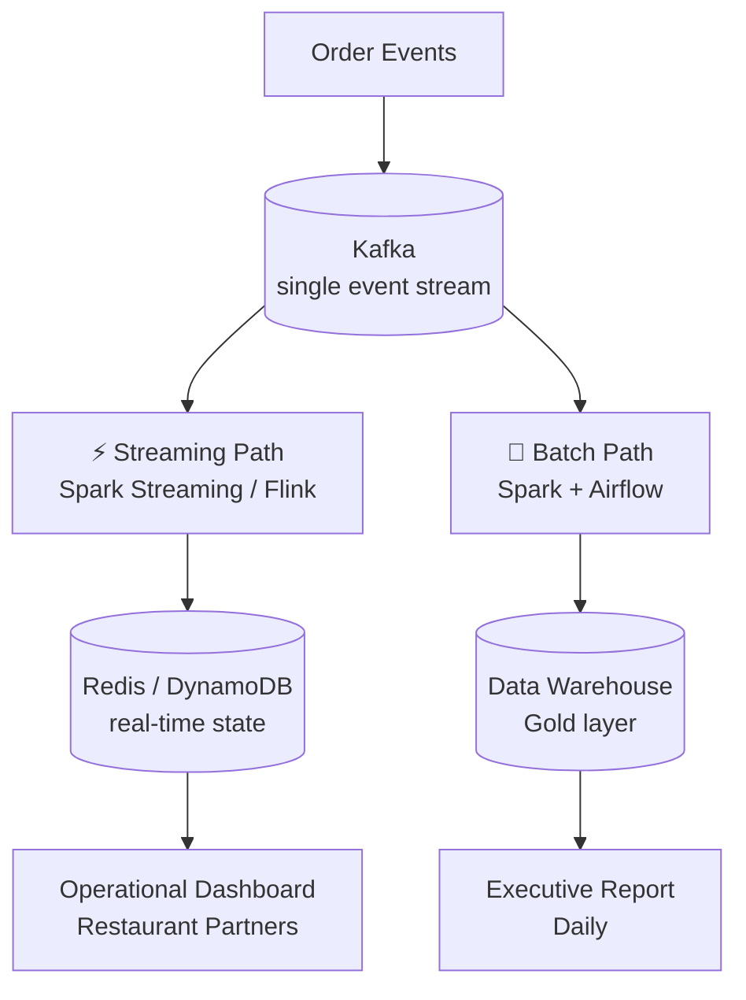

# System Design for Data Engineers  Study Guide

---

# PART 1  The Interview Framework

Every data engineering system design question no matter the domain (e-commerce, food delivery, ride-sharing)  can be worked through using the **same repeatable structure**. Learn this skeleton, not just the examples.



## 1. Requirements Gathering

This is the step candidates most often rush  **don't**. It's where you demonstrate senior-level thinking before writing a single line of architecture.

**Functional Requirements**  *what* the system needs to do:
1. **Who are the end users / consumers?** Different consumers often need fundamentally different architectures from the *same* underlying data.
   - Example: a **Marketing Analyst** needs a daily aggregated report (→ points you toward **Batch**). An **ML team** needs live product recommendations (→ points you toward **Streaming**).
2. **What do they actually need?** Aggregated metrics? Raw events? Historical snapshots? Each has different storage/processing implications.
3. **How will they access it?** BI dashboards, SQL, a REST API  this affects your **serving layer** choice (a data warehouse vs. a low-latency key-value store like Redis).

**Non-Functional Requirements**  *how well* it needs to do it:

| Requirement        | Key question to ask                          | Typical answers                                                                               |
|--------------------|----------------------------------------------|-----------------------------------------------------------------------------------------------|
| **Latency SLA**    | How fresh does the data need to be?          | Batch: ~1 hour+. Streaming: seconds to minutes.                                               |
| **Volume**         | How much data are we actually talking about? | MBs-GBs → Pandas/Polars is fine. TBs-PBs → need Spark + partitioning.                         |
| **Availability**   | How much downtime is tolerable?              | e.g., "10 minutes/month"  drives redundancy design.                                           |
| **Data Retention** | Keep forever, or expire after N days/years?  | Often split: short retention for hot/real-time data, long retention for historical/analytics. |

> **Tutor's Tip:** In interviews, **always ask these questions out loud before designing anything.** Interviewers are explicitly testing whether you jump straight to "I'll use Kafka and Spark" (junior mistake) or first pin down *why* you'd need them (senior signal).

## 2. Back-of-Envelope Calculation

A rough but structured estimate of scale  this is what justifies *every* downstream architecture decision (you don't "choose Spark" because it's trendy; you choose it because the math says so).

**The general method:**
1. Estimate **users/entities** and their **activity rate** (events per session, orders per day, etc.).
2. Multiply out to get **total events/records per day**.
3. Estimate **size per record** (usually a JSON event, ~0.5–1KB is a common starting assumption).
4. Multiply to get **raw daily volume**, then extrapolate to **monthly/yearly**.
5. Apply a **compression ratio** (Parquet/columnar formats typically compress 2–5x) to estimate **actual stored size**.
6. Convert daily/hourly volume into **events per second** to sanity-check whether your ingestion layer (e.g., Kafka) can handle it.

> **Tutor's Tip:** Interviewers care far more about your **method** than getting the exact right number. Show your formula, state your assumptions explicitly ("let's assume 1KB per event"), and move on  don't get stuck doing precise arithmetic under pressure.

## 3. Architecture Decision  Batch vs. Streaming

The single most important early decision, and it usually comes down to one trade-off:

> **Cost > Latency → Batch.**  **Latency requirement < 1 minute → Streaming.**

|                   | Batch                                                             | Streaming                                                                                                                 |
|-------------------|-------------------------------------------------------------------|---------------------------------------------------------------------------------------------------------------------------|
| **When to use**   | Latency SLA is hours (reports, dashboards refreshed periodically) | Latency SLA is seconds-to-minutes (live recommendations, operational alerts)                                              |
| **Typical stack** | Airflow (orchestration) + Spark (processing) + S3/ADLS (storage)  | Kafka (ingestion) + Spark Structured Streaming/Flink (processing) + Delta table (history) + Redis/DynamoDB (fast serving) |
| **Cost**          | Cheaper  runs on a schedule, not always-on                        | More expensive  infra runs continuously                                                                                   |
| **Complexity**    | Simpler to build and debug                                        | Harder  must handle late data, ordering, state                                                                            |

> **Why This Matters in Interviews:** Don't default to streaming because it "sounds more impressive." A senior engineer's job is to pick the **simplest architecture that meets the actual SLA**  recommending Kafka+Flink for a report that's needed once a day is a red flag, not a strength.

---

# PART 2  Core Architecture Patterns: Lambda vs. Kappa

When a system genuinely needs **both** a fast, low-latency view *and* accurate, complete historical results, two classic patterns come up repeatedly in interviews.

## 4. Lambda Architecture

Maintains **two separate processing systems** in parallel  one optimized for speed, one for completeness/accuracy  and merges their results at the serving layer.



- **Speed Layer**  processes events in real time (Flink/Spark Streaming), writes fast-but-possibly-approximate results to a cache/DynamoDB.
- **Batch Layer**  separately re-processes the full raw data (stored via Firehose → S3) on a schedule (EMR/Airflow), producing slower but **complete and accurate** results.
- **Serving Layer**  may or may not be shared; combines/reconciles both views so users get low latency now, corrected by an accurate batch recompute later.

**Downside:** you're maintaining **two separate codebases/pipelines** doing conceptually similar work  real operational and consistency burden (this is Lambda's most common interview criticism).

## 5. Kappa Architecture

Simplifies Lambda by using **one single pipeline** for everything  treating "batch" as just a special case of "replay."



- **Kafka is the single source of truth**  both for live ingestion *and* as the historical data store (as long as retention allows).
- All events flow through **one streaming pipeline** (Spark Streaming/Flink reads from Kafka, writes to the serving layer).
- **Need to reprocess history?** No separate batch system needed  just create a **new consumer group**, reset its offset back to the desired starting point, and **replay** the same stream through the same processing logic.

**Lambda vs. Kappa  Quick Comparison**

|                         | Lambda                                                                                   | Kappa                                                                                    |
|-------------------------|------------------------------------------------------------------------------------------|------------------------------------------------------------------------------------------|
| Pipelines to maintain   | Two (batch + speed)                                                                      | One                                                                                      |
| Complexity              | Higher (two codebases, reconciliation)                                                   | Lower (single codebase)                                                                  |
| Historical reprocessing | Separate batch job                                                                       | Replay via new Kafka consumer group + offset reset                                       |
| Best when               | You genuinely need very different processing logic for real-time vs. historical accuracy | Your processing logic is the same either way  just a matter of "how far back do I read?" |

> **Tutor's Tip:** In interviews, **Kappa is usually the more modern, favored answer** when the processing logic is the same for live and historical data  mention Lambda mainly to show you know the trade-off, then explain *why* you'd lean Kappa if applicable (simpler ops, one codebase). If asked "why not always Kappa?"  answer: Kafka retention has practical limits, and true Lambda still makes sense when live and historical processing genuinely need **different logic** (e.g., fast approximate speed-layer aggregation vs. a slow, fully-accurate batch recompute).

---

# PART 3  Data Modeling for Pipelines

*(Condensed here  see your dedicated Data Modeling and Databricks notes for full depth on each.)*

## 6. Medallion Architecture (Recap)
**Bronze** (raw, as-is) → **Silver** (cleaned, validated, joined) → **Gold** (aggregated, business-ready). See your Databricks Lakehouse notes for the full breakdown.

## 7. Star Schema vs. Denormalization (One Big Table)

| Approach                | Structure                                                                    | Trade-off                                                                                       |
|-------------------------|------------------------------------------------------------------------------|-------------------------------------------------------------------------------------------------|
| **Star Schema**         | `Fact_Orders` + `Dim_Customer` + `Dim_Products`, etc.                        | Normalized, less redundancy, but requires **joins** at query time.                              |
| **One Big Table (OBT)** | A single, pre-joined, denormalized orders table with everything flattened in | No joins needed at query time (fast, simple for BI tools), but **more storage** and redundancy. |

> **Tutor's Tip:** OBT has become increasingly popular in modern lakehouses because storage is cheap and columnar formats compress repeated values well  but star schema is still preferred when data is reused across many different fact tables (avoids duplicating the same dimension logic everywhere). See your Data Modeling notes for the full "Star vs. Snowflake vs. OBT" breakdown.

## 8. Slowly Changing Dimensions (SCD)  Recap
**Type 1** = overwrite (no history). **Type 2** = new row per change (full history). **Type 3** = extra "previous value" column (limited history). Full detail + Databricks-specific implementation already in your other notes.

## 9. Partitioning vs. Optimization

- **Partitioning**  physically splitting data (e.g., by `event_date`) so queries only scan relevant subsets.
  - **Primary partitioning**  the main column you partition by (e.g., date).
  - **Secondary partitioning**  a further sub-split within each primary partition (e.g., date → then region).
- **Liquid Clustering** (Databricks-specific)  a modern alternative to static partitioning that automatically and continuously reorganizes data layout based on actual query patterns, without you manually choosing/maintaining fixed partition columns. Solves the classic partitioning headache of picking the "wrong" column upfront and being stuck with it.

## 10. Storage Formats  Parquet vs. Avro

*(Your rough notes had the right facts but jumbled together  cleaned up below.)*

|              | **Parquet**                                                                                                                                   | **Avro**                                                                                        |
|--------------|-----------------------------------------------------------------------------------------------------------------------------------------------|-------------------------------------------------------------------------------------------------|
| **Layout**   | **Columnar**                                                                                                                                  | **Row-based**                                                                                   |
| **Best for** | **Read-heavy** workloads  analytics, aggregations                                                                                             | **Write-heavy** workloads  streaming ingestion, frequent appends                                |
| **Why**      | Enables **column pruning** (only read needed columns) and **partition pruning** (skip irrelevant partitions)  huge win for analytical queries | Efficient to append row-by-row; schema evolves gracefully for constantly-changing event streams |

**⚠️ The problem with plain Parquet files in a directory (no table format layer):**
- **No ACID guarantees**  two concurrent jobs writing to the same location can **corrupt or silently overwrite** each other's data.
- **No schema enforcement**  nothing stops incompatible data from landing in the same table.
- **The "small file problem"**  many tiny files (common with streaming writes) badly hurts read performance.

**The fix:** table-format layers like **Delta Lake, Apache Iceberg, or Apache Hudi** sit on top of Parquet and solve exactly these three problems (ACID transactions, schema enforcement, and automatic file compaction).

> **Why This Matters in Interviews:** If you propose "just write Parquet files to S3" for a production pipeline, expect a follow-up question about concurrent writes and small files  mentioning Delta/Iceberg/Hudi upfront shows you already know the gap.

## 11. Database Type  Relational vs. Non-Relational

|               | Relational (SQL)                                                                             | Non-Relational (NoSQL)                                                                                                  |
|---------------|----------------------------------------------------------------------------------------------|-------------------------------------------------------------------------------------------------------------------------|
| **Strengths** | Strong consistency, ACID guarantees, clear relationships, complex joins/queries              | Flexible/evolving schema, handles semi-structured data, optimized for speed & availability at scale                     |
| **Use when**  | Data structure is stable, correctness/consistency is critical (e.g., financial transactions) | Data structure varies/evolves often, or you need very high write throughput/low-latency lookups (e.g., a serving cache) |

---

# PART 4  Data Quality & Pipeline Resilience

## 12. Data Quality Dimensions

| Dimension        | What it checks                                            |
|------------------|-----------------------------------------------------------|
| **Completeness** | Is any expected data missing?                             |
| **Accuracy**     | Does the data correctly reflect reality?                  |
| **Consistency**  | Does the same fact agree across different systems/tables? |
| **Freshness**    | Is the data up to date, or stale?                         |
| **Uniqueness**   | Are there unwanted duplicate records?                     |

**Data Quality Contract**  checking these dimensions **at the point of ingestion**, not after the fact  catching bad data at the door instead of letting it flow downstream and pollute every layer built on top of it.

**Data Observability**  ongoing, automated monitoring of data pipelines' health (volume trends, freshness, schema drift, anomaly detection)  think of it as "application observability" (logs/metrics/traces) but applied to your **data** itself, not just your code.

## 13. Pipeline Resilience

**Idempotency**
- The property that running the same operation multiple times produces the **same end result** as running it once  critical because retries/reprocessing are a normal part of pipeline operations, not an edge case.
- **Practical technique:** use **`MERGE`/upsert instead of plain `INSERT`**  so reprocessing the same batch doesn't create duplicate rows.

**Backfills**
- Reprocessing historical data  either to fix a bug in past output, or to fill a gap from a pipeline outage.
- (Your Kafka/Streaming notes cover the detailed how-to: separate checkpoint, `Trigger.AvailableNow`, idempotent writes  same principles apply here.)

**Schema Evolution Strategy**
- **Bronze layer: flexible**  accept whatever shape the source sends, don't reject on schema drift (this is your raw, unopinionated copy of the source).
- **Silver/Gold layers: strict**  enforce a defined schema, using **schema merge** capabilities (e.g., Delta's `mergeSchema`) to handle *intentional, controlled* evolution rather than silently accepting anything.

> **Tutor's Tip:** "Idempotency," "backfills," and "schema evolution" are **the three resilience topics interviewers almost always probe** after you've presented your main design  have a one-sentence answer ready for each, even if the main question didn't ask about them directly.

---

# PART 5  Worked Case Study 1: E-commerce User Activity Tracking

## 14. Requirements Gathering

**Consumers & their needs:**

| Consumer          | Need                              | Access pattern          | → Points to   |
|-------------------|-----------------------------------|-------------------------|---------------|
| Marketing Analyst | Daily behavior report             | Batch, refreshed hourly | **Batch**     |
| ML Team           | Real-time product recommendations | Streaming               | **Streaming** |
| Product Team      | Streaming metrics                 | Streaming               | **Streaming** |

**Funnel tracked:** Page View → Search → View Product → Add to Cart → Purchase (100k → 60k → 30k → 10k → 4k, with drop-off % at each stage  a classic **conversion funnel**, useful for spotting where users disengage).

**Dimensions:** user type (new/existing), plan (free/paid), device (desktop/mobile). **Granularity:** daily.

## 15. Scenario 1  Marketing Team's Daily Batch Report

**Requirement:** daily behavioral report, refreshed hourly → **Batch, cost-optimized over latency.**

**Back-of-Envelope Calculation:**
```
5M daily users × 2 sessions/user × 30 events/session = 300M events/day
Avg event size ≈ 700 bytes (a JSON like {user_id, session_id, timestamp, page_url})

300M events × 700B ≈ 210 GB/day
     → ~6.3 TB/month
     → ~75 TB/year (raw)

With Parquet compression (~2.5–5x): ~15–30 TB/year actual stored size
```
→ **This volume clearly needs distributed processing (Spark), not single-machine tools (Pandas/Polars).**

**Architecture decision:** Batch, using:
- **Storage:** S3/ADLS, partitioned by `event_date` (e.g., `yyyy/mm/dd`)
- **Orchestration:** Airflow
- **Processing:** Spark

**Pipeline design:**

- No streaming infrastructure required  the latency SLA (hourly) doesn't justify it.
- Data modeled into a **star schema** (Fact_Orders, Dim_Customer, Dim_Products) in the Gold layer for the analysts' BI tool.

## 16. Scenario 2  ML Team's Real-Time Recommendations

**Requirement:** live product recommendations → **Streaming**, since latency needs to be under a minute.

**Architecture:** Kafka (ingestion) → Spark Structured Streaming (processing) → Delta table (durable history) → Redis/DynamoDB (low-latency serving) → consumed by the app.

**Concrete analogy (ride-sharing, same pattern):**
> Once a ride completes, a `ride_completed` event (containing fare, surge multiplier, driver info) is pushed to Kafka. Spark Streaming processes and aggregates it, writing results to Redis. The rider/driver app then simply **reads from Redis** for near-instant results  it never talks to Spark or Kafka directly.

> **Tutor's Tip:** Notice that **both scenarios come from the exact same raw event stream**  the architecture split happens *downstream*, based on what each consumer actually needs. This is the key insight interviewers want to see: you don't need two separate systems collecting data, just two separate **processing paths** off one source (this is literally the Lambda pattern from Part 2, applied concretely).

---

# PART 6  Worked Case Study 2: Real-Time Analytics for Food Delivery (Swiggy/Zomato-style)

## 17. Requirements Gathering

**Consumers:**
1. **Restaurant Partners**  need an **operational dashboard** (near real-time: "is my order flow normal right now?").
2. **Executive Team**  needs a **daily business report** (less time-sensitive, more comprehensive).

**Latency SLAs:** < 2 minutes (operational) / 1 day (executive reporting).
**Approx. volume:** 5M orders/day, ~500K orders/hour at peak.
**Events tracked per order:** Order Placed → Restaurant Confirmed → Driver Assigned → Driver Picked Up → Driver Delivered → (or) Cancelled  **6 event types per order**.
**Retention:** 2 years for analytics, 90 days for real-time/operational data.

## 18. Back-of-Envelope Calculation

**Throughput:**
```
5M orders/day × 6 event types = 30M events/day
30M ÷ 86,400 sec/day ≈ 350 events/sec (average)

Peak: 500K orders/hr × 6 event types = 3M events/hr
3M ÷ 3,600 sec ≈ 833 events/sec (peak)

→ Range: 350–833 events/sec  comfortably within Kafka's capabilities.
```

**Storage:**
```
30M events/day × 1KB/event (JSON) ≈ 30 GB/day
2 years ≈ 21.9 TB raw
With Parquet compression (~2–5x): ≈ 4.4–11 TB actual stored size
```

**Real-time layer sizing (a corrected calculation):**
```
50,000 active restaurants × ~1KB aggregated state per restaurant
= 50,000 KB ≈ 50 MB total
```
> 📌 **Correction:** your rough notes said "50M data," but 50,000 restaurants × 1KB comes out to **50 MB**, not 50 million of anything  worth double-checking units carefully in an interview, since this number is the whole point of showing that the **real-time serving layer is tiny** and easily fits in an in-memory cache like Redis, unlike the full historical dataset.

## 19. Pipeline Design

**One data platform, two consumption patterns**  this is a **Lambda-style split** off a single Kafka event stream:


- **Streaming path** → minimal latency, feeds the restaurant partner's operational dashboard.
- **Batch path** → day-latency, feeds the executive team's comprehensive daily report.

## 20. Data Quality Checks (Applied)

- **Data contract at Kafka (ingestion time):**
  - Validate the **event type is one of the known 6 types**.
  - Enforce **(order_id + event_type) uniqueness**  prevents duplicate event processing at the source.
- **Silver layer checks:**
  - **Null checks** on required fields.
  - **Referential integrity** (e.g., does the `restaurant_id` on this order actually exist?).
  - **Business rule validation**  e.g., is the delivery duration realistic/within expected bounds?
  - **Volume-based anomaly check**  compare today's order volume against a **7-day rolling average**, to catch pipeline issues (or genuine business anomalies) early.

> **Why This Matters in Interviews:** Notice these checks are placed **at different layers for a reason**  cheap, structural checks (event type, duplicates) happen at ingestion (fail fast, fail cheap); deeper business-logic checks happen in Silver, once data is cleaned and joined enough to actually evaluate them. Explaining *why* a check lives where it does is a stronger signal than just listing checks.

---

## Interview Cheat Sheet  Quick Recap

| Term / Step                        | One-liner                                                                   |
|------------------------------------|-----------------------------------------------------------------------------|
| Functional Requirements            | Who needs what, and how will they access it                                 |
| Non-Functional Requirements        | Latency, volume, availability, retention                                    |
| Back-of-envelope calc              | Users × activity → events/day → size → compression → events/sec             |
| Batch vs. Streaming                | Cost > Latency = Batch; SLA < 1 min = Streaming                             |
| Lambda Architecture                | Two pipelines (speed + batch), reconciled at serving layer                  |
| Kappa Architecture                 | One pipeline; historical replay via new Kafka consumer group + offset reset |
| Medallion Architecture             | Bronze (raw) → Silver (clean) → Gold (business-ready)                       |
| Star Schema vs. OBT                | Normalized + joins vs. denormalized + pre-joined                            |
| SCD Type 1/2/3                     | Overwrite / full history / limited history                                  |
| Partitioning vs. Liquid Clustering | Manual fixed split vs. automatic, query-pattern-based layout                |
| Parquet vs. Avro                   | Columnar/read-heavy vs. row-based/write-heavy                               |
| Delta/Iceberg/Hudi                 | Add ACID + schema enforcement + compaction on top of Parquet                |
| Data Quality Contract              | Validate data quality dimensions at ingestion, not after                    |
| Idempotency                        | Same operation run twice = same result (use MERGE, not INSERT)              |
| Schema Evolution                   | Flexible at Bronze, strict (with merge support) at Silver/Gold              |

### The Framework, One More Time
**Requirements → Back-of-envelope math → Batch/Streaming decision → Pipeline design → Data modeling → Data quality → Resilience.**
Walk through these steps **in this order, out loud**, in every system design interview  the structure itself is half the score.


Here are 10 practice prompts, each stressing a different part of your framework so you don't just get comfortable with one pattern. Mixed in a couple of variations you'll likely actually see (telecom, given your target role).

1. Ride-sharing surge pricing & driver matching
Design the system that computes real-time surge multipliers and matches drivers to riders, while also feeding a nightly "earnings & demand" report to finance. Stresses: Lambda-style split off one event stream, low-latency matching vs. batch reporting, semi-additive measures (surge multiplier can't just be summed/averaged naively).

2. Video streaming watch-time & recommendations (Netflix/YouTube-style)
Design the pipeline that tracks watch events (play/pause/seek/complete) to power both a "continue watching" real-time feature and a quarterly content-performance report for content buyers. Stresses: very high event volume, late/out-of-order events (buffering, offline mobile playback syncing later), funnel/drop-off analysis.

3. Fraud detection for card transactions
Design a system that flags potentially fraudulent transactions within 500ms of swipe, while also maintaining a compliant, immutable audit trail for regulators. Stresses: strict latency SLA, exactly-once/idempotency under financial correctness requirements, why you can't just use eventual consistency here — good contrast case against your other "batch is fine" answers.

4. IoT sensor telemetry (smart factory or fleet vehicles)
Design ingestion and processing for 100,000 devices sending telemetry every 5 seconds (temperature, GPS, battery), used for both live anomaly alerting and long-term predictive-maintenance model training. Stresses: back-of-envelope at genuinely high steady throughput, small-file/write-amplification concerns, hot/cold storage tiering.

5. Telecom network performance monitoring (PM counters, CDRs, alarms) — directly relevant to your interview
Design a pipeline ingesting Performance Management counters and Call Detail Records from thousands of network elements, computing rolling KPIs (call drop rate, throughput) for an NOC dashboard, plus daily regulatory reporting. Stresses: exactly the domain vocabulary you flagged as a gap earlier — good chance to rehearse PM-counter/CDR/KPI language in a design context, windowed aggregation, alarm severity handling.

6. Ad-tech real-time bidding + campaign reporting
Design a system that must respond to an ad auction bid request in under 100ms, while also aggregating campaign performance (impressions, clicks, spend) for advertiser dashboards updated hourly. Stresses: extremely tight latency at massive scale, budget-pacing state management (a stateful streaming problem), separating the "must respond fast" path from the "must be accurate eventually" path.

7. Social media feed & engagement analytics
Design the pipeline behind a social app's news feed ranking plus the creator-facing analytics dashboard (likes/shares/views per post, updated within minutes). Stresses: fan-out-on-write vs. fan-out-on-read trade-offs, semi-additive/non-additive engagement-rate metrics, schema evolution as new interaction types get added over time.

8. Warehouse/logistics inventory tracking
Design a system tracking inventory levels across thousands of warehouses in real time (for stock-out alerts) plus a daily replenishment-planning batch job. Stresses: CDC from an OLTP inventory system into the lakehouse, SCD Type 2 on product/warehouse dimensions, reconciling real-time counts against a periodic accurate snapshot (classic snapshot-vs-CDC tension).

9. SaaS product usage & billing metering
Design the pipeline that meters customer API usage in near-real-time (for a live usage dashboard and rate-limiting) and rolls it up into monthly invoices. Stresses: correctness under retries/idempotency is existential here (double-billing a customer is a real failure), exactly-once semantics, backfill/correction handling when a bug is found after invoices already went out.

10. Healthcare/wearable device monitoring
Design a system ingesting continuous vitals data (heart rate, SpO2) from wearables, triggering real-time critical alerts, plus supporting longitudinal historical analysis for physicians. Stresses: life-safety latency requirements, data retention/compliance (HIPAA-style), handling device connectivity gaps (late-arriving/out-of-order data at the edge).

How to run these well against an AI interviewer:
Paste one question in a fresh conversation, tell it to act as a staff-level data engineering interviewer, and — importantly — tell it to stay quiet on requirements it hasn't been asked for (i.e., not volunteer scale/SLA numbers unless you ask), so you're forced to actually drive the requirements-gathering step yourself rather than being handed the answer. Then walk your own framework out loud: requirements → back-of-envelope → batch/streaming → pipeline design → data modeling → data quality → resilience, in that order, before asking it to review.


