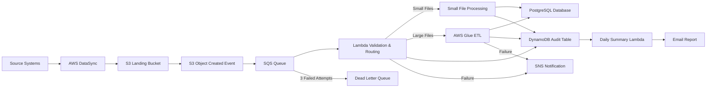
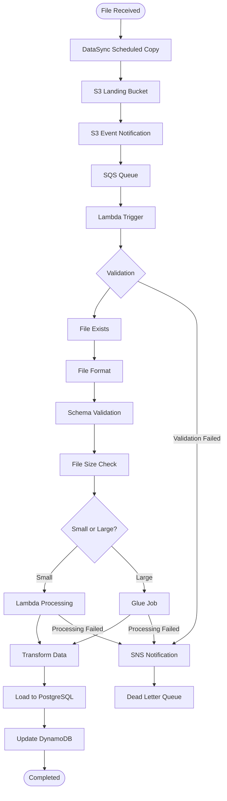

```mermaid
flowchart LR

A[Source Systems]

B[AWS DataSync]

C[S3 Landing Bucket]

D[S3 Object Created Event]

E[SQS Queue]

F[Lambda Validation & Routing]

G[Small File Processing]

H[AWS Glue ETL]

I[PostgreSQL Database]

J[DynamoDB Audit Table]

K[SNS Notification]

L[Dead Letter Queue]

M[Daily Summary Lambda]

N[Email Report]

A --> B
B --> C
C --> D
D --> E
E --> F

F -->|Small Files| G
F -->|Large Files| H

G --> I
H --> I

F --> J
H --> J
G --> J

F -->|Failure| K
H -->|Failure| K

E -->|3 Failed Attempts| L

J --> M
M --> N
```

```mermaid
flowchart TD

Start([File Received])

A[DataSync Scheduled Copy]

B[S3 Landing Bucket]

C[S3 Event Notification]

D[SQS Queue]

E[Lambda Trigger]

F{Validation}

G[File Exists]

H[File Format]

I[Schema Validation]

J[File Size Check]

K{Small or Large?}

L[Lambda Processing]

M[Glue Job]

N[Transform Data]

O[Load to PostgreSQL]

P[Update DynamoDB]

Q[SNS Notification]

R[Dead Letter Queue]

End([Completed])

Start --> A
A --> B
B --> C
C --> D
D --> E

E --> F

F --> G
G --> H
H --> I
I --> J
J --> K

K -->|Small| L
K -->|Large| M

L --> N
M --> N

N --> O
O --> P
P --> End

F -->|Validation Failed| Q
L -->|Processing Failed| Q
M -->|Processing Failed| Q

Q --> R
```